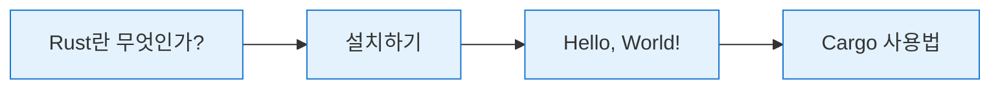

# 1장: 시작하기

<span class="badge-beginner">기초</span>

Rust 프로그래밍 여행의 첫 걸음을 내딛을 시간입니다! 이 장에서는 Rust가 무엇인지 이해하고, 개발 환경을 설정한 뒤, 첫 번째 프로그램을 작성해 보겠습니다.

---

## 이 장에서 배울 내용



| 절 | 제목 | 내용 |
|---|---|---|
| 1.1 | [Rust란 무엇인가?](ch01-01-what-is-rust.md) | Rust의 역사, 설계 목표, 다른 언어와의 비교 |
| 1.2 | [Rust 설치](ch01-02-installation.md) | rustup을 이용한 설치, IDE 설정 |
| 1.3 | [Hello, World!](ch01-03-hello-world.md) | 첫 번째 Rust 프로그램 작성 및 실행 |
| 1.4 | [Cargo 사용법](ch01-04-cargo.md) | Rust의 빌드 시스템이자 패키지 매니저 |

---

## 학습 목표

이 장을 마치면 다음을 할 수 있게 됩니다:

- Rust의 핵심 특징과 장점을 설명할 수 있다
- 자신의 컴퓨터에 Rust 개발 환경을 설정할 수 있다
- 간단한 Rust 프로그램을 작성하고 컴파일하여 실행할 수 있다
- Cargo를 사용하여 프로젝트를 생성하고 관리할 수 있다

<div class="tip-box">

**학습 시간 안내**: 이 장은 약 **1~2시간** 정도면 충분히 학습할 수 있습니다. 설치 과정에서 네트워크 상태에 따라 시간이 다소 걸릴 수 있으니, 안정적인 인터넷 환경에서 진행하세요.

</div>

---

## 미리 보는 첫 번째 Rust 프로그램

아직 설치를 하지 않았더라도, 이 책의 코드 블록에서 직접 실행해 볼 수 있습니다:

```rust,editable
fn main() {
    println!("안녕하세요! Rust의 세계에 오신 것을 환영합니다!");
    println!("이 장을 마치면 이런 프로그램을 직접 만들 수 있습니다.");

    let languages = ["Rust", "C++", "Go", "Python"];
    for lang in &languages {
        if *lang == "Rust" {
            println!("{} - 우리가 배울 언어입니다! 🦀", lang);
        } else {
            println!("{} - 좋은 언어이지만, 오늘의 주인공은 아닙니다.", lang);
        }
    }
}
```

<div class="info-box">

위 코드의 내용이 아직 이해되지 않아도 걱정하지 마세요. 이 장을 순서대로 따라가다 보면, 각 요소가 무엇을 의미하는지 자연스럽게 이해하게 될 것입니다.

</div>

---

> 그럼 시작해 볼까요? [1.1 Rust란 무엇인가?](ch01-01-what-is-rust.md)로 이동하세요!
