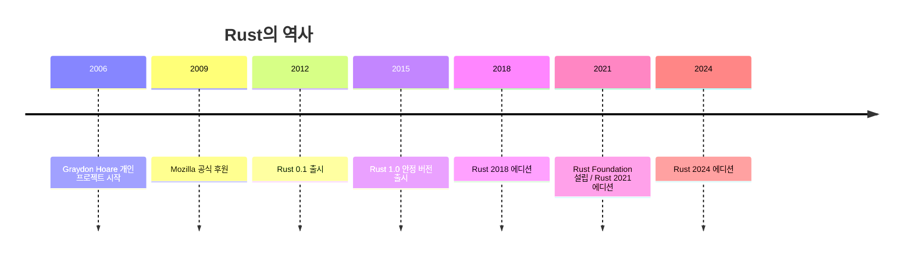
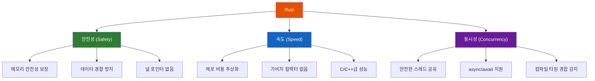
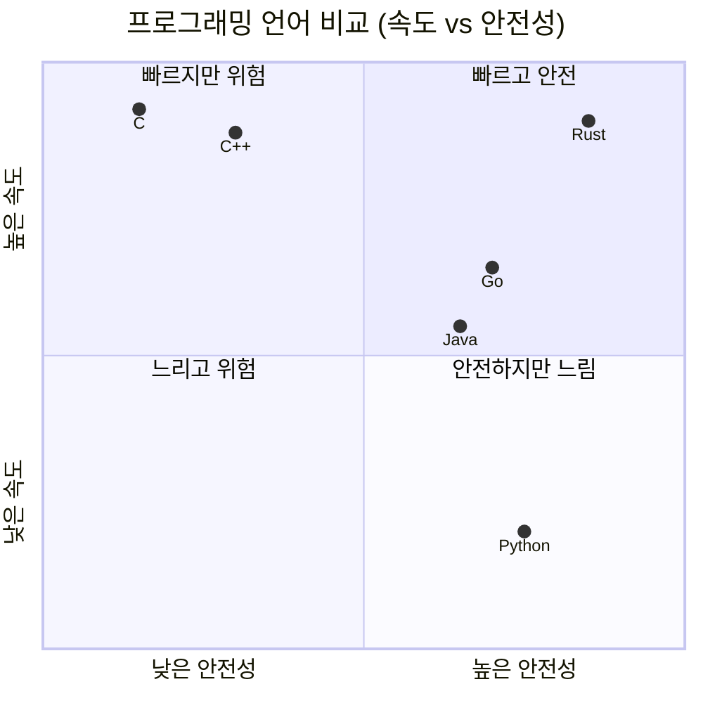
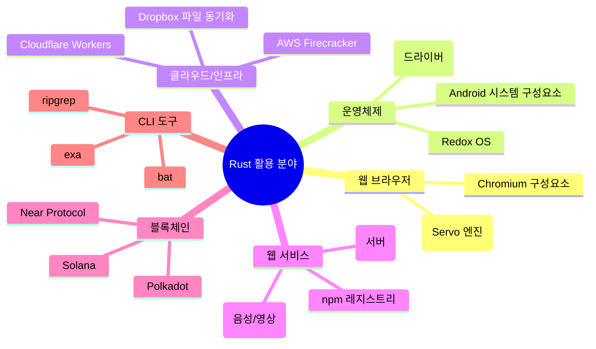

# 1.1 Rust란 무엇인가?

<span class="badge-beginner">기초</span>

## Rust 언어 소개

**Rust**는 Mozilla Research에서 시작된 **시스템 프로그래밍 언어**입니다. 2006년 Graydon Hoare의 개인 프로젝트로 시작되어, 2009년 Mozilla의 공식 후원을 받게 되었고, **2015년 5월 15일** Rust 1.0이 공식 출시되었습니다.

Rust는 "안전하고, 빠르고, 동시적인" 프로그래밍을 목표로 설계되었습니다. C/C++과 같은 저수준 제어 능력을 제공하면서도, 메모리 안전성을 컴파일 시점에 보장하는 독특한 특성을 가지고 있습니다.



---

## 설계 목표: 세 가지 핵심 가치

Rust는 세 가지 핵심 목표를 동시에 달성하려는 언어입니다. 전통적으로 이 세 가지를 모두 만족시키는 것은 매우 어려운 일이었습니다.



### 1. 안전성 (Safety)

Rust의 가장 대표적인 특징은 **소유권(Ownership) 시스템**입니다. 이 시스템은 컴파일 시점에 메모리 안전성을 검증하여, 런타임 오버헤드 없이 다음과 같은 버그를 원천 차단합니다:

- **널 포인터 역참조** (Null pointer dereference)
- **댕글링 포인터** (Dangling pointer) — 해제된 메모리 참조
- **이중 해제** (Double free) — 같은 메모리를 두 번 해제
- **버퍼 오버플로** (Buffer overflow)
- **데이터 경합** (Data race)

```rust,editable
fn main() {
    // Rust는 Option 타입으로 널(null) 대신 안전한 방법을 제공합니다
    let maybe_number: Option<i32> = Some(42);

    // match를 사용하여 값의 존재 여부를 안전하게 처리합니다
    match maybe_number {
        Some(n) => println!("값이 있습니다: {}", n),
        None => println!("값이 없습니다"),
    }

    // if let을 사용한 간결한 처리
    if let Some(n) = maybe_number {
        println!("숫자: {}", n);
    }
}
```

### 2. 속도 (Speed)

Rust는 **제로 비용 추상화(Zero-cost Abstraction)** 원칙을 따릅니다. 이는 고수준 추상화를 사용하더라도 직접 저수준 코드를 작성한 것과 동일한 성능을 보장한다는 의미입니다.

- **가비지 컬렉터(GC)가 없습니다**: 소유권 시스템이 컴파일 시점에 메모리 관리를 처리합니다
- **인라인 최적화**: 컴파일러가 적극적으로 함수를 인라인합니다
- **LLVM 백엔드**: LLVM의 강력한 최적화를 활용합니다

```rust,editable
fn main() {
    // 고수준 이터레이터 체이닝 - 읽기 좋으면서도 성능이 뛰어납니다
    let sum: i32 = (1..=100)
        .filter(|x| x % 2 == 0)   // 짝수만 필터링
        .map(|x| x * x)            // 제곱
        .sum();                      // 합계

    println!("1~100 중 짝수의 제곱의 합: {}", sum);

    // 위 코드는 for 루프로 직접 작성한 것과 동일한 성능을 냅니다
    let mut sum_manual = 0;
    for x in 1..=100 {
        if x % 2 == 0 {
            sum_manual += x * x;
        }
    }
    println!("수동 계산 결과: {}", sum_manual);

    assert_eq!(sum, sum_manual);
    println!("두 결과가 동일합니다!");
}
```

### 3. 동시성 (Concurrency)

Rust는 **"두려움 없는 동시성(Fearless Concurrency)"**을 표방합니다. 소유권과 타입 시스템이 컴파일 시점에 데이터 경합을 감지하므로, 동시성 프로그래밍에서 흔히 발생하는 버그를 미연에 방지합니다.

```rust,editable
use std::thread;

fn main() {
    let mut handles = vec![];

    for i in 0..5 {
        // 각 스레드는 독립적인 데이터를 가집니다
        let handle = thread::spawn(move || {
            println!("스레드 {} 실행 중!", i);
            i * i
        });
        handles.push(handle);
    }

    // 모든 스레드의 결과를 수집합니다
    let results: Vec<_> = handles
        .into_iter()
        .map(|h| h.join().unwrap())
        .collect();

    println!("결과: {:?}", results);
}
```

---

## 다른 언어와의 비교

Rust를 이미 알고 있는 다른 언어들과 비교해 보면 특징이 더 명확해집니다.

### 비교표

| 특성 | Rust | C/C++ | Go | Python |
|---|---|---|---|---|
| **메모리 관리** | 소유권 시스템 | 수동 관리 | 가비지 컬렉터 | 가비지 컬렉터 |
| **메모리 안전성** | 컴파일 타임 보장 | 보장 안 됨 | 런타임 보장 | 런타임 보장 |
| **실행 속도** | 매우 빠름 | 매우 빠름 | 빠름 | 느림 |
| **널 안전성** | Option 타입 | 널 포인터 존재 | nil 존재 | None 존재 |
| **동시성 안전** | 컴파일 타임 검증 | 보장 안 됨 | 고루틴 (런타임) | GIL 제한 |
| **학습 곡선** | 가파름 | 가파름 | 완만함 | 매우 완만함 |
| **컴파일 속도** | 느림 | 보통 | 매우 빠름 | 인터프리터 |
| **패키지 관리** | Cargo (내장) | CMake 등 (외부) | go mod (내장) | pip (외부) |



### Rust vs C/C++

- **공통점**: 시스템 레벨 프로그래밍, 직접적인 하드웨어 제어, GC 없음
- **Rust의 장점**: 메모리 안전성 보장, 현대적인 패키지 관리(Cargo), 친절한 에러 메시지
- **C/C++의 장점**: 더 넓은 생태계, 레거시 시스템 호환성, 빠른 컴파일

### Rust vs Go

- **공통점**: 현대적 언어, 동시성 지원, 내장 빌드 도구
- **Rust의 장점**: 더 높은 성능, GC 없음, 더 강력한 타입 시스템
- **Go의 장점**: 더 빠른 컴파일, 낮은 학습 곡선, 간결한 문법

### Rust vs Python

- **공통점**: 활발한 커뮤니티, 풍부한 라이브러리 생태계
- **Rust의 장점**: 수십 배 빠른 실행 속도, 타입 안전성, 네이티브 바이너리
- **Python의 장점**: 매우 쉬운 문법, 빠른 프로토타이핑, 데이터 과학 생태계

<div class="info-box">

**Rust와 Python을 함께 사용하기**: PyO3 라이브러리를 사용하면 Rust로 작성한 고성능 코드를 Python에서 호출할 수 있습니다. 성능이 중요한 부분만 Rust로 작성하는 방법은 실무에서 매우 인기 있는 패턴입니다.

</div>

---

## Rust가 사용되는 곳

Rust는 이미 많은 유명 프로젝트와 기업에서 사용되고 있습니다:



### 주요 사례

1. **Mozilla Firefox**: Servo 렌더링 엔진의 핵심 구성요소(CSS 파서, WebRender)가 Rust로 작성되었습니다.

2. **Linux 커널**: 2022년부터 Linux 커널에서 Rust를 공식 지원 언어로 채택했습니다. 새로운 드라이버를 Rust로 작성할 수 있게 되었습니다.

3. **Discord**: 메시지 전달 서비스의 성능 병목을 해결하기 위해 Go에서 Rust로 전환했습니다. 결과적으로 응답 시간이 크게 개선되었습니다.

4. **Cloudflare**: 전 세계 인터넷 트래픽의 상당 부분을 처리하는 인프라에 Rust를 적극 활용하고 있습니다.

5. **AWS**: 경량 가상머신 관리자인 Firecracker를 Rust로 개발했습니다. AWS Lambda와 Fargate의 기반 기술입니다.

<div class="tip-box">

**Stack Overflow 설문**: Rust는 Stack Overflow의 개발자 설문에서 **8년 연속** "가장 사랑받는 프로그래밍 언어" 1위를 차지했습니다 (2016~2023). 이후 항목명이 "가장 존경받는 언어"로 변경된 후에도 1위를 유지하고 있습니다.

</div>

---

## Rust를 배워야 하는 이유

```rust,editable
fn main() {
    let reasons = vec![
        "메모리 안전성을 보장하면서도 C/C++ 수준의 성능",
        "현대적이고 표현력 있는 타입 시스템",
        "뛰어난 에러 메시지와 개발 도구",
        "활발하고 친근한 커뮤니티",
        "계속 성장하는 취업 시장",
        "시스템부터 웹까지 다양한 분야에 적용 가능",
    ];

    println!("=== Rust를 배워야 하는 이유 ===");
    for (i, reason) in reasons.iter().enumerate() {
        println!("{}. {}", i + 1, reason);
    }
}
```

---

## 퀴즈

<div class="quiz-box" onclick="this.classList.toggle('show-answer')">

**Q1.** Rust의 메모리 관리 방식은 무엇인가요?

- (A) 가비지 컬렉터 (Garbage Collector)
- (B) 수동 메모리 관리 (malloc/free)
- (C) 소유권 시스템 (Ownership System)
- (D) 참조 카운팅 (Reference Counting)

<div class="quiz-answer">

**정답: (C) 소유권 시스템**

Rust는 소유권(Ownership), 빌림(Borrowing), 라이프타임(Lifetime) 시스템을 통해 컴파일 시점에 메모리 관리를 수행합니다. 가비지 컬렉터가 없으므로 런타임 오버헤드가 없으며, 수동 관리와 달리 안전성도 보장됩니다. (참조 카운팅 `Rc<T>`는 특수한 경우에 사용되지만, 언어의 기본 메모리 관리 방식은 아닙니다.)

</div>
</div>

<div class="quiz-box" onclick="this.classList.toggle('show-answer')">

**Q2.** Rust 1.0이 공식 출시된 연도는?

- (A) 2006년
- (B) 2012년
- (C) 2015년
- (D) 2018년

<div class="quiz-answer">

**정답: (C) 2015년**

Rust 1.0은 2015년 5월 15일에 출시되었습니다. 2006년은 개인 프로젝트로 시작된 해이며, 2012년은 0.1 버전이 출시된 해입니다.

</div>
</div>

<div class="quiz-box" onclick="this.classList.toggle('show-answer')">

**Q3.** 다음 중 Rust가 컴파일 시점에 방지하는 오류가 **아닌** 것은?

- (A) 널 포인터 역참조
- (B) 데이터 경합 (Data Race)
- (C) 논리 오류 (Logic Error)
- (D) 이중 해제 (Double Free)

<div class="quiz-answer">

**정답: (C) 논리 오류**

Rust의 컴파일러는 메모리 안전성, 타입 안전성, 동시성 안전성은 보장하지만, 프로그램의 논리적 오류(예: 잘못된 계산식, 잘못된 조건문)는 감지할 수 없습니다. 논리 오류를 잡기 위해서는 테스트 코드를 작성해야 합니다.

</div>
</div>

<div class="quiz-box" onclick="this.classList.toggle('show-answer')">

**Q4.** Rust에서 "제로 비용 추상화"란 무엇을 의미하나요?

<div class="quiz-answer">

**정답:** 제로 비용 추상화란, 고수준의 추상화(이터레이터, 제네릭, 트레이트 등)를 사용하더라도 직접 저수준 코드를 작성한 것과 **동일한 런타임 성능**을 보장한다는 원칙입니다. 추상화로 인한 추가적인 런타임 비용이 발생하지 않습니다. 이는 Rust 컴파일러의 강력한 최적화(특히 단형화와 인라이닝)를 통해 달성됩니다.

</div>
</div>

---

<div class="summary-box">

**요약**
- Rust는 2015년에 출시된 시스템 프로그래밍 언어로, **안전성**, **속도**, **동시성**을 핵심 목표로 합니다
- **소유권 시스템**을 통해 GC 없이도 메모리 안전성을 컴파일 시점에 보장합니다
- C/C++ 수준의 성능을 제공하면서도 현대적인 개발 도구(Cargo)와 풍부한 타입 시스템을 갖추고 있습니다
- Firefox, Linux 커널, Discord, Cloudflare 등 다양한 프로젝트에서 실제로 사용되고 있습니다
- Stack Overflow 설문에서 8년 연속 가장 사랑받는 언어로 선정되었습니다

</div>

---

> 다음: [1.2 Rust 설치](ch01-02-installation.md)
