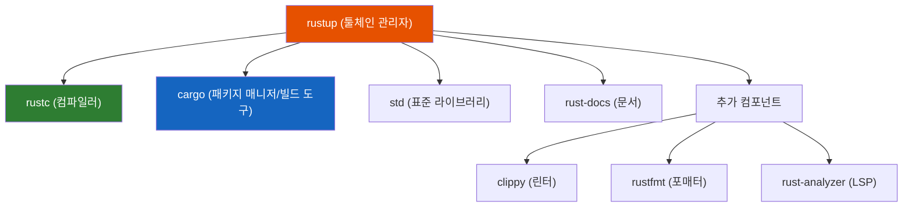
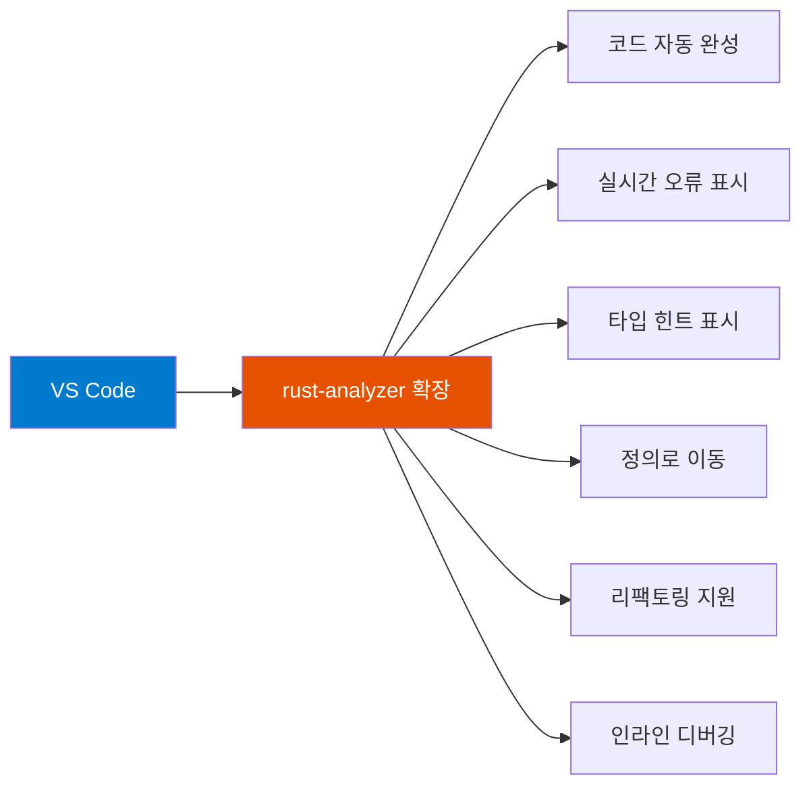

# 1.2 Rust 설치

<span class="badge-beginner">기초</span>

Rust를 설치하는 공식적이고 권장되는 방법은 **rustup**을 사용하는 것입니다. rustup은 Rust 툴체인 관리자로, Rust 컴파일러(`rustc`), 패키지 매니저(`cargo`), 표준 라이브러리 등을 한 번에 설치하고 관리해 줍니다.

---

## rustup이란?



rustup은 다음을 관리합니다:
- **Rust 버전 업데이트**: `rustup update`로 최신 버전 유지
- **여러 버전 관리**: stable, beta, nightly 채널 전환
- **크로스 컴파일 타겟**: 다른 플랫폼용 바이너리 빌드
- **추가 컴포넌트**: clippy, rustfmt 등 도구 설치

---

## 운영체제별 설치 방법

### Linux / macOS

터미널을 열고 다음 명령어를 실행합니다:

```bash
curl --proto '=https' --tlsv1.2 -sSf https://sh.rustup.rs | sh
```

실행하면 설치 옵션이 나타납니다:

```
1) Proceed with standard installation (default - just press enter)
2) Customize installation
3) Cancel installation
```

<div class="tip-box">

**팁**: 대부분의 경우 `1`을 선택하거나 `Enter`를 누르면 됩니다. 기본 설치는 stable 채널의 최신 Rust를 설치합니다.

</div>

설치가 완료되면, 환경 변수를 적용하기 위해 셸을 재시작하거나 다음 명령어를 실행합니다:

```bash
source $HOME/.cargo/env
```

#### Linux 추가 요구사항

Linux에서는 링커와 기본 빌드 도구가 필요합니다. 배포판에 따라 다음을 설치하세요:

**Ubuntu / Debian:**
```bash
sudo apt update
sudo apt install build-essential
```

**Fedora:**
```bash
sudo dnf install gcc
```

**Arch Linux:**
```bash
sudo pacman -S base-devel
```

### Windows

Windows에서는 두 가지 방법이 있습니다:

#### 방법 1: rustup-init.exe 사용 (권장)

1. [https://rustup.rs](https://rustup.rs)에 접속합니다
2. `rustup-init.exe`를 다운로드하여 실행합니다
3. 안내에 따라 설치를 진행합니다

#### 방법 2: winget 사용

```powershell
winget install Rustlang.Rustup
```

<div class="warning-box">

**Windows 사용자 주의사항**: Rust는 C/C++ 링커가 필요합니다. 다음 중 하나를 설치해야 합니다:

- **Visual Studio 2019 이상**: "C++ 데스크톱 개발" 워크로드를 선택하여 설치
- **Visual Studio Build Tools**: Visual Studio 전체가 필요 없다면 Build Tools만 설치

설치 프로그램이 자동으로 안내해 주므로, 지시에 따르면 됩니다.

</div>

---

## 설치 확인

설치가 완료되었으면, 터미널(또는 명령 프롬프트)을 **새로 열고** 다음 명령어로 확인합니다:

### Rust 컴파일러 버전 확인

```bash
rustc --version
```

출력 예시:
```
rustc 1.83.0 (90b35a623 2024-11-26)
```

### Cargo 버전 확인

```bash
cargo --version
```

출력 예시:
```
cargo 1.83.0 (5ffbef321 2024-10-29)
```

### rustup 버전 확인

```bash
rustup --version
```

출력 예시:
```
rustup 1.27.1 (54dd3d00f 2024-04-24)
```

<div class="info-box">

**세 가지 명령어 모두 버전이 표시되면 설치가 성공한 것입니다!** 만약 "command not found" 오류가 나타나면, 터미널을 재시작하거나 `$HOME/.cargo/bin`이 PATH에 포함되어 있는지 확인하세요.

</div>

---

## Rust 업데이트 및 제거

### 업데이트

Rust는 **6주마다** 새로운 안정 버전이 출시됩니다. 업데이트는 매우 간단합니다:

```bash
rustup update
```

### 제거

Rust와 rustup을 완전히 제거하려면:

```bash
rustup self uninstall
```

---

## 추가 컴포넌트 설치

Rust 개발에 유용한 추가 도구를 설치합니다:

### Clippy (린터)

Clippy는 Rust 코드의 일반적인 실수를 잡아주고, 더 관용적인(idiomatic) 코드를 제안하는 린트 도구입니다.

```bash
rustup component add clippy
```

사용법:
```bash
cargo clippy
```

### Rustfmt (코드 포매터)

Rustfmt는 Rust 코드를 공식 스타일 가이드에 맞게 자동으로 포맷합니다.

```bash
rustup component add rustfmt
```

사용법:
```bash
cargo fmt
```

### rust-src (표준 라이브러리 소스코드)

IDE에서 표준 라이브러리의 소스코드를 열람하고 자동 완성을 더 정확하게 받을 수 있습니다.

```bash
rustup component add rust-src
```

<div class="tip-box">

**팁**: 최신 rustup은 Clippy와 Rustfmt를 기본으로 포함하는 경우가 많습니다. 이미 설치되어 있다면 명령어를 실행해도 문제가 발생하지 않습니다.

</div>

---

## IDE 설정

### VS Code + rust-analyzer (강력 추천)

**rust-analyzer**는 Rust를 위한 가장 인기 있는 Language Server Protocol(LSP) 구현체입니다. VS Code와 함께 사용하면 강력한 개발 환경을 제공합니다.



#### 설치 방법

1. [VS Code](https://code.visualstudio.com/)를 설치합니다
2. VS Code를 열고, 확장(Extensions) 패널을 엽니다 (`Ctrl+Shift+X` / `Cmd+Shift+X`)
3. **"rust-analyzer"**를 검색하여 설치합니다

#### 추천 VS Code 설정

VS Code의 `settings.json`에 다음을 추가하면 더 나은 개발 경험을 얻을 수 있습니다:

```json
{
    "rust-analyzer.check.command": "clippy",
    "rust-analyzer.inlayHints.typeHints.enable": true,
    "rust-analyzer.inlayHints.parameterHints.enable": true,
    "editor.formatOnSave": true,
    "[rust]": {
        "editor.defaultFormatter": "rust-lang.rust-analyzer"
    }
}
```

#### 추천 VS Code 확장

| 확장 | 설명 |
|---|---|
| **rust-analyzer** | Rust LSP (필수) |
| **Even Better TOML** | Cargo.toml 편집 지원 |
| **Error Lens** | 코드 줄 옆에 에러 메시지 표시 |
| **CodeLLDB** | Rust 디버깅 지원 |
| **crates** | Cargo.toml에서 크레이트 버전 관리 |

### 다른 IDE/에디터

- **IntelliJ IDEA / CLion**: JetBrains의 Rust 플러그인 사용
- **Vim / Neovim**: rust-analyzer LSP 연동
- **Emacs**: rust-mode + lsp-mode
- **Sublime Text**: rust-analyzer LSP 연동

<div class="info-box">

**어떤 에디터를 사용하든**, rust-analyzer LSP를 연동하면 동일한 수준의 코드 분석 기능을 활용할 수 있습니다. 자신에게 익숙한 에디터를 사용하세요.

</div>

---

## 설치 확인 코드

모든 것이 제대로 설치되었는지 확인하는 간단한 프로그램을 실행해 봅시다:

```rust,editable
fn main() {
    println!("=== Rust 설치 확인 ===");
    println!("이 코드가 실행되면 Rust가 정상적으로 작동하고 있습니다!");

    // Rust 버전 정보 출력 (컴파일 시점)
    println!("Rust 에디션: 2021");

    // 간단한 계산으로 기본 기능 확인
    let x = 10;
    let y = 20;
    let sum = x + y;
    println!("{} + {} = {}", x, y, sum);

    // 문자열 처리 확인
    let greeting = String::from("안녕하세요");
    let name = "Rust 개발자";
    println!("{}, {}님!", greeting, name);

    println!("\n모든 기본 기능이 정상 작동합니다!");
}
```

---

## 문제 해결 (Troubleshooting)

### "command not found" 오류

```bash
# PATH에 cargo/bin이 포함되어 있는지 확인
echo $PATH | tr ':' '\n' | grep cargo

# 포함되어 있지 않다면 셸 설정 파일에 추가
# bash 사용자:
echo 'export PATH="$HOME/.cargo/bin:$PATH"' >> ~/.bashrc
source ~/.bashrc

# zsh 사용자:
echo 'export PATH="$HOME/.cargo/bin:$PATH"' >> ~/.zshrc
source ~/.zshrc
```

### 링커 오류

```
error: linker `cc` not found
```

Linux에서 빌드 도구가 설치되지 않았을 때 발생합니다. 위의 Linux 추가 요구사항 섹션을 참고하세요.

### SSL/TLS 오류

```bash
# curl이 설치되어 있지 않은 경우 (Ubuntu/Debian)
sudo apt install curl

# 인증서 문제가 있는 경우
sudo apt install ca-certificates
```

<div class="warning-box">

**회사/학교 네트워크 사용 시**: 프록시나 방화벽이 설정된 환경에서는 설치가 실패할 수 있습니다. 이 경우 네트워크 관리자에게 문의하거나, [오프라인 설치 방법](https://forge.rust-lang.org/infra/other-installation-methods.html)을 참고하세요.

</div>

---

<div class="summary-box">

**요약**
- **rustup**은 Rust의 공식 툴체인 관리자로, `rustc`, `cargo`, 표준 라이브러리를 설치합니다
- Linux/macOS에서는 `curl` 명령어로, Windows에서는 설치 프로그램으로 설치합니다
- `rustc --version`과 `cargo --version`으로 설치를 확인합니다
- **VS Code + rust-analyzer** 조합이 가장 인기 있는 개발 환경입니다
- `rustup component add clippy rustfmt`로 린터와 포매터를 설치합니다
- `rustup update`로 언제든지 최신 버전으로 업데이트할 수 있습니다

</div>

---

> 다음: [1.3 Hello, World!](ch01-03-hello-world.md)
