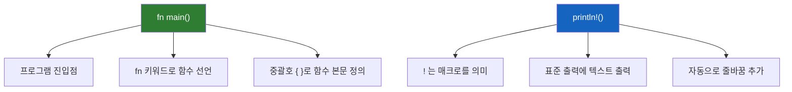
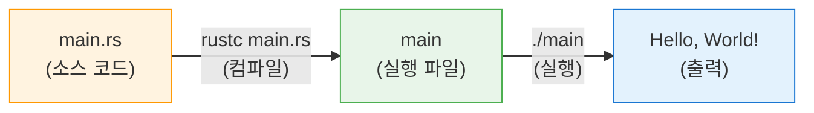
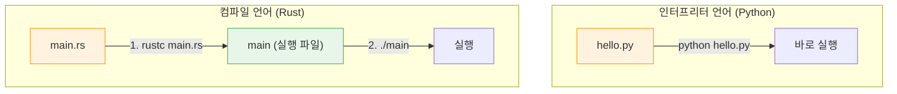

# 1.3 Hello, World!

<span class="badge-beginner">기초</span>

모든 프로그래밍 언어 학습의 전통적인 첫 단계, **Hello, World!** 프로그램을 작성해 봅시다. 이 과정을 통해 Rust 프로그램의 기본 구조와 컴파일 과정을 이해하게 됩니다.

---

## 프로젝트 디렉토리 생성

먼저, Rust 코드를 저장할 디렉토리를 만듭니다:

```bash
# 홈 디렉토리에 프로젝트 폴더 생성
mkdir ~/rust-projects
cd ~/rust-projects
mkdir hello_world
cd hello_world
```

---

## main.rs 파일 작성

`main.rs`라는 파일을 생성하고, 다음 코드를 작성합니다:

```rust,editable
fn main() {
    println!("Hello, World!");
}
```

이 짧은 코드 안에 Rust의 여러 핵심 개념이 담겨 있습니다. 하나씩 분석해 보겠습니다.

---

## 코드 분석



### `fn main()` — 메인 함수

```rust,editable
// fn: 함수를 정의하는 키워드 (function의 약자)
// main: 함수 이름. 모든 Rust 프로그램은 main 함수에서 시작됩니다
// (): 매개변수 목록 (비어있으면 매개변수 없음)
// { }: 함수의 본문(body)

fn main() {
    // 이 안에 프로그램의 코드를 작성합니다
    println!("fn main()은 프로그램의 시작점입니다!");
}
```

<div class="info-box">

**`main` 함수의 특별한 점**:
- Rust 프로그램이 실행될 때 **가장 먼저** 호출되는 함수입니다
- 모든 실행 가능한(executable) Rust 프로그램에는 **반드시 하나의** `main` 함수가 있어야 합니다
- `main` 함수는 매개변수를 받지 않으며, 기본적으로 값을 반환하지 않습니다

</div>

### `println!` — 출력 매크로

`println!`은 Rust의 **매크로(macro)**입니다. 이름 끝에 느낌표(`!`)가 붙어 있으면 함수가 아니라 매크로입니다.

```rust,editable
fn main() {
    // println! - 줄바꿈 포함 출력
    println!("Hello, World!");

    // print! - 줄바꿈 없이 출력
    print!("Hello, ");
    print!("World!");
    println!(); // 빈 줄바꿈

    // 포맷 문자열 사용 - {} 자리에 값이 삽입됩니다
    let name = "Rust";
    let version = 2021;
    println!("{} 에디션 {}에 오신 것을 환영합니다!", name, version);

    // 위치 지정 포맷
    println!("{0}은 빠르고, {0}은 안전합니다. {1}!", name, "멋져요");

    // 디버그 출력 - {:?} 사용
    let numbers = [1, 2, 3, 4, 5];
    println!("배열: {:?}", numbers);

    // 예쁜 디버그 출력 - {:#?} 사용
    println!("예쁜 배열:\n{:#?}", numbers);
}
```

<div class="tip-box">

**매크로와 함수의 차이**: 지금은 "println! 뒤에 `!`가 붙으면 매크로다"라고만 기억하면 됩니다. 매크로는 컴파일 시점에 코드를 생성하는 강력한 기능이며, 이후 장에서 자세히 다룹니다.

`println!`이 매크로인 이유는 가변 개수의 인자를 받아야 하고, 포맷 문자열을 컴파일 시점에 검사하기 위해서입니다.

</div>

### 세미콜론 (`;`)

Rust에서는 대부분의 **문(statement)**이 세미콜론으로 끝납니다:

```rust,editable
fn main() {
    let x = 5;          // 문(statement) - 세미콜론 필요
    let y = 10;         // 문(statement) - 세미콜론 필요
    println!("{}", x + y); // 문(statement) - 세미콜론 필요
}
```

<div class="warning-box">

**세미콜론을 빠뜨리면?** 대부분의 경우 컴파일 에러가 발생합니다. 하지만 Rust에서 세미콜론의 유무는 의미가 있습니다 — 세미콜론이 없으면 "표현식(expression)"이 되어 값을 반환합니다. 이는 나중에 함수 반환값을 배울 때 자세히 다룹니다.

</div>

---

## 컴파일과 실행

Rust는 **컴파일 언어**입니다. 소스 코드를 먼저 기계어로 변환(컴파일)한 후, 실행 파일을 실행합니다.



### 컴파일

```bash
rustc main.rs
```

이 명령어는 `main.rs`를 컴파일하여 실행 파일을 생성합니다:
- **Linux/macOS**: `main` 파일 생성
- **Windows**: `main.exe` 파일 생성

### 실행

```bash
# Linux/macOS
./main

# Windows
.\main.exe
```

출력:
```
Hello, World!
```

<div class="info-box">

**`rustc`는 직접 사용할 일이 거의 없습니다.** 실무에서는 다음 절에서 배울 **Cargo**를 사용하여 프로젝트를 빌드하고 실행합니다. `rustc`는 Cargo가 내부적으로 호출하는 도구입니다. 이 절에서는 컴파일 과정을 이해하기 위해 직접 사용해 봅니다.

</div>

---

## 인터프리터 언어와의 비교

Python 같은 인터프리터 언어와 Rust의 차이를 이해해 봅시다:



| 특성 | 컴파일 (Rust) | 인터프리터 (Python) |
|---|---|---|
| 실행 전 | 컴파일 필요 | 바로 실행 |
| 실행 속도 | 매우 빠름 | 상대적으로 느림 |
| 배포 | 실행 파일만 전달 | 런타임 필요 |
| 오류 발견 | 컴파일 시점 | 실행 시점 |

---

## 더 다양한 출력 예제

```rust,editable
fn main() {
    // === 기본 출력 ===
    println!("=== Rust 출력 다양하게 해보기 ===\n");

    // 1. 숫자 출력
    let integer = 42;
    let float = 3.14159;
    println!("정수: {}", integer);
    println!("실수: {}", float);
    println!("소수점 2자리: {:.2}", float);

    // 2. 진법 변환 출력
    let num = 255;
    println!("\n=== 진법 변환 ===");
    println!("10진수: {}", num);
    println!("16진수: {:x}", num);       // ff
    println!("16진수 (대문자): {:X}", num); // FF
    println!("8진수:  {:o}", num);        // 377
    println!("2진수:  {:b}", num);        // 11111111

    // 3. 정렬과 패딩
    println!("\n=== 정렬과 패딩 ===");
    println!("|{:<10}|", "왼쪽");    // 왼쪽 정렬
    println!("|{:>10}|", "오른쪽");   // 오른쪽 정렬
    println!("|{:^10}|", "가운데");   // 가운데 정렬
    println!("|{:0>5}|", 42);         // 0으로 패딩

    // 4. 이스케이프 문자
    println!("\n=== 이스케이프 문자 ===");
    println!("탭:\t여기");
    println!("줄바꿈:\n여기");
    println!("중괄호 출력: {{}}");
    println!("백슬래시: \\");
}
```

---

## Rust 프로그램의 기본 구조

지금까지 배운 내용을 정리하면, Rust 프로그램의 가장 기본적인 구조는 다음과 같습니다:

```rust,editable
// 이것은 주석입니다. 컴파일러가 무시합니다.

/* 이것은
   여러 줄 주석입니다 */

/// 이것은 문서화 주석(doc comment)입니다.
/// 나중에 API 문서를 자동 생성할 때 사용됩니다.

// 모든 Rust 프로그램의 시작점
fn main() {
    // 변수 선언 (let 키워드 사용)
    let message = "Hello, Rust!";

    // 출력 (println! 매크로 사용)
    println!("{}", message);

    // Rust에서는 기본적으로 변수가 불변(immutable)입니다
    // message = "다른 메시지"; // 이 줄의 주석을 해제하면 에러 발생!

    // 가변 변수는 mut 키워드를 사용합니다
    let mut counter = 0;
    counter += 1;
    println!("카운터: {}", counter);
}
```

<div class="warning-box">

**불변 변수**: Rust에서 `let`으로 선언한 변수는 기본적으로 **변경할 수 없습니다(immutable)**. 변경 가능한 변수가 필요하면 `let mut`을 사용해야 합니다. 이는 의도하지 않은 값 변경을 방지하기 위한 Rust의 안전 장치입니다. 2장에서 자세히 다룹니다.

</div>

---

## 연습문제

<div class="exercise-box">

**연습문제 1: 자기소개 프로그램**

아래 코드를 수정하여 자신의 이름, 나이, 좋아하는 프로그래밍 언어를 출력하는 프로그램을 완성하세요.

```rust,editable
fn main() {
    // TODO: 아래 변수들의 값을 수정하세요
    let name = "여러분의 이름";
    let age = 0;
    let favorite_lang = "좋아하는 언어";

    println!("안녕하세요! 제 이름은 {}입니다.", name);
    println!("저는 {}살이고, {}를 좋아합니다.", age, favorite_lang);
    println!("지금은 Rust를 배우고 있습니다!");
}
```

</div>

<div class="exercise-box">

**연습문제 2: 사각형 그리기**

`println!`을 사용하여 다음과 같은 사각형을 출력하는 프로그램을 작성하세요:

```
*****
*   *
*   *
*****
```

```rust,editable
fn main() {
    // TODO: println!을 사용하여 사각형을 출력하세요
    println!("*****");
    // 나머지를 완성하세요

}
```

</div>

<div class="exercise-box">

**연습문제 3: 구구단 한 줄 출력**

특정 단의 구구단을 한 줄로 출력하는 프로그램을 작성하세요. `print!`와 `println!`을 적절히 사용하세요.

```rust,editable
fn main() {
    let dan = 7; // 원하는 단으로 변경 가능

    println!("=== {}단 ===", dan);
    // TODO: for 루프를 사용하여 구구단을 출력하세요
    // 힌트: for i in 1..=9 { ... }
    for i in 1..=9 {
        println!("{} x {} = {}", dan, i, dan * i);
    }
}
```

</div>

---

<div class="summary-box">

**요약**
- Rust 프로그램은 `fn main()` 함수에서 시작됩니다
- `println!`은 텍스트를 출력하는 **매크로**입니다 (`!`가 매크로를 의미)
- `{}`는 포맷 자리표시자로, 변수의 값을 문자열에 삽입합니다
- Rust는 **컴파일 언어**로, `rustc`로 컴파일한 후 실행 파일을 실행합니다
- 대부분의 문(statement)은 **세미콜론(`;`)**으로 끝납니다
- 변수는 기본적으로 **불변(immutable)**이며, 변경하려면 `mut` 키워드가 필요합니다

</div>

---

> 다음: [1.4 Cargo 사용법](ch01-04-cargo.md)
