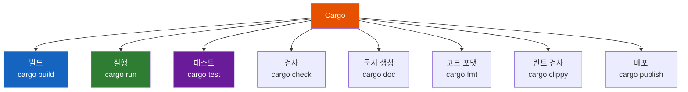
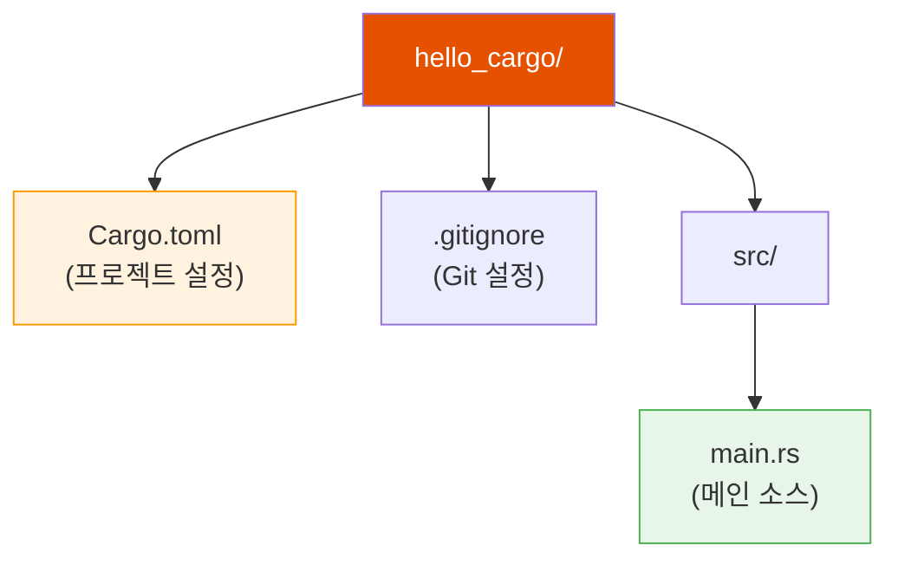
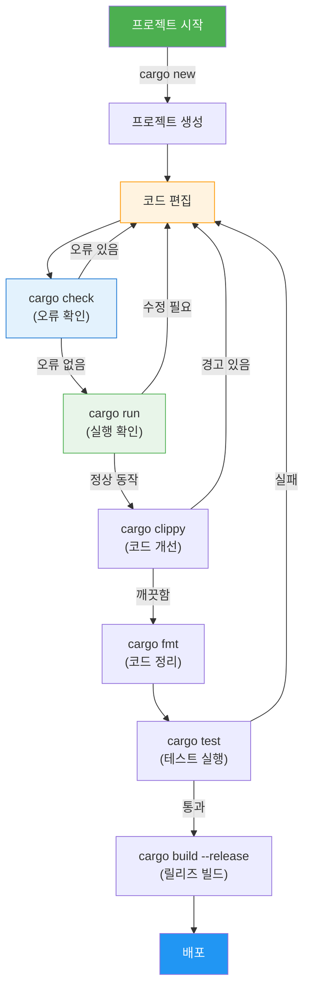

# 1.4 Cargo 사용법

<span class="badge-beginner">기초</span>

**Cargo**는 Rust의 공식 **빌드 시스템**이자 **패키지 매니저**입니다. Rust 프로젝트를 생성하고, 빌드하고, 테스트하고, 외부 라이브러리(크레이트)를 관리하는 데 필수적인 도구입니다. 앞 절에서 `rustc`로 직접 컴파일하는 방법을 배웠지만, 실제 개발에서는 거의 모든 작업을 Cargo를 통해 수행합니다.

---

## Cargo가 필요한 이유

`rustc`만으로도 단일 파일을 컴파일할 수 있지만, 실제 프로젝트에서는 다음이 필요합니다:

- 여러 소스 파일 관리
- 외부 라이브러리(크레이트) 의존성 관리
- 빌드 설정 관리 (디버그/릴리즈)
- 테스트 실행
- 문서 생성

Cargo는 이 모든 것을 하나의 도구로 해결합니다.



---

## 새 프로젝트 생성: `cargo new`

새 Rust 프로젝트를 생성하려면 `cargo new` 명령어를 사용합니다:

```bash
cargo new hello_cargo
cd hello_cargo
```

이 명령어는 다음과 같은 디렉토리 구조를 생성합니다:

```
hello_cargo/
├── Cargo.toml      ← 프로젝트 설정 파일
├── .gitignore       ← Git 무시 파일 (자동 생성)
└── src/
    └── main.rs      ← 메인 소스 파일
```



<div class="info-box">

**Git 자동 초기화**: `cargo new`는 자동으로 Git 저장소를 초기화합니다. 이미 Git 저장소 안에 있거나 Git을 사용하지 않으려면 `cargo new hello_cargo --vcs none` 옵션을 사용하세요.

</div>

### 라이브러리 프로젝트 생성

실행 파일 대신 라이브러리 프로젝트를 만들려면 `--lib` 플래그를 사용합니다:

```bash
cargo new my_library --lib
```

이 경우 `src/main.rs` 대신 `src/lib.rs`가 생성됩니다.

---

## Cargo.toml 구조 이해

`Cargo.toml`은 프로젝트의 설정 파일로, **TOML**(Tom's Obvious, Minimal Language) 형식으로 작성됩니다.

기본 생성된 `Cargo.toml`:

```toml
[package]
name = "hello_cargo"
version = "0.1.0"
edition = "2021"

[dependencies]
```

각 섹션을 자세히 살펴보겠습니다:

### `[package]` 섹션

| 키 | 설명 | 예시 |
|---|---|---|
| `name` | 프로젝트(크레이트) 이름 | `"hello_cargo"` |
| `version` | 버전 (Semantic Versioning) | `"0.1.0"` |
| `edition` | Rust 에디션 | `"2021"` |
| `authors` | 저자 정보 (선택) | `["홍길동 <hong@example.com>"]` |
| `description` | 프로젝트 설명 (선택) | `"내 첫 번째 Rust 프로젝트"` |
| `license` | 라이선스 (선택) | `"MIT"` |

### `[dependencies]` 섹션

외부 라이브러리(크레이트)를 추가하는 곳입니다:

```toml
[dependencies]
rand = "0.8"              # crates.io에서 버전 0.8.x
serde = { version = "1.0", features = ["derive"] }  # 기능 플래그 포함
```

<div class="tip-box">

**크레이트 찾기**: [crates.io](https://crates.io)에서 수천 개의 Rust 라이브러리를 검색하고 사용할 수 있습니다. `cargo add` 명령어로 의존성을 쉽게 추가할 수도 있습니다:

```bash
cargo add serde --features derive
```

</div>

### 확장된 Cargo.toml 예시

```toml
[package]
name = "hello_cargo"
version = "0.1.0"
edition = "2021"
authors = ["학습자 <learner@example.com>"]
description = "Rust 학습을 위한 첫 번째 프로젝트"
license = "MIT"

[dependencies]
# 여기에 외부 크레이트를 추가합니다

[dev-dependencies]
# 테스트에서만 사용하는 크레이트

[profile.release]
opt-level = 3    # 릴리즈 빌드 최적화 수준
```

---

## 핵심 Cargo 명령어

### `cargo build` — 프로젝트 빌드

```bash
cargo build
```

- 소스 코드를 컴파일하여 실행 파일을 생성합니다
- 실행 파일은 `target/debug/` 디렉토리에 생성됩니다
- 처음 빌드 시 의존성을 다운로드하고 `Cargo.lock` 파일을 생성합니다

```bash
# 릴리즈 모드로 빌드 (최적화 적용)
cargo build --release
```

릴리즈 모드로 빌드하면 `target/release/` 디렉토리에 최적화된 실행 파일이 생성됩니다.

<div class="warning-box">

**디버그 vs 릴리즈**: 개발 중에는 `cargo build`(디버그 모드)를 사용하세요. 컴파일이 빠르고 디버그 정보가 포함됩니다. 배포할 때는 `cargo build --release`를 사용하여 최적화된 바이너리를 생성하세요. 성능 차이가 **수배에서 수십 배**까지 날 수 있습니다.

</div>

### `cargo run` — 빌드 후 실행

```bash
cargo run
```

- `cargo build` + 실행을 한 번에 수행합니다
- 소스가 변경되지 않았으면 다시 컴파일하지 않습니다
- **개발 중 가장 자주 사용하는 명령어**입니다

```bash
# 릴리즈 모드로 실행
cargo run --release
```

### `cargo check` — 빠른 오류 검사

```bash
cargo check
```

- 코드를 컴파일하지만 실행 파일은 **생성하지 않습니다**
- `cargo build`보다 훨씬 **빠릅니다**
- 코드에 문법 오류나 타입 오류가 있는지만 확인하고 싶을 때 사용합니다

<div class="tip-box">

**`cargo check`를 자주 사용하세요!** 코드를 작성하면서 수시로 `cargo check`를 실행하면, 실행 파일 생성 시간을 절약하면서 오류를 빠르게 잡을 수 있습니다.

</div>

### `cargo test` — 테스트 실행

```bash
cargo test
```

프로젝트의 모든 테스트를 실행합니다. 테스트 코드 작성법은 이후 장에서 자세히 다룹니다.

---

## Cargo 워크플로우

실제 개발에서 Cargo 명령어를 사용하는 전형적인 흐름입니다:



---

## 코드 품질 도구

### `cargo fmt` — 코드 자동 포맷

```bash
cargo fmt
```

- Rust 공식 스타일 가이드에 맞게 코드를 자동으로 정리합니다
- 들여쓰기, 공백, 줄바꿈 등을 통일합니다
- 팀 프로젝트에서 코드 스타일을 통일하는 데 필수적입니다

```bash
# 변경 사항만 미리 확인 (실제로 수정하지 않음)
cargo fmt -- --check
```

### `cargo clippy` — 코드 린트

```bash
cargo clippy
```

- 코드의 잠재적 문제점을 찾아줍니다
- 더 관용적인(idiomatic) Rust 코드를 제안합니다
- 성능 개선 힌트도 제공합니다

예를 들어, Clippy는 다음과 같은 개선을 제안합니다:

```rust,editable
fn main() {
    // Clippy가 제안하는 개선 사항 예시

    // 개선 전: 불필요한 clone
    let s = String::from("hello");
    let _len = s.clone().len(); // Clippy: 불필요한 clone!

    // 개선 후: clone 제거
    let _len = s.len(); // 참조만으로 충분합니다

    // 개선 전: 수동 범위 체크
    let v = vec![1, 2, 3, 4, 5];
    let mut sum = 0;
    for i in 0..v.len() {
        sum += v[i]; // Clippy: 인덱싱 대신 이터레이터 사용 권장
    }
    println!("합계 (개선 전): {}", sum);

    // 개선 후: 이터레이터 사용
    let sum: i32 = v.iter().sum();
    println!("합계 (개선 후): {}", sum);
}
```

<div class="tip-box">

**Clippy를 친구로 삼으세요!** Clippy의 제안을 따르면 더 안전하고, 더 빠르고, 더 읽기 좋은 Rust 코드를 작성할 수 있습니다. 처음에는 경고가 많을 수 있지만, 하나씩 수정하다 보면 Rust 코드 작성 실력이 빠르게 향상됩니다.

</div>

---

## 프로젝트 디렉토리 구조

Cargo 프로젝트가 성장하면 다음과 같은 구조를 갖게 됩니다:

```
my_project/
├── Cargo.toml          ← 프로젝트 설정
├── Cargo.lock          ← 정확한 의존성 버전 고정 (자동 생성)
├── src/
│   ├── main.rs         ← 실행 파일 진입점
│   ├── lib.rs          ← 라이브러리 코드 (선택)
│   └── bin/
│       └── other.rs    ← 추가 실행 파일 (선택)
├── tests/
│   └── integration.rs  ← 통합 테스트
├── benches/
│   └── benchmark.rs    ← 벤치마크
├── examples/
│   └── example.rs      ← 예제 코드
└── target/
    ├── debug/          ← 디버그 빌드 산출물
    └── release/        ← 릴리즈 빌드 산출물
```

<div class="info-box">

**`target/` 디렉토리**: 빌드 산출물이 저장되는 곳입니다. 용량이 커질 수 있으므로 `.gitignore`에 포함되어 있습니다. `cargo clean` 명령어로 정리할 수 있습니다.

</div>

---

## 실전 예제: 간단한 계산기 프로젝트

Cargo로 프로젝트를 만들고 코드를 작성하는 전체 흐름을 체험해 봅시다:

```bash
# 1. 프로젝트 생성
cargo new calculator
cd calculator
```

`src/main.rs`에 다음 코드를 작성합니다:

```rust,editable
fn add(a: f64, b: f64) -> f64 {
    a + b
}

fn subtract(a: f64, b: f64) -> f64 {
    a - b
}

fn multiply(a: f64, b: f64) -> f64 {
    a * b
}

fn divide(a: f64, b: f64) -> Option<f64> {
    if b == 0.0 {
        None  // 0으로 나눌 수 없음
    } else {
        Some(a / b)
    }
}

fn main() {
    let x = 10.0;
    let y = 3.0;

    println!("=== 간단한 계산기 ===");
    println!("{} + {} = {}", x, y, add(x, y));
    println!("{} - {} = {}", x, y, subtract(x, y));
    println!("{} * {} = {}", x, y, multiply(x, y));

    match divide(x, y) {
        Some(result) => println!("{} / {} = {:.2}", x, y, result),
        None => println!("0으로 나눌 수 없습니다!"),
    }

    // 0으로 나누기 시도
    println!("\n--- 0으로 나누기 ---");
    match divide(x, 0.0) {
        Some(result) => println!("{} / 0 = {}", x, result),
        None => println!("0으로 나눌 수 없습니다! (안전하게 처리됨)"),
    }
}
```

```bash
# 2. 오류 검사
cargo check

# 3. 실행
cargo run

# 4. 코드 정리
cargo fmt

# 5. 린트 검사
cargo clippy

# 6. 릴리즈 빌드
cargo build --release
```

---

## 자주 사용하는 Cargo 명령어 정리

| 명령어 | 설명 | 자주 사용 |
|---|---|---|
| `cargo new <name>` | 새 프로젝트 생성 | 프로젝트 시작 시 |
| `cargo build` | 디버그 모드 빌드 | 가끔 |
| `cargo build --release` | 릴리즈 모드 빌드 | 배포 시 |
| `cargo run` | 빌드 + 실행 | 매우 자주 |
| `cargo check` | 빠른 오류 검사 | 매우 자주 |
| `cargo test` | 테스트 실행 | 자주 |
| `cargo fmt` | 코드 포맷 | 자주 |
| `cargo clippy` | 코드 린트 | 자주 |
| `cargo doc --open` | 문서 생성 및 열기 | 가끔 |
| `cargo clean` | 빌드 산출물 삭제 | 가끔 |
| `cargo update` | 의존성 업데이트 | 가끔 |
| `cargo add <crate>` | 의존성 추가 | 필요 시 |

---

## 연습문제

<div class="exercise-box">

**연습문제 1: 첫 Cargo 프로젝트**

1. `cargo new my_first_project` 명령어로 새 프로젝트를 생성하세요
2. `src/main.rs`를 편집하여, 자신의 이름과 오늘 날짜를 출력하는 프로그램을 작성하세요
3. `cargo run`으로 실행하세요
4. `cargo fmt`로 코드를 정리하세요
5. `cargo clippy`로 코드를 검사하세요

</div>

<div class="exercise-box">

**연습문제 2: 온도 변환기**

아래 코드를 완성하여 섭씨를 화씨로 변환하는 프로그램을 만드세요.

변환 공식: `F = C * 9/5 + 32`

```rust,editable
fn celsius_to_fahrenheit(celsius: f64) -> f64 {
    // TODO: 변환 공식을 구현하세요
    celsius * 9.0 / 5.0 + 32.0
}

fn fahrenheit_to_celsius(fahrenheit: f64) -> f64 {
    // TODO: 역변환 공식을 구현하세요
    (fahrenheit - 32.0) * 5.0 / 9.0
}

fn main() {
    let temperatures = [0.0, 20.0, 37.0, 100.0];

    println!("=== 온도 변환표 ===");
    println!("{:>8} °C | {:>8} °F", "섭씨", "화씨");
    println!("{:-<25}", "");

    for &celsius in &temperatures {
        let fahrenheit = celsius_to_fahrenheit(celsius);
        println!("{:>8.1} °C | {:>8.1} °F", celsius, fahrenheit);
    }

    println!("\n=== 역변환 확인 ===");
    let f = 98.6;
    let c = fahrenheit_to_celsius(f);
    println!("{:.1} °F = {:.1} °C", f, c);
}
```

</div>

<div class="exercise-box">

**연습문제 3: Cargo.toml 읽기**

다음 `Cargo.toml`을 읽고 질문에 답하세요:

```toml
[package]
name = "web-crawler"
version = "1.2.0"
edition = "2021"
authors = ["김러스트 <rust@example.com>"]

[dependencies]
reqwest = { version = "0.11", features = ["json"] }
tokio = { version = "1", features = ["full"] }
serde = { version = "1.0", features = ["derive"] }

[dev-dependencies]
mockito = "0.31"
```

1. 이 프로젝트의 이름은 무엇인가요?
2. 외부 의존성은 몇 개인가요?
3. `dev-dependencies`는 언제 사용되나요?
4. `features = ["json"]`은 무엇을 의미할까요?

</div>

---

## 퀴즈

<div class="quiz-box" onclick="this.classList.toggle('show-answer')">

**Q1.** `cargo check`와 `cargo build`의 차이점은?

<div class="quiz-answer">

`cargo check`는 코드의 오류를 검사만 하고 **실행 파일을 생성하지 않습니다**. `cargo build`는 실행 파일까지 생성합니다. 따라서 `cargo check`가 더 빠르며, 코드 작성 중 수시로 사용하기에 적합합니다.

</div>
</div>

<div class="quiz-box" onclick="this.classList.toggle('show-answer')">

**Q2.** `cargo build`와 `cargo build --release`의 차이점은?

<div class="quiz-answer">

- `cargo build`: **디버그 모드**로 빌드합니다. 컴파일이 빠르고 디버그 정보가 포함되지만, 실행 속도가 느립니다. 산출물은 `target/debug/`에 저장됩니다.
- `cargo build --release`: **릴리즈 모드**로 빌드합니다. 컴파일은 느리지만, 최적화가 적용되어 실행 속도가 빠릅니다. 산출물은 `target/release/`에 저장됩니다.

개발 중에는 디버그 모드, 배포 시에는 릴리즈 모드를 사용합니다.

</div>
</div>

<div class="quiz-box" onclick="this.classList.toggle('show-answer')">

**Q3.** Cargo.toml 파일의 역할은 무엇인가요?

<div class="quiz-answer">

`Cargo.toml`은 Rust 프로젝트의 **설정 파일(매니페스트)**입니다. 프로젝트의 이름, 버전, Rust 에디션, 외부 의존성(크레이트), 빌드 설정 등을 정의합니다. Node.js의 `package.json`, Python의 `pyproject.toml`과 비슷한 역할을 합니다.

</div>
</div>

---

<div class="summary-box">

**요약**
- **Cargo**는 Rust의 빌드 시스템 겸 패키지 매니저입니다
- `cargo new`로 프로젝트를 생성하면 `Cargo.toml`과 `src/main.rs`가 자동으로 만들어집니다
- **`Cargo.toml`**은 프로젝트 설정과 의존성을 관리하는 파일입니다
- `cargo run`은 빌드와 실행을 한 번에 수행하는, 개발 중 가장 자주 쓰는 명령어입니다
- `cargo check`는 실행 파일을 생성하지 않고 오류만 빠르게 확인합니다
- `cargo fmt`로 코드를 정리하고, `cargo clippy`로 코드 품질을 개선합니다
- 릴리즈 빌드(`--release`)는 최적화가 적용되어 실행 성능이 크게 향상됩니다

</div>

---

> 축하합니다! 1장을 모두 마쳤습니다. 이제 Rust의 기본 도구와 환경에 대해 이해했습니다.
>
> 다음 장에서는 Rust의 기본 문법 — 변수, 데이터 타입, 함수, 제어 흐름 — 을 배워보겠습니다.
