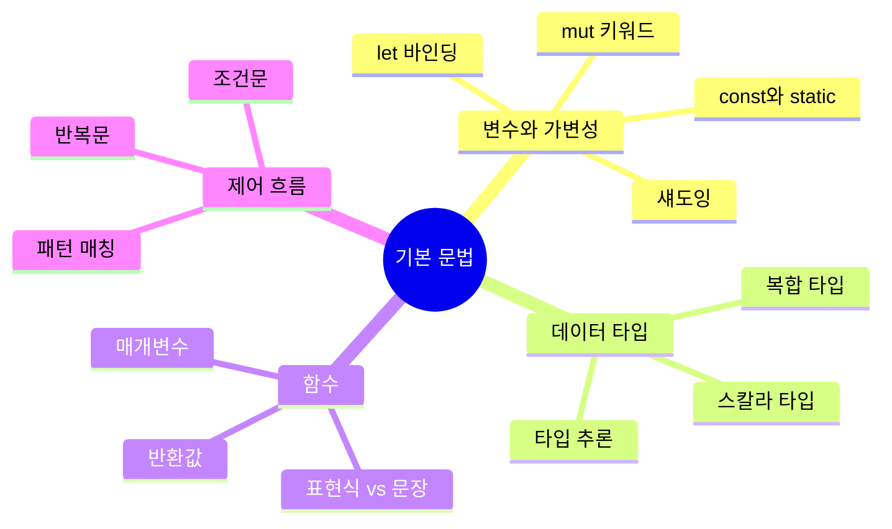
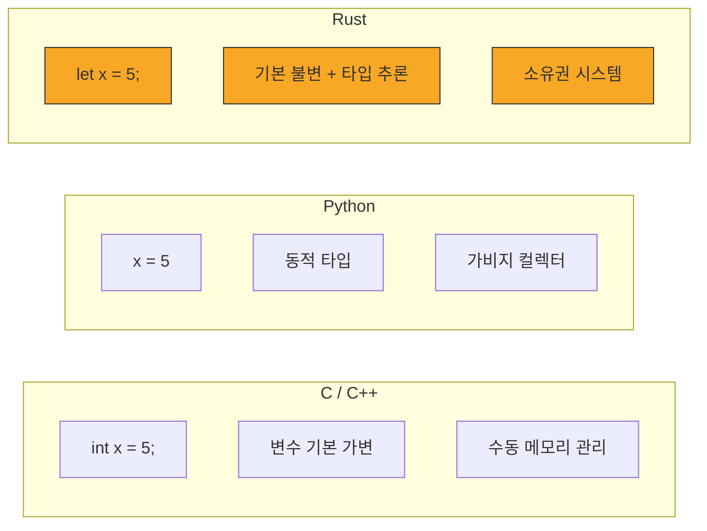

# 기본 문법 기초

Rust의 기본 문법을 배워봅시다! 이 장에서는 Rust 프로그래밍의 핵심 구성 요소들을 다룹니다.

## 이 장에서 배울 내용

## 학습 로드맵

| 순서 | 주제 | 핵심 개념 | 난이도 |
|------|------|-----------|--------|
| 2.1 | [변수와 가변성](./ch02-01-variables.md) | `let`, `mut`, `const`, 섀도잉 | ⭐ |
| 2.2 | [데이터 타입](./ch02-02-data-types.md) | 스칼라, 복합 타입, 타입 추론 | ⭐ |
| 2.3 | [함수](./ch02-03-functions.md) | `fn`, 매개변수, 반환값, 표현식 | ⭐⭐ |
| 2.4 | [제어 흐름](./ch02-04-control-flow.md) | `if`, `loop`, `while`, `for` | ⭐⭐ |

**왜 기본 문법이 중요한가요?**

Rust의 기본 문법은 다른 언어와 비슷해 보이지만, 중요한 차이점들이 있습니다:

- **변수는 기본적으로 불변(immutable)** 입니다 — 안전한 코드를 위한 Rust의 철학입니다
- **타입 시스템이 강력합니다** — 컴파일 타임에 많은 오류를 잡아줍니다
- **표현식 기반 언어입니다** — 거의 모든 것이 값을 반환합니다
- **세미콜론(`;`)의 의미가 중요합니다** — 표현식과 문장을 구분합니다

## 다른 언어와의 비교

Rust를 처음 접하는 분들을 위해, 다른 언어와 간단히 비교해 봅시다:

**학습 팁**: 각 절의 코드 예제를 직접 수정하고 실행해 보세요! 코드 블록 우측 상단의 실행 버튼을 누르면 브라우저에서 바로 실행할 수 있습니다. 에러를 내보고, 고쳐보는 과정이 가장 효과적인 학습 방법입니다.

## 준비 사항

이 장을 시작하기 전에 다음 사항을 확인하세요:

- [x] Rust 개발 환경이 설치되어 있어야 합니다 ([1.2절 참고](../ch01/ch01-02-installation.md))
- [x] `cargo new` 명령으로 프로젝트를 만들 수 있어야 합니다 ([1.4절 참고](../ch01/ch01-04-cargo.md))
- [x] 터미널에서 `rustc --version` 명령이 정상 동작해야 합니다

자, 이제 Rust의 기본 문법을 하나씩 살펴봅시다! 먼저 [변수와 가변성](./ch02-01-variables.md)부터 시작합니다.
