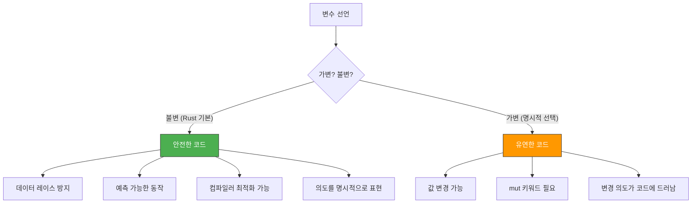
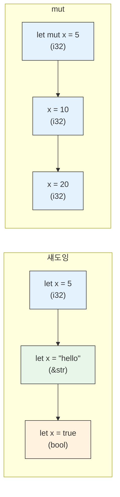

# 변수와 가변성 <span class="badge-beginner">기초</span>

Rust에서 변수를 선언하고 사용하는 방법을 알아봅시다. Rust의 변수 시스템은 안전성과 성능을 동시에 추구하는 Rust 철학의 핵심입니다.

## `let` 바인딩

Rust에서 변수는 `let` 키워드로 선언합니다. 이를 **바인딩(binding)** 이라고 부릅니다 — 값을 이름에 **묶는다**는 의미입니다.

```rust,editable
fn main() {
    let x = 5;
    let y = 10;
    let sum = x + y;
    println!("x = {}, y = {}, 합계 = {}", x, y, sum);
}
```

<div class="info-box">

**바인딩 vs 할당**: Rust에서는 "변수에 값을 할당한다"보다 "값을 이름에 바인딩한다"는 표현이 더 정확합니다. 이 미묘한 차이는 나중에 소유권(ownership)을 배울 때 중요해집니다.

</div>

## 불변 변수 (기본값)

Rust의 변수는 **기본적으로 불변(immutable)** 입니다. 한 번 값을 바인딩하면 변경할 수 없습니다.

```rust,editable
fn main() {
    let x = 5;
    println!("x의 값: {}", x);

    // 아래 줄의 주석을 해제하면 컴파일 에러가 발생합니다!
    // x = 6;  // error[E0384]: cannot assign twice to immutable variable `x`

    println!("x의 값은 여전히: {}", x);
}
```

<div class="warning-box">

**주석을 해제해 보세요!** `x = 6;` 줄의 주석을 해제하고 실행하면 어떤 에러가 발생하는지 직접 확인해 보세요. Rust 컴파일러의 에러 메시지는 매우 친절합니다.

</div>

### 왜 기본이 불변인가?



불변이 기본인 이유를 정리하면:

1. **안전성**: 의도하지 않은 값 변경을 컴파일 타임에 방지합니다
2. **가독성**: 코드를 읽을 때 값이 변하지 않는다는 보장이 있으면 이해하기 쉽습니다
3. **동시성**: 불변 데이터는 여러 스레드에서 안전하게 공유할 수 있습니다
4. **최적화**: 컴파일러가 값이 변하지 않음을 알면 더 효율적인 코드를 생성할 수 있습니다

## `mut` — 가변 변수

값을 변경해야 할 때는 `mut` 키워드를 사용합니다.

```rust,editable
fn main() {
    let mut x = 5;
    println!("x의 값: {}", x);

    x = 6;  // mut이 있으므로 변경 가능!
    println!("x의 변경된 값: {}", x);

    // 실용적인 예: 합계 계산
    let mut total = 0;
    total += 10;
    total += 20;
    total += 30;
    println!("합계: {}", total);
}
```

<div class="tip-box">

**언제 `mut`을 사용할까요?**
- 루프에서 카운터를 증가시킬 때
- 누적 합계를 계산할 때
- 버퍼에 데이터를 쌓을 때
- 상태가 변경되어야 하는 경우

가능하면 불변 변수를 사용하되, 필요한 경우에만 `mut`을 추가하세요.

</div>

## `const` — 상수

상수는 `const` 키워드로 선언합니다. 변수와 다른 중요한 차이점이 있습니다.

```rust,editable
// 상수는 반드시 타입을 명시해야 합니다
const MAX_POINTS: u32 = 100_000;
const PI: f64 = 3.141592653589793;
const APP_NAME: &str = "Rust 학습 가이드";

fn main() {
    println!("최대 점수: {}", MAX_POINTS);
    println!("원주율: {}", PI);
    println!("앱 이름: {}", APP_NAME);

    // 숫자 리터럴에 밑줄(_)을 넣어 가독성을 높일 수 있습니다
    const ONE_MILLION: u64 = 1_000_000;
    println!("백만: {}", ONE_MILLION);
}
```

### `let` vs `const` 비교

| 특성 | `let` (변수) | `const` (상수) |
|------|-------------|----------------|
| 타입 명시 | 선택 (타입 추론 가능) | **필수** |
| `mut` 사용 | 가능 | **불가능** |
| 섀도잉 | 가능 | **불가능** |
| 컴파일 타임 계산 | 불필요 | **필수** (컴파일 타임 값만) |
| 스코프 | 블록 스코프 | 어디서든 선언 가능 |
| 네이밍 규칙 | snake_case | **SCREAMING_SNAKE_CASE** |

## `static` — 정적 변수

`static`은 프로그램의 전체 생명주기 동안 존재하는 변수입니다.

```rust,editable
static GREETING: &str = "안녕하세요!";
static mut COUNTER: u32 = 0;  // 가변 static (위험!)

fn main() {
    println!("{}", GREETING);

    // 가변 static 변수 접근은 unsafe 블록이 필요합니다
    unsafe {
        COUNTER += 1;
        println!("카운터: {}", COUNTER);
    }
}
```

<div class="warning-box">

**`static mut`는 위험합니다!** 가변 정적 변수는 데이터 레이스를 일으킬 수 있어 `unsafe` 블록 안에서만 접근할 수 있습니다. 실제 코드에서는 `static mut` 대신 `Mutex`, `Atomic` 타입 등을 사용하세요. 이 내용은 동시성 장에서 자세히 다룹니다.

</div>

### `const` vs `static` 비교

| 특성 | `const` | `static` |
|------|---------|----------|
| 메모리 | 사용되는 곳에 인라인 | 고정 메모리 주소 |
| 생명주기 | 없음 (컴파일 타임 상수) | `'static` (프로그램 전체) |
| 가변성 | 불가능 | `static mut` 가능 (unsafe) |
| 참조 가능 | 참조 불가 | `&'static` 참조 가능 |
| 용도 | 매직 넘버 대체, 설정값 | 전역 상태, 전역 데이터 |

## 섀도잉 (Shadowing)

Rust에서는 같은 이름의 변수를 다시 `let`으로 선언할 수 있습니다. 이를 **섀도잉**이라고 합니다.

```rust,editable
fn main() {
    let x = 5;
    println!("처음 x: {}", x);

    // 같은 이름으로 새로운 변수를 선언 (섀도잉)
    let x = x + 1;
    println!("섀도잉 후 x: {}", x);  // 6

    let x = x * 2;
    println!("다시 섀도잉 후 x: {}", x);  // 12

    // 블록 스코프에서의 섀도잉
    {
        let x = x + 100;
        println!("내부 블록의 x: {}", x);  // 112
    }

    // 블록을 벗어나면 바깥 x가 다시 보입니다
    println!("바깥 블록의 x: {}", x);  // 12
}
```

### 섀도잉 vs `mut`

섀도잉과 `mut`은 다릅니다! 섀도잉은 **새로운 변수를 만드는 것**이고, `mut`은 **기존 변수의 값을 변경하는 것**입니다.

```rust,editable
fn main() {
    // 섀도잉: 타입을 변경할 수 있습니다!
    let spaces = "   ";           // &str 타입
    let spaces = spaces.len();    // usize 타입으로 변경!
    println!("공백 수: {}", spaces);

    // mut으로는 타입을 변경할 수 없습니다
    // let mut spaces = "   ";
    // spaces = spaces.len();  // 컴파일 에러! 타입이 다름
}
```



### 섀도잉의 실용적 활용

```rust,editable
fn main() {
    // 1. 입력 값 변환 시 자연스러운 이름 유지
    let input = "42";
    let input: i32 = input.parse().expect("숫자가 아닙니다");
    println!("변환된 입력: {}", input);

    // 2. 불필요한 가변성 제거
    let mut data = Vec::new();
    data.push(1);
    data.push(2);
    data.push(3);
    let data = data;  // 이제부터 data는 불변!
    println!("데이터: {:?}", data);
    // data.push(4);  // 에러! data는 이제 불변입니다

    // 3. 중간 계산 결과에 의미 있는 이름 부여
    let price = 10000;
    let price = price as f64 * 1.1;    // 부가세 포함
    let price = price as i64;          // 정수로 변환
    println!("최종 가격: {}원", price);
}
```

<div class="info-box">

**섀도잉을 사용하는 경우**:
- 타입 변환 시 같은 의미의 이름을 유지하고 싶을 때
- 가변 변수를 수정한 후 불변으로 "동결"하고 싶을 때
- 값을 단계적으로 변환할 때

</div>

---

## 종합 예제

지금까지 배운 개념들을 종합적으로 사용하는 예제입니다:

```rust,editable
const TAX_RATE: f64 = 0.1;  // 세율 10%

fn main() {
    // let 바인딩 (불변)
    let product_name = "Rust 프로그래밍 책";
    let base_price = 35000;

    // 섀도잉으로 타입 변환
    let base_price = base_price as f64;

    // 세금 계산
    let tax = base_price * TAX_RATE;
    let total = base_price + tax;

    println!("=== 주문서 ===");
    println!("상품: {}", product_name);
    println!("기본가: {:.0}원", base_price);
    println!("세금:   {:.0}원 ({}%)", tax, TAX_RATE * 100.0);
    println!("합계:   {:.0}원", total);

    // mut 사용: 장바구니
    let mut cart_total = 0.0_f64;
    cart_total += total;
    cart_total += 15000.0;  // 두 번째 상품
    cart_total += 8500.0;   // 세 번째 상품

    println!("\n=== 장바구니 합계 ===");
    println!("총 금액: {:.0}원", cart_total);

    // 섀도잉으로 불변 동결
    let cart_total = cart_total;
    // cart_total += 1000.0;  // 이제 변경 불가!
    println!("최종 확정 금액: {:.0}원", cart_total);
}
```

---

<div class="exercise-box">

### 연습 문제

**연습 1**: 다음 코드를 수정하여 컴파일되도록 만드세요.

```rust,editable
fn main() {
    let x = 10;
    x = 20;  // 이 줄에서 에러 발생!
    println!("x = {}", x);
}
```

**연습 2**: 섀도잉을 사용하여 문자열 `"123"`을 숫자 `123`으로 변환하고, 그 값에 `1`을 더한 결과를 출력하세요.

```rust,editable
fn main() {
    let value = "123";
    // 여기에 섀도잉을 사용하여 코드를 작성하세요

    // 최종 결과: 124가 출력되어야 합니다
    // println!("결과: {}", value);
}
```

**연습 3**: 상수 `SPEED_OF_LIGHT`를 `299_792_458` (m/s)로 정의하고, 빛이 1초, 1분, 1시간 동안 이동하는 거리를 계산하여 출력하세요.

```rust,editable
// 여기에 상수를 정의하세요

fn main() {
    // 1초, 1분, 1시간 동안의 이동 거리를 계산하세요
    println!("빛의 속도: {} m/s", 0);  // 수정하세요
    println!("1분 거리: {} m", 0);      // 수정하세요
    println!("1시간 거리: {} m", 0);    // 수정하세요
}
```

</div>

---

<div class="quiz-box" onclick="this.classList.toggle('show-answer')">

**퀴즈 1**: 다음 코드의 출력 결과는?
```rust
fn main() {
    let x = 5;
    let x = x + 1;
    {
        let x = x * 2;
        println!("{}", x);
    }
    println!("{}", x);
}
```
<div class="quiz-answer">

**정답**: `12`와 `6`이 차례로 출력됩니다.

- `let x = 5;` → x = 5
- `let x = x + 1;` → x = 6 (섀도잉)
- 내부 블록에서 `let x = x * 2;` → x = 12 (블록 내부 섀도잉)
- `println!("{}", x);` → **12** 출력
- 블록을 벗어나면 바깥 x(= 6)가 다시 보임
- `println!("{}", x);` → **6** 출력

</div>
</div>

<div class="quiz-box" onclick="this.classList.toggle('show-answer')">

**퀴즈 2**: 다음 중 컴파일 에러가 발생하는 코드는?

(A)
```rust
let x = 5;
let x = "hello";
```

(B)
```rust
let mut x = 5;
x = "hello";
```

(C)
```rust
const X: i32 = 5;
```

(D)
```rust
let mut x = 5;
x = 10;
```

<div class="quiz-answer">

**정답**: **(B)**

- (A): 섀도잉이므로 타입이 달라도 됩니다. 정상 컴파일.
- (B): `mut`은 같은 타입의 값만 변경 가능합니다. `i32`에 `&str`을 대입하므로 **컴파일 에러!**
- (C): 상수 선언. 정상 컴파일.
- (D): `mut`으로 같은 타입의 값을 변경. 정상 컴파일.

</div>
</div>

<div class="quiz-box" onclick="this.classList.toggle('show-answer')">

**퀴즈 3**: `const`와 `static`의 가장 큰 차이점은 무엇인가요?

<div class="quiz-answer">

**정답**: `const`는 컴파일 타임에 값이 결정되어 사용 위치에 인라인(복사)되지만, `static`은 프로그램 전체 생명주기 동안 **고정된 메모리 주소**에 존재합니다.

- `const`: 메모리 주소가 없고, 사용하는 곳마다 값이 복사됩니다
- `static`: 고정 메모리 주소를 가지며, `&'static` 참조를 만들 수 있습니다
- `static mut`: 가변이 가능하지만 `unsafe` 블록이 필요합니다

</div>
</div>

---

<div class="summary-box">

### 핵심 정리

1. **`let`**: 변수 바인딩. 기본적으로 **불변(immutable)** 입니다.
2. **`let mut`**: 가변 변수. 같은 타입의 값으로만 변경 가능합니다.
3. **`const`**: 컴파일 타임 상수. 타입 명시 필수, `SCREAMING_SNAKE_CASE` 사용.
4. **`static`**: 전역 정적 변수. 고정 메모리 주소, `'static` 생명주기.
5. **섀도잉**: 같은 이름으로 `let`을 다시 선언. **타입 변경 가능**, 새로운 변수를 생성.
6. **불변이 기본**인 이유: 안전성, 가독성, 동시성, 최적화.

</div>

다음 절에서는 Rust의 [데이터 타입](./ch02-02-data-types.md)을 알아봅니다.
