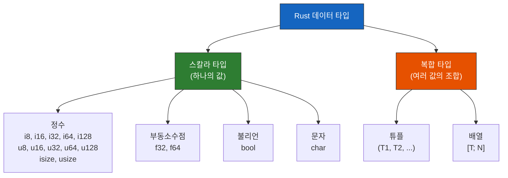
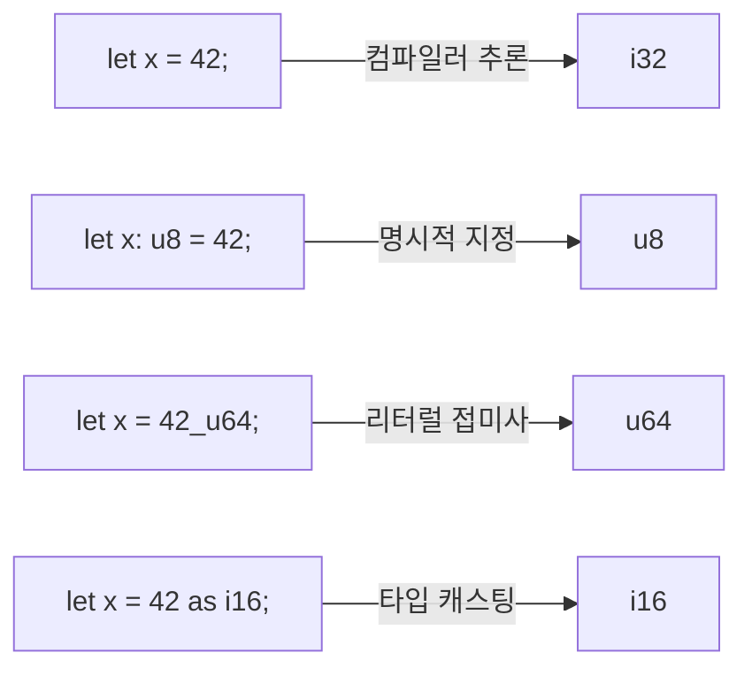

# 데이터 타입 <span class="badge-beginner">기초</span>

Rust는 **정적 타입(statically typed)** 언어입니다. 모든 변수의 타입이 컴파일 타임에 결정되어야 합니다. 하지만 대부분의 경우 컴파일러가 타입을 **추론(infer)** 할 수 있으므로 명시적으로 적지 않아도 됩니다.

Rust의 데이터 타입은 크게 **스칼라(scalar)** 타입과 **복합(compound)** 타입으로 나뉩니다.



---

## 스칼라 타입

스칼라 타입은 하나의 값을 나타냅니다.

### 정수 타입

Rust는 다양한 크기의 정수 타입을 제공합니다.

| 크기 | 부호 있음 (signed) | 부호 없음 (unsigned) | 범위 (부호 있음) |
|------|-------------------|---------------------|-----------------|
| 8비트 | `i8` | `u8` | -128 ~ 127 |
| 16비트 | `i16` | `u16` | -32,768 ~ 32,767 |
| 32비트 | `i32` | `u32` | -2,147,483,648 ~ 2,147,483,647 |
| 64비트 | `i64` | `u64` | -9.2 x 10^18 ~ 9.2 x 10^18 |
| 128비트 | `i128` | `u128` | 매우 큰 범위 |
| 아키텍처 | `isize` | `usize` | 32비트 또는 64비트 시스템에 따라 |

<div class="info-box">

**기본 정수 타입**: 타입을 명시하지 않으면 정수는 `i32`가 기본값입니다. 대부분의 경우 `i32`가 가장 빠릅니다(64비트 시스템에서도).

**`usize`와 `isize`**: 시스템 아키텍처에 따라 크기가 달라집니다. 컬렉션의 인덱스, 메모리 크기 등에 주로 사용됩니다.

</div>

```rust,editable
fn main() {
    // 기본 정수 타입 (i32)
    let default_int = 42;

    // 타입을 명시적으로 지정
    let small: i8 = 127;       // i8 최대값
    let medium: i32 = 1_000_000;
    let big: i64 = 9_000_000_000;
    let huge: i128 = 170_141_183_460_469_231_731_687_303_715_884_105_727;

    // 부호 없는 정수
    let unsigned: u32 = 4_294_967_295;  // u32 최대값
    let byte: u8 = 255;                 // u8 최대값

    // 인덱스/크기에 사용하는 usize
    let index: usize = 0;

    println!("default: {}", default_int);
    println!("i8:   {}", small);
    println!("i32:  {}", medium);
    println!("i64:  {}", big);
    println!("i128: {}", huge);
    println!("u32:  {}", unsigned);
    println!("u8:   {}", byte);
    println!("usize: {}", index);
}
```

#### 정수 리터럴 표기법

```rust,editable
fn main() {
    let decimal = 98_222;       // 십진수 (밑줄로 가독성 향상)
    let hex = 0xff;             // 16진수
    let octal = 0o77;           // 8진수
    let binary = 0b1111_0000;   // 2진수
    let byte_val = b'A';        // 바이트 (u8만)

    println!("십진수: {}", decimal);
    println!("16진수 0xff = {}", hex);
    println!("8진수 0o77 = {}", octal);
    println!("2진수 0b1111_0000 = {}", binary);
    println!("바이트 b'A' = {}", byte_val);

    // 타입 접미사로 타입 지정
    let x = 42u8;      // u8 타입
    let y = 100_i64;    // i64 타입
    println!("u8: {}, i64: {}", x, y);
}
```

<div class="warning-box">

**정수 오버플로우**: Rust는 디버그 모드에서 정수 오버플로우 시 패닉(프로그램 중단)을 발생시킵니다. 릴리스 모드에서는 2의 보수 방식으로 래핑됩니다. 명시적으로 오버플로우를 처리하려면 `wrapping_add`, `checked_add`, `overflowing_add`, `saturating_add` 메서드를 사용하세요.

</div>

```rust,editable
fn main() {
    let a: u8 = 250;

    // wrapping: 오버플로우 시 래핑
    println!("250 + 10 (wrapping) = {}", a.wrapping_add(10));  // 4

    // checked: 오버플로우 시 None 반환
    println!("250 + 10 (checked) = {:?}", a.checked_add(10));  // None
    println!("250 + 3  (checked) = {:?}", a.checked_add(3));   // Some(253)

    // saturating: 최대값에서 멈춤
    println!("250 + 10 (saturating) = {}", a.saturating_add(10));  // 255
}
```

---

### 부동소수점 타입

| 타입 | 크기 | 정밀도 | 표준 |
|------|------|--------|------|
| `f32` | 32비트 | 약 6~7 자릿수 | IEEE 754 |
| `f64` | 64비트 | 약 15~16 자릿수 | IEEE 754 |

```rust,editable
fn main() {
    // 기본 부동소수점 타입은 f64
    let x = 2.0;        // f64
    let y: f32 = 3.0;   // f32 (명시적)

    // 산술 연산
    let sum = 5.0 + 10.0;
    let difference = 95.5 - 4.3;
    let product = 4.0 * 30.0;
    let quotient = 56.7 / 32.2;
    let remainder = 43.0 % 5.0;

    println!("합: {}", sum);
    println!("차: {}", difference);
    println!("곱: {}", product);
    println!("몫: {:.4}", quotient);
    println!("나머지: {}", remainder);

    // 부동소수점 주의사항
    println!("\n--- 부동소수점 주의사항 ---");
    println!("0.1 + 0.2 = {}", 0.1 + 0.2);  // 0.30000000000000004
    println!("0.1 + 0.2 == 0.3? {}", (0.1_f64 + 0.2 - 0.3).abs() < f64::EPSILON);
}
```

<div class="tip-box">

**부동소수점 비교**: 부동소수점 숫자는 정밀도 문제로 `==` 비교가 정확하지 않을 수 있습니다. 두 부동소수점 값을 비교할 때는 `(a - b).abs() < EPSILON` 패턴을 사용하세요.

</div>

---

### 불리언 타입

```rust,editable
fn main() {
    let t: bool = true;
    let f = false;  // 타입 추론

    println!("true AND false = {}", t && f);
    println!("true OR false = {}", t || f);
    println!("NOT true = {}", !t);

    // 불리언은 조건문에서 주로 사용
    let is_rust_fun = true;
    if is_rust_fun {
        println!("Rust는 재미있습니다!");
    }

    // bool은 1바이트 크기
    println!("bool 크기: {} 바이트", std::mem::size_of::<bool>());
}
```

---

### 문자 타입 (`char`)

Rust의 `char`는 **4바이트 유니코드 스칼라 값**입니다. ASCII뿐 아니라 한글, 이모지 등을 모두 표현할 수 있습니다.

```rust,editable
fn main() {
    let c = 'z';
    let korean = '가';
    let emoji = '🦀';  // Rust의 마스코트 Ferris!
    let heart = '❤';

    println!("문자: {}, {}, {}, {}", c, korean, emoji, heart);
    println!("char 크기: {} 바이트", std::mem::size_of::<char>());

    // char 관련 메서드
    println!("'A'는 알파벳? {}", 'A'.is_alphabetic());
    println!("'3'은 숫자? {}", '3'.is_numeric());
    println!("'a'를 대문자로: {}", 'a'.to_uppercase().next().unwrap());
    println!("'가'는 알파벳? {}", '가'.is_alphabetic());  // true!
}
```

<div class="info-box">

**`char` vs 문자열의 바이트**: `char`는 항상 4바이트이지만, UTF-8 문자열(`String`, `&str`)에서 각 문자가 차지하는 바이트 수는 1~4바이트로 다양합니다. 예를 들어 ASCII는 1바이트, 한글은 3바이트입니다.

</div>

---

## 복합 타입

복합 타입은 여러 값을 하나의 타입으로 묶습니다.

### 튜플 (Tuple)

서로 다른 타입의 값들을 고정된 길이로 묶습니다.

```rust,editable
fn main() {
    // 튜플 생성
    let tup: (i32, f64, bool) = (500, 6.4, true);

    // 구조 분해(destructuring)로 값 추출
    let (x, y, z) = tup;
    println!("x = {}, y = {}, z = {}", x, y, z);

    // 인덱스로 접근 (0부터 시작)
    println!("첫 번째: {}", tup.0);
    println!("두 번째: {}", tup.1);
    println!("세 번째: {}", tup.2);

    // 다양한 타입 혼합
    let person: (&str, i32, f64) = ("김철수", 25, 175.5);
    println!("\n이름: {}, 나이: {}, 키: {}cm", person.0, person.1, person.2);

    // 중첩 튜플
    let nested = ((1, 2), (3, 4));
    println!("\n중첩: ({}, {}), ({}, {})",
        nested.0 .0, nested.0 .1, nested.1 .0, nested.1 .1);
}
```

#### 유닛 타입 `()`

빈 튜플 `()`는 **유닛(unit) 타입**이라고 합니다. 값이 없음을 나타내며, 반환값이 없는 함수는 암묵적으로 `()`를 반환합니다.

```rust,editable
fn do_nothing() {
    // 반환값이 없으면 ()를 반환
}

fn also_nothing() -> () {
    // 위와 동일
}

fn main() {
    let unit = ();
    println!("유닛 타입 크기: {} 바이트", std::mem::size_of_val(&unit));

    let result = do_nothing();
    println!("반환값: {:?}", result);  // ()
}
```

---

### 배열 (Array)

같은 타입의 값들을 **고정된 길이**로 저장합니다. 배열의 크기는 컴파일 타임에 결정됩니다.

```rust,editable
fn main() {
    // 배열 선언
    let numbers = [1, 2, 3, 4, 5];
    let months: [&str; 12] = [
        "1월", "2월", "3월", "4월", "5월", "6월",
        "7월", "8월", "9월", "10월", "11월", "12월"
    ];

    // 인덱스로 접근
    println!("첫 번째 숫자: {}", numbers[0]);
    println!("세 번째 달: {}", months[2]);

    // 같은 값으로 초기화
    let zeros = [0; 5];       // [0, 0, 0, 0, 0]
    let ones = [1.0; 3];      // [1.0, 1.0, 1.0]
    println!("zeros: {:?}", zeros);
    println!("ones: {:?}", ones);

    // 배열의 길이
    println!("months 길이: {}", months.len());

    // 배열 순회
    print!("숫자들: ");
    for num in &numbers {
        print!("{} ", num);
    }
    println!();

    // 슬라이스로 일부분 접근
    let slice = &numbers[1..4];  // [2, 3, 4]
    println!("슬라이스: {:?}", slice);
}
```

<div class="warning-box">

**배열 범위 초과 접근**: Rust는 배열 인덱스 범위를 **런타임에 검사**합니다. 범위를 벗어나면 패닉이 발생합니다. C/C++의 버퍼 오버플로우 같은 보안 취약점을 방지합니다.

```rust
let arr = [1, 2, 3];
// arr[10]; // 런타임 패닉: index out of bounds
```

</div>

### 배열 vs 벡터

| 특성 | 배열 `[T; N]` | 벡터 `Vec<T>` |
|------|--------------|---------------|
| 크기 | 컴파일 타임 고정 | 런타임에 변경 가능 |
| 저장 위치 | 스택 | 힙 |
| 성능 | 더 빠름 (스택 할당) | 약간 느림 (힙 할당) |
| 유연성 | 낮음 | 높음 |
| 사용 시점 | 크기가 고정된 데이터 | 크기가 변할 수 있는 데이터 |

---

## 타입 추론과 타입 어노테이션

Rust 컴파일러는 대부분의 경우 타입을 자동으로 추론합니다. 하지만 때로는 명시적으로 타입을 지정해야 합니다.

```rust,editable
fn main() {
    // 타입 추론
    let x = 5;          // i32로 추론
    let y = 2.0;        // f64로 추론
    let z = true;       // bool로 추론
    let s = "hello";    // &str로 추론

    // 타입 어노테이션이 필요한 경우
    let parsed: i32 = "42".parse().expect("파싱 실패");
    // let parsed = "42".parse().expect("파싱 실패");  // 에러! 어떤 타입으로?

    println!("parsed = {}", parsed);

    // 타입 어노테이션 방법들
    let a: i64 = 100;       // 변수 뒤에 명시
    let b = 100_i64;        // 리터럴 접미사
    let c = 100 as i64;     // as 캐스팅

    println!("a = {}, b = {}, c = {}", a, b, c);
}
```



---

## 타입 변환 (Casting)

Rust는 암묵적 타입 변환을 허용하지 않습니다. `as` 키워드를 사용하여 명시적으로 변환해야 합니다.

```rust,editable
fn main() {
    // 정수 간 변환
    let x: i32 = 42;
    let y: i64 = x as i64;     // 작은 타입 → 큰 타입 (안전)
    let z: i8 = x as i8;       // 큰 타입 → 작은 타입 (잘림 가능!)
    println!("i32: {}, i64: {}, i8: {}", x, y, z);

    // 정수 ↔ 부동소수점
    let int_val = 42;
    let float_val = int_val as f64;
    let back_to_int = 3.99_f64 as i32;  // 소수점 이하 버림!
    println!("int → float: {}", float_val);
    println!("3.99 → int: {}", back_to_int);  // 3 (반올림 아님!)

    // char ↔ 정수
    let letter = 'A';
    let code = letter as u32;
    println!("'A'의 유니코드: {}", code);  // 65

    let code = 44032_u32;
    let korean = char::from_u32(code).unwrap();
    println!("44032 → '{}'", korean);  // '가'
}
```

<div class="warning-box">

**타입 캐스팅 주의사항**: `as`를 사용한 캐스팅은 데이터 손실이 발생할 수 있습니다. 큰 타입에서 작은 타입으로 변환 시 값이 잘릴 수 있고, 부동소수점에서 정수로 변환 시 소수점 이하가 버려집니다(반올림이 아닙니다!).

</div>

---

## 전체 타입 요약표

| 분류 | 타입 | 크기(바이트) | 설명 |
|------|------|-------------|------|
| 정수 | `i8` / `u8` | 1 | 8비트 부호 있음 / 없음 |
| | `i16` / `u16` | 2 | 16비트 |
| | `i32` / `u32` | 4 | 32비트 (기본 정수 타입) |
| | `i64` / `u64` | 8 | 64비트 |
| | `i128` / `u128` | 16 | 128비트 |
| | `isize` / `usize` | 4 또는 8 | 아키텍처 의존 |
| 부동소수점 | `f32` | 4 | 단정밀도 |
| | `f64` | 8 | 배정밀도 (기본) |
| 불리언 | `bool` | 1 | `true` 또는 `false` |
| 문자 | `char` | 4 | 유니코드 스칼라 값 |
| 복합 | `(T1, T2, ...)` | 요소 합 | 튜플 |
| | `[T; N]` | T 크기 x N | 배열 |
| 유닛 | `()` | 0 | 빈 값 |

---

## 타입 크기 직접 확인하기

```rust,editable
use std::mem::size_of;

fn main() {
    println!("=== 스칼라 타입 크기 ===");
    println!("i8:    {} 바이트", size_of::<i8>());
    println!("i16:   {} 바이트", size_of::<i16>());
    println!("i32:   {} 바이트", size_of::<i32>());
    println!("i64:   {} 바이트", size_of::<i64>());
    println!("i128:  {} 바이트", size_of::<i128>());
    println!("usize: {} 바이트", size_of::<usize>());
    println!("f32:   {} 바이트", size_of::<f32>());
    println!("f64:   {} 바이트", size_of::<f64>());
    println!("bool:  {} 바이트", size_of::<bool>());
    println!("char:  {} 바이트", size_of::<char>());

    println!("\n=== 복합 타입 크기 ===");
    println!("():          {} 바이트", size_of::<()>());
    println!("(i32, i32):  {} 바이트", size_of::<(i32, i32)>());
    println!("[i32; 5]:    {} 바이트", size_of::<[i32; 5]>());
    println!("(bool, i32): {} 바이트", size_of::<(bool, i32)>());  // 패딩!
}
```

<div class="tip-box">

**패딩과 정렬**: 복합 타입의 크기가 요소의 단순 합보다 클 수 있습니다. 이는 메모리 정렬(alignment)을 위한 **패딩(padding)** 때문입니다. 예를 들어 `(bool, i32)`는 1 + 4 = 5가 아니라 8바이트일 수 있습니다.

</div>

---

<div class="exercise-box">

### 연습 문제

**연습 1**: 다음 코드에 적절한 타입 어노테이션을 추가하여 컴파일되도록 만드세요.

```rust,editable
fn main() {
    let temperature = "36.5";
    // temperature를 f64로 파싱하세요
    // let temp = temperature.parse().expect("파싱 실패");
    // println!("체온: {}도", temp);
}
```

**연습 2**: 튜플을 사용하여 학생 정보(이름, 나이, 평균점수)를 저장하고, 구조 분해를 통해 각 값을 출력하세요.

```rust,editable
fn main() {
    // 학생 정보를 튜플로 만드세요
    // 이름: "이영희", 나이: 20, 평균점수: 92.5

    // 구조 분해로 각 값을 추출하세요

    // 출력: "이름: 이영희, 나이: 20, 평균점수: 92.5"
}
```

**연습 3**: 5명의 학생 점수를 배열로 저장하고, 평균을 계산하여 출력하세요.

```rust,editable
fn main() {
    let scores = [85, 92, 78, 96, 88];

    // 합계를 계산하세요 (for 루프 사용)
    // let mut sum = 0;

    // 평균을 계산하세요 (f64로 변환 필요)

    // 출력: "평균 점수: XX.X"
}
```

**연습 4**: 다양한 정수 리터럴 표기법을 사용하여 같은 값(255)을 10진수, 16진수, 8진수, 2진수로 각각 선언하고 모두 같은 값인지 확인하세요.

```rust,editable
fn main() {
    // 255를 네 가지 방법으로 표현하세요
    // let decimal = ...;
    // let hex = ...;
    // let octal = ...;
    // let binary = ...;

    // 모두 같은 값인지 확인
    // println!("모두 같은 값? {}", ...);
}
```

</div>

---

<div class="quiz-box" onclick="this.classList.toggle('show-answer')">

**퀴즈 1**: Rust에서 타입을 명시하지 않았을 때, 정수 리터럴의 기본 타입은?
<div class="quiz-answer">

**정답**: `i32`

부동소수점 리터럴의 기본 타입은 `f64`입니다.

</div>
</div>

<div class="quiz-box" onclick="this.classList.toggle('show-answer')">

**퀴즈 2**: `char` 타입의 크기는 몇 바이트인가요?
<div class="quiz-answer">

**정답**: **4바이트**

Rust의 `char`는 유니코드 스칼라 값(Unicode Scalar Value)을 나타내며, 항상 4바이트입니다. 이는 C/C++의 `char`(1바이트)와 다릅니다.

</div>
</div>

<div class="quiz-box" onclick="this.classList.toggle('show-answer')">

**퀴즈 3**: 다음 코드의 출력 결과는?
```rust
fn main() {
    let tup = (1, 2.0, '3');
    let (a, b, c) = tup;
    println!("{} {} {}", a, tup.1, c);
}
```
<div class="quiz-answer">

**정답**: `1 2 3`

- `a` = 1 (i32)
- `tup.1` = 2.0 이지만 `{}` 포매터로 출력하면 `2` (소수점 이하 0은 생략됨)
- `c` = '3' (char, 출력 시 `3`)

</div>
</div>

<div class="quiz-box" onclick="this.classList.toggle('show-answer')">

**퀴즈 4**: 배열 `[0; 5]`의 의미는 무엇인가요?
<div class="quiz-answer">

**정답**: `0`이라는 값으로 채워진 길이 5의 배열을 생성합니다.

결과: `[0, 0, 0, 0, 0]`

`[값; 길이]` 형태의 문법으로, 모든 요소를 동일한 값으로 초기화할 때 사용합니다.

</div>
</div>

---

<div class="summary-box">

### 핵심 정리

1. Rust는 **정적 타입** 언어이며, 강력한 **타입 추론**을 지원합니다.
2. **스칼라 타입**: 정수(`i32` 기본), 부동소수점(`f64` 기본), 불리언(`bool`), 문자(`char` 4바이트).
3. **복합 타입**: 튜플(`(T1, T2, ...)` — 다른 타입 가능), 배열(`[T; N]` — 같은 타입, 고정 크기).
4. **유닛 타입** `()`: 값이 없음을 나타냅니다.
5. **암묵적 타입 변환 없음**: `as` 키워드로 명시적 변환만 가능합니다.
6. 정수 리터럴은 **밑줄**, **접미사**, **진법 접두사**(`0x`, `0o`, `0b`)를 지원합니다.
7. 배열 인덱스 범위 초과는 **런타임 패닉**을 일으켜 메모리 안전성을 보장합니다.

</div>

다음 절에서는 [함수](./ch02-03-functions.md)를 알아봅니다.
