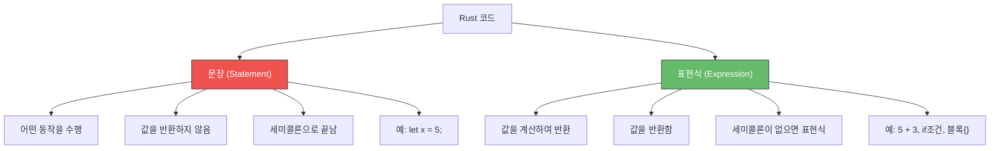
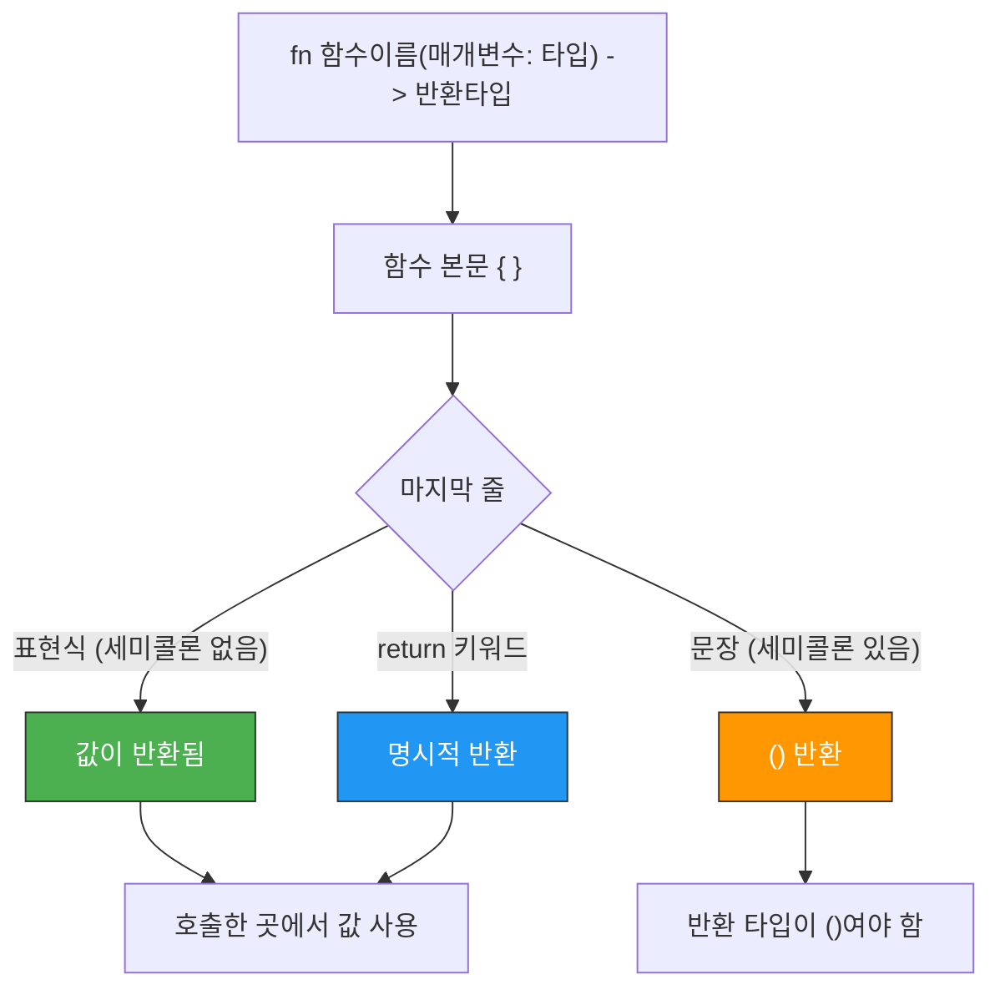

# 함수 <span class="badge-beginner">기초</span>

함수는 Rust 프로그램의 기본 구성 블록입니다. `main` 함수는 모든 Rust 프로그램의 진입점이며, `fn` 키워드로 새로운 함수를 정의합니다.

## 함수 정의

```rust,editable
// 함수 정의: fn 함수이름()
fn greet() {
    println!("안녕하세요! Rust 세계에 오신 것을 환영합니다.");
}

fn main() {
    greet();          // 함수 호출
    greet();          // 여러 번 호출 가능
    say_hello();      // main 아래에 정의된 함수도 호출 가능
}

// 함수 정의 순서는 상관없습니다
fn say_hello() {
    println!("Hello, Rust!");
}
```

<div class="info-box">

**함수 네이밍 규칙**: Rust에서 함수와 변수 이름은 `snake_case`를 사용합니다. `camelCase`나 `PascalCase`를 쓰면 컴파일러가 경고를 보여줍니다.

- `calculate_area` (좋음)
- `calculateArea` (경고 발생)
- `CalculateArea` (경고 발생)

</div>

---

## 매개변수 (Parameters)

함수에 값을 전달하려면 매개변수를 정의합니다. Rust에서는 **매개변수의 타입을 반드시 명시**해야 합니다.

```rust,editable
// 매개변수 하나
fn greet_user(name: &str) {
    println!("안녕하세요, {}님!", name);
}

// 매개변수 여러 개
fn print_info(name: &str, age: i32, height: f64) {
    println!("이름: {}, 나이: {}, 키: {}cm", name, age, height);
}

// 같은 타입의 매개변수도 각각 타입을 명시해야 합니다
fn add(a: i32, b: i32) {
    println!("{} + {} = {}", a, b, a + b);
}

fn main() {
    greet_user("철수");
    greet_user("영희");

    print_info("김민수", 28, 178.5);

    add(3, 5);
    add(100, 200);
}
```

<div class="warning-box">

**매개변수 타입은 생략할 수 없습니다!** 변수와 달리 함수 매개변수는 반드시 타입을 명시해야 합니다. 이는 함수의 인터페이스를 명확하게 하기 위한 의도적인 설계입니다.

```rust
fn bad(x, y) { }       // 컴파일 에러!
fn good(x: i32, y: i32) { }  // 올바름
```

</div>

---

## 반환값 (Return Values)

함수의 반환 타입은 `->` 기호 뒤에 명시합니다.

```rust,editable
// 반환 타입 명시
fn add(a: i32, b: i32) -> i32 {
    a + b  // 세미콜론 없음! → 이 값이 반환됩니다
}

// return 키워드도 사용 가능
fn multiply(a: i32, b: i32) -> i32 {
    return a * b;  // 명시적 return
}

// 조기 반환에 return 사용
fn absolute(x: i32) -> i32 {
    if x < 0 {
        return -x;  // 음수면 부호 바꿔서 조기 반환
    }
    x  // 양수면 그대로 반환
}

fn main() {
    let sum = add(3, 5);
    println!("3 + 5 = {}", sum);

    let product = multiply(4, 7);
    println!("4 * 7 = {}", product);

    println!("|-5| = {}", absolute(-5));
    println!("|3| = {}", absolute(3));
}
```

<div class="tip-box">

**Rust 스타일**: 함수의 마지막 표현식을 반환값으로 사용하는 것이 관용적인 Rust 스타일입니다. `return`은 주로 조기 반환(early return)에만 사용합니다.

```rust
// 관용적 스타일
fn square(x: i32) -> i32 {
    x * x
}

// 불필요한 return (동작은 하지만 비관용적)
fn square_verbose(x: i32) -> i32 {
    return x * x;
}
```

</div>

---

## 표현식(Expression) vs 문장(Statement)

이것은 Rust를 이해하는 데 **매우 중요한 개념**입니다!



### 문장 (Statement)

문장은 어떤 동작을 수행하지만 **값을 반환하지 않습니다**. `let` 바인딩이 대표적입니다.

```rust,editable
fn main() {
    // let 바인딩은 문장입니다 (값을 반환하지 않음)
    let x = 5;

    // 따라서 아래는 불가능합니다:
    // let y = (let z = 10);  // 에러! let 문장은 값을 반환하지 않음

    // C/C++에서는 가능한 x = y = 10 도 Rust에서는 불가능
    // let a = (b = 10);  // 에러!

    println!("x = {}", x);
}
```

### 표현식 (Expression)

표현식은 **값을 계산하여 반환**합니다. Rust에서는 거의 모든 것이 표현식입니다!

```rust,editable
fn main() {
    // 리터럴은 표현식
    let x = 5;       // 5는 표현식 (값: 5)

    // 연산은 표현식
    let y = 5 + 3;   // 5 + 3은 표현식 (값: 8)

    // 블록 {}도 표현식!
    let z = {
        let a = 10;
        let b = 20;
        a + b          // 세미콜론 없음 → 이 값(30)이 블록의 값
    };
    println!("z = {}", z);  // 30

    // 함수 호출은 표현식
    let abs_val = i32::abs(-42);
    println!("abs(-42) = {}", abs_val);

    // if도 표현식!
    let max = if x > y { x } else { y };
    println!("max = {}", max);
}
```

### 세미콜론의 중요성

<div class="warning-box">

**세미콜론이 있고 없고가 의미를 바꿉니다!**

- `x + 1` → **표현식**: 값 `x + 1`을 반환
- `x + 1;` → **문장**: 값을 반환하지 않음 (`()`를 반환)

함수의 마지막 줄에서 세미콜론을 잘못 붙이면 반환 타입이 달라져 컴파일 에러가 발생합니다!

</div>

```rust,editable
fn five() -> i32 {
    5       // 세미콜론 없음 → i32 반환
}

// 아래 함수는 컴파일 에러!
// fn five_error() -> i32 {
//     5;   // 세미콜론 있음 → ()를 반환 → 반환 타입 불일치!
// }

fn main() {
    println!("five() = {}", five());

    // 블록에서도 마찬가지
    let result = {
        let x = 3;
        x + 1       // 세미콜론 없음 → 4를 반환
    };
    println!("블록 결과: {}", result);

    let no_result = {
        let x = 3;
        x + 1;      // 세미콜론 있음 → ()를 반환
    };
    println!("블록 결과: {:?}", no_result);  // ()
}
```

---

## 유닛 타입 `()`

반환값이 없는 함수는 암묵적으로 유닛 타입 `()`를 반환합니다.

```rust,editable
// 이 세 함수는 모두 동일합니다
fn no_return_1() {
    println!("반환값 없음");
}

fn no_return_2() -> () {
    println!("반환값 없음 (명시적)");
}

fn no_return_3() -> () {
    println!("반환값 없음 (return 사용)");
    return ();
}

fn main() {
    let r1 = no_return_1();
    let r2 = no_return_2();
    let r3 = no_return_3();

    println!("r1 = {:?}", r1);  // ()
    println!("r2 = {:?}", r2);  // ()
    println!("r3 = {:?}", r3);  // ()

    // 유닛 타입의 크기는 0 바이트
    println!("() 크기: {} 바이트", std::mem::size_of::<()>());
}
```

---

## 실전 함수 예제

```rust,editable
// 원의 넓이 계산
fn circle_area(radius: f64) -> f64 {
    std::f64::consts::PI * radius * radius
}

// 섭씨 ↔ 화씨 변환
fn celsius_to_fahrenheit(celsius: f64) -> f64 {
    celsius * 9.0 / 5.0 + 32.0
}

fn fahrenheit_to_celsius(fahrenheit: f64) -> f64 {
    (fahrenheit - 32.0) * 5.0 / 9.0
}

// 두 값을 동시에 반환 (튜플 사용)
fn min_max(a: i32, b: i32, c: i32) -> (i32, i32) {
    let min = if a < b {
        if a < c { a } else { c }
    } else {
        if b < c { b } else { c }
    };

    let max = if a > b {
        if a > c { a } else { c }
    } else {
        if b > c { b } else { c }
    };

    (min, max)  // 튜플로 두 값 반환
}

// 피보나치 수열 (재귀)
fn fibonacci(n: u32) -> u64 {
    if n <= 1 {
        return n as u64;
    }
    fibonacci(n - 1) + fibonacci(n - 2)
}

fn main() {
    // 원의 넓이
    let radius = 5.0;
    println!("반지름 {}인 원의 넓이: {:.2}", radius, circle_area(radius));

    // 온도 변환
    let celsius = 100.0;
    let fahrenheit = celsius_to_fahrenheit(celsius);
    println!("{}°C = {}°F", celsius, fahrenheit);
    println!("{}°F = {:.1}°C", fahrenheit, fahrenheit_to_celsius(fahrenheit));

    // 최소/최대
    let (min, max) = min_max(42, 17, 85);
    println!("최소: {}, 최대: {}", min, max);

    // 피보나치
    println!("\n=== 피보나치 수열 ===");
    for i in 0..10 {
        print!("F({}) = {}  ", i, fibonacci(i));
    }
    println!();
}
```

---

## 함수의 흐름 요약



---

<div class="exercise-box">

### 연습 문제

**연습 1**: BMI(체질량지수) 계산 함수를 작성하세요. BMI = 체중(kg) / 키(m)^2

```rust,editable
// BMI 계산 함수를 작성하세요
// fn calculate_bmi(weight_kg: f64, height_cm: f64) -> f64 { ... }

// BMI 판정 함수를 작성하세요 (문자열 반환)
// 18.5 미만: "저체중", 18.5~24.9: "정상", 25.0~29.9: "과체중", 30 이상: "비만"
// fn bmi_category(bmi: f64) -> &'static str { ... }

fn main() {
    // 테스트: 70kg, 175cm → BMI ≈ 22.86, "정상"
    // let bmi = calculate_bmi(70.0, 175.0);
    // println!("BMI: {:.2} ({})", bmi, bmi_category(bmi));
}
```

**연습 2**: 두 수의 최대공약수(GCD)를 구하는 함수를 유클리드 호제법으로 작성하세요.

```rust,editable
// 유클리드 호제법: gcd(a, b) = gcd(b, a % b), gcd(a, 0) = a
// fn gcd(a: u32, b: u32) -> u32 { ... }

fn main() {
    // 테스트
    // println!("gcd(48, 18) = {}", gcd(48, 18));   // 6
    // println!("gcd(100, 75) = {}", gcd(100, 75)); // 25
}
```

**연습 3**: 직사각형의 넓이와 둘레를 계산하는 함수를 각각 작성하고, 두 값을 튜플로 반환하는 함수도 작성하세요.

```rust,editable
// fn area(width: f64, height: f64) -> f64 { ... }
// fn perimeter(width: f64, height: f64) -> f64 { ... }
// fn area_and_perimeter(width: f64, height: f64) -> (f64, f64) { ... }

fn main() {
    // 테스트: 가로 10, 세로 5
    // let (a, p) = area_and_perimeter(10.0, 5.0);
    // println!("넓이: {}, 둘레: {}", a, p);  // 넓이: 50, 둘레: 30
}
```

</div>

---

<div class="quiz-box" onclick="this.classList.toggle('show-answer')">

**퀴즈 1**: 다음 코드의 출력 결과는?
```rust
fn main() {
    let x = {
        let y = 5;
        y + 1
    };
    println!("{}", x);
}
```
<div class="quiz-answer">

**정답**: `6`

블록 `{ }`는 표현식입니다. 마지막 줄 `y + 1`에 세미콜론이 없으므로 이 값(6)이 블록의 결과값이 되어 `x`에 바인딩됩니다.

</div>
</div>

<div class="quiz-box" onclick="this.classList.toggle('show-answer')">

**퀴즈 2**: 다음 함수가 컴파일 에러를 일으키는 이유는?
```rust
fn add_one(x: i32) -> i32 {
    x + 1;
}
```
<div class="quiz-answer">

**정답**: 세미콜론 때문입니다!

`x + 1;` — 세미콜론이 붙어서 이것은 **문장**이 됩니다. 문장은 `()`(유닛 타입)를 반환하므로, 함수의 반환 타입 `i32`와 맞지 않습니다.

해결: 세미콜론을 제거하면 됩니다 → `x + 1`

</div>
</div>

<div class="quiz-box" onclick="this.classList.toggle('show-answer')">

**퀴즈 3**: 다음 중 "표현식"이 **아닌** 것은?
- (A) `5 + 3`
- (B) `{ let x = 1; x + 2 }`
- (C) `let y = 10;`
- (D) `if true { 1 } else { 2 }`

<div class="quiz-answer">

**정답**: **(C) `let y = 10;`**

`let` 바인딩은 **문장(statement)** 입니다. 값을 반환하지 않으므로 다른 변수에 대입할 수 없습니다.

나머지는 모두 표현식입니다:
- (A): 산술 표현식 → 값: 8
- (B): 블록 표현식 → 값: 3
- (D): if 표현식 → 값: 1

</div>
</div>

---

<div class="summary-box">

### 핵심 정리

1. **`fn` 키워드**로 함수를 정의하며, 이름은 `snake_case`를 사용합니다.
2. **매개변수의 타입**은 반드시 명시해야 합니다.
3. **반환 타입**은 `->` 뒤에 명시합니다. 생략하면 `()`입니다.
4. **표현식(Expression)**: 값을 반환합니다. 세미콜론이 없습니다.
5. **문장(Statement)**: 동작을 수행하지만 값을 반환하지 않습니다. 세미콜론으로 끝납니다.
6. 함수의 마지막 **표현식**이 자동으로 반환값이 됩니다 (`return` 불필요).
7. **세미콜론 유무**가 표현식과 문장을 구분합니다 — 매우 중요합니다!
8. **유닛 타입 `()`**: 반환값이 없음을 나타내며, 크기는 0바이트입니다.

</div>

다음 절에서는 [제어 흐름](./ch02-04-control-flow.md)을 알아봅니다.
