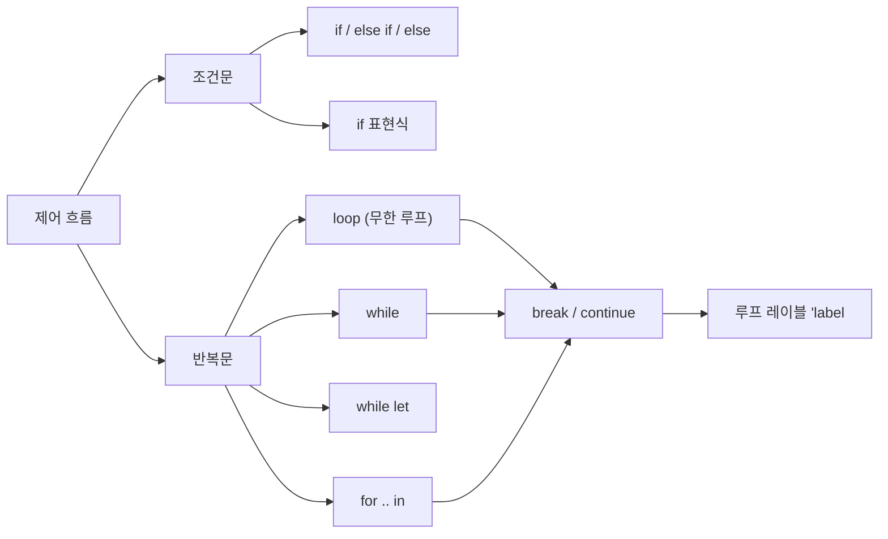
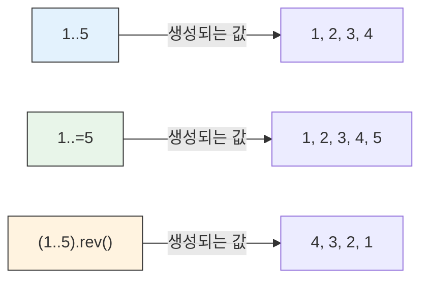
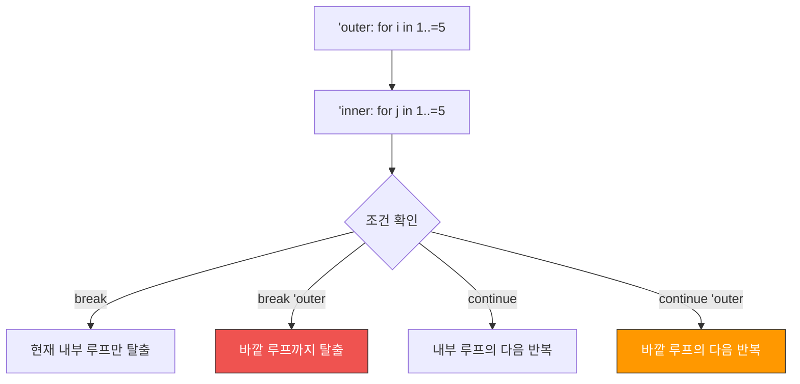

# 제어 흐름 <span class="badge-beginner">기초</span>

프로그램의 실행 흐름을 제어하는 것은 모든 프로그래밍 언어의 핵심입니다. Rust는 `if`, `loop`, `while`, `for` 등의 제어 흐름 구조를 제공하며, 특히 **표현식으로서의 제어 흐름**이라는 강력한 특징을 가지고 있습니다.



---

## 조건문: `if` / `else if` / `else`

### 기본 `if` 문

```rust,editable
fn main() {
    let number = 7;

    if number > 0 {
        println!("{}은(는) 양수입니다.", number);
    }

    // if-else
    if number % 2 == 0 {
        println!("{}은(는) 짝수입니다.", number);
    } else {
        println!("{}은(는) 홀수입니다.", number);
    }

    // if - else if - else
    let score = 85;
    if score >= 90 {
        println!("등급: A");
    } else if score >= 80 {
        println!("등급: B");
    } else if score >= 70 {
        println!("등급: C");
    } else if score >= 60 {
        println!("등급: D");
    } else {
        println!("등급: F");
    }
}
```

<div class="warning-box">

**Rust의 `if` 조건식에는 괄호가 필요 없습니다!** C/Java처럼 `if (조건)`이 아니라 `if 조건`으로 씁니다. 괄호를 쓰면 컴파일러가 불필요한 괄호 경고를 보여줍니다.

또한, 조건식은 반드시 **`bool` 타입**이어야 합니다. C/C++처럼 정수를 조건으로 사용할 수 없습니다.

```rust
let x = 5;
// if x { }        // 에러! i32는 bool이 아님
if x != 0 { }      // 올바름
```

</div>

### `if`는 표현식이다!

Rust에서 `if`는 **표현식**이므로 값을 반환합니다. 삼항 연산자(`? :`) 대신 사용할 수 있습니다.

```rust,editable
fn main() {
    let condition = true;

    // if 표현식으로 값 바인딩
    let number = if condition { 5 } else { 10 };
    println!("number = {}", number);

    // 실용적인 예: 절대값
    let x = -42;
    let abs_x = if x >= 0 { x } else { -x };
    println!("|{}| = {}", x, abs_x);

    // 등급 계산
    let score = 85;
    let grade = if score >= 90 {
        'A'
    } else if score >= 80 {
        'B'
    } else if score >= 70 {
        'C'
    } else {
        'F'
    };
    println!("점수: {}, 등급: {}", score, grade);

    // 최대값 / 최소값
    let a = 10;
    let b = 20;
    let max = if a > b { a } else { b };
    let min = if a < b { a } else { b };
    println!("max = {}, min = {}", max, min);
}
```

<div class="warning-box">

**`if` 표현식의 모든 분기는 같은 타입을 반환해야 합니다!**

```rust
// 컴파일 에러! 분기마다 타입이 다름
// let x = if true { 5 } else { "hello" };
```

</div>

---

## 반복문

### `loop` — 무한 루프

`loop`는 명시적으로 `break`하기 전까지 계속 반복합니다.

```rust,editable
fn main() {
    let mut count = 0;

    loop {
        count += 1;
        if count > 5 {
            break;  // 루프 탈출
        }
        println!("카운트: {}", count);
    }
    println!("루프 종료! 최종 카운트: {}", count);
}
```

#### `loop`에서 값 반환하기

`loop`도 표현식이므로 `break`와 함께 값을 반환할 수 있습니다!

```rust,editable
fn main() {
    let mut counter = 0;

    // loop에서 break로 값을 반환
    let result = loop {
        counter += 1;

        if counter == 10 {
            break counter * 2;  // 20을 반환하며 루프 종료
        }
    };

    println!("result = {}", result);  // 20
}
```

<div class="tip-box">

**`loop` vs `while true`**: Rust에서는 `while true { }`보다 `loop { }`를 사용하세요. `loop`를 사용하면 컴파일러가 루프가 반드시 실행됨을 알 수 있어 더 정확한 분석과 최적화가 가능합니다.

</div>

---

### `while` — 조건부 반복

조건이 `true`인 동안 반복합니다.

```rust,editable
fn main() {
    // 기본 while 루프
    let mut number = 5;
    while number > 0 {
        println!("{}!", number);
        number -= 1;
    }
    println!("발사!");

    // 숫자 맞추기 시뮬레이션
    let secret = 42;
    let mut guess = 0;

    while guess != secret {
        guess += 7;  // 단순화된 예제
    }
    println!("정답을 찾았습니다: {}", guess);
}
```

---

### `while let` — 패턴 매칭 반복

`while let`은 패턴 매칭이 성공하는 동안 반복합니다. `Option` 타입과 함께 자주 사용됩니다.

```rust,editable
fn main() {
    let mut stack = vec![1, 2, 3, 4, 5];

    // pop()은 Option<T>를 반환
    // Some(value)이면 계속, None이면 종료
    while let Some(top) = stack.pop() {
        println!("꺼낸 값: {}", top);
    }
    println!("스택이 비었습니다!");

    // 문자열 파싱 예제
    let mut chars = "Rust".chars();
    while let Some(c) = chars.next() {
        println!("문자: '{}'", c);
    }
}
```

<div class="info-box">

**`while let`은 언제 사용하나요?** 이터레이터에서 값을 하나씩 꺼내거나, `Option`/`Result` 타입의 값을 반복적으로 처리할 때 유용합니다. `loop` + `match` 조합을 간결하게 대체합니다.

</div>

---

### `for` — 범위/컬렉션 반복

`for`는 이터레이터를 순회하는 가장 일반적인 반복문입니다.

```rust,editable
fn main() {
    // 배열 순회
    let fruits = ["사과", "바나나", "체리", "포도"];
    for fruit in &fruits {
        println!("과일: {}", fruit);
    }

    // 인덱스와 함께 순회
    println!("\n--- 인덱스와 함께 ---");
    for (index, fruit) in fruits.iter().enumerate() {
        println!("{}번: {}", index + 1, fruit);
    }
}
```

#### Range 표현식

```rust,editable
fn main() {
    // 범위 (Range): 시작..끝 (끝 미포함)
    println!("=== 1..5 (1 이상 5 미만) ===");
    for i in 1..5 {
        print!("{} ", i);  // 1 2 3 4
    }
    println!();

    // 포함 범위 (Inclusive Range): 시작..=끝 (끝 포함)
    println!("=== 1..=5 (1 이상 5 이하) ===");
    for i in 1..=5 {
        print!("{} ", i);  // 1 2 3 4 5
    }
    println!();

    // 역순
    println!("=== 역순 카운트다운 ===");
    for i in (1..=5).rev() {
        print!("{} ", i);  // 5 4 3 2 1
    }
    println!();

    // 건너뛰기 (step_by)
    println!("=== 짝수만 (step_by) ===");
    for i in (0..=10).step_by(2) {
        print!("{} ", i);  // 0 2 4 6 8 10
    }
    println!();

    // 구구단
    println!("\n=== 7단 ===");
    for i in 1..=9 {
        println!("7 x {} = {}", i, 7 * i);
    }
}
```



---

## `break`와 `continue`

### `break` — 루프 탈출

```rust,editable
fn main() {
    // break로 루프 탈출
    for i in 1..100 {
        if i * i > 50 {
            println!("{}의 제곱({})이 처음으로 50을 초과!", i, i * i);
            break;
        }
    }
}
```

### `continue` — 다음 반복으로 건너뛰기

```rust,editable
fn main() {
    // continue로 홀수만 출력
    println!("1~10 중 홀수:");
    for i in 1..=10 {
        if i % 2 == 0 {
            continue;  // 짝수면 건너뛰기
        }
        print!("{} ", i);
    }
    println!();

    // FizzBuzz
    println!("\n=== FizzBuzz (1~20) ===");
    for i in 1..=20 {
        if i % 15 == 0 {
            println!("{}: FizzBuzz", i);
        } else if i % 3 == 0 {
            println!("{}: Fizz", i);
        } else if i % 5 == 0 {
            println!("{}: Buzz", i);
        }
        // 나머지는 건너뜀
    }
}
```

---

## 루프 레이블 (`'label`)

중첩된 루프에서 특정 루프를 `break`하거나 `continue`하려면 **루프 레이블**을 사용합니다.

```rust,editable
fn main() {
    // 루프 레이블로 바깥 루프 제어
    'outer: for i in 1..=5 {
        for j in 1..=5 {
            if i == 3 && j == 3 {
                println!("({}, {})에서 바깥 루프 탈출!", i, j);
                break 'outer;  // 바깥 루프를 탈출
            }
            print!("({},{}) ", i, j);
        }
        println!();
    }

    println!("\n---\n");

    // continue with label
    'rows: for row in 0..3 {
        'cols: for col in 0..3 {
            if col == 1 {
                continue 'cols;  // 현재 열 건너뛰기
            }
            if row == 1 {
                continue 'rows;  // 현재 행 건너뛰기
            }
            println!("({}, {})", row, col);
        }
    }
}
```



### 실용 예제: 2차원 검색

```rust,editable
fn main() {
    let matrix = [
        [1, 2, 3],
        [4, 5, 6],
        [7, 8, 9],
    ];
    let target = 5;

    let mut found = false;
    'search: for (row, arr) in matrix.iter().enumerate() {
        for (col, &value) in arr.iter().enumerate() {
            if value == target {
                println!("{}을(를) 찾았습니다! 위치: ({}, {})", target, row, col);
                found = true;
                break 'search;
            }
        }
    }

    if !found {
        println!("{}을(를) 찾지 못했습니다.", target);
    }
}
```

---

## 종합 예제

### 숫자 추측 게임 (간소화 버전)

```rust,editable
fn main() {
    let secret = 42;
    let guesses = [10, 25, 50, 42, 60];

    println!("=== 숫자 추측 게임 ===");
    println!("1~100 사이의 숫자를 맞춰보세요!");

    for (attempt, &guess) in guesses.iter().enumerate() {
        print!("{}번째 시도 - 추측: {} → ", attempt + 1, guess);

        if guess < secret {
            println!("너무 작습니다!");
        } else if guess > secret {
            println!("너무 큽니다!");
        } else {
            println!("정답! {}번 만에 맞추셨습니다!", attempt + 1);
            break;
        }
    }
}
```

### 소수 판별기

```rust,editable
fn is_prime(n: u32) -> bool {
    if n < 2 {
        return false;
    }
    if n == 2 {
        return true;
    }
    if n % 2 == 0 {
        return false;
    }

    let mut i = 3;
    while i * i <= n {
        if n % i == 0 {
            return false;
        }
        i += 2;
    }
    true
}

fn main() {
    println!("=== 1~50 사이의 소수 ===");
    let mut count = 0;
    for n in 1..=50 {
        if is_prime(n) {
            print!("{} ", n);
            count += 1;
        }
    }
    println!("\n총 {}개의 소수를 찾았습니다.", count);
}
```

### 패턴으로 별 찍기

```rust,editable
fn main() {
    let height = 5;

    // 직각 삼각형
    println!("=== 직각 삼각형 ===");
    for i in 1..=height {
        for _ in 0..i {
            print!("* ");
        }
        println!();
    }

    // 역삼각형
    println!("\n=== 역삼각형 ===");
    for i in (1..=height).rev() {
        for _ in 0..i {
            print!("* ");
        }
        println!();
    }

    // 피라미드
    println!("\n=== 피라미드 ===");
    for i in 1..=height {
        // 공백
        for _ in 0..(height - i) {
            print!(" ");
        }
        // 별
        for _ in 0..(2 * i - 1) {
            print!("*");
        }
        println!();
    }
}
```

---

<div class="exercise-box">

### 연습 문제

**연습 1**: 1부터 100까지의 합을 세 가지 방법(`loop`, `while`, `for`)으로 각각 계산하세요.

```rust,editable
fn main() {
    // 방법 1: loop
    // let sum_loop = ...;

    // 방법 2: while
    // let sum_while = ...;

    // 방법 3: for
    // let sum_for = ...;

    // 세 결과가 모두 5050이어야 합니다!
    // println!("loop: {}, while: {}, for: {}", sum_loop, sum_while, sum_for);
}
```

**연습 2**: `while let`을 사용하여 벡터 `[10, 20, 30, 40, 50]`의 모든 요소를 역순으로 출력하세요.

```rust,editable
fn main() {
    let mut numbers = vec![10, 20, 30, 40, 50];

    // while let을 사용하여 역순으로 출력하세요
    // 힌트: vec.pop()은 마지막 요소를 Some(값)으로 반환합니다
}
```

**연습 3**: 구구단(2단~9단)을 출력하되, 결과가 50을 초과하는 경우 해당 **단**을 건너뛰세요(루프 레이블 사용).

```rust,editable
fn main() {
    // 힌트: 바깥 루프에 레이블을 붙이고, 조건에 따라 continue 'label 사용
    // 출력 예: 2단은 전부, 8단은 8x6=48까지 출력 후 9단으로 넘어감
}
```

**연습 4**: 콜라츠 추측을 구현하세요. 양의 정수 n에 대해:
- n이 짝수면 n/2
- n이 홀수면 3n+1
- n이 1이 될 때까지 반복하고, 단계 수를 출력하세요.

```rust,editable
fn collatz_steps(mut n: u64) -> u32 {
    // 여기에 구현하세요
    0
}

fn main() {
    // 테스트
    // collatz_steps(6) → 8 (6→3→10→5→16→8→4→2→1)
    // println!("6: {} 단계", collatz_steps(6));
    // println!("27: {} 단계", collatz_steps(27));
}
```

</div>

---

<div class="quiz-box" onclick="this.classList.toggle('show-answer')">

**퀴즈 1**: 다음 코드의 출력 결과는?
```rust
fn main() {
    let x = loop {
        break 42;
    };
    println!("{}", x);
}
```
<div class="quiz-answer">

**정답**: `42`

`loop`는 표현식이며, `break 42;`는 루프를 탈출하면서 값 42를 반환합니다. 이 값이 `x`에 바인딩됩니다.

</div>
</div>

<div class="quiz-box" onclick="this.classList.toggle('show-answer')">

**퀴즈 2**: `1..5`와 `1..=5`의 차이는?
<div class="quiz-answer">

**정답**:
- `1..5` (Range): 1, 2, 3, 4 — **끝값(5)을 포함하지 않음**
- `1..=5` (Inclusive Range): 1, 2, 3, 4, 5 — **끝값(5)을 포함함**

`..`는 반열림 범위(half-open), `..=`는 닫힌 범위(closed)입니다.

</div>
</div>

<div class="quiz-box" onclick="this.classList.toggle('show-answer')">

**퀴즈 3**: 다음 코드의 출력 결과는?
```rust
fn main() {
    'outer: for i in 0..3 {
        for j in 0..3 {
            if j == 1 {
                continue 'outer;
            }
            print!("({},{}) ", i, j);
        }
    }
}
```
<div class="quiz-answer">

**정답**: `(0,0) (1,0) (2,0)`

각 바깥 루프 반복에서 `j`가 0일 때만 출력됩니다. `j`가 1이 되면 `continue 'outer`로 바깥 루프의 다음 반복으로 넘어가므로, `j`가 2인 경우는 실행되지 않습니다.

</div>
</div>

<div class="quiz-box" onclick="this.classList.toggle('show-answer')">

**퀴즈 4**: 다음 코드가 컴파일되지 않는 이유는?
```rust
fn main() {
    let x = if true { 5 } else { "hello" };
}
```
<div class="quiz-answer">

**정답**: `if` 표현식의 모든 분기가 **같은 타입**을 반환해야 하기 때문입니다.

`if` 분기는 `i32`(5)를 반환하고 `else` 분기는 `&str`("hello")를 반환하므로 타입이 일치하지 않아 컴파일 에러가 발생합니다.

에러 메시지: `if and else have incompatible types`

</div>
</div>

---

<div class="summary-box">

### 핵심 정리

1. **`if` / `else if` / `else`**: 조건 분기. 조건식은 반드시 `bool` 타입이어야 합니다.
2. **`if`는 표현식**: 값을 반환하며 변수에 바인딩할 수 있습니다. 모든 분기의 타입이 같아야 합니다.
3. **`loop`**: 무한 루프. `break 값;`으로 값을 반환할 수 있습니다.
4. **`while`**: 조건이 `true`인 동안 반복합니다.
5. **`while let`**: 패턴 매칭이 성공하는 동안 반복합니다.
6. **`for .. in`**: 이터레이터를 순회합니다. 가장 자주 사용되는 반복문입니다.
7. **Range**: `1..5`(미포함), `1..=5`(포함), `.rev()`(역순), `.step_by(n)`(간격).
8. **`break`**: 루프 탈출, **`continue`**: 다음 반복으로 건너뛰기.
9. **루프 레이블** `'label:`: 중첩 루프에서 특정 루프를 `break`/`continue` 대상으로 지정합니다.

</div>

이것으로 기본 문법 장을 마칩니다! 다음 장에서는 Rust의 핵심 개념인 [소유권](../ch03/ch03-00-ownership.md)을 알아봅니다.
