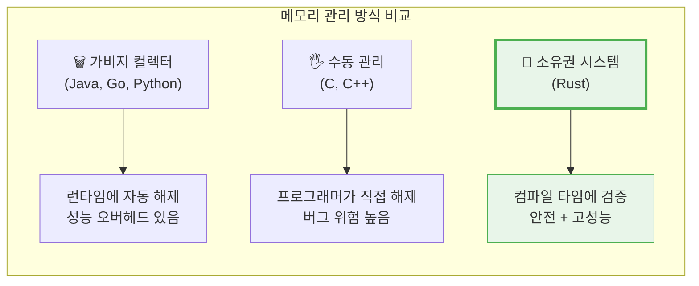
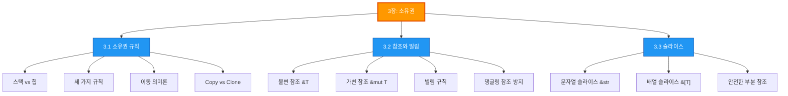

# 소유권 (Ownership)

기초

> *"소유권은 Rust를 Rust답게 만드는 핵심 개념입니다."*

## 이 챕터에서 배우는 것

소유권(Ownership)은 **Rust의 가장 독특하고 중요한 개념**입니다. 이 개념 덕분에 Rust는 **가비지 컬렉터 없이도 메모리 안전성을 컴파일 타임에 보장**할 수 있습니다.

다른 언어들과 비교해 보겠습니다:

## 왜 소유권이 중요한가?

C/C++ 프로그래밍에서 흔히 발생하는 메모리 관련 버그들을 살펴보겠습니다:

| 버그 유형 | 설명 | Rust에서는? |
|-----------|------|-------------|
| **Use after free** | 해제된 메모리 접근 | 컴파일 에러로 방지 |
| **Double free** | 같은 메모리를 두 번 해제 | 소유권 규칙으로 방지 |
| **메모리 누수** | 메모리를 해제하지 않음 | Drop 트레이트로 자동 해제 |
| **Dangling pointer** | 유효하지 않은 포인터 | 빌림 검사기로 방지 |
| **Data race** | 동시 데이터 접근 | 빌림 규칙으로 방지 |

**주의:** 소유권은 Rust를 처음 배우는 사람들이 가장 어려워하는 개념입니다. 하지만 이 개념을 제대로 이해하면, Rust의 나머지 모든 기능이 자연스럽게 이해됩니다. 시간을 들여 꼼꼼히 학습하세요!

## 챕터 구성

이 챕터는 세 개의 섹션으로 구성되어 있습니다:

### [3.1 소유권 규칙](./ch03-01-ownership-rules.md)

메모리가 어떻게 관리되는지(스택과 힙), 소유권의 세 가지 핵심 규칙, 그리고 **이동(move) 의미론**에 대해 배웁니다. `String` 타입을 통해 소유권이 실제로 어떻게 작동하는지 확인합니다.

### [3.2 참조와 빌림](./ch03-02-references-and-borrowing.md)

소유권을 넘기지 않고 값을 **빌려 사용하는 방법**을 배웁니다. 불변 참조와 가변 참조의 차이, 그리고 Rust가 어떻게 데이터 레이스를 컴파일 타임에 방지하는지 이해합니다.

### [3.3 슬라이스](./ch03-03-slices.md)

컬렉션의 **일부분을 안전하게 참조**하는 슬라이스에 대해 배웁니다. 문자열 슬라이스(`&str`)와 배열 슬라이스(`&[T]`)의 사용법을 익힙니다.

---

**학습 팁:** 각 섹션의 코드 예제를 직접 수정하고 실행해 보세요. 특히 **일부러 컴파일 에러를 만들어 보는 것**이 소유권을 이해하는 가장 좋은 방법입니다. Rust 컴파일러의 에러 메시지는 매우 친절하니, 에러를 두려워하지 마세요!

**C/C++ 경험자를 위한 팁:** Rust의 소유권 시스템은 C++의 RAII(Resource Acquisition Is Initialization) 패턴과 `std::unique_ptr`의 개념을 언어 차원에서 강제하는 것과 유사합니다. 하지만 Rust는 이를 컴파일 타임에 검증하므로 런타임 비용이 없습니다.

