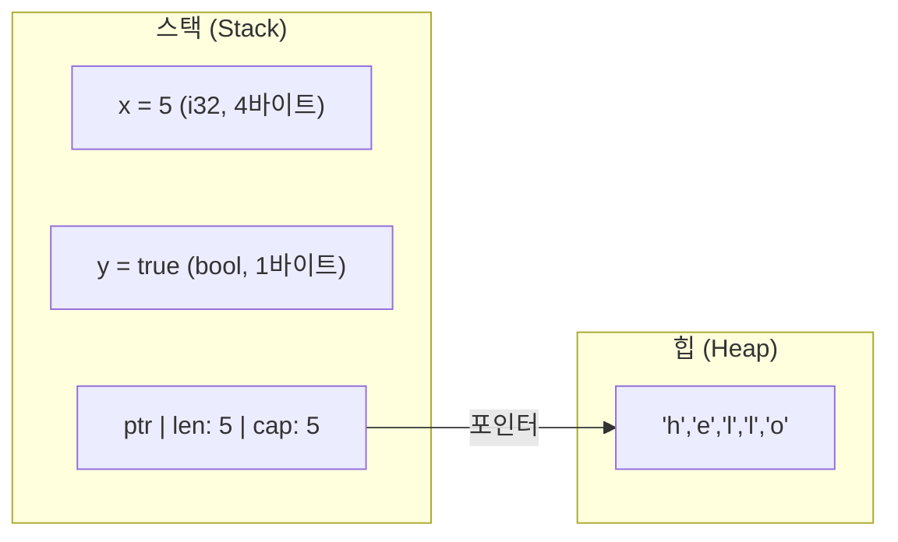
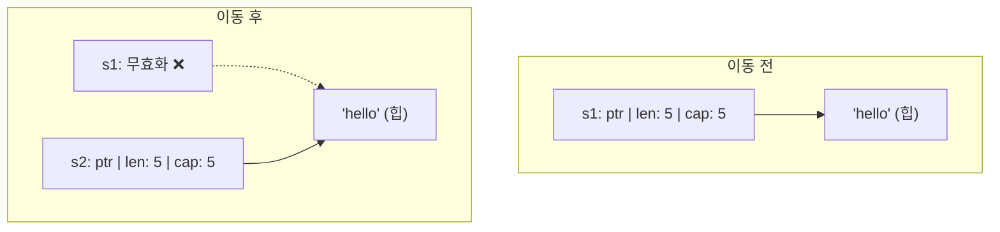

# 소유권 규칙 <span class="badge-beginner">기초</span>

Rust의 가장 핵심적인 개념인 소유권을 깊이 이해해봅시다.

## 스택과 힙

프로그램의 메모리는 **스택(Stack)**과 **힙(Heap)** 두 영역으로 나뉩니다.



| 특징 | 스택 | 힙 |
|------|------|------|
| 속도 | 매우 빠름 | 상대적으로 느림 |
| 크기 | 컴파일 시 결정 | 런타임에 결정 |
| 관리 | 자동 (LIFO) | 수동 (Rust는 소유권으로) |
| 예시 | `i32`, `bool`, `char` | `String`, `Vec<T>` |

## 소유권 규칙 세 가지

<div class="danger-box">
이 세 가지 규칙을 반드시 기억하세요!

1. **Rust의 각 값은 소유자(owner)라 불리는 변수를 가진다.**
2. **한 번에 하나의 소유자만 존재할 수 있다.**
3. **소유자가 스코프를 벗어나면 값은 버려진다(drop).**
</div>

## 변수 스코프와 Drop

```rust,editable
fn main() {
    {                          // s는 아직 유효하지 않음
        let s = String::from("hello"); // s가 유효해짐
        println!("{}", s);     // s 사용
    }                          // 스코프 종료 → s가 drop됨 → 메모리 해제

    // println!("{}", s);      // ❌ 에러! s는 더 이상 유효하지 않음
    println!("스코프 밖입니다");
}
```


## 이동 (Move) 시맨틱

### 스택 데이터: 복사

```rust,editable
fn main() {
    let x = 5;
    let y = x;  // 값이 복사됨 (Copy)

    println!("x = {}, y = {}", x, y); // ✅ 둘 다 사용 가능!
}
```

### 힙 데이터: 이동

```rust,editable
fn main() {
    let s1 = String::from("hello");
    let s2 = s1;  // s1의 소유권이 s2로 이동(move)

    // println!("{}", s1); // ❌ 에러! s1은 더 이상 유효하지 않음
    println!("{}", s2);    // ✅ s2만 사용 가능
}
```



<div class="warning-box">
<strong>왜 이동을 할까요?</strong> 만약 s1과 s2가 모두 같은 힙 메모리를 가리키면, 스코프를 벗어날 때 같은 메모리를 두 번 해제(double free)하는 버그가 발생합니다. Rust는 이를 컴파일 타임에 방지합니다.
</div>

## Copy 트레이트 vs Clone

### Copy가 구현된 타입 (자동 복사)

| 타입 | 예시 |
|------|------|
| 정수 | `i8`, `i16`, `i32`, `i64`, `i128`, `u8`~`u128` |
| 부동소수점 | `f32`, `f64` |
| 불리언 | `bool` |
| 문자 | `char` |
| 튜플 | `(i32, f64)` (Copy 타입만 포함된 경우) |
| 참조 | `&T` |

### Clone: 명시적 깊은 복사

```rust,editable
fn main() {
    let s1 = String::from("hello");
    let s2 = s1.clone();  // 힙 데이터까지 깊은 복사

    println!("s1 = {}, s2 = {}", s1, s2); // ✅ 둘 다 사용 가능!
}
```

<div class="tip-box">
<code>clone()</code>은 비용이 큰 연산일 수 있습니다. 코드에서 <code>clone()</code>을 볼 때마다 "이게 정말 필요한가?"를 생각해보세요.
</div>

## 함수와 소유권

### 함수에 값 전달 = 이동 또는 복사

```rust,editable
fn main() {
    let s = String::from("hello");
    takes_ownership(s);       // s의 소유권이 함수로 이동
    // println!("{}", s);     // ❌ s는 더 이상 유효하지 않음

    let x = 5;
    makes_copy(x);            // x는 Copy이므로 복사됨
    println!("x = {}", x);   // ✅ x는 여전히 유효
}

fn takes_ownership(some_string: String) {
    println!("{}", some_string);
}   // some_string이 drop됨

fn makes_copy(some_integer: i32) {
    println!("{}", some_integer);
}   // some_integer이 스택에서 pop
```

### 반환값으로 소유권 돌려받기

```rust,editable
fn main() {
    let s1 = gives_ownership();        // 소유권을 받음
    println!("s1 = {}", s1);

    let s2 = String::from("hello");
    let s3 = takes_and_gives_back(s2); // s2 → 함수 → s3
    // println!("{}", s2);              // ❌ s2는 이동됨
    println!("s3 = {}", s3);           // ✅
}

fn gives_ownership() -> String {
    String::from("yours")
}

fn takes_and_gives_back(a_string: String) -> String {
    a_string
}
```

<div class="info-box">
매번 소유권을 넘기고 돌려받는 것은 번거롭습니다. 이를 해결하기 위해 다음 절에서 <strong>참조와 빌림</strong>을 배웁니다.
</div>

## 흔한 실수와 해결법

### 실수 1: 이동 후 사용

```rust,editable
fn main() {
    let names = vec!["Alice", "Bob", "Charlie"];
    let names2 = names;

    // 수정: names 대신 names2를 사용하거나, names.clone()으로 복사
    // println!("{:?}", names);  // ❌ 이동됨
    println!("{:?}", names2);    // ✅
}
```

### 실수 2: 반복문에서 소유권 이동

```rust,editable
fn main() {
    let message = String::from("hello");

    // for _ in 0..3 {
    //     println!("{}", message);  // 첫 번째만 OK, 이후 에러
    //     let _ = message;          // 이동 발생!
    // }

    // 해결: 참조 사용
    for _ in 0..3 {
        println!("{}", &message);  // ✅ 빌림
    }
}
```

---

<div class="exercise-box">
<strong>연습문제 1:</strong> 다음 코드가 컴파일되도록 수정하세요.

```rust,editable
fn main() {
    let s1 = String::from("Rust");
    let s2 = s1;
    println!("{} is awesome!", s1);
    println!("{} is fast!", s2);
}
```

힌트: `clone()`을 사용하거나, 참조를 활용하세요.
</div>

<div class="exercise-box">
<strong>연습문제 2:</strong> 문자열의 길이를 반환하면서 소유권도 유지하는 함수를 작성하세요.

```rust,editable
fn calculate_length(s: String) -> (String, usize) {
    // TODO: 문자열과 그 길이를 튜플로 반환
    todo!()
}

fn main() {
    let s1 = String::from("hello");
    let (s2, len) = calculate_length(s1);
    println!("'{}'의 길이는 {}입니다.", s2, len);
}
```
</div>

---

<div class="quiz-box" onclick="this.classList.toggle('show-answer')">
<strong>Q1:</strong> <code>let s2 = s1;</code> 에서 <code>s1</code>이 <code>String</code>일 때 무슨 일이 일어나나요?
<div class="quiz-answer">
<strong>A:</strong> s1의 소유권이 s2로 <strong>이동(move)</strong>됩니다. s1은 더 이상 유효하지 않으며, 사용하면 컴파일 에러가 발생합니다. 힙의 데이터는 복사되지 않고, 스택의 포인터/길이/용량만 복사된 후 s1이 무효화됩니다.
</div>
</div>

<div class="quiz-box" onclick="this.classList.toggle('show-answer')">
<strong>Q2:</strong> <code>i32</code>는 이동 대신 복사되는 이유는?
<div class="quiz-answer">
<strong>A:</strong> <code>i32</code>는 <code>Copy</code> 트레이트가 구현되어 있기 때문입니다. 크기가 작고 스택에만 저장되는 타입은 복사 비용이 거의 없어서 자동으로 복사됩니다.
</div>
</div>

<div class="quiz-box" onclick="this.classList.toggle('show-answer')">
<strong>Q3:</strong> <code>clone()</code>과 <code>Copy</code>의 차이는?
<div class="quiz-answer">
<strong>A:</strong> <code>Copy</code>는 암묵적으로 자동 수행되며 비트 단위 복사입니다. <code>clone()</code>은 명시적으로 호출해야 하며 깊은 복사를 수행할 수 있습니다. <code>Copy</code> 타입은 항상 <code>Clone</code>도 구현하지만, 그 반대는 아닙니다 (<code>String</code>은 Clone이지만 Copy가 아님).
</div>
</div>

---

<div class="summary-box">
<h3>핵심 정리</h3>

- **소유권 규칙**: 각 값에 소유자 하나, 소유자가 스코프를 벗어나면 drop
- **이동(Move)**: 힙 데이터의 소유권이 새 변수로 넘어감, 원래 변수 무효화
- **복사(Copy)**: 스택 데이터는 자동 복사 (`i32`, `bool`, `char` 등)
- **Clone**: 힙 데이터의 명시적 깊은 복사 (`.clone()`)
- **함수 호출** 시 소유권이 이동하거나 복사됨
</div>
