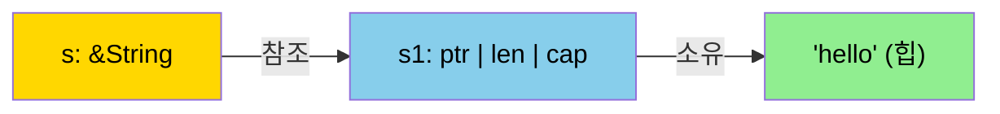
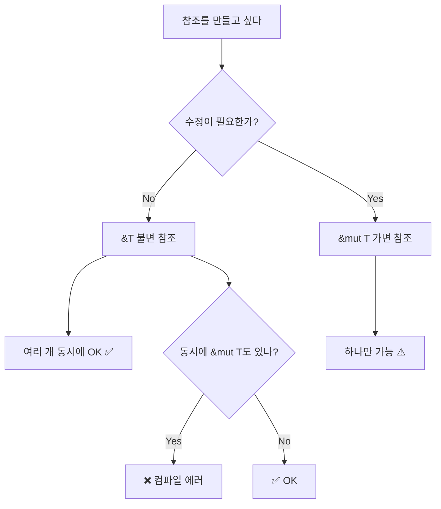

# 참조와 빌림 <span class="badge-beginner">기초</span>

소유권을 넘기지 않고 값을 사용하는 방법, **참조(Reference)**와 **빌림(Borrowing)**을 배워봅시다.

## 참조란?

참조는 소유권을 가져가지 않고 값을 "빌려" 쓰는 방법입니다.

```rust,editable
fn main() {
    let s1 = String::from("hello");
    let len = calculate_length(&s1);  // s1의 참조를 전달
    println!("'{}'의 길이는 {}입니다.", s1, len); // ✅ s1 여전히 유효!
}

fn calculate_length(s: &String) -> usize {
    s.len()
}   // s는 참조이므로 drop되지 않음
```



<div class="info-box">
<code>&</code>는 참조를 생성하는 연산자입니다. 참조를 만드는 행위를 <strong>빌림(borrowing)</strong>이라 합니다. 빌린 것은 수정할 수 없습니다 (기본적으로).
</div>

## 불변 참조 (`&T`)

```rust,editable
fn main() {
    let s = String::from("hello");

    // 불변 참조는 여러 개 만들 수 있음
    let r1 = &s;
    let r2 = &s;
    let r3 = &s;

    println!("{}, {}, {}", r1, r2, r3); // ✅ 모두 OK
}
```

## 가변 참조 (`&mut T`)

값을 수정하려면 **가변 참조**가 필요합니다.

```rust,editable
fn main() {
    let mut s = String::from("hello");
    change(&mut s);
    println!("{}", s); // "hello, world"
}

fn change(some_string: &mut String) {
    some_string.push_str(", world");
}
```

<div class="warning-box">
가변 참조에는 중요한 제한이 있습니다: <strong>한 번에 하나의 가변 참조만</strong> 허용됩니다.
</div>

```rust,editable
fn main() {
    let mut s = String::from("hello");

    let r1 = &mut s;
    // let r2 = &mut s;  // ❌ 에러! 이미 가변 빌림 중

    println!("{}", r1);
}
```

## 빌림 규칙



### 핵심 규칙

1. **불변 참조(`&T`)**: 동시에 여러 개 가능
2. **가변 참조(`&mut T`)**: 동시에 하나만 가능
3. **불변 참조와 가변 참조는 동시에 존재할 수 없음**

```rust,editable
fn main() {
    let mut s = String::from("hello");

    let r1 = &s;     // ✅ 불변 참조
    let r2 = &s;     // ✅ 불변 참조 여러 개 OK
    println!("{} and {}", r1, r2);
    // r1, r2는 여기서 마지막으로 사용됨 (NLL)

    let r3 = &mut s;  // ✅ 이제 가변 참조 가능!
    println!("{}", r3);
}
```

<div class="tip-box">
<strong>NLL (Non-Lexical Lifetimes)</strong>: Rust 2018부터 참조의 수명은 마지막 사용 시점까지입니다. 스코프 끝까지가 아닙니다. 위 코드에서 r1, r2가 마지막으로 사용된 후 r3를 만들 수 있는 이유입니다.
</div>

## 댕글링 참조 방지

Rust는 **댕글링 참조(dangling reference)**를 컴파일 타임에 방지합니다.

```rust,editable
// ❌ 이 코드는 컴파일되지 않습니다
// fn dangle() -> &String {
//     let s = String::from("hello");
//     &s  // s는 함수 끝에서 drop되므로, 참조가 무효해짐
// }

// ✅ 해결: 소유권을 반환
fn no_dangle() -> String {
    let s = String::from("hello");
    s  // 소유권을 이동
}

fn main() {
    let s = no_dangle();
    println!("{}", s);
}
```

## 흔한 빌림 에러와 해결법

### 에러 1: 불변 + 가변 참조 동시 사용

```rust,editable
fn main() {
    let mut v = vec![1, 2, 3];

    // let first = &v[0];   // 불변 빌림
    // v.push(4);           // ❌ 가변 빌림 시도 (Vec이 재할당될 수 있음!)
    // println!("{}", first);

    // 해결: 불변 참조 사용 완료 후 수정
    let first = v[0];  // 값을 복사 (i32는 Copy)
    v.push(4);
    println!("first = {}, v = {:?}", first, v); // ✅
}
```

### 에러 2: 반복문 중 수정

```rust,editable
fn main() {
    let mut numbers = vec![1, 2, 3, 4, 5];

    // ❌ 반복하면서 수정 불가
    // for n in &numbers {
    //     if *n > 3 {
    //         numbers.push(*n * 2);
    //     }
    // }

    // ✅ 해결: 먼저 수집, 나중에 추가
    let to_add: Vec<i32> = numbers.iter()
        .filter(|&&n| n > 3)
        .map(|&n| n * 2)
        .collect();
    numbers.extend(to_add);
    println!("{:?}", numbers);
}
```

---

<div class="exercise-box">
<strong>연습문제 1:</strong> 다음 코드를 컴파일되도록 수정하세요.

```rust,editable
fn main() {
    let mut s = String::from("hello");
    let r1 = &s;
    let r2 = &mut s;
    println!("{}, {}", r1, r2);
}
```

힌트: 불변 참조를 먼저 사용하고, 가변 참조는 그 후에 만드세요.
</div>

<div class="exercise-box">
<strong>연습문제 2:</strong> 문자열에서 첫 번째 단어를 반환하는 함수를 참조를 사용하여 작성하세요.

```rust,editable
fn first_word(s: &str) -> &str {
    // TODO: 첫 번째 공백 전까지의 문자열 슬라이스 반환
    // 공백이 없으면 전체 문자열 반환
    todo!()
}

fn main() {
    let sentence = String::from("hello world rust");
    let word = first_word(&sentence);
    println!("첫 번째 단어: {}", word); // "hello"
}
```
</div>

---

<div class="quiz-box" onclick="this.classList.toggle('show-answer')">
<strong>Q1:</strong> <code>&T</code>와 <code>&mut T</code>를 동시에 가질 수 없는 이유는?
<div class="quiz-answer">
<strong>A:</strong> 데이터 레이스(data race)를 방지하기 위해서입니다. 불변 참조로 읽는 도중 가변 참조로 값이 변경되면, 읽는 쪽에서 예상치 못한 결과를 얻을 수 있습니다. Rust는 이를 컴파일 타임에 원천 차단합니다.
</div>
</div>

<div class="quiz-box" onclick="this.classList.toggle('show-answer')">
<strong>Q2:</strong> 가변 참조는 왜 동시에 하나만 허용되나요?
<div class="quiz-answer">
<strong>A:</strong> 여러 가변 참조가 동시에 존재하면 같은 데이터를 동시에 수정하는 <strong>데이터 레이스</strong>가 발생할 수 있습니다. 하나만 허용함으로써 데이터의 일관성을 보장합니다.
</div>
</div>

<div class="quiz-box" onclick="this.classList.toggle('show-answer')">
<strong>Q3:</strong> NLL(Non-Lexical Lifetimes)이란?
<div class="quiz-answer">
<strong>A:</strong> 참조의 수명이 변수의 스코프 끝까지가 아니라, <strong>마지막으로 사용된 시점</strong>까지만 유효한 것입니다. 이를 통해 불변 참조를 다 쓴 후에 가변 참조를 만드는 등의 패턴이 가능해졌습니다.
</div>
</div>

---

<div class="summary-box">
<h3>핵심 정리</h3>

- **참조(`&T`)**: 소유권 없이 값을 빌려 읽기
- **가변 참조(`&mut T`)**: 소유권 없이 값을 빌려 수정
- **규칙**: 불변 참조는 여러 개 OK, 가변 참조는 하나만, 둘을 동시에 불가
- **댕글링 방지**: 참조 대상보다 참조가 오래 살 수 없음
- **NLL**: 참조 수명은 마지막 사용 시점까지
</div>
