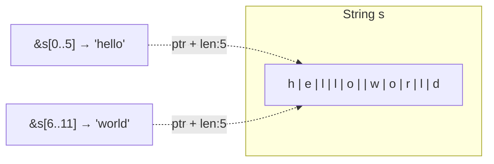

# 슬라이스 <span class="badge-beginner">기초</span>

슬라이스는 컬렉션의 연속된 요소들을 참조하는 방법입니다. 소유권을 가지지 않습니다.

## 문자열 슬라이스 (`&str`)

```rust,editable
fn main() {
    let s = String::from("hello world");

    let hello = &s[0..5];   // "hello"
    let world = &s[6..11];  // "world"

    println!("{} {}", hello, world);

    // 축약 문법
    let hello = &s[..5];    // 처음부터
    let world = &s[6..];    // 끝까지
    let whole = &s[..];     // 전체

    println!("{} {} {}", hello, world, whole);
}
```



<div class="warning-box">
문자열 슬라이스는 <strong>바이트 단위</strong>로 인덱싱합니다. UTF-8 멀티바이트 문자의 중간에서 자르면 런타임 패닉이 발생합니다.

```rust,editable
fn main() {
    let s = String::from("안녕하세요");
    // let slice = &s[0..2]; // ❌ 패닉! '안'은 3바이트
    let slice = &s[0..3];    // ✅ "안" (3바이트)
    println!("{}", slice);
}
```
</div>

## 문자열 리터럴은 슬라이스

```rust,editable
fn main() {
    let s: &str = "hello world";  // 타입이 &str
    // 문자열 리터럴은 바이너리에 포함된 데이터의 슬라이스
    println!("{}", s);
}
```

<div class="info-box">
<code>&str</code>은 불변 참조이므로 문자열 리터럴은 항상 불변입니다.
</div>

## 함수 매개변수: `&str` vs `&String`

```rust,editable
// ✅ 좋은 방법: &str을 받으면 String과 &str 모두 처리 가능
fn first_word(s: &str) -> &str {
    let bytes = s.as_bytes();
    for (i, &byte) in bytes.iter().enumerate() {
        if byte == b' ' {
            return &s[..i];
        }
    }
    s
}

fn main() {
    let my_string = String::from("hello world");
    let word = first_word(&my_string);  // ✅ &String → &str 자동 변환
    println!("첫 단어: {}", word);

    let my_literal = "hello world";
    let word = first_word(my_literal);  // ✅ &str 직접 전달
    println!("첫 단어: {}", word);
}
```

<div class="tip-box">
함수 매개변수로 <code>&String</code> 대신 <code>&str</code>을 사용하면 더 유연합니다. <code>&String</code>은 <code>&str</code>로 자동 변환(Deref coercion)되기 때문입니다.
</div>

## 배열 슬라이스 (`&[T]`)

문자열뿐 아니라 배열과 벡터에도 슬라이스를 사용할 수 있습니다.

```rust,editable
fn sum(slice: &[i32]) -> i32 {
    slice.iter().sum()
}

fn main() {
    let arr = [1, 2, 3, 4, 5];
    let vec = vec![10, 20, 30, 40, 50];

    println!("배열 전체 합: {}", sum(&arr));
    println!("배열 일부 합: {}", sum(&arr[1..4]));  // [2, 3, 4]
    println!("벡터 일부 합: {}", sum(&vec[2..]));    // [30, 40, 50]
}
```

## 슬라이스의 안전성

슬라이스가 존재하는 동안 원본 데이터를 수정할 수 없습니다.

```rust,editable
fn main() {
    let mut s = String::from("hello world");
    let word = first_word(&s);  // 불변 빌림

    // s.clear();  // ❌ 에러! word가 아직 s를 빌리고 있음
    println!("첫 단어: {}", word);

    s.clear();  // ✅ word 사용 후에는 OK
    println!("비워진 문자열: '{}'", s);
}

fn first_word(s: &str) -> &str {
    let bytes = s.as_bytes();
    for (i, &byte) in bytes.iter().enumerate() {
        if byte == b' ' {
            return &s[..i];
        }
    }
    s
}
```

---

<div class="exercise-box">
<strong>연습문제 1:</strong> 문자열에서 마지막 단어를 반환하는 함수를 작성하세요.

```rust,editable
fn last_word(s: &str) -> &str {
    // TODO: 마지막 공백 이후의 문자열 슬라이스 반환
    todo!()
}

fn main() {
    println!("{}", last_word("hello world rust")); // "rust"
    println!("{}", last_word("single"));           // "single"
}
```
</div>

<div class="exercise-box">
<strong>연습문제 2:</strong> 정수 슬라이스에서 최댓값과 최솟값을 반환하는 함수를 작성하세요.

```rust,editable
fn min_max(slice: &[i32]) -> (i32, i32) {
    // TODO: (최솟값, 최댓값) 튜플 반환
    todo!()
}

fn main() {
    let numbers = [3, 1, 4, 1, 5, 9, 2, 6];
    let (min, max) = min_max(&numbers);
    println!("최솟값: {}, 최댓값: {}", min, max); // 1, 9
}
```
</div>

---

<div class="quiz-box" onclick="this.classList.toggle('show-answer')">
<strong>Q1:</strong> <code>&str</code>과 <code>&String</code>의 차이는?
<div class="quiz-answer">
<strong>A:</strong> <code>&str</code>은 문자열 데이터의 슬라이스(참조 + 길이)이고, <code>&String</code>은 <code>String</code> 객체 자체에 대한 참조입니다. <code>&String</code>은 Deref를 통해 <code>&str</code>로 자동 변환됩니다. 함수 매개변수로는 <code>&str</code>이 더 유연합니다.
</div>
</div>

<div class="quiz-box" onclick="this.classList.toggle('show-answer')">
<strong>Q2:</strong> <code>&s[0..2]</code>에서 한글 문자열을 자르면 어떻게 되나요?
<div class="quiz-answer">
<strong>A:</strong> 한글은 UTF-8에서 문자당 3바이트를 차지합니다. <code>&s[0..2]</code>는 문자 경계를 벗어나므로 <strong>런타임 패닉</strong>이 발생합니다. 한글은 <code>&s[0..3]</code>처럼 3바이트 단위로 잘라야 합니다.
</div>
</div>

---

<div class="summary-box">
<h3>핵심 정리</h3>

- **슬라이스**: 컬렉션의 연속 요소에 대한 참조 (소유권 없음)
- **`&str`**: 문자열 슬라이스, 문자열 리터럴의 타입
- **`&[T]`**: 배열/벡터 슬라이스
- **`&str` > `&String`**: 함수 매개변수로 더 유연
- **안전성**: 슬라이스가 있으면 원본 수정 불가
- **UTF-8 주의**: 바이트 경계에서만 슬라이싱 가능
</div>
