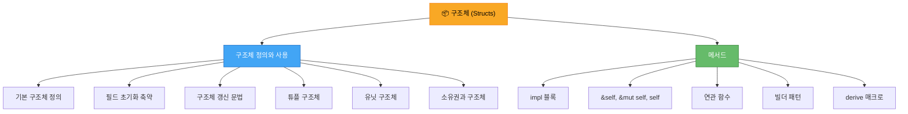

# 구조체 (Structs)

<span class="badge-beginner">기초</span>

> **구조체(struct)**는 관련 있는 여러 값을 하나로 묶어 의미 있는 데이터 그룹을 만드는 Rust의 핵심 타입입니다.

---

## 이 장에서 배울 내용

구조체는 객체 지향 프로그래밍의 "클래스"와 유사한 역할을 하지만, Rust만의 소유권 시스템과 결합되어 더욱 안전하고 효율적인 데이터 구조를 만들 수 있습니다.



---

## 왜 구조체가 필요한가?

함수에 여러 관련 값을 개별 변수로 전달하면 코드가 복잡해지고, 값들의 관계가 불명확해집니다.

```rust,editable
// ❌ 관련 데이터가 흩어져 있음
fn describe_user(name: &str, age: u32, email: &str, active: bool) {
    println!("{} ({}세) - {} [활성: {}]", name, age, email, active);
}

// ✅ 구조체로 데이터를 하나로 묶음
struct User {
    name: String,
    age: u32,
    email: String,
    active: bool,
}

fn describe(user: &User) {
    println!("{} ({}세) - {} [활성: {}]", user.name, user.age, user.email, user.active);
}

fn main() {
    // 개별 변수 방식
    describe_user("김철수", 25, "chulsoo@example.com", true);

    // 구조체 방식
    let user = User {
        name: String::from("김철수"),
        age: 25,
        email: String::from("chulsoo@example.com"),
        active: true,
    };
    describe(&user);
}
```

<div class="info-box">

**구조체 vs 튜플**: 튜플도 여러 값을 묶을 수 있지만, 각 값에 이름이 없어 의미를 파악하기 어렵습니다. 구조체는 각 필드에 이름을 부여하여 코드의 가독성과 명확성을 크게 높입니다.

</div>

---

## 장 구성

| 절 | 제목 | 핵심 내용 |
|---|---|---|
| [4.1](./ch04-01-defining-structs.md) | 구조체 정의와 사용 | 구조체 선언, 인스턴스 생성, 다양한 구조체 종류 |
| [4.2](./ch04-02-methods.md) | 메서드 | impl 블록, 메서드와 연관 함수, 빌더 패턴 |

---

## 다른 언어와의 비교

| 개념 | Rust | C/C++ | Python | Java |
|---|---|---|---|---|
| 데이터 묶기 | `struct` | `struct` / `class` | `class` | `class` |
| 메서드 정의 | `impl` 블록 | 클래스 내부 | 클래스 내부 | 클래스 내부 |
| 상속 | ❌ (트레이트 사용) | ✅ | ✅ | ✅ |
| 기본 생성자 | ❌ (직접 작성) | ✅ | `__init__` | 생성자 |
| 소유권 검사 | 컴파일 타임 | ❌ | ❌ | GC |

<div class="tip-box">

**학습 팁**: 이 장을 학습하기 전에 [Chapter 3: 소유권](../ch03/ch03-00-ownership.md)을 먼저 이해하는 것을 권장합니다. 구조체의 필드 소유권을 이해하려면 소유권 개념이 필수적입니다.

</div>

---

## 미리보기: 구조체의 전체 모습

이 장을 마치면 아래와 같은 코드를 자유롭게 작성할 수 있게 됩니다.

```rust,editable
#[derive(Debug, Clone, PartialEq)]
struct Rectangle {
    width: f64,
    height: f64,
}

impl Rectangle {
    // 연관 함수 (생성자)
    fn new(width: f64, height: f64) -> Self {
        Self { width, height }
    }

    fn square(size: f64) -> Self {
        Self { width: size, height: size }
    }

    // 메서드
    fn area(&self) -> f64 {
        self.width * self.height
    }

    fn perimeter(&self) -> f64 {
        2.0 * (self.width + self.height)
    }

    fn is_larger_than(&self, other: &Rectangle) -> bool {
        self.area() > other.area()
    }

    fn scale(&mut self, factor: f64) {
        self.width *= factor;
        self.height *= factor;
    }
}

fn main() {
    let mut rect = Rectangle::new(10.0, 5.0);
    let square = Rectangle::square(7.0);

    println!("사각형: {:?}", rect);
    println!("넓이: {}", rect.area());
    println!("둘레: {}", rect.perimeter());

    println!("정사각형: {:?}", square);
    println!("정사각형 넓이: {}", square.area());

    println!("rect가 더 큰가? {}", rect.is_larger_than(&square));

    rect.scale(2.0);
    println!("2배 확대 후: {:?}", rect);
}
```

<div class="summary-box">

**이 장의 핵심 목표**
- 구조체를 정의하고 인스턴스를 생성하는 방법을 익힌다
- 튜플 구조체와 유닛 구조체의 용도를 이해한다
- `impl` 블록으로 메서드와 연관 함수를 작성한다
- `#[derive]` 매크로로 공통 트레이트를 자동 구현한다
- 빌더 패턴 등 실용적인 구조체 활용법을 배운다

</div>
