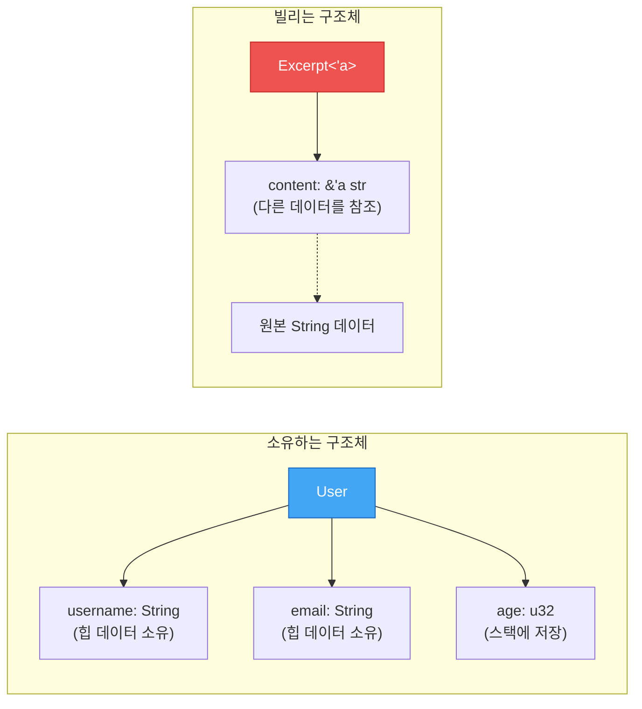
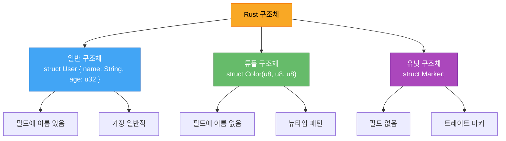

# 구조체 정의와 사용

<span class="badge-beginner">기초</span>

> 구조체는 관련 있는 데이터를 하나의 이름으로 묶어 의미 있는 그룹을 만드는 사용자 정의 타입입니다.

---

## 1. 기본 구조체 정의

`struct` 키워드를 사용하여 구조체를 정의합니다. 각 **필드(field)**에는 이름과 타입을 지정합니다.

```rust,editable
// 구조체 정의
struct User {
    username: String,
    email: String,
    age: u32,
    active: bool,
}

fn main() {
    // 인스턴스 생성 - 모든 필드를 지정해야 합니다
    let user1 = User {
        username: String::from("rust_lover"),
        email: String::from("rust@example.com"),
        age: 28,
        active: true,
    };

    // 필드 접근: 점(.) 표기법
    println!("사용자명: {}", user1.username);
    println!("이메일: {}", user1.email);
    println!("나이: {}세", user1.age);
    println!("활성: {}", user1.active);
}
```

<div class="warning-box">

**주의**: 구조체의 인스턴스를 생성할 때 **모든 필드**에 값을 지정해야 합니다. 하나라도 빠뜨리면 컴파일 에러가 발생합니다. Rust에는 기본 생성자(default constructor)가 없습니다.

</div>

---

## 2. 가변 인스턴스

인스턴스 전체를 `mut`으로 선언하면 모든 필드를 수정할 수 있습니다. 개별 필드만 `mut`으로 지정하는 것은 불가능합니다.

```rust,editable
struct User {
    username: String,
    email: String,
    age: u32,
    active: bool,
}

fn main() {
    // mut으로 선언하면 모든 필드 수정 가능
    let mut user = User {
        username: String::from("rust_lover"),
        email: String::from("old@example.com"),
        age: 28,
        active: true,
    };

    // 필드 값 변경
    user.email = String::from("new@example.com");
    user.age = 29;

    println!("변경된 이메일: {}", user.email);
    println!("변경된 나이: {}세", user.age);
}
```

---

## 3. 필드 초기화 축약 (Field Init Shorthand)

변수 이름과 필드 이름이 같으면 축약 문법을 사용할 수 있습니다.

```rust,editable
struct User {
    username: String,
    email: String,
    age: u32,
    active: bool,
}

fn create_user(username: String, email: String, age: u32) -> User {
    // ❌ 반복적인 코드
    // User {
    //     username: username,
    //     email: email,
    //     age: age,
    //     active: true,
    // }

    // ✅ 필드 초기화 축약
    User {
        username,   // username: username 과 동일
        email,      // email: email 과 동일
        age,        // age: age 와 동일
        active: true,
    }
}

fn main() {
    let user = create_user(
        String::from("kim"),
        String::from("kim@example.com"),
        30,
    );
    println!("사용자: {} ({}세)", user.username, user.age);
}
```

<div class="tip-box">

**팁**: 함수 매개변수 이름을 구조체 필드 이름과 동일하게 짓는 것이 Rust의 관례입니다. 이렇게 하면 축약 문법을 자연스럽게 활용할 수 있습니다.

</div>

---

## 4. 구조체 갱신 문법 (Struct Update Syntax)

기존 인스턴스의 값을 기반으로 일부 필드만 바꿔 새 인스턴스를 만들 때 `..` 문법을 사용합니다.

```rust,editable
struct User {
    username: String,
    email: String,
    age: u32,
    active: bool,
}

fn main() {
    let user1 = User {
        username: String::from("kim"),
        email: String::from("kim@example.com"),
        age: 30,
        active: true,
    };

    // user1을 기반으로 새 인스턴스 생성
    let user2 = User {
        email: String::from("lee@example.com"),  // 이 필드만 새로 지정
        username: String::from("lee"),            // 이 필드도 새로 지정
        ..user1  // 나머지 필드(age, active)는 user1에서 가져옴
    };

    println!("user2: {} ({}세) - {}", user2.username, user2.age, user2.email);
    // user2.age는 30, user2.active는 true (user1에서 복사됨)
}
```

<div class="warning-box">

**소유권 이동 주의!** `..` 문법으로 `String` 같은 힙 데이터를 가진 필드가 이동(move)되면, 원래 인스턴스의 해당 필드는 더 이상 사용할 수 없습니다. `Copy` 트레이트를 구현한 타입(예: `u32`, `bool`)은 복사되므로 원본이 유효합니다.

</div>

```rust,editable
struct User {
    username: String,
    email: String,
    age: u32,
    active: bool,
}

fn main() {
    let user1 = User {
        username: String::from("kim"),
        email: String::from("kim@example.com"),
        age: 30,
        active: true,
    };

    // username이 user1에서 user2로 이동(move)됨
    let user2 = User {
        email: String::from("lee@example.com"),
        ..user1
    };

    // ❌ user1.username은 이동되어 사용 불가
    // println!("{}", user1.username);  // 컴파일 에러!

    // ✅ Copy 타입인 필드는 여전히 사용 가능
    println!("user1.age: {}", user1.age);
    println!("user1.active: {}", user1.active);

    println!("user2: {} ({}세)", user2.username, user2.age);
}
```

---

## 5. 튜플 구조체 (Tuple Structs)

필드에 이름이 없는 구조체입니다. 튜플과 비슷하지만, 각각 고유한 타입으로 취급됩니다.

```rust,editable
// 튜플 구조체 정의
struct Color(u8, u8, u8);
struct Point(f64, f64, f64);

fn main() {
    let red = Color(255, 0, 0);
    let origin = Point(0.0, 0.0, 0.0);

    // 인덱스로 접근
    println!("빨간색: R={}, G={}, B={}", red.0, red.1, red.2);
    println!("원점: ({}, {}, {})", origin.0, origin.1, origin.2);

    // 구조 분해 (destructuring)
    let Color(r, g, b) = red;
    println!("분해된 값: R={}, G={}, B={}", r, g, b);

    let Point(x, y, z) = origin;
    println!("분해된 좌표: ({}, {}, {})", x, y, z);

    // ❌ Color와 Point는 다른 타입!
    // let p: Point = Color(1, 2, 3);  // 컴파일 에러
}
```

<div class="info-box">

**튜플 구조체의 용도**: 같은 내부 구조를 가지더라도 의미적으로 다른 타입을 구분하고 싶을 때 유용합니다. 예를 들어, `Color(u8, u8, u8)`와 `Point(f64, f64, f64)`는 구조가 비슷하지만 완전히 다른 개념을 표현합니다. 이를 **뉴타입 패턴(Newtype Pattern)**이라고도 합니다.

</div>

### 뉴타입 패턴 활용

```rust,editable
// 뉴타입으로 타입 안전성 확보
struct Meters(f64);
struct Seconds(f64);
struct MetersPerSecond(f64);

fn calculate_speed(distance: Meters, time: Seconds) -> MetersPerSecond {
    MetersPerSecond(distance.0 / time.0)
}

fn main() {
    let distance = Meters(100.0);
    let time = Seconds(9.58);  // 우사인 볼트 100m 기록!

    let speed = calculate_speed(distance, time);
    println!("속도: {:.2} m/s", speed.0);

    // ❌ 타입이 다르므로 실수로 순서를 바꾸면 컴파일 에러
    // let wrong = calculate_speed(time, distance);  // 에러!
}
```

---

## 6. 유닛 구조체 (Unit-Like Structs)

필드가 전혀 없는 구조체입니다. 나중에 트레이트를 구현할 때 주로 사용됩니다.

```rust,editable
// 유닛 구조체: 필드 없음
struct AlwaysEqual;
struct Marker;

fn main() {
    let _subject = AlwaysEqual;
    let _marker = Marker;

    println!("유닛 구조체는 필드가 없습니다.");
    println!("주로 트레이트 구현의 '타입 마커'로 사용됩니다.");
}
```

<div class="info-box">

**유닛 구조체는 언제 쓰나요?** 데이터는 저장하지 않지만 특정 트레이트를 구현해야 할 때 사용합니다. 예를 들어, 에러 타입이나 상태 마커 등에 활용됩니다. 트레이트는 [Chapter 9](../ch09/ch09-00-traits.md)에서 자세히 배웁니다.

</div>

---

## 7. `#[derive(Debug)]`로 구조체 출력하기

기본적으로 구조체는 `println!`으로 출력할 수 없습니다. `#[derive(Debug)]`를 추가하면 디버그 출력이 가능해집니다.

```rust,editable
// Debug 트레이트 자동 구현
#[derive(Debug)]
struct Rectangle {
    width: f64,
    height: f64,
}

fn main() {
    let rect = Rectangle {
        width: 30.0,
        height: 50.0,
    };

    // {:?} - 한 줄 디버그 출력
    println!("rect = {:?}", rect);

    // {:#?} - 여러 줄 보기 좋은 디버그 출력
    println!("rect = {:#?}", rect);

    // dbg! 매크로 - 파일명, 라인 번호까지 표시 (stderr로 출력)
    let rect2 = Rectangle {
        width: dbg!(10.0 * 2.0),  // 표현식의 값을 보여주고 그 값을 반환
        height: 20.0,
    };
    dbg!(&rect2);
}
```

<div class="tip-box">

**`dbg!` vs `println!`**
- `dbg!`는 **stderr**로 출력하고, 표현식의 **소유권을 가져갔다가 반환**합니다.
- `println!`는 **stdout**으로 출력하고, 참조만 사용합니다.
- 디버깅에는 `dbg!`가 더 편리합니다 (파일명과 줄 번호가 함께 표시됨).

</div>

---

## 8. 구조체와 소유권

구조체의 필드가 데이터를 소유하느냐, 빌리느냐에 따라 설계가 달라집니다.

### 소유하는 필드 (Owned Fields)

```rust,editable
#[derive(Debug)]
struct User {
    username: String,   // String을 소유
    email: String,      // String을 소유
    age: u32,
}

fn main() {
    let user = User {
        username: String::from("kim"),
        email: String::from("kim@example.com"),
        age: 30,
    };

    // user가 살아 있는 동안 username과 email도 유효
    println!("{:?}", user);
}
// user가 drop되면 username과 email도 함께 해제됨
```

### 빌리는 필드 (Borrowed Fields) - 라이프타임 필요

```rust,editable
// 참조를 필드로 가지려면 라이프타임 명시 필요
#[derive(Debug)]
struct Excerpt<'a> {
    content: &'a str,  // 문자열 슬라이스 (빌림)
}

fn main() {
    let novel = String::from("Rust는 안전하고 빠른 언어입니다. 모두가 좋아합니다.");

    // novel의 첫 문장을 빌림
    let first_sentence = novel.split('.').next().unwrap();

    let excerpt = Excerpt {
        content: first_sentence,
    };

    println!("발췌: {:?}", excerpt);
    // excerpt는 novel보다 먼저 drop되어야 함 (라이프타임 규칙)
}
```

<div class="warning-box">

**참조 필드와 라이프타임**: 구조체에 참조(`&`)를 필드로 사용하려면 **라이프타임 매개변수**를 반드시 명시해야 합니다. 라이프타임은 [Chapter 10](../ch10/ch10-00-lifetimes.md)에서 자세히 다룹니다. 처음에는 `String`처럼 소유하는 타입을 사용하는 것이 간단합니다.

</div>



---

## 9. 구조체 종류 요약



---

## 연습문제

<div class="exercise-box">

### 연습문제 1: 도서 구조체 만들기

다음 요구사항에 맞는 `Book` 구조체를 완성하세요.

1. `title` (String), `author` (String), `pages` (u32), `available` (bool) 필드
2. `create_book` 함수에서 필드 초기화 축약 사용
3. 구조체 갱신 문법으로 `book2` 생성

```rust,editable
// TODO: #[derive(Debug)]와 구조체 정의를 작성하세요
#[derive(Debug)]
struct Book {
    // 필드를 작성하세요
    title: String,
    author: String,
    pages: u32,
    available: bool,
}

// TODO: 필드 초기화 축약을 사용하는 함수
fn create_book(title: String, author: String, pages: u32) -> Book {
    // 여기에 작성하세요
    Book {
        title,
        author,
        pages,
        available: true,
    }
}

fn main() {
    let book1 = create_book(
        String::from("Rust 프로그래밍"),
        String::from("김러스트"),
        400,
    );
    println!("book1: {:#?}", book1);

    // TODO: 구조체 갱신 문법으로 book2 만들기
    // book2는 title만 바꾸고 나머지는 book1에서 가져옵니다
    let book2 = Book {
        title: String::from("고급 Rust"),
        ..book1
    };
    println!("book2: {:#?}", book2);
}
```

</div>

<div class="exercise-box">

### 연습문제 2: 튜플 구조체 활용

섭씨(Celsius)와 화씨(Fahrenheit) 온도를 구분하는 튜플 구조체를 만들고, 변환 함수를 작성하세요.

```rust,editable
// TODO: 튜플 구조체 정의
struct Celsius(f64);
struct Fahrenheit(f64);

// TODO: 섭씨 → 화씨 변환 함수
fn to_fahrenheit(c: Celsius) -> Fahrenheit {
    // 공식: F = C * 9/5 + 32
    Fahrenheit(c.0 * 9.0 / 5.0 + 32.0)
}

// TODO: 화씨 → 섭씨 변환 함수
fn to_celsius(f: Fahrenheit) -> Celsius {
    // 공식: C = (F - 32) * 5/9
    Celsius((f.0 - 32.0) * 5.0 / 9.0)
}

fn main() {
    let boiling = Celsius(100.0);
    let converted = to_fahrenheit(boiling);
    println!("100°C = {:.1}°F", converted.0);

    let body_temp = Fahrenheit(98.6);
    let converted = to_celsius(body_temp);
    println!("98.6°F = {:.1}°C", converted.0);
}
```

</div>

<div class="exercise-box">

### 연습문제 3: 학생 성적 관리

`Student` 구조체를 만들고, 여러 학생의 평균 점수를 계산하세요.

```rust,editable
#[derive(Debug)]
struct Student {
    name: String,
    scores: Vec<u32>,  // 여러 과목 점수
}

fn average_score(student: &Student) -> f64 {
    if student.scores.is_empty() {
        return 0.0;
    }
    let sum: u32 = student.scores.iter().sum();
    sum as f64 / student.scores.len() as f64
}

fn highest_scorer(students: &[Student]) -> Option<&Student> {
    // TODO: 평균 점수가 가장 높은 학생을 반환하세요
    students.iter().max_by(|a, b| {
        average_score(a)
            .partial_cmp(&average_score(b))
            .unwrap()
    })
}

fn main() {
    let students = vec![
        Student {
            name: String::from("김영희"),
            scores: vec![85, 92, 78, 90],
        },
        Student {
            name: String::from("이철수"),
            scores: vec![95, 88, 92, 85],
        },
        Student {
            name: String::from("박지민"),
            scores: vec![70, 75, 80, 95],
        },
    ];

    for student in &students {
        println!("{}: 평균 {:.1}점", student.name, average_score(student));
    }

    if let Some(top) = highest_scorer(&students) {
        println!("\n최고 성적 학생: {} (평균 {:.1}점)", top.name, average_score(top));
    }
}
```

</div>

---

## 퀴즈

<div class="quiz-box" onclick="this.classList.toggle('show-answer')">

**Q1.** 구조체 인스턴스의 특정 필드만 `mut`으로 선언할 수 있을까요?

<div class="quiz-answer">

**아니요.** Rust에서는 구조체 인스턴스 전체가 가변(`mut`)이거나 불변입니다. 개별 필드의 가변성을 별도로 지정할 수 없습니다. `let mut user = User { ... }`처럼 전체를 가변으로 선언해야 합니다.

</div>
</div>

<div class="quiz-box" onclick="this.classList.toggle('show-answer')">

**Q2.** 다음 코드에서 `user1.email`을 `user2` 생성 이후에 사용할 수 있을까요?

```rust,ignore
let user2 = User {
    username: String::from("새이름"),
    ..user1
};
println!("{}", user1.email);
```

<div class="quiz-answer">

**아니요.** `..user1`에 의해 `user1.email` (String 타입)이 `user2`로 **이동(move)**되었기 때문에, 이후 `user1.email`에 접근하면 컴파일 에러가 발생합니다. 하지만 `user1.age`나 `user1.active` 같은 `Copy` 타입 필드는 여전히 사용할 수 있습니다.

</div>
</div>

<div class="quiz-box" onclick="this.classList.toggle('show-answer')">

**Q3.** 튜플 구조체 `struct Color(u8, u8, u8)`와 `struct Point(u8, u8, u8)`는 같은 타입인가요?

<div class="quiz-answer">

**아니요.** 내부 구조가 동일하더라도 서로 **다른 타입**입니다. `Color` 타입의 값을 `Point` 타입의 변수에 대입할 수 없습니다. 이것이 튜플 구조체와 뉴타입 패턴의 핵심 장점입니다.

</div>
</div>

<div class="quiz-box" onclick="this.classList.toggle('show-answer')">

**Q4.** `#[derive(Debug)]` 없이 구조체를 `println!("{:?}", my_struct)`로 출력하면 어떻게 되나요?

<div class="quiz-answer">

**컴파일 에러**가 발생합니다. `{:?}` 포맷은 `Debug` 트레이트의 구현을 필요로 합니다. `#[derive(Debug)]`를 구조체 정의 위에 추가하거나, `Debug` 트레이트를 수동으로 구현해야 합니다.

</div>
</div>

<div class="quiz-box" onclick="this.classList.toggle('show-answer')">

**Q5.** 구조체 필드에 `&str` 대신 `String`을 사용하는 이유는 무엇인가요?

<div class="quiz-answer">

`String`을 사용하면 구조체가 데이터를 **소유**하므로, 구조체 인스턴스가 살아 있는 한 데이터도 유효합니다. `&str` 참조를 사용하면 **라이프타임 매개변수**를 명시해야 하며, 참조 대상이 먼저 해제되지 않도록 관리해야 합니다. 초보자에게는 `String` 사용이 훨씬 간단합니다.

</div>
</div>

---

<div class="summary-box">

### 핵심 정리

| 개념 | 설명 |
|---|---|
| **구조체 정의** | `struct Name { field: Type, ... }` |
| **인스턴스 생성** | `Name { field: value, ... }` (모든 필드 필수) |
| **필드 접근** | `instance.field` |
| **필드 초기화 축약** | 변수 이름 == 필드 이름이면 `field` 만 작성 |
| **구조체 갱신 문법** | `..other_instance` 로 나머지 필드 복사/이동 |
| **튜플 구조체** | `struct Name(Type1, Type2)` - 이름 없는 필드 |
| **유닛 구조체** | `struct Name;` - 필드 없음, 트레이트 마커용 |
| **Debug 출력** | `#[derive(Debug)]` + `{:?}` 또는 `{:#?}` |
| **소유권** | `String` = 소유, `&str` = 빌림(라이프타임 필요) |

</div>
