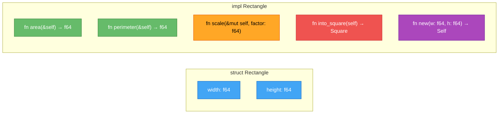

# 메서드

<span class="badge-beginner">기초</span>

> **메서드(method)**는 구조체(또는 열거형, 트레이트 객체)의 문맥 안에서 정의되는 함수입니다. 첫 번째 매개변수는 항상 `self`로, 메서드가 호출되는 인스턴스를 나타냅니다.

---

## 1. `impl` 블록과 메서드 기본

`impl` (implementation) 블록 안에 함수를 정의하면 해당 구조체의 **메서드**가 됩니다. 메서드는 점(`.`) 표기법으로 호출합니다.



> **범례**: 초록 = `&self` (읽기만), 주황 = `&mut self` (수정), 빨강 = `self` (소유권 가져감), 보라 = 연관 함수 (`self` 없음)

```rust,editable
#[derive(Debug)]
struct Rectangle {
    width: f64,
    height: f64,
}

impl Rectangle {
    // &self: 불변 참조로 빌림 (읽기만 가능)
    fn area(&self) -> f64 {
        self.width * self.height
    }

    fn perimeter(&self) -> f64 {
        2.0 * (self.width + self.height)
    }

    // 다른 Rectangle과 비교
    fn can_hold(&self, other: &Rectangle) -> bool {
        self.width > other.width && self.height > other.height
    }
}

fn main() {
    let rect1 = Rectangle { width: 30.0, height: 50.0 };
    let rect2 = Rectangle { width: 10.0, height: 40.0 };

    println!("rect1의 넓이: {}", rect1.area());
    println!("rect1의 둘레: {}", rect1.perimeter());
    println!("rect1이 rect2를 포함할 수 있나? {}", rect1.can_hold(&rect2));
}
```

<div class="info-box">

**`&self`는 `self: &Self`의 축약형입니다.** `impl Rectangle` 블록 안에서 `Self`는 `Rectangle` 타입의 별칭입니다. 따라서 `&self`는 `self: &Rectangle`과 동일한 의미입니다.

</div>

---

## 2. `&self`, `&mut self`, `self` 비교

메서드의 첫 번째 매개변수(`self`)의 형태에 따라 인스턴스와의 관계가 달라집니다.

```rust,editable
#[derive(Debug)]
struct Counter {
    value: i32,
    label: String,
}

impl Counter {
    // &self: 불변 참조 - 읽기만 가능
    fn get_value(&self) -> i32 {
        self.value
    }

    // &mut self: 가변 참조 - 수정 가능
    fn increment(&mut self) {
        self.value += 1;
    }

    fn decrement(&mut self) {
        self.value -= 1;
    }

    // self: 소유권을 가져감 - 호출 후 원래 인스턴스 사용 불가
    fn into_label(self) -> String {
        format!("{}: {}", self.label, self.value)
    }
}

fn main() {
    let mut counter = Counter {
        value: 0,
        label: String::from("방문자 수"),
    };

    // &self: 읽기
    println!("현재 값: {}", counter.get_value());

    // &mut self: 수정
    counter.increment();
    counter.increment();
    counter.increment();
    counter.decrement();
    println!("변경 후: {}", counter.get_value());

    // self: 소유권 이동 - counter는 이후 사용 불가
    let label = counter.into_label();
    println!("라벨: {}", label);

    // ❌ 아래 줄의 주석을 해제하면 컴파일 에러!
    // println!("{:?}", counter);  // counter는 이미 이동됨
}
```

<div class="warning-box">

**`self`(소유권 가져가기)를 사용하는 경우**: 메서드가 호출된 후 원래 인스턴스를 더 이상 사용하지 못하게 할 때 사용합니다. 주로 인스턴스를 다른 타입으로 **변환(transform)**하거나, 리소스를 **소비(consume)**할 때 사용됩니다.

</div>

---

## 3. 연관 함수 (Associated Functions)

`impl` 블록 안에서 `self` 매개변수가 **없는** 함수를 **연관 함수**라고 합니다. `::` 구문으로 호출하며, 주로 **생성자** 역할을 합니다.

```rust,editable
#[derive(Debug)]
struct Circle {
    x: f64,
    y: f64,
    radius: f64,
}

impl Circle {
    // 연관 함수: self가 없음 → ::로 호출
    fn new(x: f64, y: f64, radius: f64) -> Self {
        Self { x, y, radius }
    }

    // 원점에 중심을 둔 원 생성
    fn at_origin(radius: f64) -> Self {
        Self::new(0.0, 0.0, radius)
    }

    // 단위 원 (반지름 1)
    fn unit() -> Self {
        Self::at_origin(1.0)
    }

    // 메서드: &self가 있음 → .으로 호출
    fn area(&self) -> f64 {
        std::f64::consts::PI * self.radius * self.radius
    }

    fn circumference(&self) -> f64 {
        2.0 * std::f64::consts::PI * self.radius
    }

    fn contains_point(&self, px: f64, py: f64) -> bool {
        let dx = self.x - px;
        let dy = self.y - py;
        (dx * dx + dy * dy).sqrt() <= self.radius
    }
}

fn main() {
    // 연관 함수 호출: ::
    let c1 = Circle::new(3.0, 4.0, 5.0);
    let c2 = Circle::at_origin(10.0);
    let c3 = Circle::unit();

    println!("c1: {:?}", c1);
    println!("c1 넓이: {:.2}", c1.area());
    println!("c1 둘레: {:.2}", c1.circumference());
    println!("c1이 (0,0)을 포함? {}", c1.contains_point(0.0, 0.0));

    println!("\nc2: {:?}", c2);
    println!("c3: {:?}", c3);
}
```

<div class="tip-box">

**`Self` vs `self`**
- **`Self`** (대문자): 현재 `impl` 블록의 **타입** 자체를 가리킵니다. `impl Circle` 안에서 `Self`는 `Circle`입니다.
- **`self`** (소문자): 메서드의 첫 번째 매개변수로, 현재 **인스턴스**를 가리킵니다.
- `String::from("hello")`의 `from`도 `String`의 연관 함수입니다.

</div>

---

## 4. 여러 개의 `impl` 블록

하나의 구조체에 대해 여러 `impl` 블록을 작성할 수 있습니다. 기능별로 분리하면 코드 가독성이 높아집니다.

```rust,editable
#[derive(Debug)]
struct Player {
    name: String,
    health: i32,
    max_health: i32,
    attack: i32,
    level: u32,
}

// 생성자 관련
impl Player {
    fn new(name: &str) -> Self {
        Self {
            name: String::from(name),
            health: 100,
            max_health: 100,
            attack: 10,
            level: 1,
        }
    }
}

// 조회 관련
impl Player {
    fn is_alive(&self) -> bool {
        self.health > 0
    }

    fn health_percentage(&self) -> f64 {
        self.health as f64 / self.max_health as f64 * 100.0
    }

    fn status(&self) -> &str {
        match self.health_percentage() as u32 {
            76..=100 => "양호",
            51..=75 => "주의",
            26..=50 => "위험",
            1..=25 => "치명적",
            _ => "사망",
        }
    }
}

// 행동 관련
impl Player {
    fn take_damage(&mut self, damage: i32) {
        self.health = (self.health - damage).max(0);
        println!("{}이(가) {}의 피해를 받음! (체력: {})", self.name, damage, self.health);
    }

    fn heal(&mut self, amount: i32) {
        self.health = (self.health + amount).min(self.max_health);
        println!("{}이(가) {} 회복! (체력: {})", self.name, amount, self.health);
    }

    fn level_up(&mut self) {
        self.level += 1;
        self.max_health += 20;
        self.health = self.max_health;
        self.attack += 5;
        println!("🎉 {}이(가) 레벨 {}로 상승!", self.name, self.level);
    }
}

fn main() {
    let mut hero = Player::new("용사");

    println!("상태: {} (체력: {:.0}%, {})", hero.name, hero.health_percentage(), hero.status());

    hero.take_damage(30);
    hero.take_damage(45);
    println!("상태: {}", hero.status());

    hero.heal(20);
    hero.level_up();

    println!("\n최종 상태: {:?}", hero);
    println!("생존 여부: {}", hero.is_alive());
}
```

<div class="info-box">

**여러 `impl` 블록을 나누는 이유**: 기능 그룹별로 코드를 정리할 수 있습니다. 또한, 제네릭 타입이나 트레이트 구현 시에도 `impl` 블록을 분리하게 됩니다. 이 부분은 이후 장에서 다룹니다.

</div>

---

## 5. `#[derive]` 매크로 활용

`#[derive]` 속성을 사용하면 자주 사용하는 트레이트를 자동으로 구현할 수 있습니다.

```rust,editable
// 여러 트레이트를 한 번에 derive
#[derive(Debug, Clone, PartialEq, Default)]
struct Config {
    width: u32,
    height: u32,
    fullscreen: bool,
    title: String,
}

fn main() {
    // Default: 모든 필드가 기본값으로 초기화
    let default_config = Config::default();
    println!("기본 설정: {:?}", default_config);
    // u32 → 0, bool → false, String → ""

    // 사용자 정의 설정
    let custom_config = Config {
        width: 1920,
        height: 1080,
        fullscreen: true,
        title: String::from("내 게임"),
    };

    // Clone: 깊은 복사
    let backup = custom_config.clone();
    println!("백업: {:?}", backup);

    // PartialEq: == 비교
    println!("설정 동일? {}", custom_config == backup);
    println!("기본값과 동일? {}", custom_config == default_config);

    // Debug: {:?} 또는 {:#?}로 출력
    println!("\n보기 좋은 출력:\n{:#?}", custom_config);
}
```

<div class="tip-box">

**자주 사용하는 `#[derive]` 트레이트 정리**

| 트레이트 | 기능 | 요구 조건 |
|---|---|---|
| `Debug` | `{:?}` 디버그 출력 | 모든 필드가 `Debug` 구현 |
| `Clone` | `.clone()`으로 깊은 복사 | 모든 필드가 `Clone` 구현 |
| `PartialEq` | `==`, `!=` 비교 | 모든 필드가 `PartialEq` 구현 |
| `Default` | `::default()`로 기본값 생성 | 모든 필드가 `Default` 구현 |
| `Copy` | 암묵적 복사 (이동 대신) | `Clone` 필요 + 모든 필드가 `Copy` |
| `Hash` | 해시맵 키로 사용 가능 | 모든 필드가 `Hash` 구현 |

</div>

---

## 6. 빌더 패턴 (Builder Pattern)

구조체에 필드가 많거나 선택적 설정이 필요할 때, **빌더 패턴**을 사용하면 가독성 높은 API를 만들 수 있습니다.

```rust,editable
#[derive(Debug, Clone)]
struct HttpRequest {
    url: String,
    method: String,
    headers: Vec<(String, String)>,
    body: Option<String>,
    timeout_ms: u64,
}

// 빌더 구조체
#[derive(Debug, Clone)]
struct HttpRequestBuilder {
    url: String,
    method: String,
    headers: Vec<(String, String)>,
    body: Option<String>,
    timeout_ms: u64,
}

impl HttpRequestBuilder {
    // 필수 매개변수만 받는 생성자
    fn new(url: &str) -> Self {
        Self {
            url: String::from(url),
            method: String::from("GET"),
            headers: Vec::new(),
            body: None,
            timeout_ms: 30000,
        }
    }

    // 각 설정 메서드는 self를 반환하여 체이닝 가능
    fn method(mut self, method: &str) -> Self {
        self.method = String::from(method);
        self
    }

    fn header(mut self, key: &str, value: &str) -> Self {
        self.headers.push((String::from(key), String::from(value)));
        self
    }

    fn body(mut self, body: &str) -> Self {
        self.body = Some(String::from(body));
        self
    }

    fn timeout(mut self, ms: u64) -> Self {
        self.timeout_ms = ms;
        self
    }

    // 최종적으로 HttpRequest를 생성
    fn build(self) -> HttpRequest {
        HttpRequest {
            url: self.url,
            method: self.method,
            headers: self.headers,
            body: self.body,
            timeout_ms: self.timeout_ms,
        }
    }
}

fn main() {
    // 빌더 패턴: 메서드 체이닝으로 가독성 높은 코드
    let request = HttpRequestBuilder::new("https://api.example.com/users")
        .method("POST")
        .header("Content-Type", "application/json")
        .header("Authorization", "Bearer token123")
        .body(r#"{"name": "김러스트", "age": 30}"#)
        .timeout(5000)
        .build();

    println!("{:#?}", request);

    // 간단한 GET 요청 - 기본값 사용
    let simple_request = HttpRequestBuilder::new("https://api.example.com/status")
        .build();

    println!("\n간단한 요청: {:?}", simple_request);
}
```

<div class="info-box">

**빌더 패턴의 핵심**: 각 설정 메서드가 `self`를 받아 수정한 뒤 다시 `Self`를 반환합니다. 이렇게 하면 `.method("POST").header(...).body(...)` 같은 **메서드 체이닝**이 가능해집니다. Rust의 소유권 시스템과 잘 어울리는 패턴입니다.

</div>

---

## 7. `Default` 트레이트와 결합한 빌더

`Default`를 derive하면 빌더 패턴을 더 간결하게 구현할 수 있습니다.

```rust,editable
#[derive(Debug, Clone, PartialEq, Default)]
struct ServerConfig {
    host: String,
    port: u16,
    max_connections: u32,
    debug_mode: bool,
}

impl ServerConfig {
    fn new() -> Self {
        Self {
            host: String::from("localhost"),
            port: 8080,
            max_connections: 100,
            debug_mode: false,
        }
    }

    fn host(mut self, host: &str) -> Self {
        self.host = String::from(host);
        self
    }

    fn port(mut self, port: u16) -> Self {
        self.port = port;
        self
    }

    fn max_connections(mut self, max: u32) -> Self {
        self.max_connections = max;
        self
    }

    fn debug(mut self) -> Self {
        self.debug_mode = true;
        self
    }
}

fn main() {
    // 빌더 스타일 설정
    let production = ServerConfig::new()
        .host("0.0.0.0")
        .port(443)
        .max_connections(10000);

    let development = ServerConfig::new()
        .debug();

    println!("운영 서버: {:#?}", production);
    println!("개발 서버: {:#?}", development);

    // Default로 생성한 것과 비교
    let default = ServerConfig::default();
    println!("\n기본값: {:?}", default);
    println!("개발 서버 == 기본값? {}", development == default);
}
```

---

## 8. 메서드 호출과 자동 참조/역참조

Rust는 메서드를 호출할 때 자동으로 `&`, `&mut`, `*`를 추가합니다. 이를 **자동 참조/역참조(automatic referencing and dereferencing)**라 합니다.

```rust,editable
#[derive(Debug)]
struct Point {
    x: f64,
    y: f64,
}

impl Point {
    fn distance_to(&self, other: &Point) -> f64 {
        let dx = self.x - other.x;
        let dy = self.y - other.y;
        (dx * dx + dy * dy).sqrt()
    }
}

fn main() {
    let p1 = Point { x: 0.0, y: 0.0 };
    let p2 = Point { x: 3.0, y: 4.0 };

    // 아래 두 줄은 완전히 동일합니다
    let d1 = p1.distance_to(&p2);      // Rust가 자동으로 &p1로 변환
    let d2 = (&p1).distance_to(&p2);   // 명시적 참조 (불필요)

    println!("거리: {}", d1);
    println!("거리: {}", d2);
    // p1.distance_to()를 호출하면 Rust가 시그니처를 보고
    // 자동으로 &p1.distance_to()로 변환합니다.
}
```

<div class="tip-box">

**자동 참조 규칙**: `object.method()`를 호출하면 Rust는 메서드 시그니처를 확인하여 `&object`, `&mut object`, 또는 `object` 중 맞는 것을 자동 선택합니다. 이 덕분에 C/C++에서처럼 `->` 연산자를 사용할 필요가 없습니다.

</div>

---

## 연습문제

<div class="exercise-box">

### 연습문제 1: 은행 계좌 구조체

`BankAccount` 구조체에 메서드를 구현하세요.

1. `new` 연관 함수: 소유자 이름과 초기 잔액으로 계좌 생성
2. `deposit(&mut self, amount)`: 입금
3. `withdraw(&mut self, amount) -> bool`: 출금 (잔액 부족 시 `false` 반환)
4. `balance(&self)`: 잔액 조회
5. `transfer(&mut self, other: &mut Self, amount) -> bool`: 다른 계좌로 이체

```rust,editable
#[derive(Debug)]
struct BankAccount {
    owner: String,
    balance: f64,
}

impl BankAccount {
    // TODO: new 연관 함수
    fn new(owner: &str, initial_balance: f64) -> Self {
        Self {
            owner: String::from(owner),
            balance: initial_balance,
        }
    }

    // TODO: deposit 메서드
    fn deposit(&mut self, amount: f64) {
        self.balance += amount;
        println!("{}: {:.0}원 입금 (잔액: {:.0}원)", self.owner, amount, self.balance);
    }

    // TODO: withdraw 메서드 (잔액 부족 시 false 반환)
    fn withdraw(&mut self, amount: f64) -> bool {
        if amount > self.balance {
            println!("{}: 잔액 부족! (잔액: {:.0}원, 출금 시도: {:.0}원)", self.owner, self.balance, amount);
            return false;
        }
        self.balance -= amount;
        println!("{}: {:.0}원 출금 (잔액: {:.0}원)", self.owner, amount, self.balance);
        true
    }

    // TODO: balance 메서드
    fn balance(&self) -> f64 {
        self.balance
    }
}

fn main() {
    let mut account1 = BankAccount::new("김영희", 100_000.0);
    let mut account2 = BankAccount::new("이철수", 50_000.0);

    account1.deposit(50_000.0);
    account1.withdraw(30_000.0);
    account1.withdraw(200_000.0);  // 잔액 부족

    println!("\n{}: 잔액 {:.0}원", account1.owner, account1.balance());
    println!("{}: 잔액 {:.0}원", account2.owner, account2.balance());
}
```

</div>

<div class="exercise-box">

### 연습문제 2: 문자열 통계 분석기

`TextAnalyzer` 구조체를 만들고 텍스트 분석 메서드를 구현하세요.

```rust,editable
#[derive(Debug, Clone)]
struct TextAnalyzer {
    text: String,
}

impl TextAnalyzer {
    fn new(text: &str) -> Self {
        Self {
            text: String::from(text),
        }
    }

    // TODO: 글자 수 (공백 제외)
    fn char_count(&self) -> usize {
        self.text.chars().filter(|c| !c.is_whitespace()).count()
    }

    // TODO: 단어 수
    fn word_count(&self) -> usize {
        self.text.split_whitespace().count()
    }

    // TODO: 특정 문자 등장 횟수
    fn count_char(&self, target: char) -> usize {
        self.text.chars().filter(|&c| c == target).count()
    }

    // TODO: 텍스트를 대문자로 변환한 새 분석기 반환
    fn to_uppercase(&self) -> Self {
        Self::new(&self.text.to_uppercase())
    }
}

fn main() {
    let analyzer = TextAnalyzer::new("Hello Rust World! Rust is great.");

    println!("텍스트: {:?}", analyzer.text);
    println!("글자 수 (공백 제외): {}", analyzer.char_count());
    println!("단어 수: {}", analyzer.word_count());
    println!("'R' 등장 횟수: {}", analyzer.count_char('R'));

    let upper = analyzer.to_uppercase();
    println!("대문자 변환: {:?}", upper.text);
    println!("원본 유지: {:?}", analyzer.text);  // Clone 덕분에 원본 유지
}
```

</div>

<div class="exercise-box">

### 연습문제 3: 빌더 패턴으로 피자 주문

`Pizza` 구조체와 `PizzaBuilder`를 만들어 빌더 패턴을 직접 구현하세요.

```rust,editable
#[derive(Debug)]
struct Pizza {
    size: String,        // "S", "M", "L"
    dough: String,       // "thin", "thick"
    toppings: Vec<String>,
    extra_cheese: bool,
}

#[derive(Debug)]
struct PizzaBuilder {
    size: String,
    dough: String,
    toppings: Vec<String>,
    extra_cheese: bool,
}

impl PizzaBuilder {
    // TODO: 기본 피자 빌더 생성 (M 사이즈, thin 도우)
    fn new() -> Self {
        Self {
            size: String::from("M"),
            dough: String::from("thin"),
            toppings: Vec::new(),
            extra_cheese: false,
        }
    }

    // TODO: 사이즈 설정
    fn size(mut self, size: &str) -> Self {
        self.size = String::from(size);
        self
    }

    // TODO: 도우 설정
    fn dough(mut self, dough: &str) -> Self {
        self.dough = String::from(dough);
        self
    }

    // TODO: 토핑 추가 (여러 번 호출 가능)
    fn topping(mut self, topping: &str) -> Self {
        self.toppings.push(String::from(topping));
        self
    }

    // TODO: 치즈 추가
    fn extra_cheese(mut self) -> Self {
        self.extra_cheese = true;
        self
    }

    // TODO: 최종 Pizza 생성
    fn build(self) -> Pizza {
        Pizza {
            size: self.size,
            dough: self.dough,
            toppings: self.toppings,
            extra_cheese: self.extra_cheese,
        }
    }
}

fn main() {
    let margherita = PizzaBuilder::new()
        .size("L")
        .topping("토마토 소스")
        .topping("모짜렐라")
        .topping("바질")
        .build();

    let pepperoni = PizzaBuilder::new()
        .size("M")
        .dough("thick")
        .topping("토마토 소스")
        .topping("페퍼로니")
        .topping("올리브")
        .extra_cheese()
        .build();

    println!("마르게리타: {:#?}", margherita);
    println!("페퍼로니: {:#?}", pepperoni);
}
```

</div>

---

## 퀴즈

<div class="quiz-box" onclick="this.classList.toggle('show-answer')">

**Q1.** `&self`, `&mut self`, `self` 중에서 메서드 호출 후에도 원래 인스턴스를 계속 사용할 수 있는 것은 어떤 것인가요?

<div class="quiz-answer">

**`&self`와 `&mut self`**입니다. 두 가지 모두 참조(빌림)이므로 호출 후에도 인스턴스를 계속 사용할 수 있습니다. 반면 `self`는 소유권을 가져가므로 호출 후 원래 인스턴스를 사용할 수 없습니다. 단, `&mut self`를 사용하려면 인스턴스가 `mut`으로 선언되어야 합니다.

</div>
</div>

<div class="quiz-box" onclick="this.classList.toggle('show-answer')">

**Q2.** 다음 코드에서 `Circle::new(5.0)`와 `circle.area()`의 호출 방식이 다른 이유는 무엇인가요?

```rust,ignore
let circle = Circle::new(5.0);  // :: 사용
let a = circle.area();          // . 사용
```

<div class="quiz-answer">

`Circle::new(5.0)`는 **연관 함수**로, `self` 매개변수가 없기 때문에 특정 인스턴스 없이 타입 이름에 `::`를 붙여 호출합니다. 반면 `circle.area()`는 **메서드**로, `&self` 매개변수가 있어 인스턴스에 `.`을 붙여 호출합니다. 연관 함수는 구조체의 네임스페이스에 속하지만 특정 인스턴스에 바인딩되지 않습니다.

</div>
</div>

<div class="quiz-box" onclick="this.classList.toggle('show-answer')">

**Q3.** 빌더 패턴에서 각 설정 메서드가 `mut self`를 받고 `Self`를 반환하는 이유는 무엇인가요?

<div class="quiz-answer">

**메서드 체이닝**을 가능하게 하기 위해서입니다. `mut self`로 소유권을 가져와 값을 수정한 뒤, 수정된 자신(`Self`)을 반환하면 `.method1().method2().method3()` 형태의 연쇄 호출이 가능합니다. `&mut self`를 사용하면 `&mut Self`를 반환해야 하므로 체이닝이 어색해지고, 소유권 기반 빌더가 Rust에서 더 자연스러운 패턴입니다.

</div>
</div>

---

<div class="summary-box">

### 핵심 정리

| 개념 | 문법 | 설명 |
|---|---|---|
| **impl 블록** | `impl StructName { ... }` | 구조체에 메서드와 연관 함수를 정의 |
| **`&self` 메서드** | `fn name(&self)` | 불변 참조, 읽기만 가능 |
| **`&mut self` 메서드** | `fn name(&mut self)` | 가변 참조, 수정 가능 |
| **`self` 메서드** | `fn name(self)` | 소유권 이동, 호출 후 사용 불가 |
| **연관 함수** | `fn name() -> Self` | `self` 없음, `::` 로 호출, 생성자에 활용 |
| **`Self` 키워드** | `Self { ... }` | 현재 `impl` 블록의 타입 별칭 |
| **여러 `impl` 블록** | `impl T { } impl T { }` | 기능별로 분리하여 정리 가능 |
| **빌더 패턴** | `.method1().method2().build()` | 메서드 체이닝으로 가독성 높은 생성 |
| **`#[derive]`** | `#[derive(Debug, Clone, ...)]` | 트레이트 자동 구현 |
| **자동 참조** | `obj.method()` | 컴파일러가 `&`, `&mut`, 소유권 자동 판단 |

</div>
