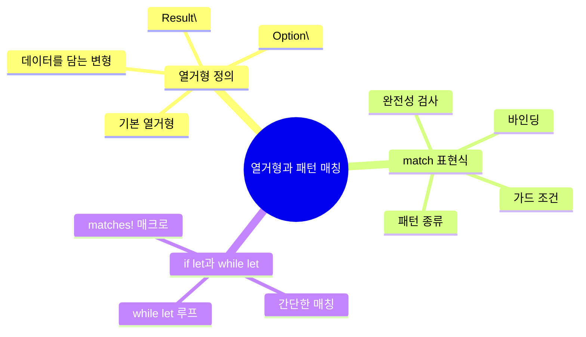
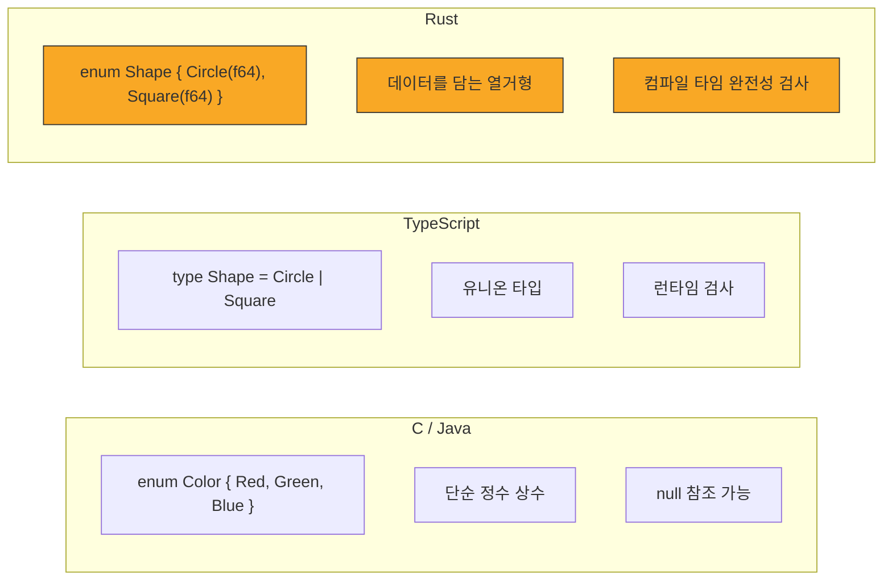

# 열거형과 패턴 매칭 기초

Rust의 열거형(enum)과 패턴 매칭(pattern matching)은 데이터를 표현하고 처리하는 가장 강력한 도구입니다. 이 장에서는 열거형을 정의하고, `match`와 `if let`으로 패턴을 매칭하는 방법을 배워봅시다.

## 이 장에서 배울 내용

## 학습 로드맵

| 순서 | 주제 | 핵심 개념 | 난이도 |
|------|------|-----------|--------|
| 5.1 | [열거형 정의](./ch05-01-defining-enums.md) | `enum`, 변형, `Option<T>`, `Result<T, E>` | ⭐⭐ |
| 5.2 | [match 표현식](./ch05-02-match.md) | 패턴 매칭, 가드, 바인딩, 완전성 | ⭐⭐ |
| 5.3 | [if let과 while let](./ch05-03-if-let.md) | `if let`, `while let`, `matches!` | ⭐⭐ |

**왜 열거형과 패턴 매칭이 중요한가요?**

Rust에서 열거형과 패턴 매칭은 단순한 문법 요소가 아니라 **프로그램의 안전성을 보장하는 핵심 메커니즘**입니다:

- **`null` 없는 안전한 코드** — `Option<T>`으로 값이 없을 수 있는 상황을 명시적으로 처리합니다
- **에러 처리의 기본** — `Result<T, E>`로 실패할 수 있는 연산을 안전하게 다룹니다
- **컴파일러가 모든 경우를 검사** — `match`의 완전성 검사로 빠뜨린 케이스를 방지합니다
- **풍부한 데이터 모델링** — 열거형 변형에 다양한 타입의 데이터를 담을 수 있습니다

## 다른 언어와의 비교

**학습 팁**: 열거형과 패턴 매칭은 Rust 프로그래밍에서 매우 자주 사용됩니다. 특히 `Option`과 `Result`는 거의 모든 Rust 코드에 등장하므로, 이 장의 내용을 완전히 이해하고 넘어가는 것이 중요합니다. 코드 예제를 직접 실행하고 수정해 보세요!

