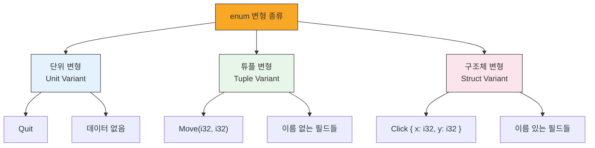
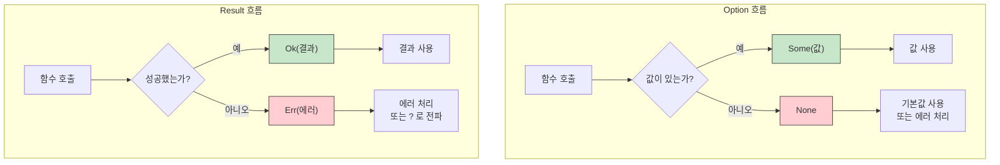

# 열거형 정의 <span class="badge-beginner">기초</span>

**열거형(enum)**은 가능한 값들의 집합을 정의하는 타입입니다. Rust의 열거형은 다른 언어와 달리 각 변형(variant)에 데이터를 담을 수 있어 매우 강력합니다.

## 기본 열거형 정의

가장 간단한 형태의 열거형은 이름이 있는 변형들의 목록입니다.

```rust,editable
// 방향을 나타내는 열거형
enum Direction {
    North,
    South,
    East,
    West,
}

// 신호등 색상을 나타내는 열거형
enum TrafficLight {
    Red,
    Yellow,
    Green,
}

fn main() {
    let dir = Direction::North;
    let light = TrafficLight::Red;

    // 열거형 값 사용하기
    match dir {
        Direction::North => println!("북쪽으로 이동합니다"),
        Direction::South => println!("남쪽으로 이동합니다"),
        Direction::East => println!("동쪽으로 이동합니다"),
        Direction::West => println!("서쪽으로 이동합니다"),
    }

    match light {
        TrafficLight::Red => println!("정지!"),
        TrafficLight::Yellow => println!("주의!"),
        TrafficLight::Green => println!("출발!"),
    }
}
```

<div class="info-box">

**열거형 vs 상수**: C/Java의 enum은 내부적으로 정수 값이지만, Rust의 enum은 **독립적인 타입**입니다. 서로 다른 enum 값을 비교하거나 정수와 혼용할 수 없어 타입 안전성이 보장됩니다.

</div>

## 데이터를 담는 변형

Rust 열거형의 진짜 힘은 **각 변형에 데이터를 담을 수 있다**는 것입니다. 세 가지 형태가 있습니다.

### 1. 튜플 변형 (Tuple Variant)

```rust,editable
enum Shape {
    Circle(f64),              // 반지름
    Rectangle(f64, f64),      // 너비, 높이
    Triangle(f64, f64, f64),  // 세 변의 길이
}

fn area(shape: &Shape) -> f64 {
    match shape {
        Shape::Circle(radius) => std::f64::consts::PI * radius * radius,
        Shape::Rectangle(width, height) => width * height,
        Shape::Triangle(a, b, c) => {
            // 헤론의 공식
            let s = (a + b + c) / 2.0;
            (s * (s - a) * (s - b) * (s - c)).sqrt()
        }
    }
}

fn main() {
    let shapes = vec![
        Shape::Circle(5.0),
        Shape::Rectangle(4.0, 6.0),
        Shape::Triangle(3.0, 4.0, 5.0),
    ];

    for shape in &shapes {
        println!("면적: {:.2}", area(shape));
    }
}
```

### 2. 구조체 변형 (Struct Variant)

```rust,editable
enum WebEvent {
    // 단위 변형 (Unit variant) - 데이터 없음
    PageLoad,
    PageUnload,
    // 구조체 변형 - 이름이 있는 필드
    KeyPress { key: char },
    Click { x: i32, y: i32 },
    // 튜플 변형
    Paste(String),
}

fn handle_event(event: WebEvent) {
    match event {
        WebEvent::PageLoad => println!("페이지 로드됨"),
        WebEvent::PageUnload => println!("페이지 언로드됨"),
        WebEvent::KeyPress { key } => println!("'{}' 키 입력", key),
        WebEvent::Click { x, y } => println!("({}, {}) 클릭", x, y),
        WebEvent::Paste(text) => println!("텍스트 붙여넣기: {}", text),
    }
}

fn main() {
    let events = vec![
        WebEvent::PageLoad,
        WebEvent::Click { x: 100, y: 200 },
        WebEvent::KeyPress { key: 'a' },
        WebEvent::Paste(String::from("안녕하세요")),
        WebEvent::PageUnload,
    ];

    for event in events {
        handle_event(event);
    }
}
```

### 3. 단위 변형 (Unit Variant)

데이터가 필요 없는 가장 단순한 형태입니다. 위 예제의 `PageLoad`와 `PageUnload`가 단위 변형입니다.



## 열거형에 메서드 정의하기

구조체처럼 `impl` 블록을 사용하여 열거형에 메서드를 정의할 수 있습니다.

```rust,editable
#[derive(Debug)]
enum Coin {
    Penny,
    Nickel,
    Dime,
    Quarter,
}

impl Coin {
    fn value_in_cents(&self) -> u32 {
        match self {
            Coin::Penny => 1,
            Coin::Nickel => 5,
            Coin::Dime => 10,
            Coin::Quarter => 25,
        }
    }

    fn name(&self) -> &str {
        match self {
            Coin::Penny => "페니",
            Coin::Nickel => "니켈",
            Coin::Dime => "다임",
            Coin::Quarter => "쿼터",
        }
    }
}

fn main() {
    let coins = vec![Coin::Penny, Coin::Quarter, Coin::Dime, Coin::Nickel];

    let total: u32 = coins.iter().map(|c| c.value_in_cents()).sum();

    for coin in &coins {
        println!("{}: {}센트", coin.name(), coin.value_in_cents());
    }
    println!("합계: {}센트", total);
}
```

## Option\<T\> — Rust의 null 대안

<div class="warning-box">

**매우 중요!** `Option<T>`은 Rust에서 가장 많이 사용되는 열거형입니다. Rust에는 `null`이 없습니다. 대신 값이 있을 수도 있고 없을 수도 있는 상황을 `Option<T>`으로 표현합니다.

</div>

`Option<T>`의 정의는 매우 간단합니다:

```rust,ignore
enum Option<T> {
    Some(T),  // 값이 있음
    None,     // 값이 없음
}
```

### Option 사용 예제

```rust,editable
fn find_first_even(numbers: &[i32]) -> Option<i32> {
    for &num in numbers {
        if num % 2 == 0 {
            return Some(num);
        }
    }
    None
}

fn divide(numerator: f64, denominator: f64) -> Option<f64> {
    if denominator == 0.0 {
        None
    } else {
        Some(numerator / denominator)
    }
}

fn main() {
    // find_first_even 사용
    let numbers = vec![1, 3, 5, 8, 11, 14];
    match find_first_even(&numbers) {
        Some(n) => println!("첫 번째 짝수: {}", n),
        None => println!("짝수가 없습니다"),
    }

    let odds = vec![1, 3, 5, 7];
    match find_first_even(&odds) {
        Some(n) => println!("첫 번째 짝수: {}", n),
        None => println!("짝수가 없습니다"),
    }

    // divide 사용
    match divide(10.0, 3.0) {
        Some(result) => println!("10 / 3 = {:.2}", result),
        None => println!("0으로 나눌 수 없습니다"),
    }

    match divide(10.0, 0.0) {
        Some(result) => println!("10 / 0 = {:.2}", result),
        None => println!("0으로 나눌 수 없습니다"),
    }
}
```

### Option의 유용한 메서드들

```rust,editable
fn main() {
    let some_value: Option<i32> = Some(42);
    let no_value: Option<i32> = None;

    // unwrap_or: None이면 기본값 사용
    println!("값: {}", some_value.unwrap_or(0));
    println!("값: {}", no_value.unwrap_or(0));

    // is_some / is_none: 값 존재 여부 확인
    println!("some_value에 값이 있나? {}", some_value.is_some());
    println!("no_value에 값이 있나? {}", no_value.is_some());

    // map: Some 안의 값을 변환
    let doubled = some_value.map(|x| x * 2);
    println!("두 배: {:?}", doubled);  // Some(84)

    let doubled_none = no_value.map(|x| x * 2);
    println!("두 배: {:?}", doubled_none);  // None

    // and_then: 연쇄 처리 (flatMap과 비슷)
    let result = some_value
        .and_then(|x| if x > 10 { Some(x * 2) } else { None });
    println!("and_then 결과: {:?}", result);  // Some(84)

    // unwrap_or_else: 클로저로 기본값 생성
    let value = no_value.unwrap_or_else(|| {
        println!("기본값을 계산합니다...");
        100
    });
    println!("최종 값: {}", value);
}
```

<div class="tip-box">

**`unwrap()`과 `expect()`에 대한 주의**: `unwrap()`은 `None`일 때 프로그램을 패닉시킵니다. `expect("메시지")`도 마찬가지이지만 에러 메시지를 지정할 수 있습니다. **프로덕션 코드에서는 `match`, `unwrap_or`, `unwrap_or_else` 등을 사용하세요.**

</div>

## Result\<T, E\> — 에러 표현

`Result<T, E>`는 **성공하거나 실패할 수 있는 연산**의 결과를 나타냅니다.

```rust,ignore
enum Result<T, E> {
    Ok(T),   // 성공 - 결과값 T
    Err(E),  // 실패 - 에러 E
}
```

### Result 사용 예제

```rust,editable
use std::num::ParseIntError;

fn parse_and_double(s: &str) -> Result<i32, ParseIntError> {
    let number = s.parse::<i32>()?;  // ?는 에러를 전파합니다
    Ok(number * 2)
}

fn validate_age(age_str: &str) -> Result<u32, String> {
    let age: u32 = age_str.parse()
        .map_err(|_| format!("'{}'은(는) 유효한 숫자가 아닙니다", age_str))?;

    if age < 1 || age > 150 {
        Err(format!("나이 {}는 유효 범위(1~150)를 벗어났습니다", age))
    } else {
        Ok(age)
    }
}

fn main() {
    // parse_and_double 테스트
    match parse_and_double("21") {
        Ok(n) => println!("성공: {}", n),
        Err(e) => println!("에러: {}", e),
    }

    match parse_and_double("hello") {
        Ok(n) => println!("성공: {}", n),
        Err(e) => println!("에러: {}", e),
    }

    // validate_age 테스트
    let test_cases = vec!["25", "abc", "200", "0", "100"];
    for case in test_cases {
        match validate_age(case) {
            Ok(age) => println!("유효한 나이: {}", age),
            Err(msg) => println!("검증 실패: {}", msg),
        }
    }
}
```

## Option과 Result 흐름 다이어그램



## Option과 Result 변환

```rust,editable
fn main() {
    // Option -> Result: ok_or / ok_or_else
    let opt: Option<i32> = Some(42);
    let res: Result<i32, &str> = opt.ok_or("값이 없습니다");
    println!("Option -> Result: {:?}", res);

    let none_opt: Option<i32> = None;
    let res: Result<i32, &str> = none_opt.ok_or("값이 없습니다");
    println!("None -> Result: {:?}", res);

    // Result -> Option: ok() / err()
    let ok_result: Result<i32, String> = Ok(42);
    let opt: Option<i32> = ok_result.ok();
    println!("Result -> Option: {:?}", opt);

    let err_result: Result<i32, String> = Err("에러!".to_string());
    let opt: Option<i32> = err_result.ok();
    println!("Err -> Option: {:?}", opt);
}
```

---

<div class="exercise-box">

**연습문제 1: 온도 변환기** <span class="badge-beginner">기초</span>

아래 코드를 완성하여 온도 변환 프로그램을 만드세요. 각 `Temperature` 변형에 메서드를 구현해야 합니다.

```rust,editable
enum Temperature {
    Celsius(f64),
    Fahrenheit(f64),
    Kelvin(f64),
}

impl Temperature {
    // 섭씨로 변환하는 메서드를 구현하세요
    fn to_celsius(&self) -> f64 {
        match self {
            Temperature::Celsius(c) => *c,
            Temperature::Fahrenheit(f) => todo!("화씨를 섭씨로 변환: (F - 32) * 5/9"),
            Temperature::Kelvin(k) => todo!("켈빈을 섭씨로 변환: K - 273.15"),
        }
    }

    // 온도를 설명하는 메서드를 구현하세요
    fn describe(&self) -> String {
        let celsius = self.to_celsius();
        if celsius < 0.0 {
            format!("{:.1}°C - 영하입니다! 매우 춥습니다.", celsius)
        } else if celsius < 15.0 {
            format!("{:.1}°C - 쌀쌀합니다.", celsius)
        } else if celsius < 25.0 {
            format!("{:.1}°C - 쾌적합니다.", celsius)
        } else if celsius < 35.0 {
            format!("{:.1}°C - 따뜻합니다.", celsius)
        } else {
            format!("{:.1}°C - 매우 덥습니다!", celsius)
        }
    }
}

fn main() {
    let temps = vec![
        Temperature::Celsius(20.0),
        Temperature::Fahrenheit(98.6),
        Temperature::Kelvin(0.0),
        Temperature::Fahrenheit(32.0),
    ];

    for temp in &temps {
        println!("{}", temp.describe());
    }
}
```

</div>

<div class="exercise-box">

**연습문제 2: 안전한 나눗셈 체인** <span class="badge-beginner">기초</span>

`Option`을 사용하여 연쇄 나눗셈을 안전하게 수행하는 함수를 완성하세요.

```rust,editable
fn safe_divide(a: f64, b: f64) -> Option<f64> {
    // TODO: b가 0이면 None, 아니면 Some(a / b) 반환
    todo!()
}

fn chain_divide(a: f64, b: f64, c: f64) -> Option<f64> {
    // TODO: a를 b로 나눈 결과를 다시 c로 나누기
    // and_then을 사용해 보세요
    todo!()
}

fn main() {
    // 테스트
    println!("{:?}", safe_divide(10.0, 3.0));     // Some(3.333...)
    println!("{:?}", safe_divide(10.0, 0.0));     // None
    println!("{:?}", chain_divide(100.0, 5.0, 4.0)); // Some(5.0)
    println!("{:?}", chain_divide(100.0, 0.0, 4.0)); // None
    println!("{:?}", chain_divide(100.0, 5.0, 0.0)); // None
}
```

</div>

---

<div class="quiz-box" onclick="this.classList.toggle('show-answer')">

**퀴즈 1**: Rust에 `null`이 없는 이유는 무엇이며, 대신 어떤 방법을 사용하나요?

<div class="quiz-answer">

`null` 참조는 "10억 달러짜리 실수"라고 불릴 정도로 많은 버그의 원인입니다. Null 포인터 역참조는 런타임에서야 발견됩니다.

Rust는 `Option<T>` 열거형을 사용합니다:
- `Some(T)`: 값이 있음
- `None`: 값이 없음

`Option<T>`는 `T`와 다른 타입이므로, **컴파일 타임에** `None`인 경우를 반드시 처리하도록 강제됩니다. 이를 통해 null 관련 버그를 원천 차단합니다.

</div>
</div>

<div class="quiz-box" onclick="this.classList.toggle('show-answer')">

**퀴즈 2**: 다음 코드에서 컴파일 에러가 나는 이유는?
```rust,ignore
let x: Option<i32> = Some(5);
let y: i32 = x + 3;
```

<div class="quiz-answer">

`Option<i32>`와 `i32`는 **서로 다른 타입**이므로 직접 더할 수 없습니다. `Option<i32>`에서 값을 꺼낸 후 사용해야 합니다:

```rust,ignore
let y: i32 = x.unwrap_or(0) + 3;  // 또는
let y: i32 = match x {
    Some(val) => val + 3,
    None => 3,
};
```

이것이 바로 Rust가 `null` 관련 버그를 방지하는 방식입니다. 값이 없을 수 있는 상황을 명시적으로 처리해야 합니다.

</div>
</div>

<div class="quiz-box" onclick="this.classList.toggle('show-answer')">

**퀴즈 3**: `Result<T, E>`와 `Option<T>`의 차이점은?

<div class="quiz-answer">

- **`Option<T>`**: 값이 **있거나 없는** 두 가지 상태만 표현합니다. 왜 없는지에 대한 정보가 없습니다.
  - `Some(T)` / `None`

- **`Result<T, E>`**: 연산이 **성공하거나 실패**할 수 있으며, 실패 시 **에러 정보**를 담습니다.
  - `Ok(T)` / `Err(E)`

일반적으로:
- 값이 단순히 없을 수 있는 경우 → `Option`
- 실패 이유를 알아야 하는 연산 → `Result`

</div>
</div>

---

<div class="summary-box">

**정리**

- **열거형(enum)**은 가능한 값들의 집합을 정의하며, 각 변형에 데이터를 담을 수 있습니다
- **변형의 종류**: 단위(Unit), 튜플(Tuple), 구조체(Struct) 변형
- **`Option<T>`**: Rust의 null 대안으로, `Some(T)` 또는 `None`으로 값의 유무를 표현
- **`Result<T, E>`**: 성공(`Ok(T)`) 또는 실패(`Err(E)`)를 표현하는 에러 처리 도구
- 열거형에도 `impl` 블록으로 메서드를 정의할 수 있습니다
- `Option`과 `Result`는 `map`, `and_then`, `unwrap_or` 등 풍부한 메서드를 제공합니다

</div>
