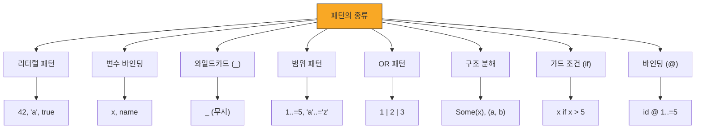

# match 표현식 <span class="badge-beginner">기초</span>

`match`는 Rust에서 가장 강력한 제어 흐름 구조 중 하나입니다. 값을 여러 패턴과 비교하고, 일치하는 패턴에 해당하는 코드를 실행합니다. 컴파일러가 **모든 경우를 처리했는지 검사**해주므로 놓치는 케이스가 없습니다.

## 패턴 매칭 기초

```rust,editable
enum Coin {
    Penny,
    Nickel,
    Dime,
    Quarter,
}

fn value_in_cents(coin: &Coin) -> u32 {
    match coin {
        Coin::Penny => {
            println!("행운의 페니!");
            1
        }
        Coin::Nickel => 5,
        Coin::Dime => 10,
        Coin::Quarter => 25,
    }
}

fn main() {
    let coins = vec![Coin::Penny, Coin::Dime, Coin::Quarter, Coin::Nickel];

    for coin in &coins {
        println!("{}센트", value_in_cents(coin));
    }
}
```

<div class="info-box">

**match는 표현식입니다!** `match`는 값을 반환하므로 변수에 바로 할당할 수 있습니다. 각 갈래(arm)의 반환 타입은 모두 동일해야 합니다.

</div>

## 패턴의 종류

Rust는 다양한 패턴 타입을 지원합니다. 하나씩 살펴봅시다.



### 리터럴 패턴

구체적인 값과 매칭합니다.

```rust,editable
fn describe_number(n: i32) {
    match n {
        0 => println!("영"),
        1 => println!("하나"),
        2 => println!("둘"),
        _ => println!("다른 숫자: {}", n),
    }
}

fn main() {
    for i in 0..5 {
        describe_number(i);
    }
}
```

### 변수 바인딩 패턴

매칭된 값을 변수에 바인딩합니다.

```rust,editable
fn process_option(opt: Option<i32>) {
    match opt {
        Some(value) => println!("값이 있습니다: {}", value),
        None => println!("값이 없습니다"),
    }
}

fn main() {
    process_option(Some(42));
    process_option(None);
}
```

### 와일드카드 패턴 (`_`)

어떤 값이든 매칭되지만, 값을 바인딩하지 않습니다. 나머지 모든 경우를 처리할 때 사용합니다.

```rust,editable
fn classify_char(c: char) {
    match c {
        'a'..='z' => println!("'{}': 소문자", c),
        'A'..='Z' => println!("'{}': 대문자", c),
        '0'..='9' => println!("'{}': 숫자", c),
        _ => println!("'{}': 기타 문자", c),
    }
}

fn main() {
    let chars = vec!['a', 'Z', '5', '!', '가'];
    for c in chars {
        classify_char(c);
    }
}
```

### 범위 패턴과 OR 패턴

```rust,editable
fn describe_score(score: u32) {
    match score {
        90..=100 => println!("{}점: A (수)", score),
        80..=89 => println!("{}점: B (우)", score),
        70..=79 => println!("{}점: C (미)", score),
        60..=69 => println!("{}점: D (양)", score),
        0..=59 => println!("{}점: F (가)", score),
        _ => println!("잘못된 점수입니다"),
    }
}

fn describe_day(day: &str) {
    match day {
        "월" | "화" | "수" | "목" | "금" => println!("{}: 평일", day),
        "토" | "일" => println!("{}: 주말!", day),
        _ => println!("알 수 없는 요일"),
    }
}

fn main() {
    let scores = vec![95, 82, 73, 65, 45];
    for s in scores {
        describe_score(s);
    }

    println!();
    let days = vec!["월", "수", "토", "일"];
    for d in days {
        describe_day(d);
    }
}
```

### 구조 분해 패턴

튜플, 구조체, 열거형의 내부 값을 꺼내면서 매칭합니다.

```rust,editable
struct Point {
    x: i32,
    y: i32,
}

enum Command {
    Quit,
    Echo(String),
    Move { x: i32, y: i32 },
    Color(u8, u8, u8),
}

fn describe_point(point: &Point) {
    match point {
        Point { x: 0, y: 0 } => println!("원점"),
        Point { x, y: 0 } => println!("x축 위: ({}, 0)", x),
        Point { x: 0, y } => println!("y축 위: (0, {})", y),
        Point { x, y } => println!("일반 점: ({}, {})", x, y),
    }
}

fn execute_command(cmd: Command) {
    match cmd {
        Command::Quit => println!("종료"),
        Command::Echo(msg) => println!("출력: {}", msg),
        Command::Move { x, y } => println!("이동: ({}, {})", x, y),
        Command::Color(r, g, b) => println!("색상: ({}, {}, {})", r, g, b),
    }
}

fn main() {
    let points = vec![
        Point { x: 0, y: 0 },
        Point { x: 5, y: 0 },
        Point { x: 0, y: 3 },
        Point { x: 2, y: 7 },
    ];

    for p in &points {
        describe_point(p);
    }

    println!();

    let commands = vec![
        Command::Move { x: 10, y: 20 },
        Command::Echo(String::from("안녕!")),
        Command::Color(255, 128, 0),
        Command::Quit,
    ];

    for cmd in commands {
        execute_command(cmd);
    }
}
```

## 가드 조건 (if guard)

패턴 뒤에 `if` 조건을 추가하여 더 세밀한 매칭이 가능합니다.

```rust,editable
fn classify_number(n: i32) {
    match n {
        x if x < 0 => println!("{}: 음수", x),
        0 => println!("0: 영"),
        x if x % 2 == 0 => println!("{}: 양의 짝수", x),
        x => println!("{}: 양의 홀수", x),
    }
}

fn check_temperature(temp: f64, unit: char) {
    match (temp, unit) {
        (t, 'C') if t < 0.0 => println!("{:.1}°C: 영하! 매우 춥습니다", t),
        (t, 'C') if t < 15.0 => println!("{:.1}°C: 쌀쌀합니다", t),
        (t, 'C') if t < 30.0 => println!("{:.1}°C: 쾌적합니다", t),
        (t, 'C') => println!("{:.1}°C: 덥습니다!", t),
        (t, 'F') if t < 32.0 => println!("{:.1}°F: 어는점 이하!", t),
        (t, 'F') => println!("{:.1}°F", t),
        _ => println!("알 수 없는 단위"),
    }
}

fn main() {
    for n in [-5, -1, 0, 3, 4, 7, 10] {
        classify_number(n);
    }

    println!();
    check_temperature(-5.0, 'C');
    check_temperature(22.0, 'C');
    check_temperature(35.0, 'C');
    check_temperature(20.0, 'F');
}
```

## 바인딩 (`@`)

`@` 연산자를 사용하면 패턴 매칭과 동시에 값을 변수에 바인딩할 수 있습니다.

```rust,editable
fn categorize_age(age: u32) {
    match age {
        a @ 0..=2 => println!("{}세: 영아", a),
        a @ 3..=5 => println!("{}세: 유아", a),
        a @ 6..=12 => println!("{}세: 어린이", a),
        a @ 13..=18 => println!("{}세: 청소년", a),
        a @ 19..=64 => println!("{}세: 성인", a),
        a @ 65.. => println!("{}세: 노인", a),
    }
}

enum Message {
    Hello { id: u32 },
    Goodbye,
}

fn process_message(msg: Message) {
    match msg {
        // id가 1~10 범위일 때 바인딩하면서 매칭
        Message::Hello { id: id_val @ 1..=10 } => {
            println!("VIP 메시지! ID: {}", id_val)
        }
        Message::Hello { id } => {
            println!("일반 메시지. ID: {}", id)
        }
        Message::Goodbye => println!("잘가요!"),
    }
}

fn main() {
    for age in [1, 4, 8, 15, 30, 70] {
        categorize_age(age);
    }

    println!();
    process_message(Message::Hello { id: 5 });
    process_message(Message::Hello { id: 42 });
    process_message(Message::Goodbye);
}
```

## match의 완전성 (Exhaustiveness)

<div class="warning-box">

**매우 중요!** `match`는 **모든 가능한 경우를 반드시 처리**해야 합니다. 하나라도 빠뜨리면 컴파일 에러가 발생합니다. 이것이 Rust의 안전성을 보장하는 핵심 메커니즘입니다.

</div>

```rust,editable
// 이 코드는 정상적으로 컴파일됩니다
enum Season {
    Spring,
    Summer,
    Autumn,
    Winter,
}

fn describe_season(season: &Season) -> &str {
    match season {
        Season::Spring => "봄: 꽃이 핍니다",
        Season::Summer => "여름: 덥습니다",
        Season::Autumn => "가을: 단풍이 듭니다",
        Season::Winter => "겨울: 눈이 옵니다",
        // 모든 변형을 처리했으므로 OK!
        // 하나라도 빼면 컴파일 에러 발생
    }
}

fn main() {
    let seasons = [Season::Spring, Season::Summer, Season::Autumn, Season::Winter];
    for s in &seasons {
        println!("{}", describe_season(s));
    }
}
```

### `_`로 나머지 처리하기

모든 경우를 개별로 처리할 필요가 없을 때 `_`를 사용합니다.

```rust,editable
fn is_vowel(c: char) -> bool {
    match c.to_lowercase().next().unwrap() {
        'a' | 'e' | 'i' | 'o' | 'u' => true,
        _ => false,  // 나머지는 모두 자음(또는 기타)
    }
}

fn main() {
    let word = "Hello, World!";
    for c in word.chars() {
        if c.is_alphabetic() {
            if is_vowel(c) {
                print!("[{}]", c);  // 모음은 대괄호로
            } else {
                print!("{}", c);
            }
        } else {
            print!("{}", c);
        }
    }
    println!();
}
```

## 중첩 매칭

복잡한 데이터 구조도 중첩된 패턴으로 매칭할 수 있습니다.

```rust,editable
#[derive(Debug)]
enum Expr {
    Num(f64),
    Add(Box<Expr>, Box<Expr>),
    Mul(Box<Expr>, Box<Expr>),
    Neg(Box<Expr>),
}

fn eval(expr: &Expr) -> f64 {
    match expr {
        Expr::Num(n) => *n,
        Expr::Add(left, right) => eval(left) + eval(right),
        Expr::Mul(left, right) => eval(left) * eval(right),
        Expr::Neg(inner) => -eval(inner),
    }
}

fn describe(expr: &Expr) -> String {
    match expr {
        Expr::Num(n) => format!("{}", n),
        Expr::Add(l, r) => format!("({} + {})", describe(l), describe(r)),
        Expr::Mul(l, r) => format!("({} * {})", describe(l), describe(r)),
        Expr::Neg(inner) => format!("(-{})", describe(inner)),
    }
}

fn main() {
    // (2 + 3) * -(4)
    let expr = Expr::Mul(
        Box::new(Expr::Add(
            Box::new(Expr::Num(2.0)),
            Box::new(Expr::Num(3.0)),
        )),
        Box::new(Expr::Neg(Box::new(Expr::Num(4.0)))),
    );

    println!("식: {}", describe(&expr));
    println!("결과: {}", eval(&expr));
}
```

## 튜플 매칭

여러 값을 동시에 매칭할 수 있습니다.

```rust,editable
fn fizzbuzz(n: u32) -> String {
    match (n % 3, n % 5) {
        (0, 0) => String::from("FizzBuzz"),
        (0, _) => String::from("Fizz"),
        (_, 0) => String::from("Buzz"),
        _ => n.to_string(),
    }
}

fn compare(a: i32, b: i32) -> &'static str {
    match (a.cmp(&b), a.abs().cmp(&b.abs())) {
        (std::cmp::Ordering::Equal, _) => "같다",
        (std::cmp::Ordering::Greater, _) => "a가 크다",
        (std::cmp::Ordering::Less, _) => "b가 크다",
    }
}

fn main() {
    for i in 1..=20 {
        println!("{:>2}: {}", i, fizzbuzz(i));
    }

    println!();
    println!("5 vs 3: {}", compare(5, 3));
    println!("2 vs 7: {}", compare(2, 7));
    println!("4 vs 4: {}", compare(4, 4));
}
```

---

<div class="exercise-box">

**연습문제 1: 가위바위보 게임** <span class="badge-beginner">기초</span>

`match`를 사용하여 가위바위보의 승패를 판정하는 함수를 완성하세요.

```rust,editable
#[derive(Debug)]
enum Hand {
    Rock,     // 바위
    Paper,    // 보
    Scissors, // 가위
}

#[derive(Debug)]
enum GameResult {
    Player1Win,
    Player2Win,
    Draw,
}

fn judge(p1: &Hand, p2: &Hand) -> GameResult {
    // TODO: 튜플 매칭을 사용하여 승패를 판정하세요
    // (Rock, Scissors) -> Player1Win
    // (Scissors, Paper) -> Player1Win
    // (Paper, Rock) -> Player1Win
    // 같은 것끼리 -> Draw
    // 나머지 -> Player2Win
    todo!()
}

fn main() {
    let games = vec![
        (Hand::Rock, Hand::Scissors),
        (Hand::Paper, Hand::Rock),
        (Hand::Scissors, Hand::Scissors),
        (Hand::Rock, Hand::Paper),
    ];

    for (p1, p2) in &games {
        let result = judge(p1, p2);
        println!("{:?} vs {:?} => {:?}", p1, p2, result);
    }
}
```

</div>

<div class="exercise-box">

**연습문제 2: 간단한 계산기** <span class="badge-beginner">기초</span>

열거형과 `match`를 사용하여 간단한 계산기를 구현하세요.

```rust,editable
enum Operation {
    Add(f64, f64),
    Sub(f64, f64),
    Mul(f64, f64),
    Div(f64, f64),
}

fn calculate(op: &Operation) -> Result<f64, String> {
    // TODO: 각 연산을 처리하세요
    // Div의 경우 0으로 나누기를 체크하세요
    todo!()
}

fn main() {
    let operations = vec![
        Operation::Add(10.0, 5.0),
        Operation::Sub(10.0, 5.0),
        Operation::Mul(10.0, 5.0),
        Operation::Div(10.0, 5.0),
        Operation::Div(10.0, 0.0),
    ];

    for op in &operations {
        match calculate(op) {
            Ok(result) => println!("결과: {:.2}", result),
            Err(msg) => println!("에러: {}", msg),
        }
    }
}
```

</div>

<div class="exercise-box">

**연습문제 3: 학생 성적 분류기** <span class="badge-beginner">기초</span>

가드 조건과 `@` 바인딩을 활용하여 성적을 분류하세요.

```rust,editable
struct Student {
    name: String,
    score: u32,
    is_retake: bool,  // 재수강 여부
}

fn evaluate(student: &Student) -> String {
    // TODO: match와 가드를 사용하여 분류
    // - 재수강이면서 90점 이상: "재수강 우수"
    // - 재수강이면서 60점 미만: "재수강 과락"
    // - 일반 90~100: "A"
    // - 일반 80~89: "B"
    // - 일반 70~79: "C"
    // - 일반 60~69: "D"
    // - 일반 0~59: "F"
    // @ 바인딩으로 점수를 출력에 포함하세요
    todo!()
}

fn main() {
    let students = vec![
        Student { name: "김철수".to_string(), score: 95, is_retake: false },
        Student { name: "이영희".to_string(), score: 82, is_retake: true },
        Student { name: "박민수".to_string(), score: 55, is_retake: true },
        Student { name: "정지원".to_string(), score: 73, is_retake: false },
    ];

    for s in &students {
        println!("{}: {}", s.name, evaluate(s));
    }
}
```

</div>

---

<div class="summary-box">

**정리**

- **`match`는 표현식**이며, 값을 반환할 수 있습니다
- **패턴의 종류**: 리터럴, 변수, 와일드카드(`_`), 범위(`..=`), OR(`|`), 구조 분해
- **가드 조건(`if`)**: 패턴 뒤에 추가 조건을 지정하여 더 세밀한 매칭이 가능합니다
- **바인딩(`@`)**: 패턴 매칭과 동시에 값을 변수에 바인딩합니다
- **완전성 검사**: `match`는 모든 가능한 경우를 처리해야 컴파일됩니다
- **튜플 매칭**: 여러 값을 동시에 매칭하여 복잡한 조건을 간결하게 표현합니다
- **중첩 매칭**: 복잡한 데이터 구조도 패턴으로 분해하여 매칭할 수 있습니다

</div>
