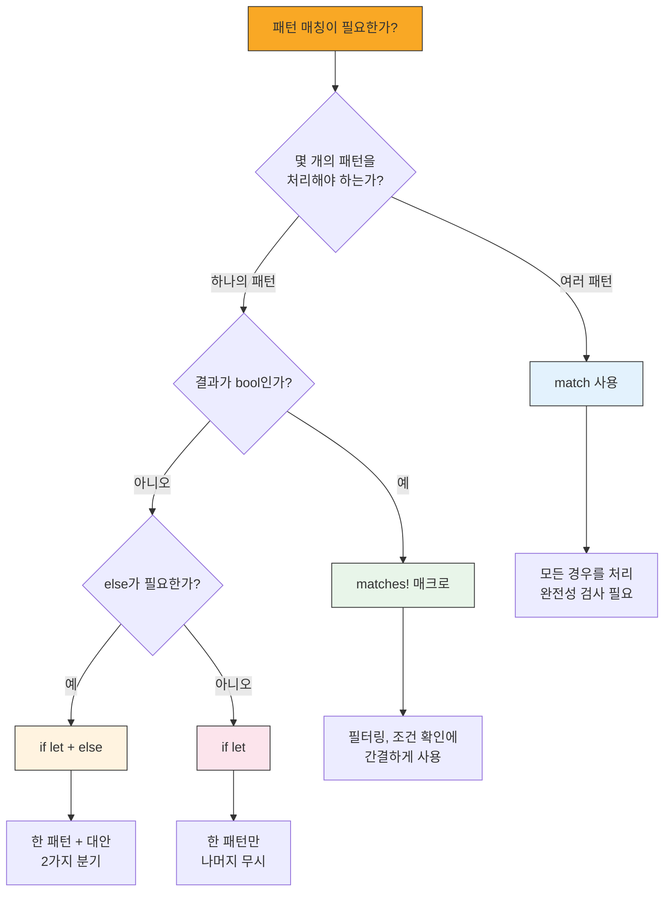

# if let과 while let <span class="badge-beginner">기초</span>

`match`는 강력하지만, 하나의 패턴만 관심이 있을 때는 코드가 장황해질 수 있습니다. `if let`과 `while let`은 이런 경우를 간결하게 처리할 수 있는 문법입니다.

## if let — match의 간결한 대안

### match vs if let 비교

```rust,editable
fn main() {
    let favorite_color: Option<&str> = Some("파란색");

    // match를 사용한 방법 - 하나의 패턴만 관심 있는데 장황합니다
    match favorite_color {
        Some(color) => println!("좋아하는 색: {}", color),
        _ => (),  // 아무것도 하지 않는 코드를 명시해야 함
    }

    // if let을 사용한 방법 - 훨씬 간결합니다!
    if let Some(color) = favorite_color {
        println!("좋아하는 색: {}", color);
    }
}
```

<div class="info-box">

**`if let` = 하나의 패턴에 대한 match의 축약형**

`if let 패턴 = 값 { ... }`은 `match 값 { 패턴 => { ... }, _ => () }`와 동일합니다. 하나의 패턴만 처리하고 나머지는 무시하고 싶을 때 사용하세요.

</div>

### if let with else

```rust,editable
fn describe_id(id: Option<u32>) {
    // if let에도 else를 사용할 수 있습니다
    if let Some(id_value) = id {
        if id_value < 100 {
            println!("VIP 사용자 (ID: {})", id_value);
        } else {
            println!("일반 사용자 (ID: {})", id_value);
        }
    } else {
        println!("비회원 사용자");
    }
}

fn main() {
    describe_id(Some(42));
    describe_id(Some(500));
    describe_id(None);
}
```

### if let 체인

여러 `if let`을 체인으로 연결할 수 있습니다.

```rust,editable
enum Discount {
    Percentage(f64),
    FixedAmount(u32),
    None,
}

fn calculate_price(base_price: f64, discount: &Discount, coupon: Option<f64>) -> f64 {
    let mut price = base_price;

    // 할인 적용
    if let Discount::Percentage(pct) = discount {
        price -= price * pct / 100.0;
        println!("  {}% 할인 적용", pct);
    } else if let Discount::FixedAmount(amount) = discount {
        price -= *amount as f64;
        println!("  {}원 할인 적용", amount);
    }

    // 쿠폰 추가 적용
    if let Some(coupon_discount) = coupon {
        price -= price * coupon_discount / 100.0;
        println!("  쿠폰 {}% 추가 할인", coupon_discount);
    }

    price.max(0.0)  // 가격이 음수가 되지 않도록
}

fn main() {
    println!("주문 1:");
    let price1 = calculate_price(50000.0, &Discount::Percentage(20.0), Some(10.0));
    println!("  최종 가격: {:.0}원\n", price1);

    println!("주문 2:");
    let price2 = calculate_price(30000.0, &Discount::FixedAmount(5000), None);
    println!("  최종 가격: {:.0}원\n", price2);

    println!("주문 3:");
    let price3 = calculate_price(10000.0, &Discount::None, Some(5.0));
    println!("  최종 가격: {:.0}원\n", price3);
}
```

### 열거형의 구조 분해와 if let

```rust,editable
#[derive(Debug)]
enum Config {
    Text(String),
    Number(i64),
    Flag(bool),
    List(Vec<String>),
}

fn print_config(name: &str, config: &Config) {
    print!("  {}: ", name);
    if let Config::Text(s) = config {
        println!("\"{}\"", s);
    } else if let Config::Number(n) = config {
        println!("{}", n);
    } else if let Config::Flag(b) = config {
        println!("{}", if *b { "활성화" } else { "비활성화" });
    } else if let Config::List(items) = config {
        println!("{:?}", items);
    }
}

fn main() {
    let settings = vec![
        ("서버 주소", Config::Text("localhost".to_string())),
        ("포트", Config::Number(8080)),
        ("디버그 모드", Config::Flag(true)),
        ("허용 도메인", Config::List(vec![
            "example.com".to_string(),
            "test.com".to_string(),
        ])),
    ];

    println!("설정 목록:");
    for (name, config) in &settings {
        print_config(name, config);
    }
}
```

## while let — 패턴 기반 반복

`while let`은 패턴이 매칭되는 동안 반복을 계속합니다.

### 스택에서 값 꺼내기

```rust,editable
fn main() {
    let mut stack = vec![1, 2, 3, 4, 5];

    // pop()은 Option<T>를 반환합니다
    // Some(value)인 동안 계속 반복합니다
    println!("스택에서 꺼내기:");
    while let Some(top) = stack.pop() {
        println!("  꺼낸 값: {}", top);
    }

    println!("스택 비었음: {:?}", stack);
}
```

### 이터레이터와 while let

```rust,editable
fn main() {
    let data = vec!["hello", "world", "rust", "programming"];
    let mut iter = data.iter();

    println!("이터레이터 순회:");
    while let Some(item) = iter.next() {
        println!("  -> {}", item.to_uppercase());
    }
}
```

### 파서 패턴

```rust,editable
#[derive(Debug)]
enum Token {
    Number(f64),
    Plus,
    Minus,
    End,
}

fn tokenize(input: &str) -> Vec<Token> {
    let mut tokens = Vec::new();
    let mut chars = input.chars().peekable();

    while let Some(&c) = chars.peek() {
        match c {
            ' ' => { chars.next(); }
            '+' => { tokens.push(Token::Plus); chars.next(); }
            '-' => { tokens.push(Token::Minus); chars.next(); }
            '0'..='9' | '.' => {
                let mut num_str = String::new();
                while let Some(&d) = chars.peek() {
                    if d.is_ascii_digit() || d == '.' {
                        num_str.push(d);
                        chars.next();
                    } else {
                        break;
                    }
                }
                if let Ok(n) = num_str.parse::<f64>() {
                    tokens.push(Token::Number(n));
                }
            }
            _ => { chars.next(); }
        }
    }
    tokens.push(Token::End);
    tokens
}

fn main() {
    let input = "3.14 + 2.86 - 1.0";
    let tokens = tokenize(input);
    println!("입력: {}", input);
    println!("토큰: {:?}", tokens);
}
```

## matches! 매크로

`matches!`는 값이 특정 패턴에 매칭되는지 `bool`로 반환합니다.

```rust,editable
#[derive(Debug)]
enum Status {
    Active,
    Inactive,
    Pending,
    Banned,
}

fn main() {
    let status = Status::Active;

    // match로 작성하면 장황합니다
    let is_active_match = match status {
        Status::Active => true,
        _ => false,
    };

    // matches! 매크로는 훨씬 간결합니다
    let is_active = matches!(status, Status::Active);
    println!("활성 상태? {}", is_active);

    // OR 패턴도 지원합니다
    let is_usable = matches!(status, Status::Active | Status::Pending);
    println!("사용 가능? {}", is_usable);

    // 가드 조건도 사용할 수 있습니다
    let values = vec![1, 5, 10, 15, 20, 25];
    let big_even: Vec<_> = values.iter()
        .filter(|&&x| matches!(x, n if n > 10 && n % 2 == 0))
        .collect();
    println!("10 초과 짝수: {:?}", big_even);

    // 문자 분류에 유용합니다
    let text = "Hello, 세계! 123";
    let ascii_letters: String = text.chars()
        .filter(|c| matches!(c, 'a'..='z' | 'A'..='Z'))
        .collect();
    println!("ASCII 글자만: {}", ascii_letters);
}
```

<div class="tip-box">

**`matches!` 활용**: `matches!`는 특히 `filter`, `any`, `all` 같은 이터레이터 메서드의 클로저 안에서 패턴 매칭이 필요할 때 매우 유용합니다.

</div>

## match vs if let vs matches! — 언제 무엇을 사용할까?



### 비교 예제

```rust,editable
enum Shape {
    Circle(f64),
    Rectangle(f64, f64),
    Triangle(f64, f64, f64),
}

fn main() {
    let shapes = vec![
        Shape::Circle(5.0),
        Shape::Rectangle(4.0, 6.0),
        Shape::Triangle(3.0, 4.0, 5.0),
        Shape::Circle(10.0),
    ];

    // 1. match: 모든 경우를 처리해야 할 때
    for shape in &shapes {
        let area = match shape {
            Shape::Circle(r) => std::f64::consts::PI * r * r,
            Shape::Rectangle(w, h) => w * h,
            Shape::Triangle(a, b, c) => {
                let s = (a + b + c) / 2.0;
                (s * (s - a) * (s - b) * (s - c)).sqrt()
            }
        };
        println!("면적: {:.2}", area);
    }

    println!();

    // 2. if let: 하나의 패턴만 관심 있을 때
    for shape in &shapes {
        if let Shape::Circle(r) = shape {
            println!("원 발견! 반지름: {}", r);
        }
    }

    println!();

    // 3. matches!: bool 결과만 필요할 때
    let circle_count = shapes.iter()
        .filter(|s| matches!(s, Shape::Circle(_)))
        .count();
    println!("원의 개수: {}", circle_count);

    let has_large_circle = shapes.iter()
        .any(|s| matches!(s, Shape::Circle(r) if *r > 7.0));
    println!("큰 원이 있는가? {}", has_large_circle);
}
```

---

<div class="exercise-box">

**연습문제 1: 설정값 추출기** <span class="badge-beginner">기초</span>

`if let`을 사용하여 설정값을 추출하고 처리하는 함수를 완성하세요.

```rust,editable
#[derive(Debug)]
enum Setting {
    Volume(u32),
    Brightness(u32),
    Language(String),
    DarkMode(bool),
}

fn apply_setting(setting: &Setting) {
    // TODO: if let을 사용하여 각 설정을 적용하세요
    // Volume: 0~100 범위인지 확인하고 적용
    // Brightness: 적용
    // Language: 적용
    // DarkMode: 적용
    // 힌트: if let과 else if let 체인을 사용하세요
    todo!()
}

fn main() {
    let settings = vec![
        Setting::Volume(75),
        Setting::Brightness(50),
        Setting::Language("한국어".to_string()),
        Setting::DarkMode(true),
        Setting::Volume(150),  // 범위 초과!
    ];

    for s in &settings {
        apply_setting(s);
    }
}
```

</div>

<div class="exercise-box">

**연습문제 2: 큐 처리기** <span class="badge-beginner">기초</span>

`while let`을 사용하여 작업 큐를 처리하는 프로그램을 완성하세요.

```rust,editable
#[derive(Debug)]
enum Task {
    Print(String),
    Add(i32, i32),
    Greet(String),
}

fn process_queue(mut queue: Vec<Task>) {
    println!("=== 작업 처리 시작 ===");
    // TODO: while let과 pop()을 사용하여 큐의 모든 작업을 처리하세요
    // 힌트: pop()은 마지막 요소부터 꺼냅니다.
    //        처음부터 처리하려면 reverse()를 먼저 호출하세요.
    todo!()
}

fn main() {
    let queue = vec![
        Task::Greet("Rustacean".to_string()),
        Task::Add(10, 20),
        Task::Print("Hello, Rust!".to_string()),
        Task::Add(100, 200),
    ];

    process_queue(queue);
}
```

</div>

---

<div class="quiz-box" onclick="this.classList.toggle('show-answer')">

**퀴즈 1**: 다음 코드의 출력 결과는?

```rust,ignore
let x: Option<i32> = None;
if let Some(n) = x {
    println!("값: {}", n);
} else {
    println!("비어 있음");
}
```

<div class="quiz-answer">

**출력: `비어 있음`**

`x`가 `None`이므로 `Some(n)` 패턴에 매칭되지 않아 `else` 블록이 실행됩니다.

</div>
</div>

<div class="quiz-box" onclick="this.classList.toggle('show-answer')">

**퀴즈 2**: `matches!` 매크로와 동일한 기능을 `match`로 작성하면?

```rust,ignore
let is_positive = matches!(value, n if n > 0);
```

<div class="quiz-answer">

```rust,ignore
let is_positive = match value {
    n if n > 0 => true,
    _ => false,
};
```

`matches!`는 패턴에 매칭되면 `true`, 아니면 `false`를 반환하는 `match`의 축약형입니다.

</div>
</div>

<div class="quiz-box" onclick="this.classList.toggle('show-answer')">

**퀴즈 3**: `if let`과 `match`를 각각 사용해야 하는 상황은?

<div class="quiz-answer">

**`if let`을 사용하는 경우:**
- 하나의 패턴만 관심이 있고 나머지는 무시할 때
- 코드를 간결하게 유지하고 싶을 때
- `else` 분기가 하나 이하일 때

**`match`를 사용하는 경우:**
- 모든 가능한 경우를 명시적으로 처리해야 할 때
- 3개 이상의 패턴을 처리해야 할 때
- 컴파일러의 완전성 검사가 필요할 때
- 각 변형에 대해 서로 다른 로직을 수행해야 할 때

일반적으로, **안전성이 중요하면 `match`**, **간결함이 중요하면 `if let`**을 선택합니다.

</div>
</div>

---

<div class="summary-box">

**정리**

- **`if let`**: 하나의 패턴만 매칭할 때 `match`의 간결한 대안
- **`if let` + `else`**: 매칭/불일치 두 가지 경우를 처리
- **`while let`**: 패턴이 매칭되는 동안 반복 실행 (스택, 이터레이터 처리에 유용)
- **`matches!` 매크로**: 패턴 매칭 결과를 `bool`로 반환 (필터링에 특히 유용)
- **사용 기준**:
  - 여러 패턴 처리 → `match`
  - 하나의 패턴만 → `if let`
  - bool 결과만 필요 → `matches!`

</div>
