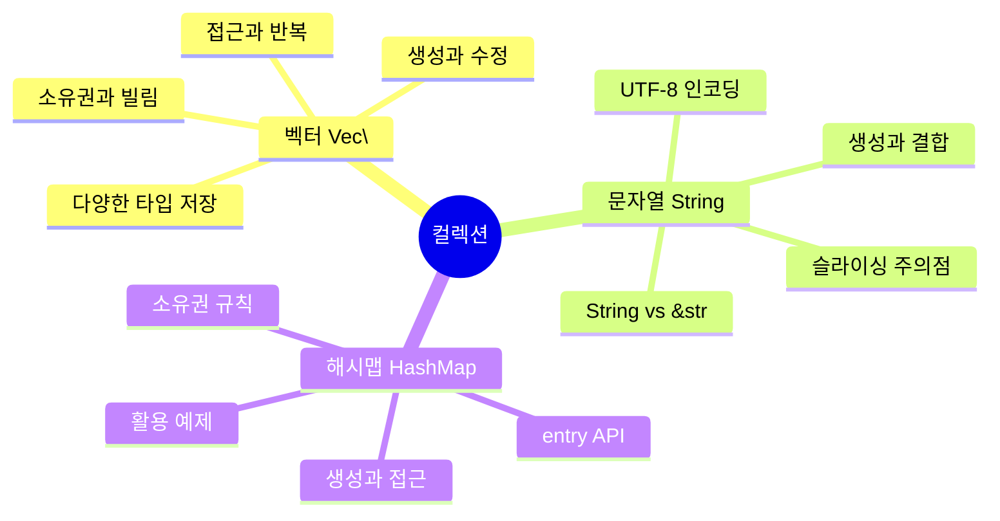
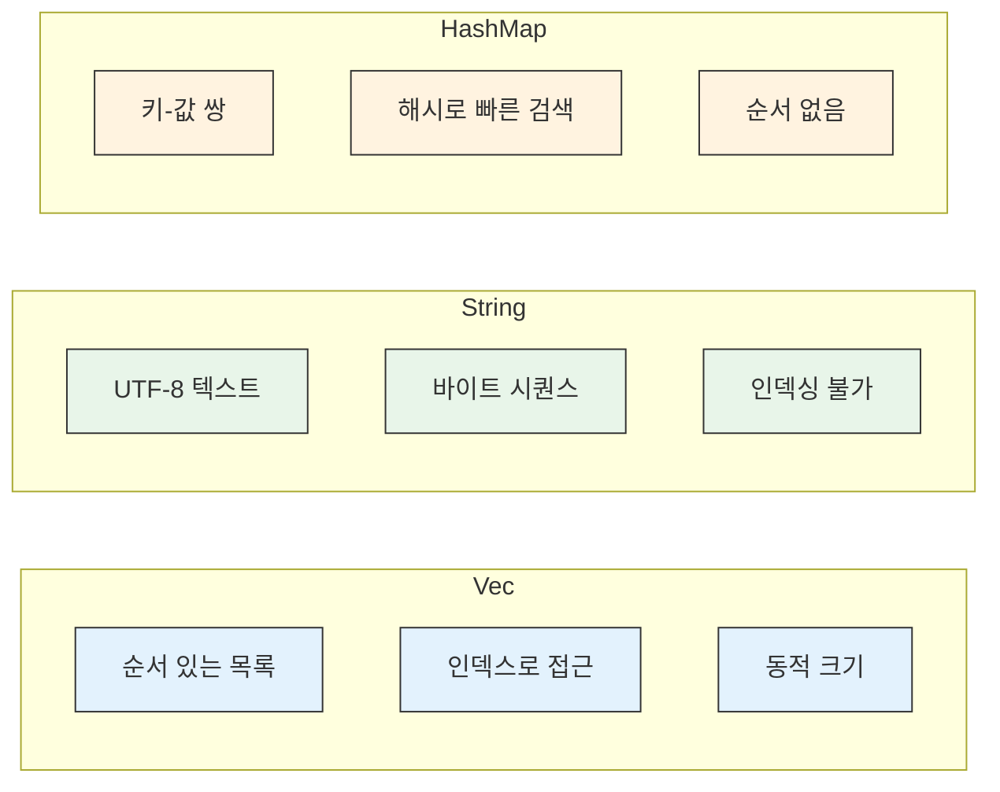

# 컬렉션 기초

Rust의 표준 라이브러리에는 여러 데이터를 저장하는 **컬렉션** 타입이 있습니다. 배열이나 튜플과 달리, 컬렉션의 데이터는 **힙에 저장**되므로 컴파일 타임에 크기를 알 필요가 없고 프로그램 실행 중에 크기가 변할 수 있습니다.

## 이 장에서 배울 내용

## 학습 로드맵

| 순서 | 주제 | 핵심 개념 | 난이도 |
|------|------|-----------|--------|
| 6.1 | [벡터](./ch06-01-vectors.md) | `Vec<T>`, `vec![]`, 인덱싱, 반복 | ⭐⭐ |
| 6.2 | [문자열](./ch06-02-strings.md) | `String`, `&str`, UTF-8, 슬라이싱 | ⭐⭐⭐ |
| 6.3 | [해시맵](./ch06-03-hashmaps.md) | `HashMap`, `entry`, 소유권 | ⭐⭐ |

**왜 컬렉션이 중요한가요?**

실제 프로그래밍에서 데이터는 대부분 여러 개입니다:

- **사용자 목록** → 벡터(`Vec<T>`)
- **텍스트 처리** → 문자열(`String`)
- **설정값, 캐시** → 해시맵(`HashMap<K, V>`)

이 세 가지 컬렉션은 Rust에서 가장 자주 사용되며, 소유권 시스템과 밀접하게 연관되어 있어 Rust의 핵심 개념을 실전에서 적용하는 좋은 연습이 됩니다.

## 컬렉션 비교

**학습 팁**: 컬렉션을 사용할 때 소유권과 빌림 규칙이 어떻게 적용되는지 주의 깊게 살펴보세요. 특히 벡터에서 요소를 빌린 상태에서 벡터를 수정하려 할 때 발생하는 문제는 Rust 초보자가 가장 많이 만나는 컴파일 에러 중 하나입니다.

