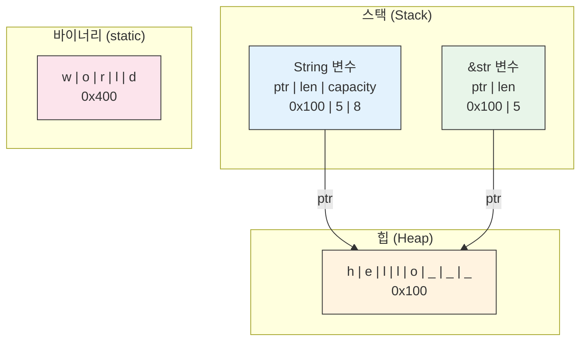
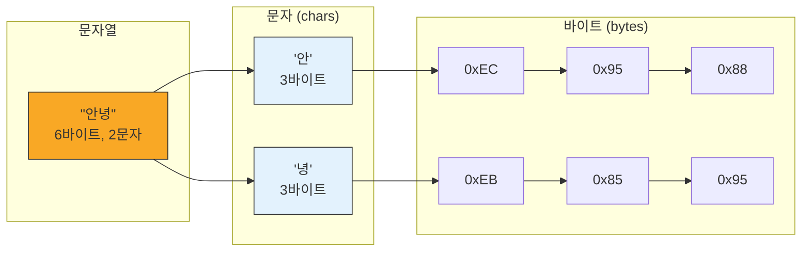

# 문자열 <span class="badge-beginner">기초</span>

Rust의 문자열은 다른 언어보다 복잡합니다. UTF-8 인코딩, 소유권, 그리고 여러 문자열 타입이 존재하기 때문입니다. 하지만 이러한 복잡함 덕분에 **문자열 관련 버그를 컴파일 타임에 방지**할 수 있습니다.

## String vs &str

Rust에는 두 가지 주요 문자열 타입이 있습니다:

| 특성 | `String` | `&str` |
|------|----------|--------|
| 소유권 | 데이터를 **소유** | 데이터를 **빌림** |
| 저장 위치 | 힙(heap) | 어디든 가능 |
| 크기 변경 | 가능 (가변) | 불가 (불변) |
| 사용 사례 | 문자열을 만들고 수정할 때 | 문자열을 읽기만 할 때 |



```rust,editable
fn main() {
    // String: 소유된 문자열 (힙에 저장)
    let mut owned = String::from("안녕하세요");
    owned.push_str(", Rust!");
    println!("String: {}", owned);

    // &str: 문자열 슬라이스 (빌림)
    let borrowed: &str = "문자열 리터럴";  // 바이너리에 저장
    println!("&str: {}", borrowed);

    // String에서 &str로 변환 (역참조 강제변환)
    let s = String::from("hello");
    let slice: &str = &s;  // 자동 변환
    println!("슬라이스: {}", slice);

    // &str에서 String으로 변환
    let s1 = "hello".to_string();
    let s2 = String::from("hello");
    let s3 = "hello".to_owned();
    println!("{}, {}, {}", s1, s2, s3);
}
```

<div class="tip-box">

**함수 매개변수에는 `&str`을 사용하세요**: 함수가 문자열을 읽기만 한다면 `&str`을 매개변수로 사용하세요. `String`과 `&str` 모두 전달할 수 있어 더 유연합니다.

```rust,ignore
fn greet(name: &str) {  // String과 &str 모두 받을 수 있음
    println!("안녕, {}!", name);
}
```

</div>

## 문자열 생성

```rust,editable
fn main() {
    // 다양한 방법으로 String 생성
    let s1 = String::new();                        // 빈 문자열
    let s2 = String::from("직접 생성");              // from
    let s3 = "to_string으로".to_string();            // to_string
    let s4 = "to_owned로".to_owned();                // to_owned
    let s5 = format!("{} {}", "format!", "매크로");   // format!

    println!("s1 (빈 문자열): '{}'", s1);
    println!("s2: {}", s2);
    println!("s3: {}", s3);
    println!("s4: {}", s4);
    println!("s5: {}", s5);

    // 반복으로 생성
    let repeated = "Ha".repeat(3);
    println!("반복: {}", repeated);  // HaHaHa

    // 문자 벡터에서 생성
    let chars = vec!['R', 'u', 's', 't'];
    let from_chars: String = chars.into_iter().collect();
    println!("문자에서: {}", from_chars);
}
```

## 문자열 결합 (Concatenation)

```rust,editable
fn main() {
    // 1. push_str: 문자열 슬라이스 추가
    let mut s = String::from("Hello");
    s.push_str(", ");
    s.push_str("World");
    println!("push_str: {}", s);

    // 2. push: 단일 문자 추가
    let mut s = String::from("abc");
    s.push('d');
    s.push('e');
    println!("push: {}", s);

    // 3. + 연산자 (첫 번째는 String, 나머지는 &str)
    let hello = String::from("Hello, ");
    let world = String::from("World!");
    let greeting = hello + &world;  // hello는 소유권 이동!
    // println!("{}", hello);  // 에러! hello의 소유권이 이동함
    println!("+ 연산: {}", greeting);

    // 4. format! 매크로 (소유권을 이동시키지 않음 - 가장 추천!)
    let first = String::from("Rust");
    let second = String::from("Programming");
    let third = String::from("Language");
    let combined = format!("{} {} {}", first, second, third);
    println!("format!: {}", combined);
    // first, second, third 모두 여전히 사용 가능!
    println!("원본 유지: {}, {}, {}", first, second, third);
}
```

<div class="warning-box">

**`+` 연산자 주의사항**: `+` 연산자는 왼쪽 `String`의 소유권을 가져갑니다. 여러 문자열을 결합할 때는 `format!` 매크로가 더 읽기 쉽고 소유권 문제도 없습니다.

</div>

## UTF-8과 문자 처리

Rust의 `String`과 `&str`은 항상 **유효한 UTF-8**입니다. 이것이 문자열 인덱싱이 단순하지 않은 이유입니다.



```rust,editable
fn main() {
    let korean = "안녕하세요";
    let english = "Hello";
    let emoji = "Hello 🌍!";

    // 바이트 수 vs 문자 수
    println!("'{}': {} 바이트, {} 문자", korean, korean.len(), korean.chars().count());
    println!("'{}': {} 바이트, {} 문자", english, english.len(), english.chars().count());
    println!("'{}': {} 바이트, {} 문자", emoji, emoji.len(), emoji.chars().count());

    // chars(): 유니코드 스칼라 값으로 반복
    println!("\n문자 단위 반복:");
    for (i, c) in korean.chars().enumerate() {
        println!("  [{}] '{}' ({} 바이트)", i, c, c.len_utf8());
    }

    // bytes(): 바이트 단위로 반복
    println!("\n바이트 단위 반복:");
    for (i, b) in korean.bytes().enumerate() {
        print!("  [{:02}] 0x{:02X}", i, b);
        if (i + 1) % 3 == 0 { println!(); }
    }
    println!();

    // char_indices(): 바이트 인덱스와 문자
    println!("\n문자 + 바이트 인덱스:");
    for (byte_idx, c) in korean.char_indices() {
        println!("  바이트 {} -> '{}'", byte_idx, c);
    }
}
```

<div class="info-box">

**왜 `s[0]`으로 문자에 접근할 수 없나요?**

`"안녕"[0]`이 `'안'`을 반환할 것 같지만, UTF-8에서 `'안'`은 3바이트입니다. 인덱스 `0`이 바이트를 의미하는지, 문자를 의미하는지 모호하고, 바이트 단위 접근은 유효하지 않은 유니코드가 될 수 있습니다. Rust는 이런 모호함을 허용하지 않습니다.

</div>

## 문자열 슬라이싱

```rust,editable
fn main() {
    let s = "Hello, 세계!";

    // 바이트 범위로 슬라이싱 (UTF-8 경계에 맞아야 함!)
    let hello = &s[0..5];  // "Hello" (ASCII는 1바이트씩)
    println!("영문 슬라이스: '{}'", hello);

    // 한글은 3바이트씩이므로 주의!
    let world = &s[7..13];  // "세계" (각 3바이트)
    println!("한글 슬라이스: '{}'", world);

    // 안전한 문자 단위 슬라이싱
    fn safe_substring(s: &str, start: usize, end: usize) -> &str {
        let mut indices: Vec<usize> = s.char_indices().map(|(i, _)| i).collect();
        indices.push(s.len());

        let byte_start = indices.get(start).copied().unwrap_or(s.len());
        let byte_end = indices.get(end).copied().unwrap_or(s.len());
        &s[byte_start..byte_end]
    }

    println!("\n안전한 슬라이싱:");
    println!("  [0..5]: '{}'", safe_substring(s, 0, 5));
    println!("  [7..9]: '{}'", safe_substring(s, 7, 9));
    println!("  [0..1]: '{}'", safe_substring(s, 0, 1));
}
```

<div class="warning-box">

**주의**: 문자열을 바이트 범위로 슬라이싱할 때, **UTF-8 문자 경계에 맞지 않으면 패닉**이 발생합니다! 예를 들어 `"안녕"[0..1]`은 `'안'`의 첫 번째 바이트만 자르게 되어 패닉됩니다. 한글이나 이모지가 포함된 문자열은 `char_indices()`를 활용하세요.

</div>

## 유용한 문자열 메서드들

```rust,editable
fn main() {
    let s = "  Hello, Rust World!  ";

    // 공백 처리
    println!("trim: '{}'", s.trim());
    println!("trim_start: '{}'", s.trim_start());
    println!("trim_end: '{}'", s.trim_end());

    let s = "Hello, Rust World!";

    // 검색
    println!("\ncontains 'Rust': {}", s.contains("Rust"));
    println!("starts_with 'Hello': {}", s.starts_with("Hello"));
    println!("ends_with '!': {}", s.ends_with('!'));
    println!("find 'Rust': {:?}", s.find("Rust"));

    // 변환
    println!("\nto_uppercase: {}", s.to_uppercase());
    println!("to_lowercase: {}", s.to_lowercase());

    // 교체
    println!("replace: {}", s.replace("World", "세계"));
    println!("replacen(1): {}", "aabaa".replacen('a', "x", 2));

    // 분리
    let csv = "사과,바나나,체리,딸기";
    let fruits: Vec<&str> = csv.split(',').collect();
    println!("\nsplit: {:?}", fruits);

    let sentence = "  단어  사이에   공백이  많음  ";
    let words: Vec<&str> = sentence.split_whitespace().collect();
    println!("split_whitespace: {:?}", words);

    // 결합
    let joined = fruits.join(" | ");
    println!("join: {}", joined);

    // 반복
    println!("repeat: {}", "abc".repeat(3));
}
```

## 실용적인 문자열 처리 예제

```rust,editable
fn is_palindrome(s: &str) -> bool {
    let cleaned: String = s.chars()
        .filter(|c| c.is_alphanumeric())
        .map(|c| c.to_lowercase().next().unwrap())
        .collect();

    let reversed: String = cleaned.chars().rev().collect();
    cleaned == reversed
}

fn count_words(text: &str) -> Vec<(&str, usize)> {
    let mut word_counts: Vec<(&str, usize)> = Vec::new();
    for word in text.split_whitespace() {
        if let Some(entry) = word_counts.iter_mut().find(|(w, _)| *w == word) {
            entry.1 += 1;
        } else {
            word_counts.push((word, 1));
        }
    }
    word_counts.sort_by(|a, b| b.1.cmp(&a.1));
    word_counts
}

fn title_case(s: &str) -> String {
    s.split_whitespace()
        .map(|word| {
            let mut chars = word.chars();
            match chars.next() {
                None => String::new(),
                Some(first) => {
                    let upper: String = first.to_uppercase().collect();
                    let rest: String = chars.collect();
                    format!("{}{}", upper, rest)
                }
            }
        })
        .collect::<Vec<_>>()
        .join(" ")
}

fn main() {
    // 회문 검사
    println!("=== 회문 검사 ===");
    let tests = vec!["racecar", "hello", "A man a plan a canal Panama", "토마토"];
    for t in tests {
        println!("  '{}': {}", t, if is_palindrome(t) { "회문!" } else { "회문 아님" });
    }

    // 단어 빈도
    println!("\n=== 단어 빈도 ===");
    let text = "the quick brown fox jumps over the lazy dog the fox";
    for (word, count) in count_words(text) {
        println!("  '{}': {}회", word, count);
    }

    // 제목 형식
    println!("\n=== 제목 형식 ===");
    println!("  {}", title_case("hello world from rust"));
}
```

---

<div class="exercise-box">

**연습문제 1: 문자열 압축** <span class="badge-beginner">기초</span>

연속된 같은 문자를 압축하는 함수를 구현하세요. 예: "aaabbbcc" -> "a3b3c2"

```rust,editable
fn compress(s: &str) -> String {
    // TODO: 연속된 같은 문자를 묶어서 압축하세요
    // 한 번만 나타나는 문자는 숫자 없이 표시
    // 예: "aabccc" -> "a2bc3"
    // 힌트: chars()로 반복하며 이전 문자와 비교하세요
    todo!()
}

fn main() {
    let tests = vec![
        "aaabbbcc",
        "aabccc",
        "abcde",
        "aaaaaa",
        "",
    ];

    for t in tests {
        println!("'{}' -> '{}'", t, compress(t));
    }
}
```

</div>

<div class="exercise-box">

**연습문제 2: 간단한 마크다운 변환기** <span class="badge-beginner">기초</span>

간단한 마크다운 텍스트를 HTML로 변환하는 함수를 구현하세요.

```rust,editable
fn markdown_to_html(markdown: &str) -> String {
    // TODO: 간단한 마크다운 -> HTML 변환
    // - "# 제목" -> "<h1>제목</h1>"
    // - "## 부제" -> "<h2>부제</h2>"
    // - "**굵게**" -> "<strong>굵게</strong>"
    // - 일반 텍스트 -> "<p>텍스트</p>"
    // 힌트: 각 줄을 처리하세요. starts_with와 replace를 활용하세요.
    let mut result = Vec::new();

    for line in markdown.lines() {
        let trimmed = line.trim();
        if trimmed.is_empty() {
            continue;
        }
        // TODO: 변환 로직 구현
        todo!()
    }

    result.join("\n")
}

fn main() {
    let markdown = "# 제목
## 부제목
이것은 **일반** 텍스트입니다.
**전체가 굵은** 줄";

    println!("=== 마크다운 ===");
    println!("{}", markdown);
    println!("\n=== HTML ===");
    println!("{}", markdown_to_html(markdown));
}
```

</div>

---

<div class="summary-box">

**정리**

- **`String`**: 소유된, 힙에 저장된 가변 UTF-8 문자열
- **`&str`**: 빌린, 불변 UTF-8 문자열 슬라이스 (함수 매개변수에 권장)
- **생성**: `String::from()`, `.to_string()`, `format!()`, `.to_owned()`
- **결합**: `push_str`, `push`, `+` 연산자, `format!` (가장 추천)
- **UTF-8**: 문자마다 바이트 수가 다름 (ASCII: 1, 한글: 3, 이모지: 4)
- **반복**: `chars()` (문자 단위), `bytes()` (바이트 단위), `char_indices()` (인덱스 + 문자)
- **슬라이싱 주의**: 바이트 범위가 UTF-8 문자 경계에 맞아야 하며, 아니면 패닉 발생
- **유용한 메서드**: `trim`, `split`, `contains`, `replace`, `to_uppercase` 등

</div>
