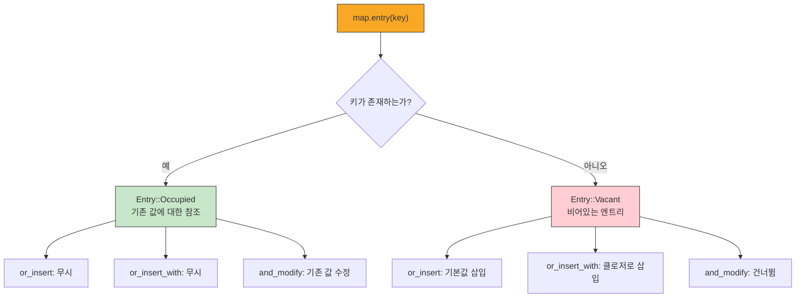

# 해시맵 <span class="badge-beginner">기초</span>

`HashMap<K, V>`는 **키-값(key-value) 쌍**으로 데이터를 저장하는 컬렉션입니다. 키를 해시하여 값에 빠르게 접근할 수 있으며, 설정, 캐시, 빈도 계산 등 다양한 용도로 사용됩니다.

## HashMap 생성과 기본 사용

```rust,editable
use std::collections::HashMap;

fn main() {
    // 방법 1: new()로 생성 후 insert
    let mut scores = HashMap::new();
    scores.insert("Alice", 95);
    scores.insert("Bob", 82);
    scores.insert("Charlie", 78);
    println!("점수: {:?}", scores);

    // 방법 2: from 배열로 생성
    let colors = HashMap::from([
        ("빨강", "#FF0000"),
        ("초록", "#00FF00"),
        ("파랑", "#0000FF"),
    ]);
    println!("색상: {:?}", colors);

    // 방법 3: 이터레이터에서 collect
    let keys = vec!["사과", "바나나", "체리"];
    let values = vec![3000, 2000, 5000];
    let prices: HashMap<_, _> = keys.into_iter().zip(values.into_iter()).collect();
    println!("가격: {:?}", prices);
}
```

<div class="info-box">

**`use std::collections::HashMap;`**: HashMap은 프렐루드(prelude)에 포함되어 있지 않으므로 반드시 `use`로 가져와야 합니다. `Vec`과 `String`은 프렐루드에 포함되어 있어 별도의 `use`가 필요 없습니다.

</div>

## 값 삽입과 접근

```rust,editable
use std::collections::HashMap;

fn main() {
    let mut inventory = HashMap::new();

    // 삽입
    inventory.insert("연필", 100);
    inventory.insert("지우개", 50);
    inventory.insert("노트", 30);

    // 접근 방법 1: get() - Option<&V> 반환 (안전)
    match inventory.get("연필") {
        Some(count) => println!("연필: {}개", count),
        None => println!("연필이 없습니다"),
    }

    // 접근 방법 2: [] 인덱싱 (키가 없으면 패닉!)
    let pencils = inventory["연필"];
    println!("연필 (인덱싱): {}개", pencils);

    // get_or 패턴
    let erasers = inventory.get("지우개").copied().unwrap_or(0);
    let pens = inventory.get("볼펜").copied().unwrap_or(0);
    println!("지우개: {}개, 볼펜: {}개", erasers, pens);

    // 키 존재 여부 확인
    println!("'노트' 있나? {}", inventory.contains_key("노트"));
    println!("'가위' 있나? {}", inventory.contains_key("가위"));

    // 크기와 비어있는지 확인
    println!("종류: {}개", inventory.len());
    println!("비어있나? {}", inventory.is_empty());
}
```

## 값 수정과 업데이트

```rust,editable
use std::collections::HashMap;

fn main() {
    let mut scores = HashMap::new();
    scores.insert("Alice", 90);
    println!("초기: {:?}", scores);

    // 1. insert로 덮어쓰기 (기존 값이 있으면 교체)
    scores.insert("Alice", 95);
    println!("덮어쓰기 후: {:?}", scores);

    // 2. 값이 없을 때만 삽입
    scores.entry("Alice").or_insert(100);  // 이미 있으므로 무시
    scores.entry("Bob").or_insert(80);      // 없으므로 삽입
    println!("or_insert 후: {:?}", scores);

    // 3. 기존 값을 기반으로 수정
    let mut counter = HashMap::new();
    let words = vec!["hello", "world", "hello", "rust", "hello", "world"];

    for word in &words {
        let count = counter.entry(word).or_insert(0);
        *count += 1;
    }
    println!("\n단어 빈도: {:?}", counter);

    // 4. remove로 제거
    if let Some(removed) = scores.remove("Bob") {
        println!("\nBob 제거됨 (점수: {})", removed);
    }
    println!("제거 후: {:?}", scores);
}
```

## entry API 심화

`entry` API는 HashMap의 가장 강력한 기능 중 하나입니다.



```rust,editable
use std::collections::HashMap;

fn main() {
    // or_insert: 값이 없을 때 기본값 삽입
    let mut config = HashMap::new();
    config.entry("timeout").or_insert(30);
    config.entry("max_retries").or_insert(3);
    config.entry("timeout").or_insert(60);  // 이미 있으므로 무시
    println!("설정: {:?}", config);

    // or_insert_with: 클로저로 기본값 생성 (비용이 큰 계산에 유용)
    let mut cache: HashMap<&str, Vec<i32>> = HashMap::new();
    let data = cache.entry("numbers").or_insert_with(|| {
        println!("  (비용이 큰 계산 실행...)");
        vec![1, 2, 3, 4, 5]
    });
    println!("첫 번째 접근: {:?}", data);

    let data = cache.entry("numbers").or_insert_with(|| {
        println!("  (이건 실행되지 않음)");
        vec![]
    });
    println!("두 번째 접근: {:?}", data);

    // and_modify + or_insert: 있으면 수정, 없으면 삽입
    let mut word_freq = HashMap::new();
    let text = "apple banana apple cherry banana apple";

    for word in text.split_whitespace() {
        word_freq.entry(word)
            .and_modify(|count| *count += 1)
            .or_insert(1);
    }

    // 빈도 순으로 정렬하여 출력
    let mut sorted: Vec<_> = word_freq.iter().collect();
    sorted.sort_by(|a, b| b.1.cmp(a.1));
    println!("\n단어 빈도 (정렬):");
    for (word, count) in sorted {
        println!("  {}: {}회", word, count);
    }
}
```

## 소유권 규칙

```rust,editable
use std::collections::HashMap;

fn main() {
    // Copy 타입 (i32 등)은 복사됩니다
    let key = 42;
    let value = 100;
    let mut map1 = HashMap::new();
    map1.insert(key, value);
    println!("key 사용 가능: {}", key);     // OK - i32는 Copy
    println!("value 사용 가능: {}", value);  // OK - i32는 Copy

    // 소유 타입 (String 등)은 소유권이 이동합니다
    let name = String::from("Alice");
    let score = String::from("95점");
    let mut map2 = HashMap::new();
    map2.insert(name, score);
    // println!("{}", name);  // 에러! 소유권이 이동됨
    // println!("{}", score); // 에러! 소유권이 이동됨

    // 참조를 저장하면 소유권이 이동하지 않습니다
    // (단, 참조의 수명이 HashMap보다 길어야 합니다)
    let city = String::from("서울");
    let country = String::from("한국");
    let mut map3 = HashMap::new();
    map3.insert(&city, &country);   // 참조를 저장
    println!("원본 사용 가능: {} in {}", city, country);
    println!("맵: {:?}", map3);
}
```

<div class="warning-box">

**소유권 주의**: `String`을 HashMap의 키나 값으로 삽입하면 소유권이 이동합니다. 원본을 계속 사용하려면 `clone()`을 사용하거나 참조(`&str`)를 사용하세요. 참조를 사용할 경우 라이프타임에 주의해야 합니다.

</div>

## HashMap 반복

```rust,editable
use std::collections::HashMap;

fn main() {
    let mut student_grades = HashMap::new();
    student_grades.insert("김철수", vec![85, 92, 78]);
    student_grades.insert("이영희", vec![95, 88, 91]);
    student_grades.insert("박민수", vec![72, 65, 80]);

    // 키-값 쌍으로 반복
    println!("=== 성적표 ===");
    for (name, grades) in &student_grades {
        let avg: f64 = grades.iter().sum::<i32>() as f64 / grades.len() as f64;
        println!("  {}: {:?} (평균: {:.1})", name, grades, avg);
    }

    // 키만 반복
    println!("\n학생 목록:");
    for name in student_grades.keys() {
        println!("  - {}", name);
    }

    // 값만 반복
    println!("\n모든 성적:");
    for grades in student_grades.values() {
        println!("  {:?}", grades);
    }

    // 가변 참조로 반복하며 수정
    for grades in student_grades.values_mut() {
        // 5점 보너스 추가
        for grade in grades.iter_mut() {
            *grade = (*grade + 5).min(100);
        }
    }

    println!("\n=== 보너스 적용 후 ===");
    for (name, grades) in &student_grades {
        println!("  {}: {:?}", name, grades);
    }
}
```

## 단어 세기 예제 (Word Count)

가장 대표적인 HashMap 활용 예제입니다.

```rust,editable
use std::collections::HashMap;

fn word_count(text: &str) -> HashMap<String, usize> {
    let mut counts = HashMap::new();

    for word in text.split_whitespace() {
        // 구두점 제거하고 소문자로 변환
        let cleaned: String = word.chars()
            .filter(|c| c.is_alphanumeric() || *c >= '\u{AC00}')  // 한글 포함
            .collect::<String>()
            .to_lowercase();

        if !cleaned.is_empty() {
            *counts.entry(cleaned).or_insert(0) += 1;
        }
    }

    counts
}

fn print_histogram(counts: &HashMap<String, usize>) {
    let mut sorted: Vec<_> = counts.iter().collect();
    sorted.sort_by(|a, b| b.1.cmp(a.1));

    let max_count = sorted.first().map(|(_, c)| **c).unwrap_or(1);

    for (word, count) in sorted.iter().take(10) {
        let bar_width = (**count as f64 / max_count as f64 * 30.0) as usize;
        let bar: String = "#".repeat(bar_width);
        println!("  {:>10} | {:30} ({})", word, bar, count);
    }
}

fn main() {
    let text = "the quick brown fox jumps over the lazy dog \
                the fox the dog the quick fox quick quick";

    println!("텍스트: {}\n", text);

    let counts = word_count(text);

    println!("=== 단어 빈도 히스토그램 ===");
    print_histogram(&counts);

    println!("\n총 고유 단어 수: {}", counts.len());
    println!("총 단어 수: {}", counts.values().sum::<usize>());
}
```

## 실용적인 HashMap 활용

### 두 HashMap 병합

```rust,editable
use std::collections::HashMap;

fn merge_maps(base: &HashMap<&str, i32>, overrides: &HashMap<&str, i32>) -> HashMap<&str, i32> {
    let mut result = base.clone();
    for (&key, &value) in overrides {
        result.insert(key, value);
    }
    result
}

fn main() {
    let defaults = HashMap::from([
        ("timeout", 30),
        ("max_retries", 3),
        ("port", 8080),
    ]);

    let custom = HashMap::from([
        ("timeout", 60),
        ("port", 3000),
    ]);

    let config = merge_maps(&defaults, &custom);
    println!("기본: {:?}", defaults);
    println!("커스텀: {:?}", custom);
    println!("병합: {:?}", config);
}
```

### 그룹화

```rust,editable
use std::collections::HashMap;

#[derive(Debug)]
struct Student {
    name: String,
    grade: u32,
    score: u32,
}

fn group_by_grade(students: &[Student]) -> HashMap<u32, Vec<&Student>> {
    let mut groups: HashMap<u32, Vec<&Student>> = HashMap::new();
    for student in students {
        groups.entry(student.grade).or_insert_with(Vec::new).push(student);
    }
    groups
}

fn main() {
    let students = vec![
        Student { name: "김철수".to_string(), grade: 1, score: 85 },
        Student { name: "이영희".to_string(), grade: 2, score: 92 },
        Student { name: "박민수".to_string(), grade: 1, score: 78 },
        Student { name: "정지원".to_string(), grade: 2, score: 88 },
        Student { name: "최서현".to_string(), grade: 3, score: 95 },
        Student { name: "한동현".to_string(), grade: 1, score: 91 },
    ];

    let groups = group_by_grade(&students);

    let mut grades: Vec<_> = groups.keys().collect();
    grades.sort();

    for grade in grades {
        let group = &groups[grade];
        let avg: f64 = group.iter().map(|s| s.score as f64).sum::<f64>() / group.len() as f64;
        println!("{}학년 (평균: {:.1}점):", grade, avg);
        for s in group {
            println!("  - {} ({}점)", s.name, s.score);
        }
    }
}
```

### 캐시 패턴 (Memoization)

```rust,editable
use std::collections::HashMap;

fn fibonacci_with_cache(n: u64, cache: &mut HashMap<u64, u64>) -> u64 {
    if n <= 1 {
        return n;
    }

    if let Some(&result) = cache.get(&n) {
        return result;
    }

    let result = fibonacci_with_cache(n - 1, cache) + fibonacci_with_cache(n - 2, cache);
    cache.insert(n, result);
    result
}

fn main() {
    let mut cache = HashMap::new();

    println!("=== 피보나치 수열 (캐시 사용) ===");
    for i in 0..=20 {
        let result = fibonacci_with_cache(i, &mut cache);
        println!("  fib({:>2}) = {}", i, result);
    }

    println!("\n캐시 크기: {} 항목", cache.len());
}
```

---

<div class="exercise-box">

**연습문제 1: 연락처 관리** <span class="badge-beginner">기초</span>

HashMap을 사용하여 간단한 연락처 관리 프로그램을 완성하세요.

```rust,editable
use std::collections::HashMap;

struct ContactBook {
    contacts: HashMap<String, String>,  // 이름 -> 전화번호
}

impl ContactBook {
    fn new() -> Self {
        todo!()
    }

    fn add(&mut self, name: &str, phone: &str) {
        // TODO: 연락처 추가 (이미 있으면 업데이트)
        todo!()
    }

    fn find(&self, name: &str) -> Option<&String> {
        // TODO: 이름으로 전화번호 검색
        todo!()
    }

    fn remove(&mut self, name: &str) -> bool {
        // TODO: 연락처 삭제 (성공하면 true)
        todo!()
    }

    fn search_by_prefix(&self, prefix: &str) -> Vec<(&String, &String)> {
        // TODO: 이름이 prefix로 시작하는 모든 연락처 반환
        todo!()
    }

    fn count(&self) -> usize {
        self.contacts.len()
    }
}

fn main() {
    let mut book = ContactBook::new();

    book.add("김철수", "010-1234-5678");
    book.add("김영희", "010-2345-6789");
    book.add("박민수", "010-3456-7890");
    book.add("김지원", "010-4567-8901");

    println!("총 연락처: {}명", book.count());

    // 검색
    if let Some(phone) = book.find("김철수") {
        println!("김철수: {}", phone);
    }

    // 접두사 검색
    println!("\n'김'으로 시작하는 연락처:");
    for (name, phone) in book.search_by_prefix("김") {
        println!("  {} - {}", name, phone);
    }

    // 삭제
    book.remove("박민수");
    println!("\n삭제 후 총 연락처: {}명", book.count());
}
```

</div>

<div class="exercise-box">

**연습문제 2: 문자 빈도 분석** <span class="badge-beginner">기초</span>

문자열의 문자 빈도를 분석하는 프로그램을 완성하세요.

```rust,editable
use std::collections::HashMap;

fn char_frequency(text: &str) -> HashMap<char, usize> {
    // TODO: 각 문자의 출현 빈도를 세세요 (공백 제외)
    todo!()
}

fn most_common(freq: &HashMap<char, usize>, n: usize) -> Vec<(char, usize)> {
    // TODO: 가장 많이 나타난 상위 n개 문자를 반환하세요
    todo!()
}

fn main() {
    let text = "Hello, World! Programming in Rust is fun and safe!";

    let freq = char_frequency(text);
    println!("전체 문자 빈도:");
    let mut sorted: Vec<_> = freq.iter().collect();
    sorted.sort_by(|a, b| b.1.cmp(a.1));
    for (ch, count) in &sorted {
        println!("  '{}': {}", ch, count);
    }

    println!("\n가장 많은 문자 상위 5개:");
    for (ch, count) in most_common(&freq, 5) {
        println!("  '{}': {}회", ch, count);
    }
}
```

</div>

---

<div class="quiz-box" onclick="this.classList.toggle('show-answer')">

**퀴즈 1**: 다음 코드의 출력 결과는?

```rust,ignore
use std::collections::HashMap;
let mut map = HashMap::new();
map.insert("a", 1);
map.insert("b", 2);
map.insert("a", 3);
println!("{}", map.len());
println!("{:?}", map.get("a"));
```

<div class="quiz-answer">

```
2
Some(3)
```

같은 키("a")로 두 번 `insert`하면, **두 번째 값(3)이 첫 번째 값(1)을 덮어씁니다**. 따라서 맵의 길이는 2이고, "a"의 값은 3입니다.

</div>
</div>

<div class="quiz-box" onclick="this.classList.toggle('show-answer')">

**퀴즈 2**: `entry().or_insert()`와 일반 `insert()`의 차이점은?

<div class="quiz-answer">

- **`insert(key, value)`**: 키가 이미 존재하면 **기존 값을 덮어씁니다**.
- **`entry(key).or_insert(value)`**: 키가 이미 존재하면 **아무 것도 하지 않고** 기존 값에 대한 가변 참조를 반환합니다. 키가 없을 때만 새 값을 삽입합니다.

```rust,ignore
// insert: 항상 덮어씀
map.insert("key", 10);  // 기존 값이 있든 없든 10으로 설정

// or_insert: 없을 때만 삽입
map.entry("key").or_insert(10);  // 기존 값이 있으면 유지
```

</div>
</div>

<div class="quiz-box" onclick="this.classList.toggle('show-answer')">

**퀴즈 3**: `String`을 HashMap에 키로 삽입한 후 원본 변수를 사용하면 어떻게 되나요?

<div class="quiz-answer">

**컴파일 에러가 발생합니다!** `String`은 `Copy` 트레이트를 구현하지 않으므로, `insert()`에 전달할 때 **소유권이 이동(move)**합니다. 원본 변수는 더 이상 사용할 수 없습니다.

해결 방법:
1. `clone()`으로 복사본 삽입: `map.insert(key.clone(), value);`
2. `&str` 참조 사용: `map.insert(&key as &str, value);` (라이프타임 주의)
3. 삽입 후 원본이 필요 없다면 그냥 이동시키기

</div>
</div>

---

<div class="summary-box">

**정리**

- **`HashMap<K, V>`**: 키-값 쌍을 저장하며 해시 기반으로 빠른 검색을 제공합니다
- **생성**: `HashMap::new()`, `HashMap::from()`, 이터레이터의 `.collect()`
- **접근**: `get()` (Option 반환, 안전), `[]` 인덱싱 (없으면 패닉)
- **entry API**: `or_insert()`, `or_insert_with()`, `and_modify()` — 조건부 삽입/수정
- **소유권**: `String` 등 소유 타입은 삽입 시 소유권이 이동합니다
- **반복**: `for (k, v) in &map`, `keys()`, `values()`, `values_mut()`
- **주요 활용**: 단어 세기, 그룹화, 캐싱, 설정 관리

</div>
