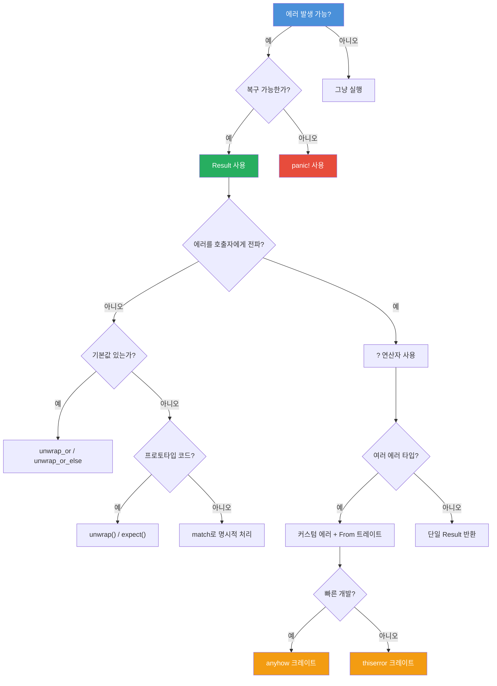

# 에러 처리

<span class="badge-intermediate">중급</span>

Rust는 안전성을 최우선으로 하는 언어답게, 에러 처리에 대해서도 체계적인 접근 방식을 제공합니다. 이 장에서는 `panic!`부터 커스텀 에러 타입, 외부 크레이트까지 Rust의 에러 처리 전략을 종합적으로 살펴봅니다.

---

## 에러 처리 의사결정 트리



---

## 1. panic!과 언와인딩

`panic!`은 복구 불가능한 에러 상황에서 프로그램을 즉시 중단시킵니다.

```rust,editable
fn main() {
    // panic!은 프로그램을 즉시 중단합니다
    // panic!("치명적인 오류 발생!");

    // 배열 범위를 벗어나면 자동으로 panic 발생
    let v = vec![1, 2, 3];
    // v[99]; // index out of bounds 패닉!

    println!("panic! 호출을 주석 해제하면 여기까지 도달하지 못합니다");
}
```

<div class="info-box">

**언와인딩(Unwinding) vs 중단(Abort)**

- **언와인딩**: 스택을 역추적하며 각 값의 소멸자를 호출합니다 (기본 동작).
- **중단(Abort)**: 즉시 프로세스를 종료합니다. `Cargo.toml`에서 설정 가능:

```toml
[profile.release]
panic = 'abort'
```

</div>

---

## 2. Result<T, E>

대부분의 에러는 `Result<T, E>`로 처리합니다.

```rust,editable
use std::fs::File;
use std::io::Read;

fn read_file_content(path: &str) -> Result<String, std::io::Error> {
    let mut file = File::open(path)?;
    let mut content = String::new();
    file.read_to_string(&mut content)?;
    Ok(content)
}

fn main() {
    match read_file_content("hello.txt") {
        Ok(content) => println!("파일 내용: {}", content),
        Err(e) => println!("파일 읽기 실패: {}", e),
    }
}
```

### unwrap()과 expect()

```rust,editable
fn main() {
    // unwrap: 성공하면 값을 반환, 실패하면 panic
    let val: Result<i32, &str> = Ok(42);
    println!("unwrap 결과: {}", val.unwrap());

    // expect: unwrap과 같지만 에러 메시지를 지정 가능
    let val2: Result<i32, &str> = Ok(100);
    println!("expect 결과: {}", val2.expect("값이 있어야 합니다"));

    // unwrap_or: 실패 시 기본값 반환
    let val3: Result<i32, &str> = Err("에러");
    println!("unwrap_or 결과: {}", val3.unwrap_or(0));

    // unwrap_or_else: 실패 시 클로저 실행
    let val4: Result<i32, &str> = Err("에러");
    println!("unwrap_or_else 결과: {}", val4.unwrap_or_else(|_| -1));
}
```

<div class="warning-box">

**주의**: `unwrap()`과 `expect()`는 프로토타입이나 테스트 코드에서만 사용하세요. 프로덕션 코드에서는 명시적 에러 처리를 권장합니다.

</div>

---

## 3. ? 연산자

`?` 연산자는 `Result`의 에러를 자동으로 호출자에게 전파합니다.

```rust,editable
use std::num::ParseIntError;

fn parse_and_double(s: &str) -> Result<i32, ParseIntError> {
    // ? 연산자: Ok면 값 추출, Err면 즉시 반환
    let n = s.parse::<i32>()?;
    Ok(n * 2)
}

fn main() {
    println!("\"5\" -> {:?}", parse_and_double("5"));
    println!("\"abc\" -> {:?}", parse_and_double("abc"));
}
```

<div class="tip-box">

**팁**: `?` 연산자는 `From` 트레이트를 자동으로 호출하여 에러 타입을 변환합니다. 이를 통해 서로 다른 에러 타입을 하나의 커스텀 에러 타입으로 통합할 수 있습니다.

</div>

---

## 4. 커스텀 에러 타입

실제 프로젝트에서는 여러 종류의 에러를 하나의 타입으로 통합해야 합니다.

```rust,editable
use std::fmt;
use std::num::ParseIntError;

#[derive(Debug)]
enum AppError {
    ParseError(ParseIntError),
    ValidationError(String),
    NotFound(String),
}

impl fmt::Display for AppError {
    fn fmt(&self, f: &mut fmt::Formatter<'_>) -> fmt::Result {
        match self {
            AppError::ParseError(e) => write!(f, "파싱 에러: {}", e),
            AppError::ValidationError(msg) => write!(f, "검증 에러: {}", msg),
            AppError::NotFound(item) => write!(f, "찾을 수 없음: {}", item),
        }
    }
}

// From 트레이트로 자동 변환 지원
impl From<ParseIntError> for AppError {
    fn from(e: ParseIntError) -> Self {
        AppError::ParseError(e)
    }
}

fn process_input(input: &str) -> Result<i32, AppError> {
    let n: i32 = input.parse()?; // ParseIntError -> AppError 자동 변환
    if n < 0 {
        return Err(AppError::ValidationError(
            "음수는 허용되지 않습니다".to_string(),
        ));
    }
    Ok(n * 10)
}

fn main() {
    println!("{:?}", process_input("42"));
    println!("{:?}", process_input("abc"));
    println!("{:?}", process_input("-5"));
}
```

---

## 5. From 트레이트를 활용한 에러 변환

`From` 트레이트를 구현하면 `?` 연산자가 자동으로 에러 타입을 변환합니다.

```rust,editable
use std::num::ParseIntError;
use std::fmt;

#[derive(Debug)]
enum MyError {
    Parse(ParseIntError),
    TooLarge(i32),
}

impl fmt::Display for MyError {
    fn fmt(&self, f: &mut fmt::Formatter<'_>) -> fmt::Result {
        match self {
            MyError::Parse(e) => write!(f, "파싱 실패: {}", e),
            MyError::TooLarge(n) => write!(f, "값이 너무 큼: {}", n),
        }
    }
}

impl From<ParseIntError> for MyError {
    fn from(e: ParseIntError) -> Self {
        MyError::Parse(e)
    }
}

fn parse_and_validate(s: &str) -> Result<i32, MyError> {
    let n: i32 = s.parse()?; // From 자동 호출
    if n > 1000 {
        return Err(MyError::TooLarge(n));
    }
    Ok(n)
}

fn main() {
    for input in &["42", "not_a_number", "9999"] {
        match parse_and_validate(input) {
            Ok(v) => println!("{} -> 성공: {}", input, v),
            Err(e) => println!("{} -> 에러: {}", input, e),
        }
    }
}
```

---

## 6. thiserror와 anyhow 크레이트

### thiserror - 라이브러리용 에러 정의

```rust,editable
// thiserror 크레이트 사용 예시 (의사 코드)
// Cargo.toml에 thiserror = "1.0" 추가 필요

/*
use thiserror::Error;

#[derive(Error, Debug)]
enum DataError {
    #[error("파일을 읽을 수 없습니다: {0}")]
    IoError(#[from] std::io::Error),

    #[error("잘못된 데이터 형식: {msg}")]
    FormatError { msg: String },

    #[error("데이터를 찾을 수 없습니다 (ID: {0})")]
    NotFound(u64),
}
*/

// 직접 구현한 동등한 코드
use std::fmt;

#[derive(Debug)]
enum DataError {
    FormatError { msg: String },
    NotFound(u64),
}

impl fmt::Display for DataError {
    fn fmt(&self, f: &mut fmt::Formatter<'_>) -> fmt::Result {
        match self {
            DataError::FormatError { msg } => write!(f, "잘못된 데이터 형식: {}", msg),
            DataError::NotFound(id) => write!(f, "데이터를 찾을 수 없습니다 (ID: {})", id),
        }
    }
}

fn find_data(id: u64) -> Result<String, DataError> {
    if id == 0 {
        Err(DataError::NotFound(id))
    } else {
        Ok(format!("데이터_{}", id))
    }
}

fn main() {
    println!("{:?}", find_data(1));
    println!("{}", find_data(0).unwrap_err());
}
```

### anyhow - 애플리케이션용 간편한 에러 처리

```rust,editable
// anyhow 크레이트 사용 예시 (의사 코드)
// Cargo.toml에 anyhow = "1.0" 추가 필요

/*
use anyhow::{Context, Result};

fn read_config(path: &str) -> Result<Config> {
    let content = std::fs::read_to_string(path)
        .context("설정 파일을 읽을 수 없습니다")?;

    let config: Config = serde_json::from_str(&content)
        .context("설정 파일 파싱 실패")?;

    Ok(config)
}
*/

fn main() {
    println!("anyhow는 다양한 에러 타입을 하나로 통합합니다.");
    println!("라이브러리에는 thiserror, 애플리케이션에는 anyhow를 사용하세요.");
}
```

<div class="info-box">

**thiserror vs anyhow 선택 기준**

| 기준 | thiserror | anyhow |
|------|-----------|--------|
| 용도 | 라이브러리 개발 | 애플리케이션 개발 |
| 에러 타입 | 구체적 enum 정의 | `anyhow::Error`로 통합 |
| 패턴 매칭 | 가능 | 불편함 |
| 컨텍스트 추가 | 수동 | `.context()` 메서드 |

</div>

---

## 연습문제

<div class="exercise-box">

**연습 1**: 다음 함수를 완성하세요. 문자열을 파싱하여 두 수의 나눗셈 결과를 반환합니다.

```rust,editable
use std::num::ParseIntError;
use std::fmt;

#[derive(Debug)]
enum CalcError {
    Parse(ParseIntError),
    DivisionByZero,
}

impl fmt::Display for CalcError {
    fn fmt(&self, f: &mut fmt::Formatter<'_>) -> fmt::Result {
        match self {
            CalcError::Parse(e) => write!(f, "파싱 에러: {}", e),
            CalcError::DivisionByZero => write!(f, "0으로 나눌 수 없습니다"),
        }
    }
}

impl From<ParseIntError> for CalcError {
    fn from(e: ParseIntError) -> Self {
        CalcError::Parse(e)
    }
}

fn divide(a_str: &str, b_str: &str) -> Result<f64, CalcError> {
    // TODO: a_str과 b_str을 파싱하고 나눗셈 결과를 반환하세요
    // b가 0이면 CalcError::DivisionByZero를 반환하세요
    todo!()
}

fn main() {
    println!("{:?}", divide("10", "3"));   // Ok(3.333...)
    println!("{:?}", divide("10", "0"));   // Err(DivisionByZero)
    println!("{:?}", divide("abc", "3"));  // Err(Parse(...))
}
```

</div>

<div class="exercise-box">

**연습 2**: `?` 연산자 체이닝을 활용하여 중첩된 JSON 문자열에서 값을 추출하는 함수를 작성하세요.

```rust,editable
fn extract_value(data: &str) -> Result<i32, String> {
    // 형식: "key:value" (예: "score:42")
    let parts: Vec<&str> = data.split(':').collect();
    let value_str = parts.get(1)
        .ok_or("값이 없습니다".to_string())?;
    let value: i32 = value_str.parse()
        .map_err(|e| format!("파싱 실패: {}", e))?;
    Ok(value)
}

fn main() {
    println!("{:?}", extract_value("score:42"));
    println!("{:?}", extract_value("score:abc"));
    println!("{:?}", extract_value("invalid"));
}
```

</div>

---

## 퀴즈

<div class="quiz-box" onclick="this.classList.toggle('show-answer')">

**Q1**: `panic!`과 `Result`의 차이점은 무엇인가요?

<div class="quiz-answer">

`panic!`은 **복구 불가능한** 에러에 사용하며 프로그램을 즉시 중단합니다. `Result`는 **복구 가능한** 에러에 사용하며 호출자가 에러를 처리하거나 전파할 수 있습니다.

</div>
</div>

<div class="quiz-box" onclick="this.classList.toggle('show-answer')">

**Q2**: `?` 연산자는 내부적으로 어떤 동작을 수행하나요?

<div class="quiz-answer">

`?` 연산자는 `Result`가 `Ok`이면 내부 값을 추출하고, `Err`이면 `From::from()`을 호출하여 에러 타입을 변환한 후 함수에서 즉시 `Err`을 반환합니다.

</div>
</div>

<div class="quiz-box" onclick="this.classList.toggle('show-answer')">

**Q3**: `thiserror`와 `anyhow` 중 라이브러리 개발에 적합한 것은?

<div class="quiz-answer">

**thiserror**가 라이브러리 개발에 적합합니다. 구체적인 에러 타입을 정의하여 사용자가 패턴 매칭으로 에러를 처리할 수 있기 때문입니다. `anyhow`는 애플리케이션 개발에 적합합니다.

</div>
</div>

---

<div class="summary-box">

**요약**

- `panic!`은 복구 불가능한 에러, `Result<T, E>`는 복구 가능한 에러에 사용합니다.
- `unwrap()`, `expect()`는 프로토타입에만 사용하고, 프로덕션에서는 명시적 처리를 합니다.
- `?` 연산자로 에러를 간결하게 전파할 수 있습니다.
- `From` 트레이트를 구현하면 `?` 연산자가 에러 타입을 자동 변환합니다.
- 라이브러리에는 `thiserror`, 애플리케이션에는 `anyhow`를 사용합니다.

</div>
