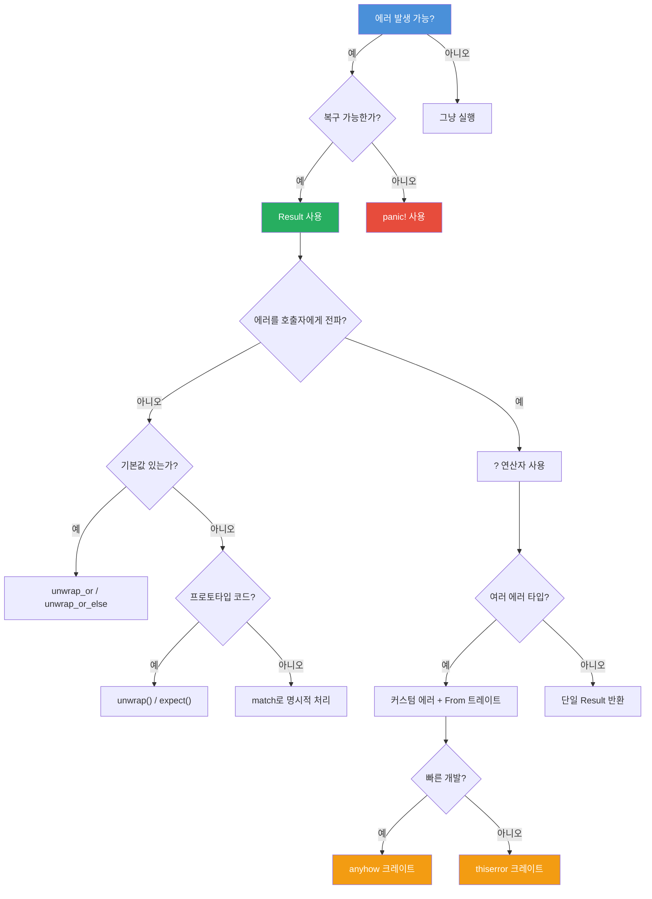

# 에러 처리

중급

Rust는 안전성을 최우선으로 하는 언어답게, 에러 처리에 대해서도 체계적인 접근 방식을 제공합니다. 이 장에서는 `panic!`부터 커스텀 에러 타입, 외부 크레이트까지 Rust의 에러 처리 전략을 종합적으로 살펴봅니다.

---

## 에러 처리 의사결정 트리

---

## 이 장에서 다루는 내용

- **panic!과 Result** — 복구 불가능한 에러와 복구 가능한 에러 처리의 기본
- **에러 전파와 커스텀 에러** — `?` 연산자, 커스텀 에러 타입, `From` 트레이트를 활용한 에러 변환
- **에러 처리 크레이트와 실전** — `thiserror`와 `anyhow` 크레이트, 연습문제, 퀴즈
