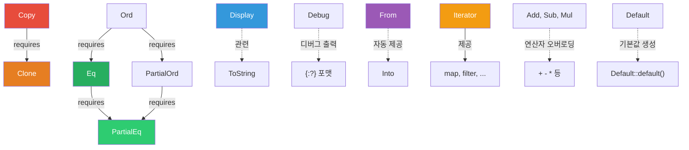

# 트레이트

중급

트레이트(Trait)는 Rust에서 **공유 동작을 정의하는 핵심 메커니즘**입니다. 다른 언어의 인터페이스와 비슷하지만, 기본 구현, 연관 타입, 블랭킷 구현 등 훨씬 강력한 기능을 제공합니다.

---

## 표준 라이브러리 트레이트 계층도

---

## 이 장에서 다루는 내용

- **트레이트 정의와 바운드** — 트레이트 정의, 구현, 기본 구현, 트레이트 바운드와 `impl Trait` 문법
- **표준 트레이트와 연산자 오버로딩** — 핵심 표준 트레이트(`Display`, `Debug`, `Clone`, `From/Into` 등)와 연산자 오버로딩
- **트레이트 객체와 고급 기능** — `dyn Trait`, 객체 안전성, 연관 타입, 블랭킷 구현
- **트레이트 실전 연습** — 연습문제와 퀴즈
