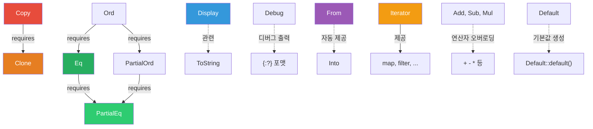

# 트레이트

<span class="badge-intermediate">중급</span>

트레이트(Trait)는 Rust에서 **공유 동작을 정의하는 핵심 메커니즘**입니다. 다른 언어의 인터페이스와 비슷하지만, 기본 구현, 연관 타입, 블랭킷 구현 등 훨씬 강력한 기능을 제공합니다.

---

## 표준 라이브러리 트레이트 계층도



---

## 1. 트레이트 정의와 구현

```rust,editable
trait Describable {
    fn describe(&self) -> String;

    // 기본 구현 (오버라이드 가능)
    fn summary(&self) -> String {
        format!("요약: {}", self.describe())
    }
}

struct Article {
    title: String,
    content: String,
}

struct Tweet {
    username: String,
    message: String,
}

impl Describable for Article {
    fn describe(&self) -> String {
        format!("[기사] {}: {}", self.title, self.content)
    }
}

impl Describable for Tweet {
    fn describe(&self) -> String {
        format!("@{}: {}", self.username, self.message)
    }

    // 기본 구현을 오버라이드
    fn summary(&self) -> String {
        format!("트윗 - {}", self.describe())
    }
}

fn main() {
    let article = Article {
        title: "Rust 배우기".to_string(),
        content: "Rust는 안전한 시스템 프로그래밍 언어입니다.".to_string(),
    };
    let tweet = Tweet {
        username: "rustlang".to_string(),
        message: "Rust 2024 에디션이 출시되었습니다!".to_string(),
    };

    println!("{}", article.summary());  // 기본 구현 사용
    println!("{}", tweet.summary());    // 오버라이드된 구현 사용
}
```

---

## 2. 트레이트 바운드

```rust,editable
use std::fmt::Display;

// 방법 1: 트레이트 바운드 문법
fn print_item<T: Display>(item: &T) {
    println!("항목: {}", item);
}

// 방법 2: where 절 (복잡한 바운드에 적합)
fn compare_and_display<T, U>(t: &T, u: &U)
where
    T: Display + PartialOrd,
    U: Display + Clone,
{
    println!("t = {}, u = {}", t, u);
}

// 방법 3: impl Trait 문법 (간결함)
fn show(item: &impl Display) {
    println!("표시: {}", item);
}

// 여러 트레이트 바운드
fn process<T: Display + Clone + PartialOrd>(item: T) -> T {
    println!("처리 중: {}", item);
    item.clone()
}

fn main() {
    print_item(&42);
    print_item(&"hello");
    compare_and_display(&10, &"world");
    show(&3.14);
    let result = process(100);
    println!("결과: {}", result);
}
```

---

## 3. impl Trait — 매개변수와 반환 타입

```rust,editable
use std::fmt::Display;

// 매개변수에 impl Trait
fn notify(item: &impl Display) {
    println!("알림: {}", item);
}

// 반환 타입에 impl Trait
fn make_greeting(name: &str) -> impl Display {
    format!("안녕하세요, {}님!", name)
}

fn main() {
    notify(&"긴급 메시지");
    let greeting = make_greeting("홍길동");
    println!("{}", greeting);
}
```

<div class="warning-box">

**주의**: `impl Trait`를 반환 타입으로 사용할 때, 함수 내에서 **단 하나의 구체 타입**만 반환할 수 있습니다. 조건에 따라 서로 다른 타입을 반환해야 하면 트레이트 객체(`Box<dyn Trait>`)를 사용해야 합니다.

</div>

---

## 4. 핵심 표준 트레이트

```rust,editable
use std::fmt;

#[derive(Debug, Clone, PartialEq, Default)]
struct Color {
    r: u8,
    g: u8,
    b: u8,
}

// Display 트레이트 구현
impl fmt::Display for Color {
    fn fmt(&self, f: &mut fmt::Formatter<'_>) -> fmt::Result {
        write!(f, "#{:02X}{:02X}{:02X}", self.r, self.g, self.b)
    }
}

// From 트레이트 구현
impl From<(u8, u8, u8)> for Color {
    fn from((r, g, b): (u8, u8, u8)) -> Self {
        Color { r, g, b }
    }
}

fn main() {
    let red = Color { r: 255, g: 0, b: 0 };
    let blue = Color::from((0, 0, 255));
    let default_color = Color::default(); // (0, 0, 0)

    // Display
    println!("빨강: {}", red);
    // Debug
    println!("파랑: {:?}", blue);
    // Clone
    let red_clone = red.clone();
    // PartialEq
    println!("같은가? {}", red == red_clone);
    // Into (From이 있으면 자동 제공)
    let green: Color = (0_u8, 255_u8, 0_u8).into();
    println!("초록: {}", green);
    println!("기본값: {}", default_color);
}
```

---

## 5. 연산자 오버로딩

```rust,editable
use std::ops::{Add, Index};

#[derive(Debug, Clone, Copy)]
struct Vec2 {
    x: f64,
    y: f64,
}

impl Add for Vec2 {
    type Output = Vec2;

    fn add(self, other: Vec2) -> Vec2 {
        Vec2 {
            x: self.x + other.x,
            y: self.y + other.y,
        }
    }
}

impl std::fmt::Display for Vec2 {
    fn fmt(&self, f: &mut std::fmt::Formatter<'_>) -> std::fmt::Result {
        write!(f, "({}, {})", self.x, self.y)
    }
}

// Index 트레이트로 [] 연산자 오버로딩
struct Grid {
    data: Vec<Vec<i32>>,
}

impl Index<(usize, usize)> for Grid {
    type Output = i32;

    fn index(&self, (row, col): (usize, usize)) -> &i32 {
        &self.data[row][col]
    }
}

fn main() {
    let a = Vec2 { x: 1.0, y: 2.0 };
    let b = Vec2 { x: 3.0, y: 4.0 };
    println!("{} + {} = {}", a, b, a + b);

    let grid = Grid {
        data: vec![vec![1, 2, 3], vec![4, 5, 6]],
    };
    println!("grid[(1,2)] = {}", grid[(1, 2)]);
}
```

---

## 6. 트레이트 객체 (dyn Trait) vs 정적 디스패치

```rust,editable
trait Shape {
    fn area(&self) -> f64;
    fn name(&self) -> &str;
}

struct Circle { radius: f64 }
struct Rectangle { width: f64, height: f64 }

impl Shape for Circle {
    fn area(&self) -> f64 { std::f64::consts::PI * self.radius * self.radius }
    fn name(&self) -> &str { "원" }
}

impl Shape for Rectangle {
    fn area(&self) -> f64 { self.width * self.height }
    fn name(&self) -> &str { "직사각형" }
}

// 정적 디스패치 (컴파일 타임에 타입 결정, 빠름)
fn print_area_static(shape: &impl Shape) {
    println!("[정적] {}: 넓이 = {:.2}", shape.name(), shape.area());
}

// 동적 디스패치 (런타임에 vtable 조회, 유연함)
fn print_area_dynamic(shape: &dyn Shape) {
    println!("[동적] {}: 넓이 = {:.2}", shape.name(), shape.area());
}

// 트레이트 객체의 핵심: 이질적 컬렉션
fn total_area(shapes: &[Box<dyn Shape>]) -> f64 {
    shapes.iter().map(|s| s.area()).sum()
}

fn main() {
    let circle = Circle { radius: 5.0 };
    let rect = Rectangle { width: 4.0, height: 6.0 };

    print_area_static(&circle);
    print_area_dynamic(&rect);

    // 서로 다른 타입을 하나의 벡터에 저장
    let shapes: Vec<Box<dyn Shape>> = vec![
        Box::new(Circle { radius: 3.0 }),
        Box::new(Rectangle { width: 2.0, height: 5.0 }),
        Box::new(Circle { radius: 1.0 }),
    ];

    println!("총 넓이: {:.2}", total_area(&shapes));
}
```

<div class="info-box">

**정적 디스패치 vs 동적 디스패치**

| 특성 | 정적 (`impl Trait` / 제네릭) | 동적 (`dyn Trait`) |
|------|------|------|
| 성능 | 빠름 (인라인 가능) | vtable 간접 호출 비용 |
| 바이너리 크기 | 타입별 코드 생성 | 코드 하나로 공유 |
| 이질적 컬렉션 | 불가 | 가능 |
| 타입 결정 시점 | 컴파일 타임 | 런타임 |

</div>

---

## 7. 객체 안전성 (Object Safety)

트레이트 객체(`dyn Trait`)로 사용하려면 트레이트가 **객체 안전(object-safe)**해야 합니다.

```rust,editable
// 객체 안전한 트레이트
trait Drawable {
    fn draw(&self);
}

// 객체 안전하지 않은 트레이트 (제네릭 메서드 포함)
// trait NotObjectSafe {
//     fn convert<T>(&self) -> T;  // 제네릭 메서드 -> 객체 안전 위반
// }

// 객체 안전하지 않은 트레이트 (Self를 반환)
// trait Clonable {
//     fn clone_self(&self) -> Self;  // Self 반환 -> 객체 안전 위반
// }

struct Square { size: f64 }
struct Triangle { base: f64, height: f64 }

impl Drawable for Square {
    fn draw(&self) { println!("■ (크기: {})", self.size); }
}
impl Drawable for Triangle {
    fn draw(&self) { println!("▲ (밑변: {}, 높이: {})", self.base, self.height); }
}

fn main() {
    let shapes: Vec<Box<dyn Drawable>> = vec![
        Box::new(Square { size: 3.0 }),
        Box::new(Triangle { base: 4.0, height: 5.0 }),
    ];

    for shape in &shapes {
        shape.draw();
    }
}
```

<div class="tip-box">

**객체 안전성 조건**: (1) 메서드가 `Self`를 반환하지 않아야 하며, (2) 제네릭 타입 매개변수가 없어야 합니다.

</div>

---

## 8. 연관 타입 (Associated Types)

```rust,editable
// 연관 타입을 사용하는 트레이트
trait Container {
    type Item;

    fn first(&self) -> Option<&Self::Item>;
    fn last(&self) -> Option<&Self::Item>;
    fn len(&self) -> usize;
}

struct NumberList {
    items: Vec<i32>,
}

impl Container for NumberList {
    type Item = i32;

    fn first(&self) -> Option<&i32> {
        self.items.first()
    }

    fn last(&self) -> Option<&i32> {
        self.items.last()
    }

    fn len(&self) -> usize {
        self.items.len()
    }
}

fn print_container(c: &impl Container<Item = i32>) {
    println!("첫 번째: {:?}, 마지막: {:?}, 길이: {}",
             c.first(), c.last(), c.len());
}

fn main() {
    let list = NumberList { items: vec![10, 20, 30, 40] };
    print_container(&list);
}
```

---

## 9. 블랭킷 구현 (Blanket Implementations)

```rust,editable
use std::fmt::Display;

// 모든 Display를 구현하는 타입에 대해 자동으로 Printable 구현
trait Printable {
    fn print_with_label(&self, label: &str);
}

impl<T: Display> Printable for T {
    fn print_with_label(&self, label: &str) {
        println!("[{}] {}", label, self);
    }
}

fn main() {
    42.print_with_label("숫자");
    "안녕하세요".print_with_label("문자열");
    3.14.print_with_label("실수");
}
```

<div class="info-box">

**블랭킷 구현**은 표준 라이브러리에서 흔히 사용됩니다. 예를 들어 `From<T>`를 구현하면 `Into<T>`가 자동으로 제공되는 것이 바로 블랭킷 구현 덕분입니다.

</div>

---

## 연습문제

<div class="exercise-box">

**연습 1**: `Summable` 트레이트를 정의하고, `Vec<i32>`와 `Vec<f64>`에 구현하세요.

```rust,editable
trait Summable {
    type Output;
    fn total(&self) -> Self::Output;
}

// TODO: Vec<i32>에 대해 Summable 구현
// TODO: Vec<f64>에 대해 Summable 구현

fn main() {
    let ints = vec![1, 2, 3, 4, 5];
    let floats = vec![1.5, 2.5, 3.5];

    // println!("정수 합: {}", ints.total());    // 15
    // println!("실수 합: {}", floats.total());  // 7.5
}
```

</div>

<div class="exercise-box">

**연습 2**: `dyn Trait`을 활용하여 다양한 동물 소리를 출력하는 프로그램을 작성하세요.

```rust,editable
trait Animal {
    fn name(&self) -> &str;
    fn sound(&self) -> &str;
    fn info(&self) -> String {
        format!("{}은(는) '{}'라고 울어요", self.name(), self.sound())
    }
}

struct Dog;
struct Cat;
struct Duck;

// TODO: 각 동물에 대해 Animal 트레이트를 구현하세요

fn animal_chorus(animals: &[Box<dyn Animal>]) {
    for animal in animals {
        println!("{}", animal.info());
    }
}

fn main() {
    // TODO: 동물 벡터를 만들고 animal_chorus 호출
}
```

</div>

---

## 퀴즈

<div class="quiz-box" onclick="this.classList.toggle('show-answer')">

**Q1**: `impl Trait`와 `dyn Trait`의 핵심 차이는 무엇인가요?

<div class="quiz-answer">

`impl Trait`는 **정적 디스패치**(컴파일 타임에 타입이 결정, 단형성화)를 사용하고, `dyn Trait`는 **동적 디스패치**(런타임에 vtable을 통해 메서드 호출)를 사용합니다. `dyn Trait`는 이질적 컬렉션에 사용할 수 있지만 약간의 런타임 비용이 있습니다.

</div>
</div>

<div class="quiz-box" onclick="this.classList.toggle('show-answer')">

**Q2**: 연관 타입(Associated Type)과 제네릭 타입 매개변수의 차이는?

<div class="quiz-answer">

제네릭 타입 매개변수를 사용하면 하나의 타입에 대해 **여러 번** 트레이트를 구현할 수 있지만, 연관 타입은 **한 번만** 구현할 수 있습니다. `Iterator` 트레이트의 `type Item`처럼, 구현이 하나뿐이어야 할 때 연관 타입을 사용합니다.

</div>
</div>

<div class="quiz-box" onclick="this.classList.toggle('show-answer')">

**Q3**: 블랭킷 구현이란 무엇인가요?

<div class="quiz-answer">

특정 트레이트를 구현하는 **모든 타입**에 대해 다른 트레이트를 자동으로 구현하는 것입니다. 예: `impl<T: Display> ToString for T`는 `Display`를 구현하는 모든 타입에 `ToString`을 자동 제공합니다.

</div>
</div>

---

<div class="summary-box">

**요약**

- 트레이트는 공유 동작을 정의하며, 기본 구현을 포함할 수 있습니다.
- 트레이트 바운드(`T: Trait`, `where` 절)로 제네릭 타입에 제약을 추가합니다.
- 핵심 표준 트레이트: `Display`, `Debug`, `Clone`, `Copy`, `From/Into`, `PartialEq`, `Default`, `Iterator`.
- `Add`, `Index` 등의 트레이트로 연산자를 오버로딩할 수 있습니다.
- `dyn Trait`(동적 디스패치)는 이질적 컬렉션에 사용하며, 객체 안전성이 필요합니다.
- 연관 타입은 트레이트 구현당 하나의 타입만 지정할 때 사용합니다.
- 블랭킷 구현으로 특정 트레이트를 구현하는 모든 타입에 자동으로 기능을 부여합니다.

</div>
