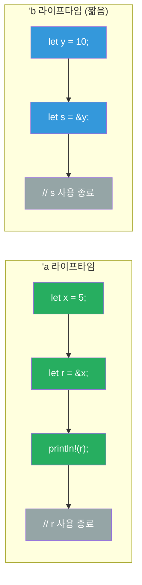
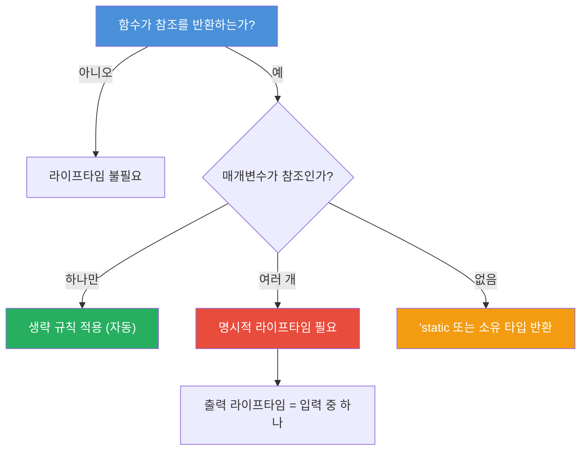

# 라이프타임

중급

라이프타임(Lifetime)은 Rust의 핵심 개념으로, **참조가 유효한 범위**를 명시적으로 표현합니다. 컴파일러가 댕글링 참조(dangling reference)를 방지하기 위해 사용하는 메커니즘입니다.

---

## 라이프타임 스코프 다이어그램

---

## 이 장에서 다루는 내용

- **라이프타임 기초** — 라이프타임의 개념, 함수와 구조체에서의 라이프타임 어노테이션
- **라이프타임 심화** — 생략 규칙, `'static` 라이프타임, 복합적인 시나리오
- **라이프타임 실전 연습** — 연습문제와 퀴즈
