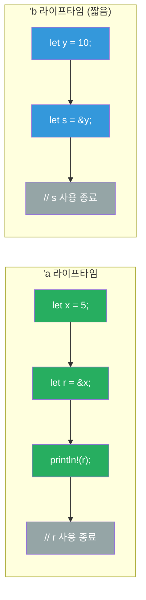
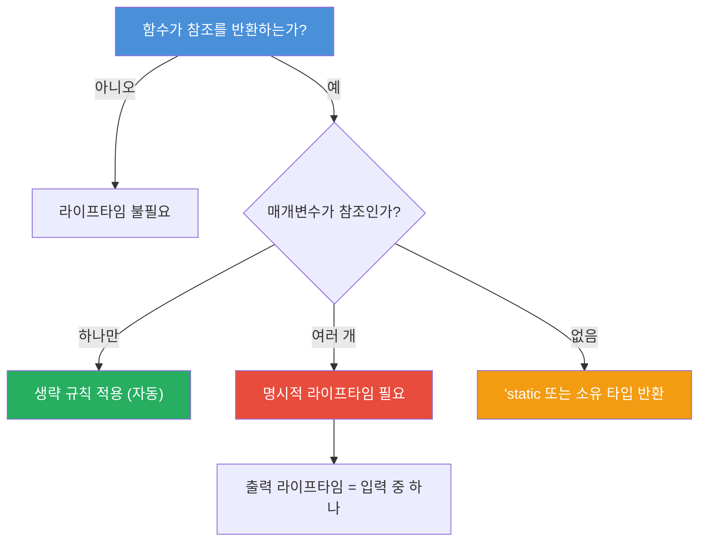

# 라이프타임

<span class="badge-intermediate">중급</span>

라이프타임(Lifetime)은 Rust의 핵심 개념으로, **참조가 유효한 범위**를 명시적으로 표현합니다. 컴파일러가 댕글링 참조(dangling reference)를 방지하기 위해 사용하는 메커니즘입니다.

---

## 라이프타임 스코프 다이어그램





---

## 1. 라이프타임이란?

모든 참조에는 라이프타임이 있습니다. 대부분의 경우 컴파일러가 자동으로 추론하지만, 모호한 경우 명시적으로 지정해야 합니다.

```rust,editable
fn main() {
    let r;                     // -----+-- 'a
    {                          //      |
        let x = 5;             // -+-- 'b
        r = &x;                //  |   // 에러! x는 여기서 소멸
    }                          // -+
    // println!("{}", r);      // 'b는 끝났지만 r은 'a까지 살아야 함
    // 위 코드는 컴파일 에러! 댕글링 참조 방지

    // 올바른 코드
    let x = 5;                 // -----+-- 'a
    let r = &x;                //      |-- 'a (x와 같은 스코프)
    println!("r = {}", r);     //      |
}
```

---

## 2. 함수에서의 라이프타임 어노테이션

```rust,editable
// 라이프타임 어노테이션: 반환된 참조가 어떤 입력과 같은 수명을 갖는지 명시
fn longest<'a>(x: &'a str, y: &'a str) -> &'a str {
    if x.len() > y.len() { x } else { y }
}

// 라이프타임이 다른 경우
fn first_word<'a>(s: &'a str) -> &'a str {
    let bytes = s.as_bytes();
    for (i, &item) in bytes.iter().enumerate() {
        if item == b' ' {
            return &s[..i];
        }
    }
    s
}

fn main() {
    let string1 = String::from("긴 문자열입니다");
    let result;

    {
        let string2 = String::from("짧은");
        result = longest(string1.as_str(), string2.as_str());
        println!("더 긴 문자열: {}", result);
    }
    // 주의: result를 여기서 사용하면 컴파일 에러!
    // string2의 라이프타임이 끝났기 때문

    let word = first_word("hello world");
    println!("첫 단어: {}", word);
}
```

<div class="info-box">

**핵심 규칙**: 라이프타임 어노테이션은 참조의 수명을 변경하지 않습니다. 단지 여러 참조 사이의 **관계**를 컴파일러에게 알려줄 뿐입니다.

`'a`는 "x와 y 중 더 짧은 라이프타임"을 의미합니다.

</div>

---

## 3. 구조체에서의 라이프타임

참조를 포함하는 구조체는 반드시 라이프타임을 명시해야 합니다.

```rust,editable
#[derive(Debug)]
struct Excerpt<'a> {
    text: &'a str,
}

impl<'a> Excerpt<'a> {
    fn level(&self) -> i32 {
        3
    }

    // 반환 타입이 &self의 라이프타임을 따름 (생략 규칙 3)
    fn announce(&self, announcement: &str) -> &str {
        println!("주의: {}", announcement);
        self.text
    }
}

fn main() {
    let novel = String::from("어느 날 아침. 그리고 그 다음 날...");
    let first_sentence;

    {
        let first_dot = novel.find('.').unwrap_or(novel.len());
        first_sentence = Excerpt {
            text: &novel[..first_dot],
        };
        println!("발췌: {:?}", first_sentence);
        println!("레벨: {}", first_sentence.level());
    }
}
```

---

## 4. 라이프타임 생략 규칙

컴파일러는 세 가지 규칙으로 라이프타임을 자동 추론합니다.

```rust,editable
// 규칙 1: 각 참조 매개변수에 고유 라이프타임 부여
// fn foo(x: &str) → fn foo<'a>(x: &'a str)

// 규칙 2: 참조 매개변수가 하나면 출력에 같은 라이프타임 적용
// fn foo(x: &str) -> &str → fn foo<'a>(x: &'a str) -> &'a str

// 규칙 3: &self나 &mut self가 있으면 self의 라이프타임을 출력에 적용

struct Parser {
    input: String,
}

impl Parser {
    // 생략 규칙 3 적용: &self의 라이프타임이 반환 참조에 적용됨
    fn first_token(&self) -> &str {
        &self.input[..self.input.find(' ').unwrap_or(self.input.len())]
    }

    // 명시적으로 쓰면 이렇게 됩니다:
    // fn first_token<'a>(&'a self) -> &'a str { ... }
}

// 생략 가능한 경우
fn first_char(s: &str) -> &str {
    &s[..1]
}

fn main() {
    let parser = Parser {
        input: "hello world rust".to_string(),
    };
    println!("첫 토큰: {}", parser.first_token());
    println!("첫 글자: {}", first_char("안녕"));
}
```

<div class="tip-box">

**팁**: 생략 규칙만으로 라이프타임을 결정할 수 없을 때만 명시적으로 작성하면 됩니다. 대부분의 경우 컴파일러가 알아서 처리합니다.

</div>

---

## 5. 'static 라이프타임

`'static`은 프로그램 전체 실행 기간 동안 유효한 참조입니다.

```rust,editable
// 문자열 리터럴은 항상 'static
fn get_greeting() -> &'static str {
    "안녕하세요, Rust 세계에 오신 것을 환영합니다!"
}

// 'static은 트레이트 바운드로도 사용 가능
fn print_static(s: &'static str) {
    println!("정적 문자열: {}", s);
}

fn main() {
    let greeting = get_greeting();
    println!("{}", greeting);

    // 문자열 리터럴은 'static
    let s: &'static str = "이것은 바이너리에 포함됩니다";
    print_static(s);

    // String은 'static이 아닙니다
    let dynamic = String::from("동적 문자열");
    // print_static(&dynamic); // 컴파일 에러!
    println!("{}", dynamic);
}
```

<div class="warning-box">

**주의**: `'static`을 남용하지 마세요. 에러 메시지에서 `'static`을 요구하는 경우, 대부분 소유 타입(`String` 등)을 사용하는 것이 더 나은 해결책입니다.

</div>

---

## 6. 복합적인 라이프타임 시나리오

```rust,editable
use std::fmt::Display;

// 여러 라이프타임 매개변수
fn longest_with_announcement<'a, T>(
    x: &'a str,
    y: &'a str,
    ann: T,
) -> &'a str
where
    T: Display,
{
    println!("알림: {}", ann);
    if x.len() > y.len() { x } else { y }
}

// 서로 다른 라이프타임
fn different_lifetimes<'a, 'b>(x: &'a str, _y: &'b str) -> &'a str {
    // 반환값은 'a 라이프타임만 사용
    x
}

fn main() {
    let s1 = "긴 문자열";
    let s2 = "짧은";

    let result = longest_with_announcement(s1, s2, "비교 시작!");
    println!("결과: {}", result);

    let result2 = different_lifetimes(s1, s2);
    println!("첫 번째: {}", result2);
}
```

---

## 연습문제

<div class="exercise-box">

**연습 1**: 아래 코드가 컴파일되지 않는 이유를 설명하고 수정하세요.

```rust,editable
// 수정 전 (컴파일 에러)
/*
fn longest(x: &str, y: &str) -> &str {
    if x.len() > y.len() { x } else { y }
}
*/

// TODO: 라이프타임 어노테이션을 추가하여 수정하세요
fn longest<'a>(x: &'a str, y: &'a str) -> &'a str {
    if x.len() > y.len() { x } else { y }
}

fn main() {
    let result;
    let s1 = String::from("hello");
    {
        let s2 = String::from("hi");
        result = longest(s1.as_str(), s2.as_str());
        println!("결과: {}", result); // 이 위치에서만 사용 가능
    }
}
```

</div>

<div class="exercise-box">

**연습 2**: 라이프타임을 포함하는 `Config` 구조체를 완성하세요.

```rust,editable
#[derive(Debug)]
struct Config<'a> {
    name: &'a str,
    values: Vec<&'a str>,
}

impl<'a> Config<'a> {
    fn new(name: &'a str) -> Self {
        Config {
            name,
            values: Vec::new(),
        }
    }

    fn add_value(&mut self, value: &'a str) {
        self.values.push(value);
    }

    // TODO: 가장 긴 값을 반환하는 메서드를 구현하세요
    fn longest_value(&self) -> Option<&&str> {
        self.values.iter().max_by_key(|v| v.len())
    }
}

fn main() {
    let mut config = Config::new("앱 설정");
    config.add_value("짧은");
    config.add_value("중간 길이의 값");
    config.add_value("아주 매우 긴 설정 값입니다");

    println!("{:?}", config);
    println!("가장 긴 값: {:?}", config.longest_value());
}
```

</div>

---

## 퀴즈

<div class="quiz-box" onclick="this.classList.toggle('show-answer')">

**Q1**: 라이프타임 어노테이션은 참조의 수명을 변경하나요?

<div class="quiz-answer">

아니요, 라이프타임 어노테이션은 참조의 수명을 **변경하지 않습니다**. 여러 참조 간의 수명 **관계**를 컴파일러에게 알려주어, 유효하지 않은 참조를 방지하는 역할만 합니다.

</div>
</div>

<div class="quiz-box" onclick="this.classList.toggle('show-answer')">

**Q2**: 라이프타임 생략 규칙 3가지를 설명하세요.

<div class="quiz-answer">

1. 각 참조 매개변수에 **고유한 라이프타임**이 부여됩니다.
2. 참조 매개변수가 **하나**뿐이면, 그 라이프타임이 모든 출력 참조에 적용됩니다.
3. 메서드에서 `&self` 또는 `&mut self`가 있으면, **self의 라이프타임**이 출력 참조에 적용됩니다.

</div>
</div>

<div class="quiz-box" onclick="this.classList.toggle('show-answer')">

**Q3**: `'static` 라이프타임은 언제 사용되나요?

<div class="quiz-answer">

`'static`은 프로그램의 **전체 실행 기간** 동안 유효한 참조에 사용됩니다. 문자열 리터럴(`&str`)이 대표적인 예입니다. 바이너리에 직접 포함되어 프로그램이 끝날 때까지 존재합니다. 트레이트 바운드로도 사용할 수 있습니다(`T: 'static`).

</div>
</div>

---

<div class="summary-box">

**요약**

- 라이프타임은 참조가 유효한 **범위**를 나타내며, 댕글링 참조를 방지합니다.
- `'a` 같은 라이프타임 어노테이션은 참조 간의 **관계**를 명시합니다.
- 구조체에 참조 필드가 있으면 반드시 라이프타임을 명시해야 합니다.
- 생략 규칙 3가지로 대부분의 라이프타임을 자동 추론합니다.
- `'static`은 프로그램 전체 기간 동안 유효한 참조입니다.
- 라이프타임은 컴파일 타임에만 검사되며 런타임 비용이 없습니다.

</div>
