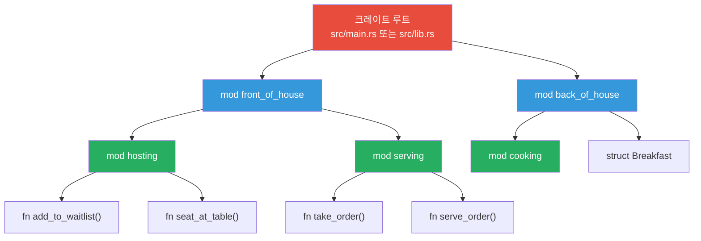

# 모듈과 패키지

<span class="badge-intermediate">중급</span>

Rust의 모듈 시스템은 코드를 논리적으로 구성하고, 가시성을 제어하며, 네임스페이스를 관리합니다. 이 장에서는 크레이트, 모듈, 패키지, 워크스페이스까지 Rust의 코드 구성 체계를 종합적으로 살펴봅니다.

---

## 모듈 트리 구조



---

## 1. 크레이트 타입: 바이너리 vs 라이브러리

```rust,editable
// 바이너리 크레이트: src/main.rs (실행 가능)
// fn main() { ... }

// 라이브러리 크레이트: src/lib.rs (다른 코드에서 사용)
// pub fn greet() { ... }

// 하나의 패키지에 여러 크레이트 포함 가능:
// - src/main.rs (바이너리 크레이트 1개)
// - src/lib.rs (라이브러리 크레이트 1개)
// - src/bin/extra.rs (추가 바이너리 크레이트)

fn main() {
    println!("바이너리 크레이트: src/main.rs에 fn main() 포함");
    println!("라이브러리 크레이트: src/lib.rs에 공개 API 정의");
}
```

<div class="info-box">

**패키지 구성 요소**

| 구성 요소 | 설명 | 파일 |
|-----------|------|------|
| 패키지 | `Cargo.toml`로 정의, 크레이트들의 묶음 | `Cargo.toml` |
| 크레이트 | 컴파일의 최소 단위 | `src/main.rs`, `src/lib.rs` |
| 모듈 | 코드 구성 단위 | `mod` 키워드로 정의 |

</div>

---

## 2. mod, pub, use, as

```rust,editable
// 모듈 정의
mod math {
    // 기본적으로 비공개 (private)
    fn internal_calc(x: i32) -> i32 {
        x * x
    }

    // pub으로 공개
    pub fn square(x: i32) -> i32 {
        internal_calc(x)
    }

    pub fn cube(x: i32) -> i32 {
        x * x * x
    }

    pub mod geometry {
        pub fn circle_area(radius: f64) -> f64 {
            std::f64::consts::PI * radius * radius
        }

        pub fn rectangle_area(w: f64, h: f64) -> f64 {
            w * h
        }
    }
}

// use로 경로 단축
use math::geometry::circle_area;
// as로 별칭 지정
use math::geometry::rectangle_area as rect_area;

fn main() {
    println!("3^2 = {}", math::square(3));
    println!("3^3 = {}", math::cube(3));

    // use로 가져온 함수 직접 호출
    println!("원 넓이(r=5): {:.2}", circle_area(5.0));
    println!("직사각형 넓이(3x4): {:.2}", rect_area(3.0, 4.0));
}
```

---

## 3. 가시성 제어: pub, pub(crate), pub(super)

```rust,editable
mod outer {
    pub mod inner {
        // 완전 공개
        pub fn public_fn() {
            println!("완전 공개 함수");
        }

        // 크레이트 내에서만 공개
        pub(crate) fn crate_only() {
            println!("크레이트 내부 전용");
        }

        // 부모 모듈에서만 공개
        pub(super) fn parent_only() {
            println!("부모 모듈 전용");
        }

        // 비공개 (기본값)
        fn private_fn() {
            println!("비공개 함수");
        }

        pub fn call_private() {
            private_fn(); // 같은 모듈 내에서는 접근 가능
        }
    }

    pub fn test() {
        inner::public_fn();
        inner::crate_only();
        inner::parent_only();  // pub(super)이므로 부모에서 접근 가능
        // inner::private_fn(); // 에러! 비공개
        inner::call_private();
    }
}

fn main() {
    outer::test();
    outer::inner::public_fn();
    outer::inner::crate_only();  // 같은 크레이트이므로 접근 가능
    // outer::inner::parent_only(); // 에러! outer의 자식만 접근 가능
}
```

---

## 4. 파일 기반 모듈 구조

<div class="info-box">

**두 가지 파일 구조 방식**

**방식 1: `mod.rs` 사용 (구 방식)**
```
src/
├── main.rs
├── network/
│   ├── mod.rs        // mod network 정의
│   ├── client.rs     // mod client
│   └── server.rs     // mod server
```

**방식 2: 파일명 사용 (신 방식, 권장)**
```
src/
├── main.rs
├── network.rs        // mod network 정의
├── network/
│   ├── client.rs     // mod client
│   └── server.rs     // mod server
```

두 방식 모두 동일하게 동작합니다. 최신 Rust에서는 **방식 2**를 권장합니다.

</div>

```rust,editable
// 파일 구조를 인라인 모듈로 시뮬레이션
// 실제로는 별도 파일에 작성합니다.

// src/network.rs에 해당
mod network {
    pub mod client {
        pub fn connect(addr: &str) {
            println!("클라이언트: {}에 연결", addr);
        }
    }

    pub mod server {
        pub fn listen(port: u16) {
            println!("서버: 포트 {}에서 대기", port);
        }
    }
}

fn main() {
    network::client::connect("127.0.0.1:8080");
    network::server::listen(3000);
}
```

---

## 5. 재내보내기 (Re-exporting)

```rust,editable
mod database {
    mod connection {
        pub struct Pool {
            pub size: usize,
        }

        impl Pool {
            pub fn new(size: usize) -> Self {
                Pool { size }
            }

            pub fn connect(&self) {
                println!("연결 풀 (크기: {})", self.size);
            }
        }
    }

    mod query {
        pub fn execute(sql: &str) {
            println!("쿼리 실행: {}", sql);
        }
    }

    // pub use로 내부 구조를 상위 모듈에서 직접 접근 가능하게 만듦
    pub use connection::Pool;
    pub use query::execute;
}

fn main() {
    // 재내보내기 덕분에 깊은 경로 대신 간단하게 접근
    let pool = database::Pool::new(10);
    pool.connect();
    database::execute("SELECT * FROM users");

    // 재내보내기 없이는:
    // database::connection::Pool::new(10); // connection이 비공개이므로 에러!
}
```

<div class="tip-box">

**팁**: `pub use`는 라이브러리의 **공개 API를 설계**할 때 핵심적입니다. 내부 구조를 변경해도 외부 사용자에게 영향을 주지 않도록 안정적인 API를 제공할 수 있습니다.

</div>

---

## 6. use 그룹 가져오기

```rust,editable
// 중첩된 use 문
use std::collections::{HashMap, HashSet, BTreeMap};
use std::io::{self, Read, Write};

// self는 모듈 자체를 가져옴
// 위 코드는 아래와 동일:
// use std::io;
// use std::io::Read;
// use std::io::Write;

// 글롭(glob) 연산자: 모든 공개 항목 가져오기 (비권장)
// use std::collections::*;

fn main() {
    let mut map = HashMap::new();
    map.insert("key", "value");

    let mut set = HashSet::new();
    set.insert(42);

    let mut tree = BTreeMap::new();
    tree.insert(1, "one");

    println!("HashMap: {:?}", map);
    println!("HashSet: {:?}", set);
    println!("BTreeMap: {:?}", tree);
}
```

---

## 7. 워크스페이스

<div class="info-box">

**워크스페이스**는 여러 패키지를 하나의 프로젝트로 관리합니다.

```toml
# 최상위 Cargo.toml
[workspace]
members = [
    "core",
    "api",
    "cli",
]

# 공통 의존성 관리
[workspace.dependencies]
serde = { version = "1.0", features = ["derive"] }
tokio = { version = "1", features = ["full"] }
```

```
my-workspace/
├── Cargo.toml          # 워크스페이스 정의
├── Cargo.lock          # 공유 잠금 파일
├── core/
│   ├── Cargo.toml
│   └── src/lib.rs
├── api/
│   ├── Cargo.toml
│   └── src/lib.rs
└── cli/
    ├── Cargo.toml
    └── src/main.rs
```

멤버 패키지에서 워크스페이스 의존성 사용:

```toml
# core/Cargo.toml
[dependencies]
serde.workspace = true
```

</div>

---

## 8. 실전 모듈 설계 예제

```rust,editable
mod app {
    // 공개 API 레이어
    pub mod api {
        pub fn handle_request(path: &str) -> String {
            match path {
                "/users" => super::service::get_users(),
                "/health" => "OK".to_string(),
                _ => "404 Not Found".to_string(),
            }
        }
    }

    // 비즈니스 로직 (외부에 비공개)
    mod service {
        pub(super) fn get_users() -> String {
            let users = super::repository::fetch_all();
            format!("사용자 목록: {:?}", users)
        }
    }

    // 데이터 접근 (외부에 비공개)
    mod repository {
        pub(super) fn fetch_all() -> Vec<String> {
            vec!["Alice".into(), "Bob".into(), "Charlie".into()]
        }
    }
}

fn main() {
    // 외부에서는 api 모듈만 접근 가능
    println!("{}", app::api::handle_request("/users"));
    println!("{}", app::api::handle_request("/health"));
    println!("{}", app::api::handle_request("/other"));

    // app::service::get_users(); // 에러! 비공개
    // app::repository::fetch_all(); // 에러! 비공개
}
```

---

## 연습문제

<div class="exercise-box">

**연습 1**: 다음 모듈 구조를 완성하세요. `pub use`를 활용하여 깔끔한 공개 API를 만드세요.

```rust,editable
mod ecommerce {
    mod models {
        pub struct Product {
            pub name: String,
            pub price: f64,
        }

        pub struct Order {
            pub items: Vec<Product>,
        }

        impl Order {
            pub fn total(&self) -> f64 {
                self.items.iter().map(|p| p.price).sum()
            }
        }
    }

    // TODO: pub use로 Product와 Order를 재내보내기 하세요

    pub fn create_sample_order() -> Order {
        Order {
            items: vec![
                Product { name: "키보드".into(), price: 89000.0 },
                Product { name: "마우스".into(), price: 45000.0 },
            ],
        }
    }
}

fn main() {
    // 재내보내기 후 이렇게 사용 가능해야 합니다:
    // let order = ecommerce::create_sample_order();
    // println!("총 금액: {}원", order.total());
}
```

</div>

<div class="exercise-box">

**연습 2**: 가시성 수준을 올바르게 설정하여 컴파일이 되도록 수정하세요.

```rust,editable
mod library {
    mod catalog {
        pub struct Book {
            pub title: String,
            pub(super) isbn: String,  // library 모듈 내에서만 접근
            pages: u32,               // catalog 내에서만 접근
        }

        impl Book {
            pub fn new(title: &str, isbn: &str, pages: u32) -> Self {
                Book {
                    title: title.to_string(),
                    isbn: isbn.to_string(),
                    pages,
                }
            }

            pub fn page_count(&self) -> u32 {
                self.pages
            }
        }
    }

    pub use catalog::Book;

    pub fn find_book(title: &str) -> Book {
        let book = Book::new(title, "978-0-000", 300);
        // isbn에 접근 가능 (pub(super)이므로)
        println!("ISBN: {}", book.isbn);
        book
    }
}

fn main() {
    let book = library::find_book("Rust 프로그래밍");
    println!("제목: {}", book.title);
    println!("페이지: {}", book.page_count());
    // println!("{}", book.isbn);   // 에러! pub(super)
    // println!("{}", book.pages);  // 에러! 비공개
}
```

</div>

---

## 퀴즈

<div class="quiz-box" onclick="this.classList.toggle('show-answer')">

**Q1**: `pub`, `pub(crate)`, `pub(super)`의 차이는?

<div class="quiz-answer">

- **`pub`**: 어디서든 접근 가능 (완전 공개).
- **`pub(crate)`**: 같은 크레이트 내에서만 접근 가능.
- **`pub(super)`**: 부모 모듈에서만 접근 가능.
- **(기본값)**: 같은 모듈과 자식 모듈에서만 접근 가능.

</div>
</div>

<div class="quiz-box" onclick="this.classList.toggle('show-answer')">

**Q2**: `pub use`는 어떤 목적으로 사용하나요?

<div class="quiz-answer">

`pub use`는 **재내보내기(re-export)**로, 내부 모듈의 항목을 상위 모듈에서 직접 접근할 수 있게 합니다. 이를 통해 내부 구조를 숨기면서도 깔끔한 공개 API를 제공할 수 있습니다. 내부 리팩터링 시 외부 API에 영향을 주지 않습니다.

</div>
</div>

<div class="quiz-box" onclick="this.classList.toggle('show-answer')">

**Q3**: 워크스페이스의 장점은 무엇인가요?

<div class="quiz-answer">

(1) 여러 패키지가 하나의 `Cargo.lock`을 공유하여 의존성 버전이 통일됩니다. (2) 공통 의존성을 `[workspace.dependencies]`로 한 곳에서 관리합니다. (3) `cargo build`로 전체를 한 번에 빌드할 수 있습니다. (4) 패키지 간 로컬 의존성을 쉽게 설정할 수 있습니다.

</div>
</div>

---

<div class="summary-box">

**요약**

- **크레이트**는 바이너리(`src/main.rs`)와 라이브러리(`src/lib.rs`) 두 종류가 있습니다.
- `mod`로 모듈을 정의하고, `pub`으로 공개, `use`/`as`로 경로를 단축합니다.
- 가시성: `pub` (완전 공개), `pub(crate)` (크레이트 내부), `pub(super)` (부모 모듈).
- 파일 기반 모듈: `module.rs` + `module/` 디렉터리 방식을 권장합니다.
- `pub use`로 재내보내기하여 깔끔한 공개 API를 설계할 수 있습니다.
- **워크스페이스**로 여러 패키지를 하나의 프로젝트로 관리합니다.

</div>
