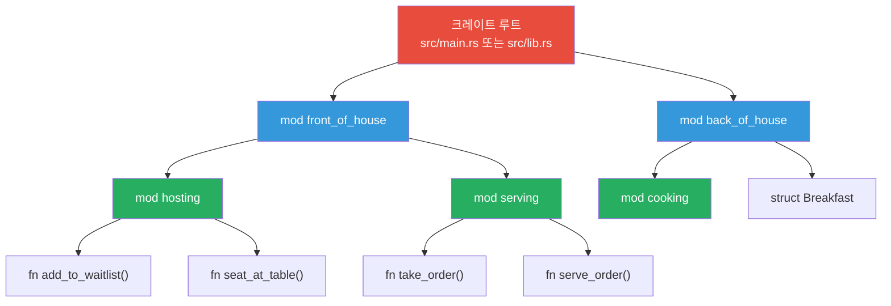

# 크레이트와 모듈 기초

## 모듈 트리 구조



---

## 1. 크레이트 타입: 바이너리 vs 라이브러리

```rust,editable
// 바이너리 크레이트: src/main.rs (실행 가능)
// fn main() { ... }

// 라이브러리 크레이트: src/lib.rs (다른 코드에서 사용)
// pub fn greet() { ... }

// 하나의 패키지에 여러 크레이트 포함 가능:
// - src/main.rs (바이너리 크레이트 1개)
// - src/lib.rs (라이브러리 크레이트 1개)
// - src/bin/extra.rs (추가 바이너리 크레이트)

fn main() {
    println!("바이너리 크레이트: src/main.rs에 fn main() 포함");
    println!("라이브러리 크레이트: src/lib.rs에 공개 API 정의");
}
```

<div class="info-box">

**패키지 구성 요소**

| 구성 요소 | 설명 | 파일 |
|-----------|------|------|
| 패키지 | `Cargo.toml`로 정의, 크레이트들의 묶음 | `Cargo.toml` |
| 크레이트 | 컴파일의 최소 단위 | `src/main.rs`, `src/lib.rs` |
| 모듈 | 코드 구성 단위 | `mod` 키워드로 정의 |

</div>

---

## 2. mod, pub, use, as

```rust,editable
// 모듈 정의
mod math {
    // 기본적으로 비공개 (private)
    fn internal_calc(x: i32) -> i32 {
        x * x
    }

    // pub으로 공개
    pub fn square(x: i32) -> i32 {
        internal_calc(x)
    }

    pub fn cube(x: i32) -> i32 {
        x * x * x
    }

    pub mod geometry {
        pub fn circle_area(radius: f64) -> f64 {
            std::f64::consts::PI * radius * radius
        }

        pub fn rectangle_area(w: f64, h: f64) -> f64 {
            w * h
        }
    }
}

// use로 경로 단축
use math::geometry::circle_area;
// as로 별칭 지정
use math::geometry::rectangle_area as rect_area;

fn main() {
    println!("3^2 = {}", math::square(3));
    println!("3^3 = {}", math::cube(3));

    // use로 가져온 함수 직접 호출
    println!("원 넓이(r=5): {:.2}", circle_area(5.0));
    println!("직사각형 넓이(3x4): {:.2}", rect_area(3.0, 4.0));
}
```

---

## 3. 가시성 제어: pub, pub(crate), pub(super)

```rust,editable
mod outer {
    pub mod inner {
        // 완전 공개
        pub fn public_fn() {
            println!("완전 공개 함수");
        }

        // 크레이트 내에서만 공개
        pub(crate) fn crate_only() {
            println!("크레이트 내부 전용");
        }

        // 부모 모듈에서만 공개
        pub(super) fn parent_only() {
            println!("부모 모듈 전용");
        }

        // 비공개 (기본값)
        fn private_fn() {
            println!("비공개 함수");
        }

        pub fn call_private() {
            private_fn(); // 같은 모듈 내에서는 접근 가능
        }
    }

    pub fn test() {
        inner::public_fn();
        inner::crate_only();
        inner::parent_only();  // pub(super)이므로 부모에서 접근 가능
        // inner::private_fn(); // 에러! 비공개
        inner::call_private();
    }
}

fn main() {
    outer::test();
    outer::inner::public_fn();
    outer::inner::crate_only();  // 같은 크레이트이므로 접근 가능
    // outer::inner::parent_only(); // 에러! outer의 자식만 접근 가능
}
```
