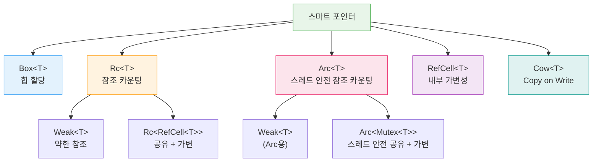

# 스마트 포인터 고급

스마트 포인터는 포인터처럼 동작하면서 추가적인 메타데이터와 기능을 제공하는 데이터 구조입니다. Rust에서 가장 기본적인 포인터는 참조(`&`)이지만, 스마트 포인터는 **소유권**을 가지며 데이터를 관리합니다.

**스마트 포인터란?**
스마트 포인터는 일반 참조와 달리 데이터의 **소유권**을 가집니다. `String`과 `Vec<T>`도 사실 스마트 포인터입니다! 스마트 포인터는 보통 `Deref`와 `Drop` 트레이트를 구현합니다.

## 스마트 포인터 관계도

이 장에서 다루는 내용:

- [Box, Deref, Drop](ch15-01-box-deref-drop.md) — `Box<T>`로 힙 할당하기, `Deref` 트레이트와 역참조 강제 변환, `Drop` 트레이트
- [Rc와 Arc](ch15-02-rc-arc.md) — `Rc<T>` 참조 카운팅, `Arc<T>` 스레드 안전 참조 카운팅
- [RefCell, Cow, Weak](ch15-03-refcell-cow-weak.md) — `RefCell<T>` 내부 가변성, `Rc<RefCell<T>>` 패턴, `Cow<T>`, `Weak<T>` 순환 참조 방지
