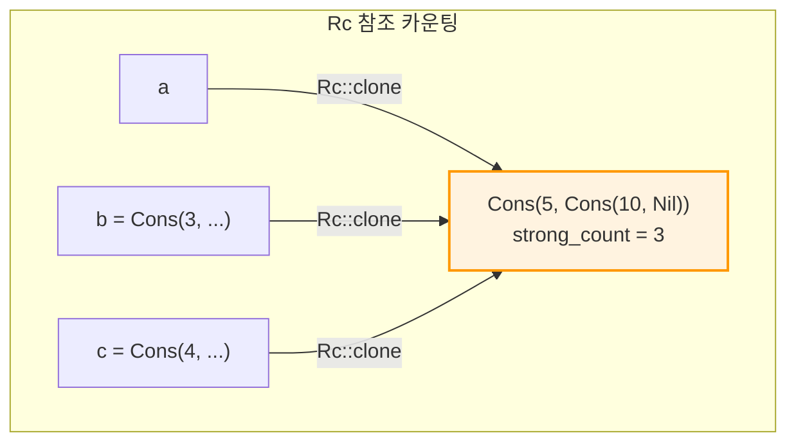

# `Rc<T>`와 `Arc<T>` — 참조 카운팅

## 4. `Rc<T>` — 참조 카운팅

`Rc<T>` (Reference Counted)는 하나의 값에 여러 소유자를 허용합니다. 마지막 소유자가 사라질 때 값이 해제됩니다.

```rust,editable
use std::rc::Rc;

#[derive(Debug)]
enum List {
    Cons(i32, Rc<List>),
    Nil,
}

use List::{Cons, Nil};

fn main() {
    let a = Rc::new(Cons(5, Rc::new(Cons(10, Rc::new(Nil)))));
    println!("a 생성 후 참조 카운트: {}", Rc::strong_count(&a));

    let b = Cons(3, Rc::clone(&a));  // 참조 카운트 증가 (깊은 복사 아님!)
    println!("b 생성 후 참조 카운트: {}", Rc::strong_count(&a));

    {
        let c = Cons(4, Rc::clone(&a));
        println!("c 생성 후 참조 카운트: {}", Rc::strong_count(&a));
    }  // c가 드롭됨

    println!("c 스코프 종료 후 참조 카운트: {}", Rc::strong_count(&a));
}
```



<div class="warning-box">

**`Rc<T>`는 단일 스레드 전용입니다!** 멀티스레드 환경에서는 `Arc<T>`를 사용하세요. 또한 `Rc<T>`는 불변 참조만 제공합니다. 내부 값을 변경하려면 `Rc<RefCell<T>>` 패턴을 사용하세요.

</div>

---

## 5. `Arc<T>` — 스레드 안전 참조 카운팅

`Arc<T>` (Atomically Reference Counted)는 `Rc<T>`의 스레드 안전 버전입니다. 원자적(atomic) 연산을 사용하여 참조 카운트를 관리합니다.

```rust,editable
use std::sync::Arc;
use std::thread;

fn main() {
    let data = Arc::new(vec![1, 2, 3, 4, 5]);
    let mut handles = vec![];

    for i in 0..3 {
        let data_clone = Arc::clone(&data);
        let handle = thread::spawn(move || {
            let sum: i32 = data_clone.iter().sum();
            println!("스레드 {}: 합계 = {}", i, sum);
        });
        handles.push(handle);
    }

    for handle in handles {
        handle.join().unwrap();
    }

    println!("최종 참조 카운트: {}", Arc::strong_count(&data));
}
```

<div class="tip-box">

**`Rc<T>` vs `Arc<T>` 선택 기준:**
- 단일 스레드 → `Rc<T>` (원자적 연산 오버헤드 없음)
- 멀티스레드 → `Arc<T>` (원자적 연산으로 스레드 안전)

</div>
