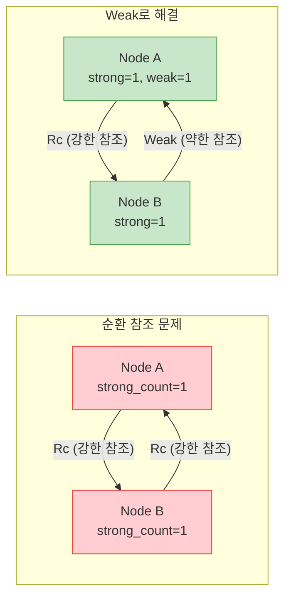

# RefCell, Cow, Weak

## 6. `RefCell<T>` — 내부 가변성

`RefCell<T>`는 **런타임**에 대여 규칙을 검사합니다. 불변 참조를 통해서도 내부 값을 변경할 수 있게 해줍니다.

```rust,editable
use std::cell::RefCell;

fn main() {
    let data = RefCell::new(vec![1, 2, 3]);

    // 불변 대여 (borrow)
    {
        let borrowed = data.borrow();
        println!("읽기: {:?}", borrowed);
    }

    // 가변 대여 (borrow_mut)
    {
        let mut borrowed_mut = data.borrow_mut();
        borrowed_mut.push(4);
        println!("수정 후: {:?}", borrowed_mut);
    }

    // 최종 값 확인
    println!("최종: {:?}", data.borrow());
}
```

<div class="danger-box">

**런타임 패닉 주의!** `RefCell<T>`는 대여 규칙을 런타임에 검사합니다. 불변 대여와 가변 대여가 동시에 존재하면 **패닉**이 발생합니다.

```rust,editable
use std::cell::RefCell;

fn main() {
    let data = RefCell::new(42);

    let borrow1 = data.borrow();     // 불변 대여
    let borrow2 = data.borrow();     // 불변 대여 여러 개는 OK
    println!("{}, {}", borrow1, borrow2);

    // 아래 코드의 주석을 해제하면 런타임 패닉!
    // let mut borrow_mut = data.borrow_mut();  // 불변 대여가 있는데 가변 대여 시도
}
```

</div>

### 대여 규칙 비교

| | 컴파일 타임 (일반 참조) | 런타임 (RefCell) |
|---|---|---|
| 불변 대여 여러 개 | ✅ 허용 | ✅ 허용 |
| 가변 대여 1개만 | ✅ 허용 | ✅ 허용 |
| 불변 + 가변 동시 | ❌ 컴파일 에러 | ❌ 런타임 패닉 |

---

## 7. `Rc<RefCell<T>>` 패턴

여러 소유자가 데이터를 공유하면서 변경도 해야 할 때 이 조합을 사용합니다.

```rust,editable
use std::cell::RefCell;
use std::rc::Rc;

#[derive(Debug)]
struct Node {
    value: i32,
    children: Vec<Rc<RefCell<Node>>>,
}

impl Node {
    fn new(value: i32) -> Rc<RefCell<Node>> {
        Rc::new(RefCell::new(Node {
            value,
            children: vec![],
        }))
    }
}

fn main() {
    let root = Node::new(1);
    let child1 = Node::new(2);
    let child2 = Node::new(3);

    // child1과 child2를 root의 자식으로 추가
    root.borrow_mut().children.push(Rc::clone(&child1));
    root.borrow_mut().children.push(Rc::clone(&child2));

    // child1에도 자식 추가
    let grandchild = Node::new(4);
    child1.borrow_mut().children.push(Rc::clone(&grandchild));

    // 값 변경도 가능!
    grandchild.borrow_mut().value = 42;

    println!("트리 구조: {:#?}", root.borrow());
}
```

---

## 8. `Cow<T>` — Clone on Write

`Cow<T>`는 데이터가 변경이 필요할 때만 복제합니다. 읽기만 할 때는 빌림(borrow), 수정이 필요할 때만 소유(own)합니다.

```rust,editable
use std::borrow::Cow;

fn remove_spaces(input: &str) -> Cow<str> {
    if input.contains(' ') {
        // 변경이 필요 → 복제 후 수정 (Owned)
        Cow::Owned(input.replace(' ', ""))
    } else {
        // 변경 불필요 → 원본 빌림 (Borrowed)
        Cow::Borrowed(input)
    }
}

fn main() {
    let no_spaces = "HelloWorld";
    let with_spaces = "Hello World";

    let result1 = remove_spaces(no_spaces);
    let result2 = remove_spaces(with_spaces);

    println!("결과1: {} (복제됨? {})", result1, matches!(result1, Cow::Owned(_)));
    println!("결과2: {} (복제됨? {})", result2, matches!(result2, Cow::Owned(_)));
}
```

<div class="tip-box">

**`Cow<T>` 사용 시나리오:**
- 대부분의 경우 데이터를 그대로 사용하지만, 가끔 수정이 필요한 경우
- 불필요한 복제를 피해 성능을 최적화할 때
- 함수가 빌린 데이터 또는 소유한 데이터를 모두 반환해야 할 때

</div>

---

## 9. `Weak<T>` — 순환 참조 방지

`Rc<T>`만 사용하면 순환 참조가 발생하여 메모리 누수가 생길 수 있습니다. `Weak<T>`는 소유권을 갖지 않는 약한 참조로, 이를 방지합니다.



```rust,editable
use std::cell::RefCell;
use std::rc::{Rc, Weak};

#[derive(Debug)]
struct Node {
    value: i32,
    parent: RefCell<Weak<Node>>,       // 부모는 Weak 참조
    children: RefCell<Vec<Rc<Node>>>,  // 자식은 Rc 참조
}

fn main() {
    let leaf = Rc::new(Node {
        value: 3,
        parent: RefCell::new(Weak::new()),
        children: RefCell::new(vec![]),
    });

    println!(
        "leaf - strong: {}, weak: {}",
        Rc::strong_count(&leaf),
        Rc::weak_count(&leaf)
    );

    {
        let branch = Rc::new(Node {
            value: 5,
            parent: RefCell::new(Weak::new()),
            children: RefCell::new(vec![Rc::clone(&leaf)]),
        });

        // leaf의 부모를 branch로 설정 (Weak 참조)
        *leaf.parent.borrow_mut() = Rc::downgrade(&branch);

        println!(
            "branch - strong: {}, weak: {}",
            Rc::strong_count(&branch),
            Rc::weak_count(&branch)
        );

        println!(
            "leaf - strong: {}, weak: {}",
            Rc::strong_count(&leaf),
            Rc::weak_count(&leaf)
        );

        // Weak 참조를 통해 부모에 접근
        if let Some(parent) = leaf.parent.borrow().upgrade() {
            println!("leaf의 부모 값: {}", parent.value);
        }
    }
    // branch가 스코프를 벗어남 → 정상 해제 (순환 참조 없음!)

    println!("branch 스코프 종료 후:");
    println!("leaf 부모 접근: {:?}", leaf.parent.borrow().upgrade());
    // None — branch가 이미 해제되었으므로
}
```

<div class="info-box">

**`Weak<T>` 핵심 메서드:**
- `Rc::downgrade(&rc)` → `Weak<T>` 생성
- `weak.upgrade()` → `Option<Rc<T>>` (값이 살아있으면 `Some`, 해제되었으면 `None`)
- `Rc::weak_count(&rc)` → 약한 참조 수 확인

</div>

---

## 스마트 포인터 비교 총정리

| 스마트 포인터 | 소유권 | 가변성 | 스레드 안전 | 주요 용도 |
|---|---|---|---|---|
| `Box<T>` | 단일 | 소유자가 결정 | ✅ | 힙 할당, 재귀 타입 |
| `Rc<T>` | 복수 | 불변만 | ❌ | 단일 스레드 공유 |
| `Arc<T>` | 복수 | 불변만 | ✅ | 멀티스레드 공유 |
| `RefCell<T>` | 단일 | 런타임 가변 | ❌ | 내부 가변성 |
| `Cow<T>` | 조건부 | 필요시 복제 | ✅ | 성능 최적화 |
| `Weak<T>` | 없음 | - | Rc/Arc에 따름 | 순환 참조 방지 |

---

<div class="exercise-box">

### 연습문제

**연습 1: 이중 연결 리스트**

`Rc`, `Weak`, `RefCell`을 사용하여 이중 연결 리스트를 구현하세요.

```rust,editable
use std::cell::RefCell;
use std::rc::{Rc, Weak};

#[derive(Debug)]
struct DNode {
    value: i32,
    next: Option<Rc<RefCell<DNode>>>,
    prev: Option<Weak<RefCell<DNode>>>,  // 약한 참조로 순환 방지
}

impl DNode {
    fn new(value: i32) -> Rc<RefCell<DNode>> {
        Rc::new(RefCell::new(DNode {
            value,
            next: None,
            prev: None,
        }))
    }
}

fn main() {
    let node1 = DNode::new(1);
    let node2 = DNode::new(2);
    let node3 = DNode::new(3);

    // TODO: 노드들을 연결하세요
    // node1 -> node2 -> node3
    // node3.prev -> node2, node2.prev -> node1

    // 힌트: node1.borrow_mut().next = Some(Rc::clone(&node2));
    //       node2.borrow_mut().prev = Some(Rc::downgrade(&node1));

    // 연결 후 순회 테스트
    // 정방향: 1 -> 2 -> 3
    // 역방향: 3 -> 2 -> 1
}
```

**연습 2: Cow를 사용한 문자열 정규화**

입력 문자열에 대문자가 있으면 모두 소문자로 변환하고, 이미 소문자면 원본을 그대로 반환하는 함수를 `Cow<str>`로 작성하세요.

```rust,editable
use std::borrow::Cow;

fn normalize(input: &str) -> Cow<str> {
    // TODO: 구현하세요
    // 힌트: input.chars().any(|c| c.is_uppercase())
    todo!()
}

fn main() {
    let s1 = "hello";
    let s2 = "Hello World";

    let r1 = normalize(s1);
    let r2 = normalize(s2);

    println!("{} → {} (복제: {})", s1, r1, matches!(r1, Cow::Owned(_)));
    println!("{} → {} (복제: {})", s2, r2, matches!(r2, Cow::Owned(_)));
}
```

</div>

---

<div class="quiz-box" onclick="this.classList.toggle('show-answer')">

**퀴즈 1:** `Rc<T>`와 `Arc<T>`의 주요 차이점은 무엇인가요?

<div class="quiz-answer">

`Rc<T>`는 단일 스레드에서만 사용 가능하며, 일반적인 참조 카운팅을 사용합니다. `Arc<T>`는 **원자적(atomic) 연산**을 사용하여 참조 카운트를 관리하므로 **멀티스레드 환경에서 안전**합니다. 원자적 연산에는 약간의 성능 오버헤드가 있으므로, 단일 스레드에서는 `Rc<T>`가 더 효율적입니다.

</div>
</div>

<div class="quiz-box" onclick="this.classList.toggle('show-answer')">

**퀴즈 2:** 왜 `RefCell<T>`의 대여 규칙 위반이 컴파일 에러가 아닌 런타임 패닉을 발생시키나요?

<div class="quiz-answer">

`RefCell<T>`는 **내부 가변성(interior mutability)** 패턴을 구현합니다. 컴파일러는 불변 참조(`&T`)를 통해 내부 값이 변경되는 것을 정적으로 분석할 수 없기 때문에, 대여 규칙 검사를 **런타임으로 미룹니다**. 이를 통해 컴파일러가 보수적으로 거부하는 안전한 코드를 작성할 수 있지만, 프로그래머가 규칙을 지킬 책임이 있습니다.

</div>
</div>

<div class="quiz-box" onclick="this.classList.toggle('show-answer')">

**퀴즈 3:** 순환 참조가 왜 메모리 누수를 일으키며, `Weak<T>`가 이를 어떻게 해결하나요?

<div class="quiz-answer">

순환 참조에서 각 `Rc`가 서로를 참조하면, 참조 카운트가 절대 0이 되지 않아 메모리가 해제되지 않습니다. `Weak<T>`는 **strong_count를 증가시키지 않는 참조**입니다. 따라서 강한 참조가 모두 사라지면 값이 정상적으로 해제됩니다. `Weak` 참조를 통해 값에 접근하려면 `upgrade()`를 호출해야 하며, 값이 이미 해제되었으면 `None`을 반환합니다.

</div>
</div>

<div class="quiz-box" onclick="this.classList.toggle('show-answer')">

**퀴즈 4:** Deref 강제 변환(Deref coercion)이란 무엇이며, 어떤 이점이 있나요?

<div class="quiz-answer">

Deref 강제 변환은 `Deref` 트레이트를 구현한 타입의 참조를 다른 타입의 참조로 **자동 변환**하는 기능입니다. 예를 들어 `&String`이 `&str`로, `&Box<T>`가 `&T`로 자동 변환됩니다. 이를 통해 함수 호출 시 명시적인 역참조와 슬라이스 변환 코드를 생략할 수 있어 코드가 더 깔끔해집니다.

</div>
</div>

---

<div class="summary-box">

### 📝 요약

1. **`Box<T>`**: 힙에 데이터를 할당합니다. 재귀 타입과 트레이트 객체에 필수입니다.
2. **`Deref` / `Drop`**: 스마트 포인터의 핵심 트레이트로, 역참조 동작과 해제 동작을 정의합니다.
3. **`Rc<T>`**: 단일 스레드에서 여러 소유자가 데이터를 공유합니다.
4. **`Arc<T>`**: 멀티스레드 환경에서 안전하게 데이터를 공유합니다.
5. **`RefCell<T>`**: 런타임 대여 검사로 내부 가변성을 제공합니다.
6. **`Rc<RefCell<T>>`**: 여러 소유자가 데이터를 공유하면서 변경할 수 있습니다.
7. **`Cow<T>`**: 필요할 때만 복제하여 성능을 최적화합니다.
8. **`Weak<T>`**: 순환 참조를 방지하여 메모리 누수를 예방합니다.

</div>
