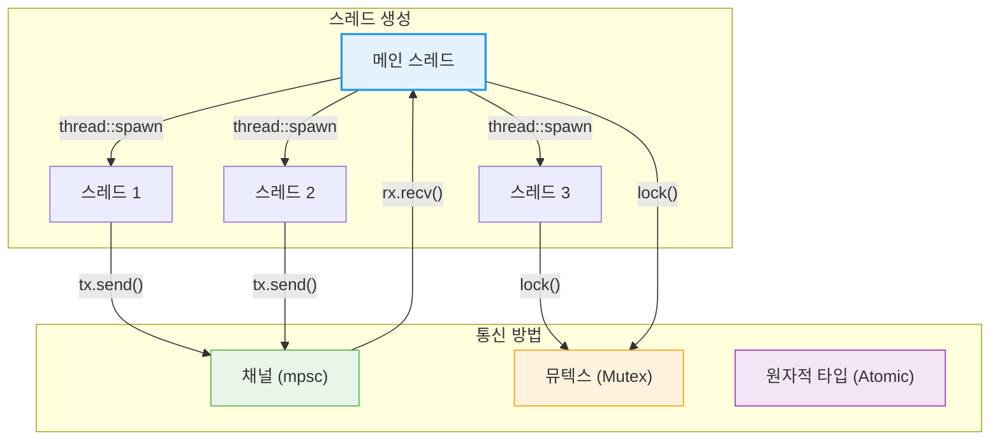

# 동시성 고급

Rust는 **"두려움 없는 동시성(Fearless Concurrency)"**을 제공합니다. 소유권 시스템과 타입 시스템을 활용하여 많은 동시성 버그를 컴파일 타임에 잡아냅니다.

**동시성 vs 병렬성:**
- **동시성(Concurrency)**: 여러 작업이 겹치는 시간 동안 진행되는 것 (논리적)
- **병렬성(Parallelism)**: 여러 작업이 물리적으로 동시에 실행되는 것
- Rust는 두 가지 모두를 안전하게 지원합니다.

## 스레드 통신 흐름

이 장에서 다루는 내용:

- [스레드와 move 클로저](ch16-01-threads.md) — 스레드 생성, JoinHandle, move 클로저와 데이터 공유
- [채널](ch16-02-channels.md) — mpsc 채널, 여러 생산자, 동기 채널
- [공유 상태와 동기화](ch16-03-shared-state.md) — Mutex, RwLock, Arc<Mutex<T>>, Send/Sync, 교착 상태 방지, Rayon, 스레드 풀
