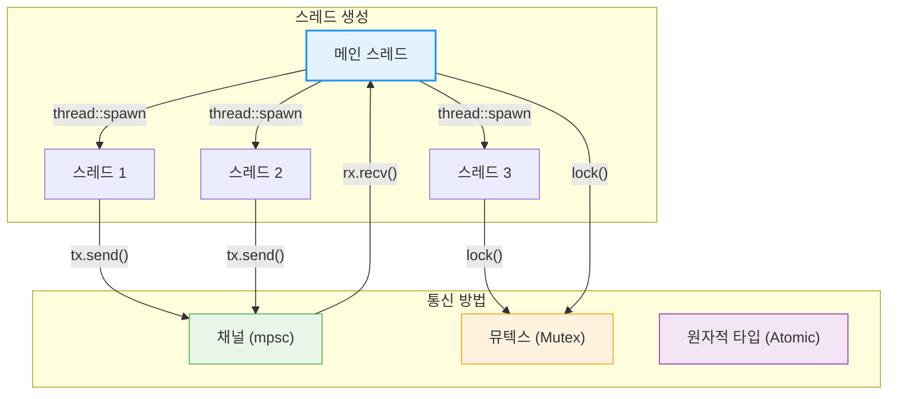
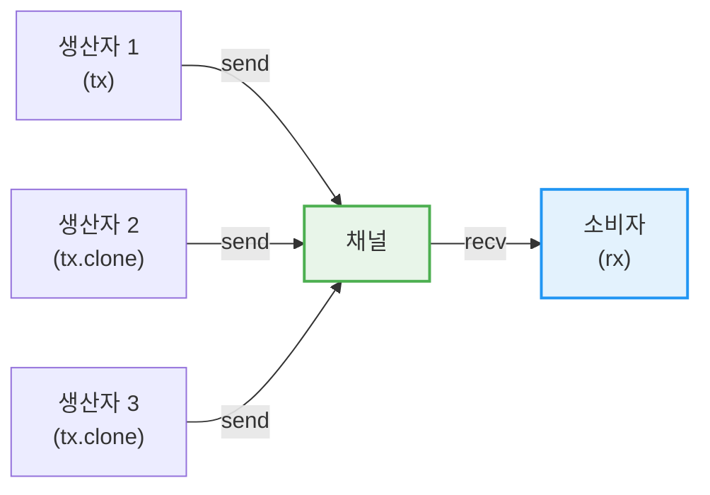
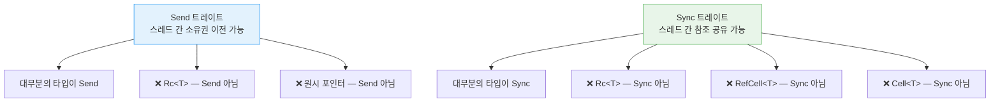
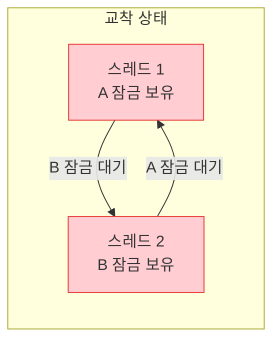

# 동시성 <span class="badge-advanced">고급</span>

Rust는 **"두려움 없는 동시성(Fearless Concurrency)"**을 제공합니다. 소유권 시스템과 타입 시스템을 활용하여 많은 동시성 버그를 컴파일 타임에 잡아냅니다.

<div class="info-box">

**동시성 vs 병렬성:**
- **동시성(Concurrency)**: 여러 작업이 겹치는 시간 동안 진행되는 것 (논리적)
- **병렬성(Parallelism)**: 여러 작업이 물리적으로 동시에 실행되는 것
- Rust는 두 가지 모두를 안전하게 지원합니다.

</div>

## 스레드 통신 흐름



---

## 1. 스레드 생성 — `std::thread::spawn`

### 기본 스레드 생성

```rust,editable
use std::thread;
use std::time::Duration;

fn main() {
    // 새 스레드 생성
    let handle = thread::spawn(|| {
        for i in 1..=5 {
            println!("스레드에서: {}", i);
            thread::sleep(Duration::from_millis(100));
        }
    });

    // 메인 스레드 작업
    for i in 1..=3 {
        println!("메인에서: {}", i);
        thread::sleep(Duration::from_millis(150));
    }

    // 스레드 완료 대기
    handle.join().unwrap();
    println!("모든 스레드 완료!");
}
```

### JoinHandle과 반환값

```rust,editable
use std::thread;

fn main() {
    // 스레드에서 값 반환
    let handle = thread::spawn(|| {
        let mut sum = 0;
        for i in 1..=100 {
            sum += i;
        }
        sum  // 반환값
    });

    // join()은 Result를 반환 — 스레드의 반환값을 꺼낼 수 있음
    let result = handle.join().unwrap();
    println!("1부터 100까지의 합: {}", result);
}
```

---

## 2. `move` 클로저와 스레드

스레드에서 외부 데이터를 사용하려면 `move` 클로저로 소유권을 이전해야 합니다.

```rust,editable
use std::thread;

fn main() {
    let message = String::from("안녕하세요!");

    // move: message의 소유권을 스레드로 이전
    let handle = thread::spawn(move || {
        println!("스레드에서 메시지: {}", message);
    });

    // 여기서 message를 사용하면 컴파일 에러!
    // println!("{}", message);  // ❌ 소유권이 이미 이전됨

    handle.join().unwrap();
}
```

<div class="warning-box">

**왜 `move`가 필요한가요?** 스레드는 생성한 스코프보다 오래 살 수 있습니다. 메인 스레드의 지역 변수가 이미 해제된 후에도 생성된 스레드가 실행될 수 있으므로, 참조가 아닌 **소유권 이전**이 필요합니다.

</div>

### 여러 스레드에서 데이터 공유

```rust,editable
use std::sync::Arc;
use std::thread;

fn main() {
    let data = Arc::new(vec![1, 2, 3, 4, 5, 6, 7, 8, 9, 10]);
    let mut handles = vec![];

    // 데이터를 4개의 스레드에서 병렬로 처리
    let chunk_size = (data.len() + 3) / 4;

    for i in 0..4 {
        let data = Arc::clone(&data);
        let handle = thread::spawn(move || {
            let start = i * chunk_size;
            let end = (start + chunk_size).min(data.len());
            if start < data.len() {
                let chunk_sum: i32 = data[start..end].iter().sum();
                println!("스레드 {}: [{}-{}) 합계 = {}", i, start, end, chunk_sum);
                chunk_sum
            } else {
                0
            }
        });
        handles.push(handle);
    }

    let total: i32 = handles
        .into_iter()
        .map(|h| h.join().unwrap())
        .sum();

    println!("전체 합계: {}", total);
}
```

---

## 3. 채널 — `mpsc::channel`

**mpsc** = Multiple Producer, Single Consumer. 여러 송신자가 하나의 수신자에게 메시지를 보낼 수 있습니다.



### 기본 채널 사용

```rust,editable
use std::sync::mpsc;
use std::thread;

fn main() {
    // 채널 생성: tx(송신), rx(수신)
    let (tx, rx) = mpsc::channel();

    thread::spawn(move || {
        let messages = vec![
            String::from("안녕하세요"),
            String::from("Rust"),
            String::from("채널입니다"),
        ];

        for msg in messages {
            tx.send(msg).unwrap();
            thread::sleep(std::time::Duration::from_millis(200));
        }
        // tx가 드롭되면 채널이 닫힘
    });

    // 수신 — 이터레이터로 사용
    for received in rx {
        println!("수신: {}", received);
    }
}
```

### 여러 생산자 (Multiple Producers)

```rust,editable
use std::sync::mpsc;
use std::thread;
use std::time::Duration;

fn main() {
    let (tx, rx) = mpsc::channel();

    // 3개의 생산자
    for id in 0..3 {
        let tx_clone = tx.clone();
        thread::spawn(move || {
            for i in 0..3 {
                let msg = format!("[생산자 {}] 메시지 {}", id, i);
                tx_clone.send(msg).unwrap();
                thread::sleep(Duration::from_millis(100));
            }
        });
    }

    // 원본 tx를 드롭해야 채널이 닫힘
    drop(tx);

    // 모든 메시지 수신
    for received in rx {
        println!("{}", received);
    }

    println!("모든 생산자 완료!");
}
```

### `sync_channel` — 동기 채널

```rust,editable
use std::sync::mpsc;
use std::thread;

fn main() {
    // 버퍼 크기 2인 동기 채널
    let (tx, rx) = mpsc::sync_channel(2);

    thread::spawn(move || {
        for i in 0..5 {
            println!("전송 시도: {}", i);
            tx.send(i).unwrap();  // 버퍼가 가득 차면 블록됨
            println!("전송 완료: {}", i);
        }
    });

    thread::sleep(std::time::Duration::from_secs(1));

    for val in rx {
        println!("수신: {}", val);
    }
}
```

<div class="tip-box">

**`channel()` vs `sync_channel(n)`:**
- `channel()`: 무한 버퍼 — 송신자가 절대 블록되지 않음
- `sync_channel(n)`: n개의 버퍼 — 버퍼가 가득 차면 송신자가 블록됨
- `sync_channel(0)`: 랑데부 채널 — 수신자가 받을 때까지 송신자 블록

</div>

---

## 4. `Mutex<T>`와 `RwLock<T>`

### Mutex — 상호 배제

```rust,editable
use std::sync::{Arc, Mutex};
use std::thread;

fn main() {
    let counter = Arc::new(Mutex::new(0));
    let mut handles = vec![];

    for _ in 0..10 {
        let counter = Arc::clone(&counter);
        let handle = thread::spawn(move || {
            // lock()으로 뮤텍스 획득
            let mut num = counter.lock().unwrap();
            *num += 1;
            // MutexGuard가 스코프를 벗어나면 자동 잠금 해제
        });
        handles.push(handle);
    }

    for handle in handles {
        handle.join().unwrap();
    }

    println!("최종 카운트: {}", *counter.lock().unwrap());
}
```

### RwLock — 읽기-쓰기 잠금

```rust,editable
use std::sync::{Arc, RwLock};
use std::thread;

fn main() {
    let data = Arc::new(RwLock::new(vec![1, 2, 3]));
    let mut handles = vec![];

    // 여러 읽기 스레드
    for i in 0..3 {
        let data = Arc::clone(&data);
        handles.push(thread::spawn(move || {
            let read = data.read().unwrap();  // 읽기 잠금 (동시 가능)
            println!("읽기 스레드 {}: {:?}", i, *read);
        }));
    }

    // 쓰기 스레드
    {
        let data = Arc::clone(&data);
        handles.push(thread::spawn(move || {
            let mut write = data.write().unwrap();  // 쓰기 잠금 (배타적)
            write.push(4);
            println!("쓰기 완료: {:?}", *write);
        }));
    }

    for handle in handles {
        handle.join().unwrap();
    }

    println!("최종 데이터: {:?}", *data.read().unwrap());
}
```

<div class="info-box">

**`Mutex` vs `RwLock` 선택 기준:**
- 읽기가 훨씬 많은 경우 → `RwLock` (여러 읽기 동시 가능)
- 쓰기가 빈번한 경우 → `Mutex` (더 단순하고 오버헤드 적음)
- 잠금 시간이 매우 짧은 경우 → `Mutex`가 보통 더 효율적

</div>

---

## 5. `Arc<Mutex<T>>` 패턴

스레드 간 공유 가변 데이터를 위한 가장 일반적인 패턴입니다.

```rust,editable
use std::collections::HashMap;
use std::sync::{Arc, Mutex};
use std::thread;

fn main() {
    // 스레드 안전 공유 HashMap
    let scores: Arc<Mutex<HashMap<String, i32>>> =
        Arc::new(Mutex::new(HashMap::new()));

    let mut handles = vec![];

    let players = vec![
        ("Alice", 95),
        ("Bob", 87),
        ("Charlie", 92),
        ("Diana", 98),
    ];

    for (name, score) in players {
        let scores = Arc::clone(&scores);
        let handle = thread::spawn(move || {
            let mut map = scores.lock().unwrap();
            map.insert(name.to_string(), score);
            println!("{}: {} 등록 완료", name, score);
        });
        handles.push(handle);
    }

    for handle in handles {
        handle.join().unwrap();
    }

    let final_scores = scores.lock().unwrap();
    println!("\n최종 점수판:");
    for (name, score) in final_scores.iter() {
        println!("  {} → {}", name, score);
    }
}
```

---

## 6. `Send`와 `Sync` 트레이트



<div class="info-box">

**`Send`와 `Sync`는 마커 트레이트입니다:**
- **`Send`**: 소유권을 다른 스레드로 이전할 수 있는 타입
- **`Sync`**: 여러 스레드에서 참조(`&T`)를 통해 접근할 수 있는 타입
- `T`가 `Sync`이면 `&T`는 `Send`입니다
- 이 트레이트들은 자동으로 구현되며, 수동 구현은 `unsafe`가 필요합니다

</div>

```rust,editable
use std::sync::{Arc, Mutex};
use std::thread;

// Send + Sync 여부 컴파일 타임 확인 헬퍼
fn assert_send<T: Send>() {}
fn assert_sync<T: Sync>() {}

fn main() {
    // 이들은 Send + Sync
    assert_send::<i32>();
    assert_sync::<i32>();
    assert_send::<String>();
    assert_sync::<String>();
    assert_send::<Arc<Mutex<i32>>>();
    assert_sync::<Arc<Mutex<i32>>>();

    // Rc는 Send도 Sync도 아님
    // assert_send::<std::rc::Rc<i32>>();  // ❌ 컴파일 에러!
    // assert_sync::<std::rc::Rc<i32>>();  // ❌ 컴파일 에러!

    // RefCell은 Send이지만 Sync 아님
    assert_send::<std::cell::RefCell<i32>>();
    // assert_sync::<std::cell::RefCell<i32>>();  // ❌ 컴파일 에러!

    println!("타입 검사 통과!");
}
```

---

## 7. 교착 상태(Deadlock) 방지



<div class="danger-box">

**교착 상태(Deadlock) 시나리오:** 두 스레드가 서로 상대방이 보유한 잠금을 기다리면 영원히 블록됩니다. Rust는 교착 상태를 컴파일 타임에 방지하지 **못합니다!**

</div>

```rust,editable
use std::sync::{Arc, Mutex};
use std::thread;

fn main() {
    let resource_a = Arc::new(Mutex::new("리소스 A"));
    let resource_b = Arc::new(Mutex::new("리소스 B"));

    // ✅ 교착 상태 방지: 항상 같은 순서로 잠금 획득
    let r_a = Arc::clone(&resource_a);
    let r_b = Arc::clone(&resource_b);

    let handle1 = thread::spawn(move || {
        let a = r_a.lock().unwrap();  // 항상 A 먼저
        let b = r_b.lock().unwrap();  // 그 다음 B
        println!("스레드 1: {}, {}", a, b);
    });

    let r_a = Arc::clone(&resource_a);
    let r_b = Arc::clone(&resource_b);

    let handle2 = thread::spawn(move || {
        let a = r_a.lock().unwrap();  // 항상 A 먼저 (같은 순서!)
        let b = r_b.lock().unwrap();  // 그 다음 B
        println!("스레드 2: {}, {}", a, b);
    });

    handle1.join().unwrap();
    handle2.join().unwrap();
    println!("교착 상태 없이 완료!");
}
```

<div class="tip-box">

**교착 상태 방지 전략:**
1. **잠금 순서 통일**: 모든 스레드가 같은 순서로 잠금 획득
2. **잠금 범위 최소화**: 가능한 짧은 시간만 잠금 보유
3. **try_lock 사용**: 논블로킹 잠금 시도로 교착 상태 회피
4. **단일 잠금**: 가능하면 하나의 `Mutex`로 통합

</div>

---

## 8. Rayon — 데이터 병렬 처리

<div class="info-box">

**Rayon**은 데이터 병렬 처리를 쉽게 만들어주는 라이브러리입니다. `Cargo.toml`에 `rayon = "1.10"`을 추가하여 사용합니다. 기존 이터레이터 코드를 최소한으로 변경하여 병렬화할 수 있습니다.

</div>

```rust,editable
// 참고: 이 코드는 rayon 크레이트가 필요합니다.
// Cargo.toml에 rayon = "1.10" 추가 필요

// use rayon::prelude::*;

fn main() {
    // 순차 처리
    let numbers: Vec<i64> = (1..=1_000_000).collect();
    let sum_seq: i64 = numbers.iter().sum();
    println!("순차 합계: {}", sum_seq);

    // Rayon 병렬 처리 (이터레이터를 par_iter()로 변경만 하면 됨!)
    // let sum_par: i64 = numbers.par_iter().sum();
    // println!("병렬 합계: {}", sum_par);

    // 병렬 map + filter
    // let result: Vec<i64> = numbers
    //     .par_iter()
    //     .filter(|&&x| x % 2 == 0)     // 짝수만
    //     .map(|&x| x * x)               // 제곱
    //     .collect();

    // 병렬 정렬
    // let mut data = vec![5, 3, 8, 1, 9, 2, 7, 4, 6];
    // data.par_sort();  // 병렬 정렬!

    println!("Rayon 예제 (크레이트 추가 후 주석 해제)");
}
```

### Rayon 사용 전후 비교

```rust,editable
fn main() {
    // 순차 처리 (일반 이터레이터)
    let data: Vec<u64> = (1..=100).collect();

    let sequential: Vec<u64> = data
        .iter()
        .filter(|&&x| x % 3 == 0)
        .map(|&x| x * x)
        .collect();

    println!("3의 배수의 제곱: {:?}", &sequential[..5]);

    // Rayon 병렬 처리 — .iter()를 .par_iter()로만 변경!
    // let parallel: Vec<u64> = data
    //     .par_iter()         // ← 이 한 줄만 변경!
    //     .filter(|&&x| x % 3 == 0)
    //     .map(|&x| x * x)
    //     .collect();
}
```

---

## 실전 예제: 스레드 풀 패턴

```rust,editable
use std::sync::{mpsc, Arc, Mutex};
use std::thread;

struct ThreadPool {
    workers: Vec<thread::JoinHandle<()>>,
    sender: Option<mpsc::Sender<Box<dyn FnOnce() + Send + 'static>>>,
}

impl ThreadPool {
    fn new(size: usize) -> ThreadPool {
        let (sender, receiver) = mpsc::channel::<Box<dyn FnOnce() + Send + 'static>>();
        let receiver = Arc::new(Mutex::new(receiver));
        let mut workers = Vec::with_capacity(size);

        for id in 0..size {
            let receiver = Arc::clone(&receiver);
            workers.push(thread::spawn(move || loop {
                let message = receiver.lock().unwrap().recv();
                match message {
                    Ok(job) => {
                        println!("워커 {} 작업 시작", id);
                        job();
                    }
                    Err(_) => {
                        println!("워커 {} 종료", id);
                        break;
                    }
                }
            }));
        }

        ThreadPool {
            workers,
            sender: Some(sender),
        }
    }

    fn execute<F>(&self, f: F)
    where
        F: FnOnce() + Send + 'static,
    {
        self.sender.as_ref().unwrap().send(Box::new(f)).unwrap();
    }
}

impl Drop for ThreadPool {
    fn drop(&mut self) {
        drop(self.sender.take()); // 채널 닫기

        for worker in self.workers.drain(..) {
            worker.join().unwrap();
        }
    }
}

fn main() {
    let pool = ThreadPool::new(4);

    for i in 0..8 {
        pool.execute(move || {
            println!("작업 {} 실행 중 (스레드: {:?})", i, thread::current().id());
            thread::sleep(std::time::Duration::from_millis(100));
        });
    }

    // pool이 Drop되면 모든 작업 완료 후 스레드 종료
    drop(pool);
    println!("모든 작업 완료!");
}
```

---

<div class="exercise-box">

### 연습문제

**연습 1: 채널을 이용한 단어 수 세기**

여러 스레드가 각각 문자열의 단어 수를 세어 채널로 보내고, 메인 스레드가 합산하세요.

```rust,editable
use std::sync::mpsc;
use std::thread;

fn main() {
    let texts = vec![
        "Rust는 안전하고 빠른 시스템 프로그래밍 언어입니다",
        "동시성 프로그래밍을 두려움 없이 할 수 있습니다",
        "소유권 시스템이 메모리 안전성을 보장합니다",
        "제로 비용 추상화를 제공합니다",
    ];

    let (tx, rx) = mpsc::channel();

    for text in texts {
        let tx = tx.clone();
        // TODO: 각 텍스트의 단어 수를 세어 채널로 전송하세요
        // 힌트: text.split_whitespace().count()
    }
    drop(tx);

    // TODO: 수신한 단어 수를 합산하세요
    let total: usize = 0; // 수정하세요

    println!("총 단어 수: {}", total);
}
```

**연습 2: 공유 카운터**

`Arc<Mutex<T>>`를 사용하여 여러 스레드에서 동시에 HashMap의 값을 업데이트하세요.

```rust,editable
use std::collections::HashMap;
use std::sync::{Arc, Mutex};
use std::thread;

fn main() {
    let word_counts: Arc<Mutex<HashMap<char, usize>>> =
        Arc::new(Mutex::new(HashMap::new()));

    let words = vec!["hello", "world", "rust", "hello", "rust", "rust"];

    // TODO: 각 단어의 첫 글자를 세는 스레드를 만드세요
    // 예: h→2, w→1, r→3

    // 결과 출력
    let counts = word_counts.lock().unwrap();
    for (ch, count) in counts.iter() {
        println!("'{}': {}회", ch, count);
    }
}
```

</div>

---

<div class="quiz-box" onclick="this.classList.toggle('show-answer')">

**퀴즈 1:** `Mutex`의 `lock()` 메서드가 `Result`를 반환하는 이유는 무엇인가요?

<div class="quiz-answer">

잠금을 보유한 스레드가 패닉하면 `Mutex`는 **오염(poisoned)** 상태가 됩니다. 이 경우 `lock()`은 `Err(PoisonError)`를 반환합니다. 이를 통해 다른 스레드가 잠재적으로 손상된 데이터에 접근하는 것을 방지합니다. `unwrap()` 대신 적절한 에러 처리를 하거나, `into_inner()`로 강제 접근할 수 있습니다.

</div>
</div>

<div class="quiz-box" onclick="this.classList.toggle('show-answer')">

**퀴즈 2:** 왜 `Rc<T>`를 스레드 간에 공유할 수 없나요?

<div class="quiz-answer">

`Rc<T>`는 `Send` 트레이트를 구현하지 않습니다. `Rc<T>`의 참조 카운팅은 원자적 연산이 아니므로, 여러 스레드에서 동시에 카운트를 수정하면 **데이터 레이스**가 발생합니다. 스레드 간 공유에는 원자적 연산을 사용하는 `Arc<T>`를 사용해야 합니다.

</div>
</div>

<div class="quiz-box" onclick="this.classList.toggle('show-answer')">

**퀴즈 3:** `mpsc` 채널에서 송신자(`tx`)를 `drop`하면 어떤 일이 발생하나요?

<div class="quiz-answer">

모든 송신자(`tx`)가 드롭되면 채널이 **닫힙니다**. 이후 수신자(`rx`)의 `recv()`는 `Err(RecvError)`를 반환하고, `for msg in rx` 이터레이터는 종료됩니다. 이것이 수신 측에서 "더 이상 메시지가 없다"는 것을 알 수 있는 방법입니다. 따라서 `tx.clone()`을 사용할 때 원본 `tx`도 적절히 드롭해야 합니다.

</div>
</div>

<div class="quiz-box" onclick="this.classList.toggle('show-answer')">

**퀴즈 4:** `Mutex<T>`와 `RwLock<T>`의 차이점은 무엇인가요?

<div class="quiz-answer">

- **`Mutex<T>`**: 한 번에 하나의 스레드만 접근 가능 (읽기/쓰기 구분 없음)
- **`RwLock<T>`**: 여러 읽기 스레드가 동시에 접근 가능(`read()`), 쓰기는 배타적(`write()`)

읽기가 주된 작업이면 `RwLock`이 성능상 유리합니다. 하지만 `RwLock`은 쓰기 기아(write starvation) 문제가 있을 수 있고, 잠금 관리 오버헤드가 더 큽니다.

</div>
</div>

---

<div class="summary-box">

### 📝 요약

1. **스레드 생성**: `thread::spawn`으로 스레드를 만들고 `JoinHandle`로 관리합니다.
2. **`move` 클로저**: 스레드에 데이터 소유권을 이전할 때 사용합니다.
3. **채널 (`mpsc`)**: 메시지 전달 방식의 동시성 — "공유 메모리 대신 통신으로 공유"합니다.
4. **`Mutex<T>`**: 상호 배제 잠금으로 공유 데이터를 보호합니다.
5. **`RwLock<T>`**: 읽기는 동시에, 쓰기는 배타적으로 접근합니다.
6. **`Arc<Mutex<T>>`**: 스레드 간 공유 가변 데이터의 표준 패턴입니다.
7. **`Send` / `Sync`**: 컴파일러가 스레드 안전성을 보장하는 마커 트레이트입니다.
8. **Rayon**: `.iter()`를 `.par_iter()`로 바꾸기만 하면 데이터 병렬 처리가 됩니다.

</div>
