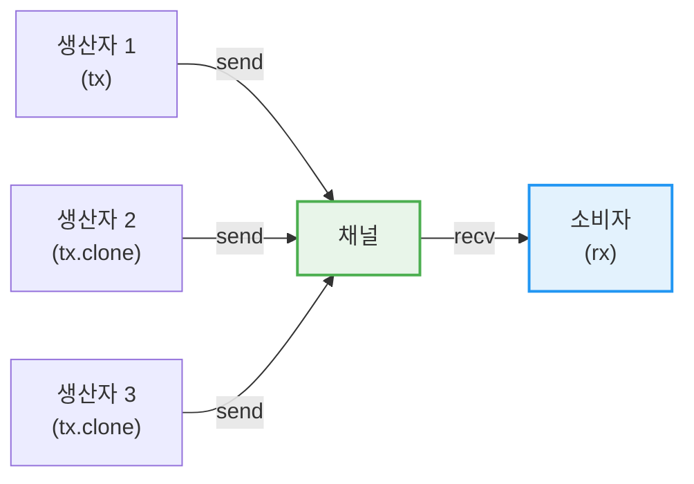

# 채널

## 3. 채널 — `mpsc::channel`

**mpsc** = Multiple Producer, Single Consumer. 여러 송신자가 하나의 수신자에게 메시지를 보낼 수 있습니다.



### 기본 채널 사용

```rust,editable
use std::sync::mpsc;
use std::thread;

fn main() {
    // 채널 생성: tx(송신), rx(수신)
    let (tx, rx) = mpsc::channel();

    thread::spawn(move || {
        let messages = vec![
            String::from("안녕하세요"),
            String::from("Rust"),
            String::from("채널입니다"),
        ];

        for msg in messages {
            tx.send(msg).unwrap();
            thread::sleep(std::time::Duration::from_millis(200));
        }
        // tx가 드롭되면 채널이 닫힘
    });

    // 수신 — 이터레이터로 사용
    for received in rx {
        println!("수신: {}", received);
    }
}
```

### 여러 생산자 (Multiple Producers)

```rust,editable
use std::sync::mpsc;
use std::thread;
use std::time::Duration;

fn main() {
    let (tx, rx) = mpsc::channel();

    // 3개의 생산자
    for id in 0..3 {
        let tx_clone = tx.clone();
        thread::spawn(move || {
            for i in 0..3 {
                let msg = format!("[생산자 {}] 메시지 {}", id, i);
                tx_clone.send(msg).unwrap();
                thread::sleep(Duration::from_millis(100));
            }
        });
    }

    // 원본 tx를 드롭해야 채널이 닫힘
    drop(tx);

    // 모든 메시지 수신
    for received in rx {
        println!("{}", received);
    }

    println!("모든 생산자 완료!");
}
```

### `sync_channel` — 동기 채널

```rust,editable
use std::sync::mpsc;
use std::thread;

fn main() {
    // 버퍼 크기 2인 동기 채널
    let (tx, rx) = mpsc::sync_channel(2);

    thread::spawn(move || {
        for i in 0..5 {
            println!("전송 시도: {}", i);
            tx.send(i).unwrap();  // 버퍼가 가득 차면 블록됨
            println!("전송 완료: {}", i);
        }
    });

    thread::sleep(std::time::Duration::from_secs(1));

    for val in rx {
        println!("수신: {}", val);
    }
}
```

<div class="tip-box">

**`channel()` vs `sync_channel(n)`:**
- `channel()`: 무한 버퍼 — 송신자가 절대 블록되지 않음
- `sync_channel(n)`: n개의 버퍼 — 버퍼가 가득 차면 송신자가 블록됨
- `sync_channel(0)`: 랑데부 채널 — 수신자가 받을 때까지 송신자 블록

</div>
