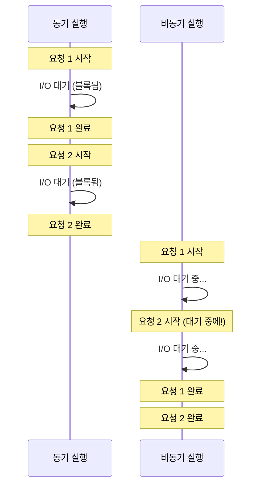
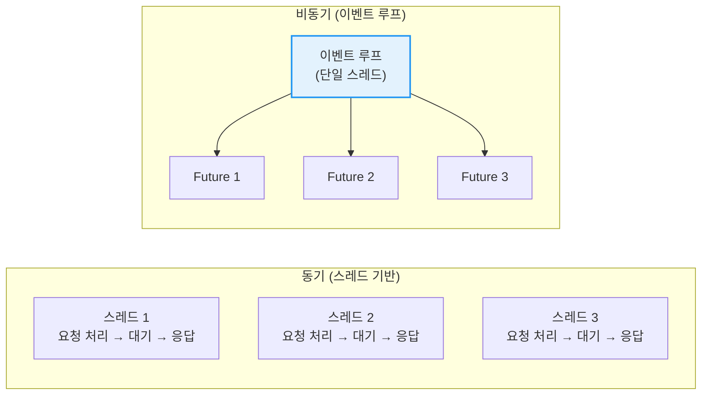

# 비동기 프로그래밍 고급

비동기 프로그래밍은 I/O 바운드 작업(네트워크 요청, 파일 읽기 등)을 효율적으로 처리하기 위한 프로그래밍 패러다임입니다. Rust는 **제로 비용 추상화** 원칙에 따라 비동기 프로그래밍을 지원합니다.

**왜 비동기인가?** 동기 코드에서 I/O 작업을 기다리는 동안 스레드는 아무것도 하지 않습니다. 비동기 코드는 대기 시간 동안 다른 작업을 실행할 수 있어 시스템 리소스를 훨씬 효율적으로 활용합니다. 수천 개의 동시 연결을 처리하는 웹 서버에서 특히 중요합니다.

## 동기 vs 비동기 실행 흐름

이 장에서 다루는 내용:

- [async/await와 Future](ch17-01-async-await.md) — async fn, await, Future 트레이트
- [Tokio 런타임](ch17-02-tokio.md) — Tokio 기본 사용법, spawn, select!, 비동기 I/O
- [스트림, Pin, 에러 처리와 실전 패턴](ch17-03-streams-pin-patterns.md) — 비동기 스트림, Pin/Unpin, 에러 처리, 흔한 실수, 실전 패턴
