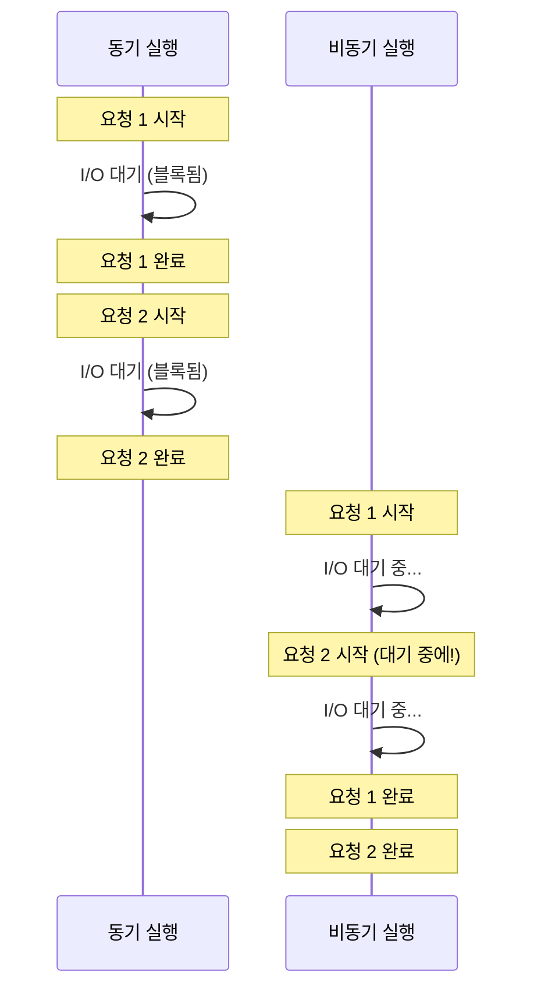
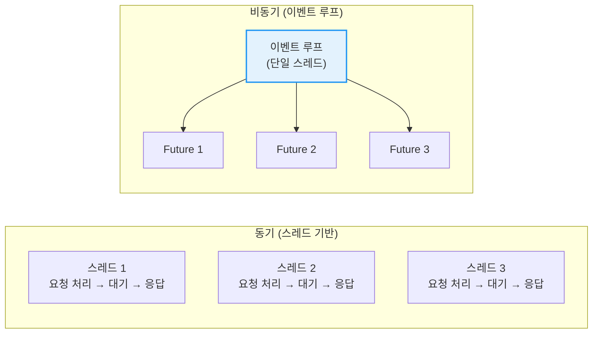
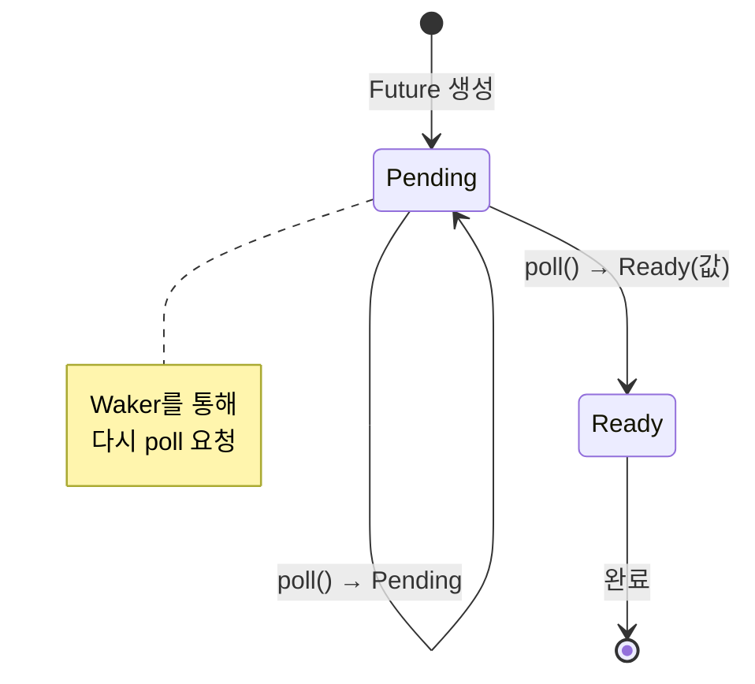
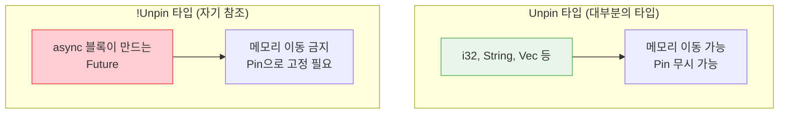

# 비동기 프로그래밍 <span class="badge-advanced">고급</span>

비동기 프로그래밍은 I/O 바운드 작업(네트워크 요청, 파일 읽기 등)을 효율적으로 처리하기 위한 프로그래밍 패러다임입니다. Rust는 **제로 비용 추상화** 원칙에 따라 비동기 프로그래밍을 지원합니다.

<div class="info-box">

**왜 비동기인가?** 동기 코드에서 I/O 작업을 기다리는 동안 스레드는 아무것도 하지 않습니다. 비동기 코드는 대기 시간 동안 다른 작업을 실행할 수 있어 시스템 리소스를 훨씬 효율적으로 활용합니다. 수천 개의 동시 연결을 처리하는 웹 서버에서 특히 중요합니다.

</div>

## 동기 vs 비동기 실행 흐름





---

## 1. `async fn`과 `await`

### 기본 문법

```rust,editable
// async fn은 Future를 반환하는 함수입니다
async fn greet(name: &str) -> String {
    format!("안녕하세요, {}님!", name)
}

async fn compute(x: i32, y: i32) -> i32 {
    // 비동기 작업 시뮬레이션
    x + y
}

// async 블록도 사용 가능
fn make_future() -> impl std::future::Future<Output = i32> {
    async {
        let a = compute(10, 20).await;
        let b = compute(30, 40).await;
        a + b
    }
}

// 참고: 실행하려면 비동기 런타임이 필요합니다.
// 여기서는 개념만 보여줍니다.
fn main() {
    // async fn을 호출하면 즉시 실행되지 않고 Future를 반환합니다!
    let future = greet("Rust");
    println!("Future 생성됨 (아직 실행 안 됨)");

    // Future를 실행하려면 런타임에서 .await 해야 합니다
    // greet("Rust").await;  // async 컨텍스트에서만 사용 가능

    // 간단한 실행: futures::executor::block_on 또는 tokio 사용
    println!("비동기 런타임이 필요합니다!");
}
```

<div class="warning-box">

**핵심 개념:** `async fn`을 호출하면 **즉시 실행되지 않습니다!** `Future`를 반환하며, 이 `Future`가 `.await`되거나 런타임에 의해 poll될 때 비로소 실행됩니다. 이를 **게으른 실행(lazy evaluation)**이라 합니다.

</div>

---

## 2. `Future` 트레이트

Rust의 비동기 시스템의 핵심은 `Future` 트레이트입니다.

```rust,editable
use std::future::Future;
use std::pin::Pin;
use std::task::{Context, Poll};

// Future 트레이트 정의 (표준 라이브러리)
// trait Future {
//     type Output;
//     fn poll(self: Pin<&mut Self>, cx: &mut Context<'_>) -> Poll<Self::Output>;
// }

// 수동 Future 구현 예시
struct CountDown {
    count: u32,
}

impl Future for CountDown {
    type Output = String;

    fn poll(mut self: Pin<&mut Self>, cx: &mut Context<'_>) -> Poll<Self::Output> {
        if self.count == 0 {
            Poll::Ready("발사!".to_string())
        } else {
            println!("카운트다운: {}", self.count);
            self.count -= 1;
            cx.waker().wake_by_ref();  // 다시 poll 해달라고 요청
            Poll::Pending
        }
    }
}

fn main() {
    println!("Future 트레이트 구조:");
    println!("  poll() → Poll::Pending (아직 완료 안 됨)");
    println!("  poll() → Poll::Ready(결과) (완료!)");
    println!();
    println!("async fn은 컴파일러가 자동으로 Future를 구현합니다.");
}
```



---

## 3. 비동기 런타임 — Tokio

<div class="info-box">

Rust 표준 라이브러리는 비동기 런타임을 포함하지 않습니다. 가장 널리 사용되는 런타임은 **Tokio**입니다. `Cargo.toml`에 추가:

```toml
[dependencies]
tokio = { version = "1", features = ["full"] }
```

</div>

### Tokio 기본 사용법

```rust,editable
// 실행하려면 tokio 크레이트가 필요합니다.
// #[tokio::main]은 async main을 가능하게 합니다.

// #[tokio::main]
// async fn main() {
//     println!("비동기 시작!");
//
//     let result = fetch_data().await;
//     println!("결과: {}", result);
// }
//
// async fn fetch_data() -> String {
//     // 네트워크 요청 시뮬레이션
//     tokio::time::sleep(std::time::Duration::from_secs(1)).await;
//     "데이터 수신 완료".to_string()
// }

fn main() {
    println!("#[tokio::main] 매크로 사용 예시");
    println!();
    println!("#[tokio::main]");
    println!("async fn main() {{");
    println!("    let data = fetch_data().await;");
    println!("}}");
}
```

### `tokio::spawn` — 비동기 태스크 생성

```rust,editable
// Tokio 태스크 생성 예시 (실행하려면 tokio 필요)

// #[tokio::main]
// async fn main() {
//     // 여러 비동기 태스크를 동시에 실행
//     let task1 = tokio::spawn(async {
//         tokio::time::sleep(std::time::Duration::from_millis(500)).await;
//         println!("태스크 1 완료");
//         42
//     });
//
//     let task2 = tokio::spawn(async {
//         tokio::time::sleep(std::time::Duration::from_millis(300)).await;
//         println!("태스크 2 완료");
//         "hello"
//     });
//
//     // 태스크 결과 수집
//     let result1 = task1.await.unwrap();
//     let result2 = task2.await.unwrap();
//
//     println!("결과: {}, {}", result1, result2);
// }

fn main() {
    println!("tokio::spawn으로 비동기 태스크를 생성합니다.");
    println!("각 태스크는 독립적으로 실행되며, .await로 결과를 기다립니다.");
}
```

### `tokio::select!` — 경쟁 실행

```rust,editable
// tokio::select! 예시
// 여러 비동기 작업 중 먼저 완료되는 것을 선택합니다.

// #[tokio::main]
// async fn main() {
//     tokio::select! {
//         val = async {
//             tokio::time::sleep(std::time::Duration::from_secs(1)).await;
//             "느린 작업"
//         } => {
//             println!("완료: {}", val);
//         }
//         val = async {
//             tokio::time::sleep(std::time::Duration::from_millis(500)).await;
//             "빠른 작업"
//         } => {
//             println!("완료: {}", val);  // 이것이 먼저!
//         }
//     }
// }

fn main() {
    println!("select! 매크로는 여러 Future 중 먼저 완료되는 것을 선택합니다.");
    println!();
    println!("사용 사례:");
    println!("  - 타임아웃 구현");
    println!("  - 여러 소스에서 데이터 수신");
    println!("  - 취소 가능한 작업");
}
```

---

## 4. 비동기 I/O

```rust,editable
// Tokio 비동기 I/O 예시

// use tokio::fs;
// use tokio::io::{self, AsyncReadExt, AsyncWriteExt};
//
// #[tokio::main]
// async fn main() -> io::Result<()> {
//     // 비동기 파일 쓰기
//     fs::write("hello.txt", "안녕하세요, 비동기!").await?;
//
//     // 비동기 파일 읽기
//     let contents = fs::read_to_string("hello.txt").await?;
//     println!("파일 내용: {}", contents);
//
//     // 비동기 TCP 서버
//     // let listener = tokio::net::TcpListener::bind("127.0.0.1:8080").await?;
//     // loop {
//     //     let (socket, addr) = listener.accept().await?;
//     //     tokio::spawn(async move {
//     //         handle_connection(socket).await;
//     //     });
//     // }
//
//     Ok(())
// }

fn main() {
    println!("Tokio 비동기 I/O 특징:");
    println!("  - tokio::fs — 비동기 파일 시스템 작업");
    println!("  - tokio::net — 비동기 네트워킹 (TCP, UDP)");
    println!("  - tokio::io — 비동기 읽기/쓰기 트레이트");
}
```

---

## 5. 비동기 스트림

스트림은 여러 값을 비동기적으로 생성하는 **비동기 이터레이터**입니다.

```rust,editable
// use tokio_stream::{self as stream, StreamExt};
//
// #[tokio::main]
// async fn main() {
//     // 비동기 스트림 생성
//     let mut stream = stream::iter(vec![1, 2, 3, 4, 5]);
//
//     // 스트림 소비
//     while let Some(value) = stream.next().await {
//         println!("값: {}", value);
//     }
//
//     // 스트림 변환
//     let stream = stream::iter(1..=10);
//     let doubled: Vec<i32> = stream
//         .filter(|x| x % 2 == 0)
//         .map(|x| x * 2)
//         .collect()
//         .await;
//
//     println!("변환 결과: {:?}", doubled);
// }

fn main() {
    println!("Stream = 비동기 Iterator");
    println!();
    println!("Iterator:  fn next(&mut self) -> Option<Item>");
    println!("Stream:    fn poll_next(Pin<&mut Self>, &mut Context)");
    println!("                       -> Poll<Option<Item>>");
}
```

---

## 6. `Pin`과 `Unpin`

<div class="warning-box">

`Pin`은 비동기 프로그래밍에서 가장 어려운 개념 중 하나입니다. 핵심은: **자기 참조 구조체가 메모리에서 이동하면 안 되기 때문에** `Pin`으로 고정합니다.

</div>



```rust,editable
use std::pin::Pin;

fn main() {
    // 대부분의 타입은 Unpin — Pin의 영향을 받지 않음
    let mut x = 42;
    let pinned = Pin::new(&mut x);
    println!("고정된 값: {}", pinned);

    // Pin은 주로 Future를 다룰 때 중요합니다
    // async 블록이 생성하는 Future는 !Unpin일 수 있습니다

    // Box::pin으로 힙에 고정
    let future = Box::pin(async {
        // 이 Future는 메모리에서 이동하지 않습니다
        42
    });

    println!("Pin 이해하기:");
    println!("  - Unpin 타입: 자유롭게 이동 가능 (대부분의 타입)");
    println!("  - !Unpin 타입: Pin으로 고정해야 함 (일부 Future)");
    println!("  - 일반적인 async/await 사용 시 직접 다룰 일은 드뭅니다");
}
```

<div class="tip-box">

**Pin을 직접 다뤄야 하는 경우:**
- 수동으로 `Future` 트레이트를 구현할 때
- 자기 참조(self-referential) 구조체를 만들 때
- 라이브러리를 설계할 때

일반적인 `async`/`await` 사용에서는 컴파일러가 알아서 처리합니다.

</div>

---

## 7. 비동기 에러 처리

```rust,editable
use std::fmt;

// 비동기 함수에서도 ? 연산자 사용 가능
#[derive(Debug)]
enum AppError {
    Network(String),
    Parse(String),
    Timeout,
}

impl fmt::Display for AppError {
    fn fmt(&self, f: &mut fmt::Formatter) -> fmt::Result {
        match self {
            AppError::Network(msg) => write!(f, "네트워크 오류: {}", msg),
            AppError::Parse(msg) => write!(f, "파싱 오류: {}", msg),
            AppError::Timeout => write!(f, "시간 초과"),
        }
    }
}

// async fn fetch_user(id: u64) -> Result<String, AppError> {
//     let response = http_get(format!("/users/{}", id))
//         .await
//         .map_err(|e| AppError::Network(e.to_string()))?;
//
//     let user = parse_json(&response)
//         .map_err(|e| AppError::Parse(e.to_string()))?;
//
//     Ok(user)
// }

// 타임아웃과 함께 사용
// async fn fetch_with_timeout(id: u64) -> Result<String, AppError> {
//     tokio::time::timeout(
//         std::time::Duration::from_secs(5),
//         fetch_user(id),
//     )
//     .await
//     .map_err(|_| AppError::Timeout)?
// }

fn main() {
    println!("비동기 에러 처리 패턴:");
    println!("  1. Result<T, E> 반환 + ? 연산자");
    println!("  2. tokio::time::timeout으로 타임아웃");
    println!("  3. anyhow 크레이트로 유연한 에러 처리");
}
```

---

## 8. 흔한 실수와 주의사항

### 실수 1: 블로킹 코드를 async에서 실행

```rust,editable
fn main() {
    println!("❌ 나쁜 예:");
    println!("   async fn bad() {{");
    println!("       std::thread::sleep(Duration::from_secs(1)); // 블로킹!");
    println!("   }}");
    println!();
    println!("✅ 좋은 예:");
    println!("   async fn good() {{");
    println!("       tokio::time::sleep(Duration::from_secs(1)).await; // 비동기!");
    println!("   }}");
    println!();
    println!("💡 블로킹이 필수인 경우:");
    println!("   tokio::task::spawn_blocking(|| {{");
    println!("       // CPU 집약적 또는 동기 I/O 작업");
    println!("   }}).await");
}
```

### 실수 2: 참조를 스레드/태스크에 넘기기

```rust,editable
fn main() {
    println!("❌ async 태스크에 참조 전달 불가:");
    println!("   let data = String::from(\"hello\");");
    println!("   tokio::spawn(async {{");
    println!("       println!(\"{{}}\", &data); // 컴파일 에러!");
    println!("   }});");
    println!();
    println!("✅ 소유권 이전 또는 Arc 사용:");
    println!("   let data = String::from(\"hello\");");
    println!("   tokio::spawn(async move {{");
    println!("       println!(\"{{}}\", data); // OK: 소유권 이전");
    println!("   }});");
}
```

### 실수 3: `.await` 없이 Future 호출

```rust,editable
async fn important_work() -> i32 {
    42
}

fn main() {
    // ❌ .await 없이 호출하면 Future만 생성되고 실행되지 않음!
    // let _ = important_work();  // 경고: unused future

    // ✅ .await를 붙여야 실행됨
    // let result = important_work().await;

    println!("async fn을 호출하면 Future가 반환됩니다.");
    println!(".await를 붙이지 않으면 아무것도 실행되지 않습니다!");
}
```

---

## 9. 실전 패턴: 동시 HTTP 요청

```rust,editable
// 여러 비동기 작업을 동시에 실행하는 패턴

// use tokio;
//
// async fn fetch_url(url: &str) -> Result<String, reqwest::Error> {
//     reqwest::get(url).await?.text().await
// }
//
// #[tokio::main]
// async fn main() -> Result<(), Box<dyn std::error::Error>> {
//     let urls = vec![
//         "https://httpbin.org/get",
//         "https://httpbin.org/ip",
//         "https://httpbin.org/user-agent",
//     ];
//
//     // 방법 1: join! — 모든 작업 동시 실행, 모두 완료까지 대기
//     // let (r1, r2, r3) = tokio::join!(
//     //     fetch_url(urls[0]),
//     //     fetch_url(urls[1]),
//     //     fetch_url(urls[2]),
//     // );
//
//     // 방법 2: FuturesUnordered — 동적 개수
//     // use futures::stream::{FuturesUnordered, StreamExt};
//     // let mut futures = FuturesUnordered::new();
//     // for url in &urls {
//     //     futures.push(fetch_url(url));
//     // }
//     // while let Some(result) = futures.next().await {
//     //     println!("응답: {:?}", result?.len());
//     // }
//
//     Ok(())
// }

fn main() {
    println!("동시 실행 패턴:");
    println!("  tokio::join!     — 모든 작업 동시 실행, 전부 완료 대기");
    println!("  tokio::select!   — 먼저 완료되는 작업 선택");
    println!("  tokio::spawn     — 독립적인 태스크로 실행");
    println!("  FuturesUnordered — 동적 개수의 Future 동시 실행");
}
```

---

## 비동기 생태계 비교

| 런타임 | 특징 | 사용 사례 |
|---|---|---|
| **Tokio** | 가장 성숙, 풍부한 생태계 | 웹 서버, 네트워킹, 범용 |
| **async-std** | std와 유사한 API | std에 익숙한 경우 |
| **smol** | 매우 작고 가벼움 | 임베디드, 간단한 앱 |

---

<div class="exercise-box">

### 연습문제

**연습 1: 비동기 함수 체이닝**

다음 비동기 함수들을 완성하세요 (개념적으로).

```rust,editable
// 비동기 함수 체이닝 연습
// 실행하려면 tokio가 필요합니다.

async fn get_user_id(username: &str) -> Result<u64, String> {
    // 사용자 이름으로 ID를 조회하는 시뮬레이션
    match username {
        "alice" => Ok(1),
        "bob" => Ok(2),
        _ => Err(format!("사용자 '{}' 없음", username)),
    }
}

async fn get_user_email(user_id: u64) -> Result<String, String> {
    // ID로 이메일을 조회하는 시뮬레이션
    match user_id {
        1 => Ok("alice@example.com".to_string()),
        2 => Ok("bob@example.com".to_string()),
        _ => Err("사용자 ID 없음".to_string()),
    }
}

// TODO: username을 받아서 email을 반환하는 비동기 함수를 작성하세요
// async fn get_email_by_username(username: &str) -> Result<String, String> {
//     // 힌트: get_user_id와 get_user_email을 체이닝하세요
// }

fn main() {
    println!("async 함수 체이닝 연습");
    println!("get_user_id → get_user_email 순서로 호출하세요");
}
```

**연습 2: 타임아웃 패턴 구현**

주어진 Future에 타임아웃을 추가하는 래퍼를 설계하세요 (의사 코드).

```rust,editable
// 타임아웃 패턴 연습

// async fn with_timeout<F, T>(
//     duration: std::time::Duration,
//     future: F,
// ) -> Result<T, &'static str>
// where
//     F: std::future::Future<Output = T>,
// {
//     // TODO: tokio::select!를 사용하여 구현하세요
//     // 힌트:
//     // tokio::select! {
//     //     result = future => Ok(result),
//     //     _ = tokio::time::sleep(duration) => Err("시간 초과"),
//     // }
//     todo!()
// }

fn main() {
    println!("타임아웃 패턴:");
    println!("  select! 매크로로 타이머와 작업을 경쟁시킵니다");
    println!("  먼저 완료되는 쪽이 선택됩니다");
}
```

</div>

---

<div class="quiz-box" onclick="this.classList.toggle('show-answer')">

**퀴즈 1:** `async fn`을 호출했을 때 무슨 일이 일어나나요?

<div class="quiz-answer">

`async fn`을 호출하면 **즉시 실행되지 않고** `Future`를 반환합니다. 이 Future는 `.await`되거나 런타임에 의해 `poll()`될 때 비로소 실행이 시작됩니다. 이를 **게으른 실행(lazy evaluation)**이라 합니다. 따라서 `.await` 없이 `async fn`을 호출하면 아무 작업도 수행되지 않습니다.

</div>
</div>

<div class="quiz-box" onclick="this.classList.toggle('show-answer')">

**퀴즈 2:** `tokio::join!`과 `tokio::select!`의 차이점은 무엇인가요?

<div class="quiz-answer">

- **`join!`**: 주어진 **모든** Future를 동시에 실행하고, **모두 완료될 때까지** 대기합니다. 모든 결과를 튜플로 반환합니다.
- **`select!`**: 주어진 Future들을 동시에 실행하되, **가장 먼저 완료되는 것 하나**만 선택합니다. 나머지는 취소(drop)됩니다.

`join!`은 모든 결과가 필요할 때, `select!`는 타임아웃이나 취소 패턴에 사용합니다.

</div>
</div>

<div class="quiz-box" onclick="this.classList.toggle('show-answer')">

**퀴즈 3:** async 블록 안에서 `std::thread::sleep()`을 사용하면 안 되는 이유는?

<div class="quiz-answer">

`std::thread::sleep()`은 **현재 OS 스레드 전체를 블록**합니다. 비동기 런타임은 하나의 스레드에서 여러 태스크를 실행하므로, 스레드가 블록되면 **해당 스레드의 모든 태스크가 멈춥니다**. 대신 `tokio::time::sleep().await`를 사용하면 현재 태스크만 일시 중지되고, 런타임이 다른 태스크를 실행할 수 있습니다.

</div>
</div>

<div class="quiz-box" onclick="this.classList.toggle('show-answer')">

**퀴즈 4:** `Pin`이 필요한 이유는 무엇인가요?

<div class="quiz-answer">

`async` 블록은 컴파일러에 의해 **상태 머신(state machine)**으로 변환됩니다. 이 상태 머신이 `.await` 지점을 넘어 지역 변수의 참조를 유지하면 **자기 참조(self-referential) 구조체**가 됩니다. 이런 구조체가 메모리에서 이동하면 내부 참조가 무효화됩니다. `Pin`은 값이 메모리에서 **이동하지 못하도록 고정**하여 이 문제를 방지합니다.

</div>
</div>

---

<div class="summary-box">

### 📝 요약

1. **`async fn`과 `.await`**: Rust의 비동기 문법의 핵심입니다. `async fn`은 `Future`를 반환합니다.
2. **`Future` 트레이트**: `poll()` 메서드로 완료 여부를 확인하며, `Pending` 또는 `Ready`를 반환합니다.
3. **런타임**: Tokio, async-std 등이 Future를 실행합니다. 표준 라이브러리에는 포함되지 않습니다.
4. **`tokio::spawn`**: 독립적인 비동기 태스크를 생성합니다.
5. **`select!`**: 여러 Future 중 먼저 완료되는 것을 선택합니다.
6. **스트림**: 여러 값을 비동기적으로 생성하는 비동기 이터레이터입니다.
7. **`Pin`**: 자기 참조 구조체가 이동하지 않도록 메모리에 고정합니다.
8. **주의사항**: 블로킹 코드 금지, `.await` 잊지 말기, 참조 대신 소유권 이전 사용

</div>
