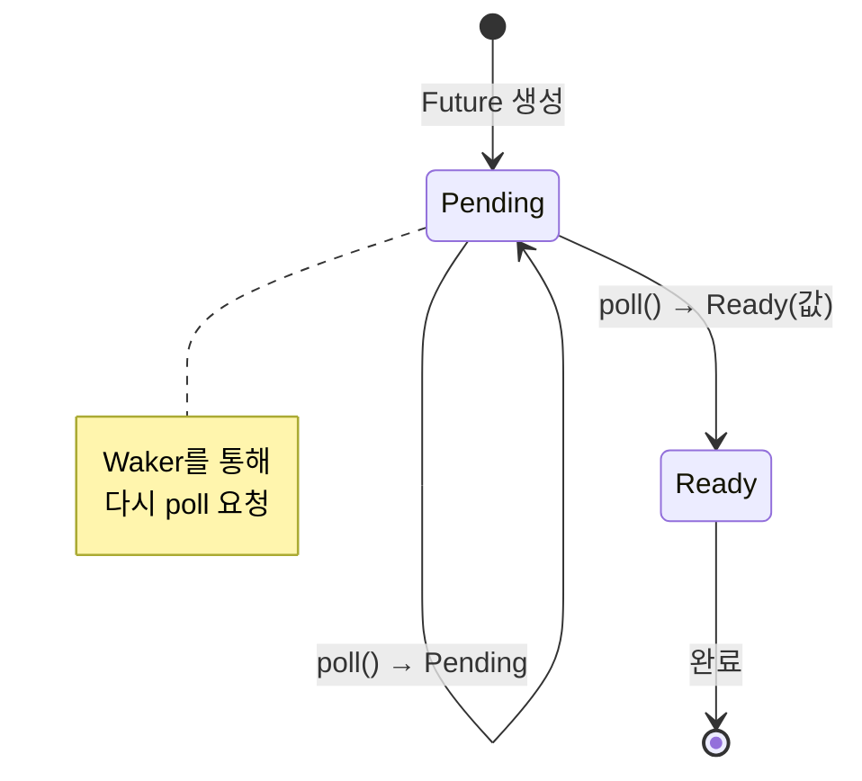

# async/await와 Future

## 1. `async fn`과 `await`

### 기본 문법

```rust,editable
// async fn은 Future를 반환하는 함수입니다
async fn greet(name: &str) -> String {
    format!("안녕하세요, {}님!", name)
}

async fn compute(x: i32, y: i32) -> i32 {
    // 비동기 작업 시뮬레이션
    x + y
}

// async 블록도 사용 가능
fn make_future() -> impl std::future::Future<Output = i32> {
    async {
        let a = compute(10, 20).await;
        let b = compute(30, 40).await;
        a + b
    }
}

// 참고: 실행하려면 비동기 런타임이 필요합니다.
// 여기서는 개념만 보여줍니다.
fn main() {
    // async fn을 호출하면 즉시 실행되지 않고 Future를 반환합니다!
    let future = greet("Rust");
    println!("Future 생성됨 (아직 실행 안 됨)");

    // Future를 실행하려면 런타임에서 .await 해야 합니다
    // greet("Rust").await;  // async 컨텍스트에서만 사용 가능

    // 간단한 실행: futures::executor::block_on 또는 tokio 사용
    println!("비동기 런타임이 필요합니다!");
}
```

<div class="warning-box">

**핵심 개념:** `async fn`을 호출하면 **즉시 실행되지 않습니다!** `Future`를 반환하며, 이 `Future`가 `.await`되거나 런타임에 의해 poll될 때 비로소 실행됩니다. 이를 **게으른 실행(lazy evaluation)**이라 합니다.

</div>

---

## 2. `Future` 트레이트

Rust의 비동기 시스템의 핵심은 `Future` 트레이트입니다.

```rust,editable
use std::future::Future;
use std::pin::Pin;
use std::task::{Context, Poll};

// Future 트레이트 정의 (표준 라이브러리)
// trait Future {
//     type Output;
//     fn poll(self: Pin<&mut Self>, cx: &mut Context<'_>) -> Poll<Self::Output>;
// }

// 수동 Future 구현 예시
struct CountDown {
    count: u32,
}

impl Future for CountDown {
    type Output = String;

    fn poll(mut self: Pin<&mut Self>, cx: &mut Context<'_>) -> Poll<Self::Output> {
        if self.count == 0 {
            Poll::Ready("발사!".to_string())
        } else {
            println!("카운트다운: {}", self.count);
            self.count -= 1;
            cx.waker().wake_by_ref();  // 다시 poll 해달라고 요청
            Poll::Pending
        }
    }
}

fn main() {
    println!("Future 트레이트 구조:");
    println!("  poll() → Poll::Pending (아직 완료 안 됨)");
    println!("  poll() → Poll::Ready(결과) (완료!)");
    println!();
    println!("async fn은 컴파일러가 자동으로 Future를 구현합니다.");
}
```


