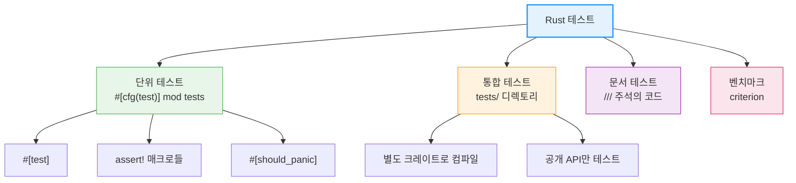
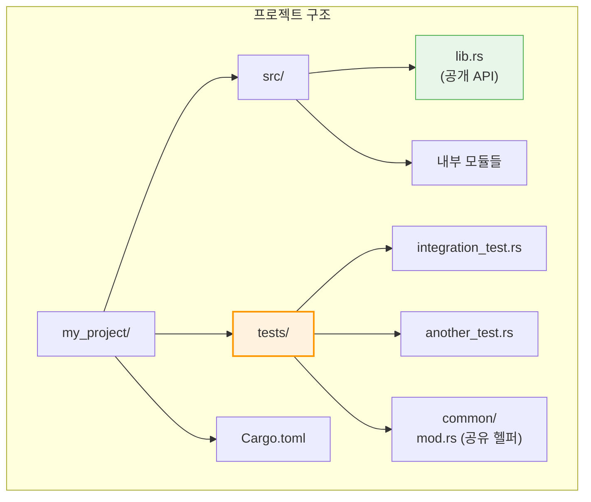

# 테스트 <span class="badge-advanced">고급</span>

Rust는 테스트를 일급(first-class) 기능으로 지원합니다. 별도의 테스트 프레임워크 없이도 풍부한 테스트를 작성할 수 있습니다.

<div class="info-box">

**Rust 테스트의 종류:**
- **단위 테스트(Unit Tests)**: 개별 함수/모듈을 독립적으로 테스트
- **통합 테스트(Integration Tests)**: 외부 사용자 관점에서 라이브러리 테스트
- **문서 테스트(Doc Tests)**: 문서 내 코드 예시가 실제로 동작하는지 확인
- **벤치마크(Benchmarks)**: 성능 측정

</div>



---

## 1. 단위 테스트 기초

### `#[test]`와 `#[cfg(test)]`

```rust,editable
// 테스트 대상 함수들
fn add(a: i32, b: i32) -> i32 {
    a + b
}

fn divide(a: f64, b: f64) -> Result<f64, String> {
    if b == 0.0 {
        Err("0으로 나눌 수 없습니다".to_string())
    } else {
        Ok(a / b)
    }
}

fn is_even(n: i32) -> bool {
    n % 2 == 0
}

// #[cfg(test)]는 cargo test 실행 시에만 컴파일됨
#[cfg(test)]
mod tests {
    use super::*;  // 상위 모듈의 모든 항목 가져오기

    #[test]
    fn test_add() {
        assert_eq!(add(2, 3), 5);
    }

    #[test]
    fn test_add_negative() {
        assert_eq!(add(-1, 1), 0);
    }

    #[test]
    fn test_divide() {
        assert_eq!(divide(10.0, 2.0), Ok(5.0));
    }

    #[test]
    fn test_divide_by_zero() {
        assert!(divide(10.0, 0.0).is_err());
    }

    #[test]
    fn test_is_even() {
        assert!(is_even(4));
        assert!(!is_even(3));
    }
}

fn main() {
    println!("cargo test로 테스트를 실행하세요!");
    println!("위 코드의 테스트 함수들이 실행됩니다.");
}
```

### `assert!`, `assert_eq!`, `assert_ne!`

```rust,editable
#[derive(Debug, PartialEq)]
struct Rectangle {
    width: u32,
    height: u32,
}

impl Rectangle {
    fn area(&self) -> u32 {
        self.width * self.height
    }

    fn can_hold(&self, other: &Rectangle) -> bool {
        self.width > other.width && self.height > other.height
    }
}

#[cfg(test)]
mod tests {
    use super::*;

    #[test]
    fn test_area() {
        let rect = Rectangle { width: 10, height: 5 };
        // assert_eq!는 실패 시 두 값을 출력 (Debug 필요)
        assert_eq!(rect.area(), 50);
    }

    #[test]
    fn test_not_equal() {
        let r1 = Rectangle { width: 10, height: 5 };
        let r2 = Rectangle { width: 5, height: 10 };
        // assert_ne!는 두 값이 다른지 확인
        assert_ne!(r1, r2);
    }

    #[test]
    fn test_can_hold() {
        let larger = Rectangle { width: 10, height: 8 };
        let smaller = Rectangle { width: 5, height: 3 };

        // assert!는 조건이 true인지 확인
        assert!(larger.can_hold(&smaller));
        assert!(!smaller.can_hold(&larger));
    }

    #[test]
    fn test_with_custom_message() {
        let rect = Rectangle { width: 10, height: 5 };
        assert_eq!(
            rect.area(),
            50,
            "넓이 계산 실패: {}x{} = {} (기대값: 50)",
            rect.width,
            rect.height,
            rect.area()
        );
    }
}

fn main() {
    println!("assert! 매크로 비교:");
    println!("  assert!(조건)      — 조건이 true인지 확인");
    println!("  assert_eq!(a, b)   — a == b 인지 확인 (실패 시 양쪽 값 출력)");
    println!("  assert_ne!(a, b)   — a != b 인지 확인");
    println!("  모든 매크로에 커스텀 메시지 추가 가능");
}
```

---

## 2. `#[should_panic]`과 Result 반환 테스트

### `#[should_panic]`

```rust,editable
fn validate_age(age: i32) -> i32 {
    if age < 0 || age > 150 {
        panic!("유효하지 않은 나이: {}", age);
    }
    age
}

#[cfg(test)]
mod tests {
    use super::*;

    #[test]
    #[should_panic]
    fn test_negative_age() {
        validate_age(-1);  // 패닉이 발생해야 테스트 통과
    }

    #[test]
    #[should_panic(expected = "유효하지 않은 나이")]
    fn test_too_old() {
        validate_age(200);  // "유효하지 않은 나이"를 포함하는 패닉 메시지 확인
    }

    // Result<(), E>를 반환하는 테스트 — ? 연산자 사용 가능
    #[test]
    fn test_result() -> Result<(), String> {
        let age = validate_age(25);
        if age == 25 {
            Ok(())
        } else {
            Err(format!("예상값 25, 실제값 {}", age))
        }
    }
}

fn main() {
    println!("#[should_panic] — 패닉이 발생해야 통과하는 테스트");
    println!("Result 반환 — ? 연산자를 사용할 수 있는 테스트");
}
```

---

## 3. 테스트 실행 옵션

```rust,editable
fn main() {
    println!("=== 테스트 실행 명령어 ===");
    println!();
    println!("기본 실행:");
    println!("  cargo test                    — 모든 테스트 실행");
    println!();
    println!("필터링:");
    println!("  cargo test test_add           — 이름에 'test_add' 포함된 테스트만");
    println!("  cargo test tests::            — tests 모듈의 테스트만");
    println!();
    println!("특수 옵션:");
    println!("  cargo test -- --ignored       — #[ignore] 테스트만 실행");
    println!("  cargo test -- --include-ignored  — 모든 테스트 + ignored 포함");
    println!("  cargo test -- --test-threads=1   — 단일 스레드로 실행 (순차)");
    println!("  cargo test -- --show-output      — 성공한 테스트의 출력도 표시");
    println!("  cargo test -- --nocapture        — 출력 캡처 비활성화");
}
```

### `#[ignore]` 속성

```rust,editable
#[cfg(test)]
mod tests {
    #[test]
    fn quick_test() {
        assert_eq!(2 + 2, 4);
    }

    #[test]
    #[ignore]  // 기본적으로 건너뜀 (느린 테스트에 사용)
    fn expensive_test() {
        // 시간이 오래 걸리는 테스트
        // cargo test -- --ignored 로 실행
        let sum: u64 = (1..=1_000_000).sum();
        assert_eq!(sum, 500_000_500_000);
    }
}

fn main() {
    println!("#[ignore] — 기본 실행에서 제외되는 테스트");
    println!("cargo test -- --ignored 로 따로 실행");
}
```

---

## 4. 통합 테스트 (`tests/` 디렉토리)



```rust,editable
// tests/integration_test.rs 예시
// (별도 파일로 존재하며, 크레이트의 공개 API만 테스트)

// use my_crate;  // 외부 크레이트처럼 import

// #[test]
// fn test_public_api() {
//     let result = my_crate::public_function(42);
//     assert_eq!(result, 84);
// }

// tests/common/mod.rs — 테스트 헬퍼 (테스트로 실행되지 않음)
// pub fn setup() -> TestData {
//     TestData::new()
// }

fn main() {
    println!("통합 테스트 특징:");
    println!("  - tests/ 디렉토리에 위치");
    println!("  - 각 파일이 별도 크레이트로 컴파일됨");
    println!("  - 공개(pub) API만 접근 가능");
    println!("  - tests/common/mod.rs로 공유 헬퍼 정의 가능");
    println!();
    println!("참고: 바이너리 크레이트(main.rs만 있는 경우)는");
    println!("통합 테스트를 작성할 수 없습니다.");
    println!("→ 로직을 lib.rs로 분리하세요.");
}
```

---

## 5. 문서 테스트 (Doc Tests)

문서 주석(`///`)의 코드 블록은 자동으로 테스트됩니다.

```rust,editable
/// 두 수를 더합니다.
///
/// # 예제
///
/// ```
/// let result = add(2, 3);  // 실제로는 크레이트명::add
/// assert_eq!(result, 5);
/// ```
///
/// # 음수도 처리합니다
///
/// ```
/// let result = add(-1, 1);
/// assert_eq!(result, 0);
/// ```
fn add(a: i32, b: i32) -> i32 {
    a + b
}

/// 0으로 나누면 에러를 반환합니다.
///
/// ```
/// let result = divide(10.0, 2.0);
/// assert_eq!(result, Ok(5.0));
/// ```
///
/// ```
/// let result = divide(10.0, 0.0);
/// assert!(result.is_err());
/// ```
///
/// 컴파일만 되고 실행하지 않으려면:
///
/// ```no_run
/// // 이 코드는 컴파일 확인만 됩니다
/// let _ = divide(1.0, 1.0);
/// ```
///
/// 컴파일도 하지 않으려면:
///
/// ```ignore
/// // 이 코드는 완전히 무시됩니다
/// unreachable_function();
/// ```
///
/// 컴파일 에러가 발생해야 하는 코드:
///
/// ```compile_fail
/// let x: i32 = "not a number";
/// ```
fn divide(a: f64, b: f64) -> Result<f64, String> {
    if b == 0.0 {
        Err("0으로 나눌 수 없습니다".to_string())
    } else {
        Ok(a / b)
    }
}

fn main() {
    println!("문서 테스트 속성:");
    println!("  ```          — 컴파일 + 실행 (기본)");
    println!("  ```no_run    — 컴파일만 (실행 안 함)");
    println!("  ```ignore    — 완전히 무시");
    println!("  ```compile_fail — 컴파일 실패 확인");
    println!("  ```should_panic — 패닉 확인");
}
```

<div class="tip-box">

**문서 테스트의 장점:** 문서의 코드 예시가 항상 최신 상태로 유지됩니다. API가 변경되면 문서 테스트가 실패하므로, 문서와 코드의 불일치를 방지합니다.

</div>

---

## 6. 테스트 헬퍼와 픽스처

```rust,editable
#[derive(Debug, PartialEq)]
struct User {
    name: String,
    age: u32,
    email: String,
}

impl User {
    fn is_adult(&self) -> bool {
        self.age >= 18
    }

    fn email_domain(&self) -> &str {
        self.email.split('@').nth(1).unwrap_or("")
    }
}

#[cfg(test)]
mod tests {
    use super::*;

    // 테스트 헬퍼 — 반복되는 설정을 함수로 추출
    fn create_test_user() -> User {
        User {
            name: "홍길동".to_string(),
            age: 25,
            email: "hong@example.com".to_string(),
        }
    }

    fn create_minor_user() -> User {
        User {
            name: "어린이".to_string(),
            age: 10,
            email: "child@school.kr".to_string(),
        }
    }

    #[test]
    fn test_is_adult() {
        let user = create_test_user();
        assert!(user.is_adult());
    }

    #[test]
    fn test_minor_not_adult() {
        let user = create_minor_user();
        assert!(!user.is_adult());
    }

    #[test]
    fn test_email_domain() {
        let user = create_test_user();
        assert_eq!(user.email_domain(), "example.com");
    }

    // 매개변수화된 테스트 (수동)
    #[test]
    fn test_age_boundary() {
        let test_cases = vec![
            (17, false),
            (18, true),
            (19, true),
            (0, false),
            (100, true),
        ];

        for (age, expected) in test_cases {
            let user = User {
                name: "테스트".to_string(),
                age,
                email: "test@test.com".to_string(),
            };
            assert_eq!(
                user.is_adult(),
                expected,
                "나이 {}에 대해 is_adult()가 {}를 반환해야 합니다",
                age,
                expected
            );
        }
    }
}

fn main() {
    println!("테스트 헬퍼 패턴:");
    println!("  - 팩토리 함수로 테스트 데이터 생성");
    println!("  - 매개변수화된 테스트로 여러 케이스 테스트");
    println!("  - setup/teardown은 RAII 패턴 활용");
}
```

---

## 7. Criterion을 이용한 벤치마킹

<div class="info-box">

**Criterion**은 Rust의 대표적인 벤치마킹 라이브러리입니다. `Cargo.toml`에 추가:

```toml
[dev-dependencies]
criterion = { version = "0.5", features = ["html_reports"] }

[[bench]]
name = "my_benchmark"
harness = false
```

</div>

```rust,editable
// benches/my_benchmark.rs 예시
// use criterion::{black_box, criterion_group, criterion_main, Criterion};

// fn fibonacci(n: u64) -> u64 {
//     match n {
//         0 => 0,
//         1 => 1,
//         _ => fibonacci(n - 1) + fibonacci(n - 2),
//     }
// }

// fn fibonacci_iter(n: u64) -> u64 {
//     let (mut a, mut b) = (0u64, 1u64);
//     for _ in 0..n {
//         let temp = b;
//         b = a + b;
//         a = temp;
//     }
//     a
// }

// fn bench_fibonacci(c: &mut Criterion) {
//     let mut group = c.benchmark_group("fibonacci");
//
//     group.bench_function("recursive_20", |b| {
//         b.iter(|| fibonacci(black_box(20)))
//     });
//
//     group.bench_function("iterative_20", |b| {
//         b.iter(|| fibonacci_iter(black_box(20)))
//     });
//
//     group.finish();
// }

// criterion_group!(benches, bench_fibonacci);
// criterion_main!(benches);

fn main() {
    println!("Criterion 벤치마크 사용법:");
    println!("  1. Cargo.toml에 criterion 추가");
    println!("  2. benches/ 디렉토리에 벤치마크 파일 생성");
    println!("  3. cargo bench 실행");
    println!();
    println!("cargo bench 출력 예시:");
    println!("  fibonacci/recursive_20  time: [25.431 µs 25.589 µs 25.762 µs]");
    println!("  fibonacci/iterative_20  time: [3.1234 ns 3.1456 ns 3.1698 ns]");
}
```

---

## 8. Property-Based Testing (Proptest)

<div class="info-box">

**Property-based testing**은 구체적인 값 대신 **속성(property)**을 검증합니다. 프레임워크가 무작위 입력을 생성하여 속성이 항상 성립하는지 확인합니다.

```toml
[dev-dependencies]
proptest = "1.4"
```

</div>

```rust,editable
// proptest 예시

fn reverse(s: &str) -> String {
    s.chars().rev().collect()
}

fn sort_vec(mut v: Vec<i32>) -> Vec<i32> {
    v.sort();
    v
}

// proptest! 매크로 사용 예시 (proptest 크레이트 필요)

// use proptest::prelude::*;
//
// proptest! {
//     // 속성: 문자열을 두 번 뒤집으면 원본이 된다
//     #[test]
//     fn test_double_reverse(s in "\\PC*") {
//         let doubled = reverse(&reverse(&s));
//         assert_eq!(doubled, s);
//     }
//
//     // 속성: 정렬된 벡터의 길이는 원본과 같다
//     #[test]
//     fn test_sort_preserves_length(v in prop::collection::vec(any::<i32>(), 0..100)) {
//         let sorted = sort_vec(v.clone());
//         assert_eq!(sorted.len(), v.len());
//     }
//
//     // 속성: 정렬된 벡터는 오름차순이다
//     #[test]
//     fn test_sort_is_ordered(v in prop::collection::vec(any::<i32>(), 0..100)) {
//         let sorted = sort_vec(v);
//         for window in sorted.windows(2) {
//             assert!(window[0] <= window[1]);
//         }
//     }
//
//     // 범위 지정 가능
//     #[test]
//     fn test_add_positive(a in 1..1000i32, b in 1..1000i32) {
//         assert!(a + b > a);
//         assert!(a + b > b);
//     }
// }

fn main() {
    // 수동으로 속성 테스트 개념 시연
    let test_strings = vec!["hello", "rust", "테스트", "", "a b c"];
    for s in test_strings {
        let doubled = reverse(&reverse(s));
        assert_eq!(doubled, s, "이중 역순 실패: '{}'", s);
    }
    println!("이중 역순 속성 검증 통과!");

    let test_vecs: Vec<Vec<i32>> = vec![
        vec![3, 1, 2],
        vec![],
        vec![1],
        vec![5, 4, 3, 2, 1],
    ];
    for v in test_vecs {
        let original_len = v.len();
        let sorted = sort_vec(v);
        assert_eq!(sorted.len(), original_len);
        for w in sorted.windows(2) {
            assert!(w[0] <= w[1]);
        }
    }
    println!("정렬 속성 검증 통과!");
}
```

---

## 테스트 모범 사례

<div class="tip-box">

**효과적인 테스트 작성 가이드:**

1. **AAA 패턴**: Arrange(준비) → Act(실행) → Assert(검증)
2. **한 테스트, 한 개념**: 각 테스트는 하나의 동작만 검증
3. **경계값 테스트**: 0, 빈 문자열, 최대값 등 경계 케이스 확인
4. **에러 경로 테스트**: 성공 경로뿐 아니라 실패 경로도 테스트
5. **테스트 이름**: `test_함수명_상황_기대결과` 형식으로 명확하게

</div>

---

<div class="exercise-box">

### 연습문제

**연습 1: 스택 구현 테스트**

아래 Stack 구현에 대한 포괄적인 테스트를 작성하세요.

```rust,editable
#[derive(Debug)]
struct Stack<T> {
    elements: Vec<T>,
}

impl<T> Stack<T> {
    fn new() -> Self {
        Stack { elements: Vec::new() }
    }

    fn push(&mut self, item: T) {
        self.elements.push(item);
    }

    fn pop(&mut self) -> Option<T> {
        self.elements.pop()
    }

    fn peek(&self) -> Option<&T> {
        self.elements.last()
    }

    fn is_empty(&self) -> bool {
        self.elements.is_empty()
    }

    fn size(&self) -> usize {
        self.elements.len()
    }
}

#[cfg(test)]
mod tests {
    use super::*;

    // TODO: 아래 테스트들을 작성하세요

    #[test]
    fn test_new_stack_is_empty() {
        // 새 스택이 비어있는지 확인
        todo!()
    }

    #[test]
    fn test_push_and_pop() {
        // push 후 pop하면 같은 값이 나오는지 확인
        todo!()
    }

    #[test]
    fn test_pop_empty() {
        // 빈 스택에서 pop하면 None인지 확인
        todo!()
    }

    #[test]
    fn test_lifo_order() {
        // LIFO (후입선출) 순서 확인
        // push 1, 2, 3 → pop 3, 2, 1
        todo!()
    }

    #[test]
    fn test_peek_does_not_remove() {
        // peek 후에도 크기가 변하지 않는지 확인
        todo!()
    }
}

fn main() {
    let mut stack = Stack::new();
    stack.push(1);
    stack.push(2);
    stack.push(3);
    println!("peek: {:?}", stack.peek());
    println!("pop: {:?}", stack.pop());
    println!("size: {}", stack.size());
}
```

**연습 2: 문서 테스트 작성**

아래 함수에 대한 문서 주석과 문서 테스트를 작성하세요.

```rust,editable
// TODO: 아래 함수들에 /// 문서 주석과 코드 예시를 추가하세요

fn celsius_to_fahrenheit(celsius: f64) -> f64 {
    celsius * 9.0 / 5.0 + 32.0
}

fn truncate(s: &str, max_chars: usize) -> &str {
    if s.len() <= max_chars {
        s
    } else {
        &s[..max_chars]
    }
}

fn main() {
    println!("{}°C = {}°F", 100.0, celsius_to_fahrenheit(100.0));
    println!("잘림: '{}'", truncate("Hello, World!", 5));
}
```

</div>

---

<div class="quiz-box" onclick="this.classList.toggle('show-answer')">

**퀴즈 1:** `#[cfg(test)]`의 역할은 무엇인가요?

<div class="quiz-answer">

`#[cfg(test)]`는 **조건부 컴파일 속성**으로, `cargo test` 실행 시에만 해당 모듈을 컴파일합니다. `cargo build`이나 `cargo run`으로 릴리즈 빌드할 때는 테스트 코드가 포함되지 않아 바이너리 크기가 줄어들고 컴파일 시간도 단축됩니다.

</div>
</div>

<div class="quiz-box" onclick="this.classList.toggle('show-answer')">

**퀴즈 2:** 단위 테스트와 통합 테스트의 차이점은 무엇인가요?

<div class="quiz-answer">

- **단위 테스트**: `src/` 디렉토리 내 `#[cfg(test)]` 모듈에 위치하며, **비공개 함수**에도 접근 가능합니다. 개별 함수와 모듈을 독립적으로 테스트합니다.
- **통합 테스트**: `tests/` 디렉토리에 별도 파일로 존재하며, **공개 API만** 접근 가능합니다. 외부 사용자 관점에서 라이브러리를 테스트합니다. 각 파일이 별도 크레이트로 컴파일됩니다.

</div>
</div>

<div class="quiz-box" onclick="this.classList.toggle('show-answer')">

**퀴즈 3:** `assert_eq!`보다 `assert!`를 사용해야 하는 경우는 언제인가요?

<div class="quiz-answer">

- **`assert_eq!(a, b)`**: 두 값이 같은지 비교할 때 사용합니다. 실패 시 두 값을 모두 출력하므로 디버깅이 쉽습니다. (`Debug` + `PartialEq` 구현 필요)
- **`assert!(condition)`**: 불리언 조건을 검사할 때 사용합니다. `assert!(x > 0)`, `assert!(result.is_ok())`, `assert!(!list.is_empty())` 같은 경우에 적합합니다.

값의 동등성 비교에는 `assert_eq!`이, 범위/조건 검사에는 `assert!`가 더 적합합니다.

</div>
</div>

---

<div class="summary-box">

### 📝 요약

1. **`#[test]`**: 함수를 테스트로 표시합니다. `cargo test`로 실행합니다.
2. **`#[cfg(test)]`**: 테스트 빌드에서만 컴파일되는 모듈을 정의합니다.
3. **Assert 매크로**: `assert!`, `assert_eq!`, `assert_ne!`로 조건을 검증합니다.
4. **`#[should_panic]`**: 패닉이 발생해야 통과하는 테스트를 작성합니다.
5. **통합 테스트**: `tests/` 디렉토리에서 공개 API를 외부 사용자 관점으로 테스트합니다.
6. **문서 테스트**: `///` 주석의 코드 예시가 자동으로 테스트되어 문서의 정확성을 보장합니다.
7. **Criterion**: 통계 기반 정밀 벤치마킹으로 성능을 측정합니다.
8. **Proptest**: 속성 기반 테스트로 무작위 입력에 대해 불변량을 검증합니다.

</div>
