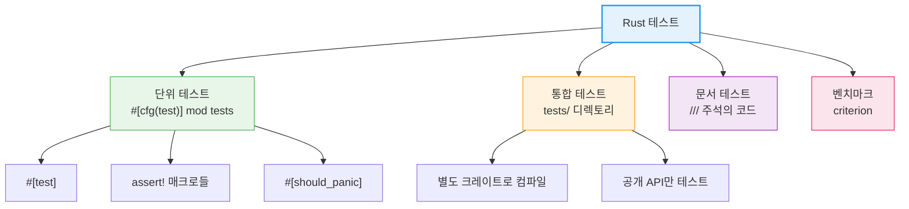

# 테스트 고급

Rust는 테스트를 일급(first-class) 기능으로 지원합니다. 별도의 테스트 프레임워크 없이도 단위 테스트, 통합 테스트, 문서 테스트, 벤치마크까지 풍부한 테스트를 작성할 수 있습니다.

---

## 이 장에서 다루는 내용

- **[테스트 기초](./ch18-01-testing-basics.md)** — 단위 테스트, `#[should_panic]`, 테스트 실행 옵션, 통합 테스트
- **[테스트 심화](./ch18-02-testing-advanced.md)** — 문서 테스트, 테스트 픽스처, Criterion 벤치마킹, Property-Based Testing
