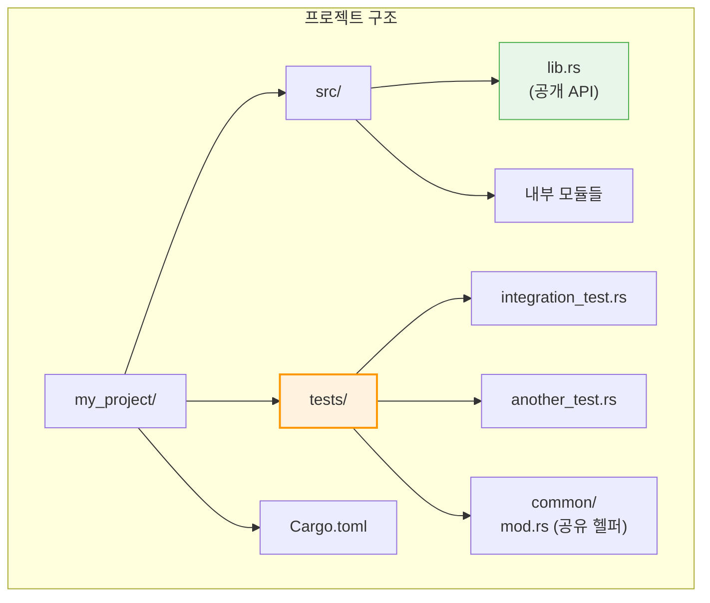

# 통합 테스트와 문서 테스트

## 4. 통합 테스트 (`tests/` 디렉토리)



```rust,editable
// tests/integration_test.rs 예시
// (별도 파일로 존재하며, 크레이트의 공개 API만 테스트)

// use my_crate;  // 외부 크레이트처럼 import

// #[test]
// fn test_public_api() {
//     let result = my_crate::public_function(42);
//     assert_eq!(result, 84);
// }

// tests/common/mod.rs — 테스트 헬퍼 (테스트로 실행되지 않음)
// pub fn setup() -> TestData {
//     TestData::new()
// }

fn main() {
    println!("통합 테스트 특징:");
    println!("  - tests/ 디렉토리에 위치");
    println!("  - 각 파일이 별도 크레이트로 컴파일됨");
    println!("  - 공개(pub) API만 접근 가능");
    println!("  - tests/common/mod.rs로 공유 헬퍼 정의 가능");
    println!();
    println!("참고: 바이너리 크레이트(main.rs만 있는 경우)는");
    println!("통합 테스트를 작성할 수 없습니다.");
    println!("→ 로직을 lib.rs로 분리하세요.");
}
```

---

## 5. 문서 테스트 (Doc Tests)

문서 주석(`///`)의 코드 블록은 자동으로 테스트됩니다.

```rust,editable
/// 두 수를 더합니다.
///
/// # 예제
///
/// ```
/// let result = add(2, 3);  // 실제로는 크레이트명::add
/// assert_eq!(result, 5);
/// ```
///
/// # 음수도 처리합니다
///
/// ```
/// let result = add(-1, 1);
/// assert_eq!(result, 0);
/// ```
fn add(a: i32, b: i32) -> i32 {
    a + b
}

/// 0으로 나누면 에러를 반환합니다.
///
/// ```
/// let result = divide(10.0, 2.0);
/// assert_eq!(result, Ok(5.0));
/// ```
///
/// ```
/// let result = divide(10.0, 0.0);
/// assert!(result.is_err());
/// ```
///
/// 컴파일만 되고 실행하지 않으려면:
///
/// ```no_run
/// // 이 코드는 컴파일 확인만 됩니다
/// let _ = divide(1.0, 1.0);
/// ```
///
/// 컴파일도 하지 않으려면:
///
/// ```ignore
/// // 이 코드는 완전히 무시됩니다
/// unreachable_function();
/// ```
///
/// 컴파일 에러가 발생해야 하는 코드:
///
/// ```compile_fail
/// let x: i32 = "not a number";
/// ```
fn divide(a: f64, b: f64) -> Result<f64, String> {
    if b == 0.0 {
        Err("0으로 나눌 수 없습니다".to_string())
    } else {
        Ok(a / b)
    }
}

fn main() {
    println!("문서 테스트 속성:");
    println!("  ```          — 컴파일 + 실행 (기본)");
    println!("  ```no_run    — 컴파일만 (실행 안 함)");
    println!("  ```ignore    — 완전히 무시");
    println!("  ```compile_fail — 컴파일 실패 확인");
    println!("  ```should_panic — 패닉 확인");
}
```

<div class="tip-box">

**문서 테스트의 장점:** 문서의 코드 예시가 항상 최신 상태로 유지됩니다. API가 변경되면 문서 테스트가 실패하므로, 문서와 코드의 불일치를 방지합니다.

</div>
