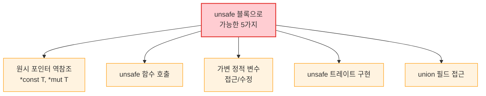

# 원시 포인터와 unsafe 블록

## unsafe로 할 수 있는 것들



<div class="info-box">

**중요:** `unsafe` 블록 안에서도 대여 검사기, 소유권 규칙, 타입 검사는 여전히 작동합니다! `unsafe`가 끄는 것은 위의 5가지 검사뿐입니다.

</div>

---

## 1. 왜 unsafe가 존재하는가?

```rust,editable
fn main() {
    println!("unsafe가 필요한 이유:");
    println!();
    println!("1. 하드웨어/OS와의 직접 상호작용");
    println!("   → 메모리 매핑 I/O, 시스템 콜");
    println!();
    println!("2. 성능 최적화");
    println!("   → 경계 검사 생략, 캐시 친화적 메모리 레이아웃");
    println!();
    println!("3. C/C++ 라이브러리와의 FFI");
    println!("   → extern \"C\" 함수 호출");
    println!();
    println!("4. 컴파일러가 증명할 수 없는 안전한 패턴");
    println!("   → split_at_mut 같은 표준 라이브러리 함수 구현");
    println!();
    println!("표준 라이브러리의 많은 안전한 API 내부에");
    println!("unsafe가 사용되고 있습니다.");
}
```

---

## 2. `unsafe` 블록과 `unsafe fn`

### unsafe 블록

```rust,editable
fn main() {
    let mut num = 5;

    // 원시 포인터 생성은 안전 (unsafe 불필요)
    let r1 = &num as *const i32;
    let r2 = &mut num as *mut i32;

    // 원시 포인터 역참조는 unsafe!
    unsafe {
        println!("r1이 가리키는 값: {}", *r1);
        println!("r2가 가리키는 값: {}", *r2);

        // 원시 포인터를 통한 수정
        *r2 = 10;
        println!("수정 후: {}", *r2);
    }

    println!("num: {}", num);
}
```

### unsafe 함수

```rust,editable
// unsafe fn: 호출자가 안전성을 보장해야 함
unsafe fn dangerous() {
    println!("이것은 unsafe 함수입니다");
}

// 안전한 함수 안에서 unsafe 코드를 감쌀 수 있음
fn safe_wrapper() {
    // unsafe 블록 안에서만 unsafe 함수 호출 가능
    unsafe {
        dangerous();
    }
}

fn main() {
    // dangerous();  // ❌ 컴파일 에러: unsafe 블록 없이 호출 불가

    unsafe {
        dangerous();  // ✅ OK
    }

    safe_wrapper();  // ✅ OK: 안전한 래퍼를 통해 호출
}
```

---

## 3. 원시 포인터 (`*const T`, `*mut T`)

```rust,editable
fn main() {
    // === 원시 포인터의 특성 ===
    // 1. 빌림 규칙을 무시할 수 있음
    // 2. null일 수 있음
    // 3. 자동 정리(cleanup)되지 않음
    // 4. 유효한 메모리를 가리키는지 보장 없음

    let mut value = 42;

    // 참조로부터 원시 포인터 생성 (안전)
    let ptr_const: *const i32 = &value;
    let ptr_mut: *mut i32 = &mut value;

    // 원시 포인터 역참조 (unsafe)
    unsafe {
        println!("const 포인터: {}", *ptr_const);
        *ptr_mut = 100;
        println!("수정 후: {}", *ptr_mut);
    }

    // 임의의 메모리 주소로 포인터 생성 (매우 위험!)
    let arbitrary_address = 0x012345usize;
    let _wild_ptr = arbitrary_address as *const i32;
    // unsafe { println!("{}", *_wild_ptr); }  // 정의되지 않은 동작!

    // null 포인터
    let null_ptr: *const i32 = std::ptr::null();
    println!("null 포인터? {}", null_ptr.is_null());
}
```

### 포인터 산술 연산

```rust,editable
fn main() {
    let arr = [10, 20, 30, 40, 50];
    let ptr = arr.as_ptr();  // 첫 번째 원소의 포인터

    unsafe {
        for i in 0..arr.len() {
            // 포인터 오프셋으로 배열 원소 접근
            let val = *ptr.add(i);
            println!("arr[{}] = {}", i, val);
        }
    }
}
```
