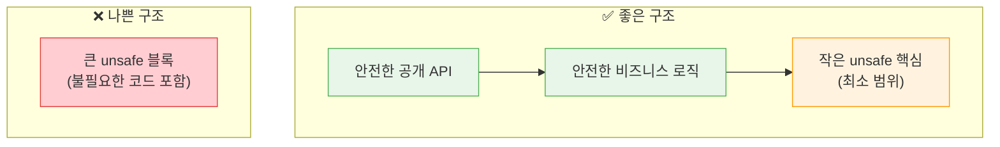

# 안전한 추상화와 unsafe 최소화

## 7. 안전한 추상화 만들기

`unsafe` 코드를 안전한 API로 감싸는 것이 Rust의 핵심 패턴입니다.

### 예시: `split_at_mut` 구현

```rust,editable
fn split_at_mut(values: &mut [i32], mid: usize) -> (&mut [i32], &mut [i32]) {
    let len = values.len();
    assert!(mid <= len, "인덱스가 범위를 벗어남");

    let ptr = values.as_mut_ptr();

    // 컴파일러는 두 슬라이스가 겹치지 않음을 증명할 수 없지만,
    // 우리는 mid로 분할하므로 겹치지 않음을 알고 있습니다.
    unsafe {
        (
            std::slice::from_raw_parts_mut(ptr, mid),
            std::slice::from_raw_parts_mut(ptr.add(mid), len - mid),
        )
    }
}

fn main() {
    let mut arr = [1, 2, 3, 4, 5, 6];
    let (left, right) = split_at_mut(&mut arr, 3);

    println!("왼쪽: {:?}", left);   // [1, 2, 3]
    println!("오른쪽: {:?}", right); // [4, 5, 6]

    // 양쪽을 독립적으로 수정 가능
    left[0] = 10;
    right[0] = 40;

    println!("수정 후 왼쪽: {:?}", left);
    println!("수정 후 오른쪽: {:?}", right);
}
```

### 예시: 안전한 래퍼 타입

```rust,editable
/// 고정 크기 링 버퍼
struct RingBuffer {
    data: Vec<u8>,
    head: usize,
    len: usize,
}

impl RingBuffer {
    fn new(capacity: usize) -> Self {
        RingBuffer {
            data: vec![0; capacity],
            head: 0,
            len: 0,
        }
    }

    fn push(&mut self, value: u8) {
        let capacity = self.data.len();
        if self.len < capacity {
            let idx = (self.head + self.len) % capacity;
            // unsafe 없이도 구현 가능하지만, 예시로 사용
            unsafe {
                *self.data.get_unchecked_mut(idx) = value;
            }
            self.len += 1;
        }
    }

    fn pop(&mut self) -> Option<u8> {
        if self.len == 0 {
            None
        } else {
            let value = unsafe { *self.data.get_unchecked(self.head) };
            self.head = (self.head + 1) % self.data.len();
            self.len -= 1;
            Some(value)
        }
    }

    fn len(&self) -> usize {
        self.len
    }
}

fn main() {
    let mut buf = RingBuffer::new(4);
    buf.push(10);
    buf.push(20);
    buf.push(30);

    println!("pop: {:?}", buf.pop());  // Some(10)
    println!("pop: {:?}", buf.pop());  // Some(20)
    println!("길이: {}", buf.len());   // 1

    buf.push(40);
    buf.push(50);
    println!("길이: {}", buf.len());   // 3
}
```

---

## 8. unsafe 최소화 원칙



```rust,editable
fn main() {
    println!("=== unsafe 최소화 가이드 ===");
    println!();
    println!("1. unsafe 블록을 가능한 작게 만드세요");
    println!("   ❌ unsafe {{ 100줄의 코드 }}");
    println!("   ✅ 안전한 코드; unsafe {{ 1줄 }}; 안전한 코드");
    println!();
    println!("2. unsafe 코드를 안전한 API로 감싸세요");
    println!("   사용자가 unsafe를 쓰지 않아도 되게");
    println!();
    println!("3. 불변량(invariant)을 문서화하세요");
    println!("   // SAFETY: ptr은 유효하고 정렬됨");
    println!();
    println!("4. 가능하면 표준 라이브러리의 안전한 대안 사용");
    println!("   get_unchecked → get + unwrap");
    println!("   static mut → AtomicXxx / Mutex");
    println!();
    println!("5. unsafe 코드를 철저히 테스트하세요");
    println!("   Miri 도구로 정의되지 않은 동작 검출");
}
```

<div class="tip-box">

**SAFETY 주석 관례:** unsafe 블록 앞에 `// SAFETY:` 주석을 달아 왜 이 코드가 안전한지 설명하는 것이 Rust 커뮤니티의 관례입니다.

```rust,ignore
// SAFETY: `mid`가 슬라이스 범위 내에 있음을 assert로 확인했으므로,
// 두 슬라이스는 겹치지 않습니다.
unsafe {
    std::slice::from_raw_parts_mut(ptr, mid)
}
```

</div>

---

<div class="exercise-box">

### 연습문제

**연습 1: 안전한 래퍼 함수**

`get_unchecked`를 사용하되, 안전한 API로 감싸세요.

```rust,editable
/// 인덱스가 유효하면 Some(값), 아니면 None을 반환
fn safe_get(slice: &[i32], index: usize) -> Option<i32> {
    // TODO: 인덱스 범위를 검사한 후 unsafe로 접근
    // 힌트: if index < slice.len() { unsafe { ... } }
    todo!()
}

fn main() {
    let data = [10, 20, 30, 40, 50];

    println!("index 2: {:?}", safe_get(&data, 2));   // Some(30)
    println!("index 10: {:?}", safe_get(&data, 10));  // None
}
```

**연습 2: 두 포인터의 값 교환**

원시 포인터를 사용하여 두 변수의 값을 교환하는 unsafe 함수를 작성하세요.

```rust,editable
/// 두 포인터가 가리키는 값을 교환합니다.
///
/// # Safety
/// - 두 포인터 모두 유효한 메모리를 가리켜야 합니다.
/// - 두 포인터가 겹치지 않아야 합니다.
/// - 두 포인터 모두 정렬(aligned)되어 있어야 합니다.
unsafe fn swap_raw<T>(a: *mut T, b: *mut T) {
    // TODO: std::ptr::read와 std::ptr::write를 사용하여 구현하세요
    // 힌트:
    //   let tmp = std::ptr::read(a);
    //   std::ptr::write(a, std::ptr::read(b));
    //   std::ptr::write(b, tmp);
    todo!()
}

fn main() {
    let mut x = 10;
    let mut y = 20;
    println!("교환 전: x={}, y={}", x, y);

    unsafe {
        swap_raw(&mut x as *mut i32, &mut y as *mut i32);
    }
    println!("교환 후: x={}, y={}", x, y);  // x=20, y=10
}
```

</div>

---

<div class="quiz-box" onclick="this.classList.toggle('show-answer')">

**퀴즈 1:** `unsafe` 블록 안에서도 여전히 작동하는 Rust의 안전성 기능은 무엇인가요?

<div class="quiz-answer">

`unsafe` 블록 안에서도 **소유권 규칙, 대여 검사, 타입 검사, 수명(lifetime) 검사**는 여전히 작동합니다. `unsafe`가 비활성화하는 것은 오직 5가지: (1) 원시 포인터 역참조, (2) unsafe 함수 호출, (3) 가변 정적 변수 접근, (4) unsafe 트레이트 구현, (5) union 필드 접근뿐입니다.

</div>
</div>

<div class="quiz-box" onclick="this.classList.toggle('show-answer')">

**퀴즈 2:** 원시 포인터(`*const T`)를 생성하는 것은 왜 안전한가요?

<div class="quiz-answer">

원시 포인터를 **생성**하는 것 자체는 아무런 위험이 없습니다. 위험한 것은 포인터를 **역참조**하는 것입니다. 포인터를 생성하고 보관하는 것만으로는 어떤 메모리 접근도 일어나지 않으므로 안전합니다. `*ptr`로 역참조할 때 비로소 해당 메모리가 유효한지, 정렬되어 있는지 등을 확인해야 하며, 이것이 `unsafe` 블록이 필요한 이유입니다.

</div>
</div>

<div class="quiz-box" onclick="this.classList.toggle('show-answer')">

**퀴즈 3:** `static mut` 대신 어떤 대안을 사용할 수 있나요?

<div class="quiz-answer">

- **`std::sync::atomic`** 타입 (`AtomicBool`, `AtomicI32`, `AtomicUsize` 등): 원자적 연산으로 스레드 안전한 전역 카운터/플래그에 적합합니다.
- **`std::sync::Mutex<T>`** 또는 **`RwLock<T>`**: `lazy_static!` 또는 `std::sync::OnceLock`과 함께 사용하여 복잡한 전역 데이터를 안전하게 관리합니다.
- **`std::sync::OnceLock<T>`**: 한 번만 초기화되는 전역 값에 적합합니다 (Rust 1.70+).

이들은 모두 `unsafe` 없이 사용할 수 있으며 스레드 안전합니다.

</div>
</div>

<div class="quiz-box" onclick="this.classList.toggle('show-answer')">

**퀴즈 4:** "안전한 추상화"란 무엇이며 왜 중요한가요?

<div class="quiz-answer">

안전한 추상화란 내부적으로 `unsafe` 코드를 사용하지만 **외부에는 안전한 API만 노출**하는 패턴입니다. 예를 들어 `Vec<T>`는 내부적으로 원시 포인터와 메모리 할당을 사용하지만, 사용자는 `push`, `pop` 등 안전한 메서드만 사용합니다. 이렇게 하면 unsafe의 올바름을 확인해야 하는 범위가 줄어들고, 버그가 발생해도 원인을 좁힐 수 있습니다.

</div>
</div>

---

<div class="summary-box">

### 요약

1. **`unsafe`는 5가지만 허용**: 원시 포인터 역참조, unsafe 함수 호출, 가변 정적 변수, unsafe 트레이트, union 접근
2. **원시 포인터**: `*const T`와 `*mut T`는 빌림 규칙을 무시하며, null이거나 유효하지 않을 수 있습니다.
3. **FFI**: `extern "C"`로 C 함수를 호출하거나 C에서 Rust 함수를 호출할 수 있습니다.
4. **가변 정적 변수**: 가능하면 `Atomic` 타입이나 `Mutex`로 대체하세요.
5. **안전한 추상화**: unsafe 코드를 안전한 API로 감싸는 것이 핵심 원칙입니다.
6. **최소화 원칙**: unsafe 블록은 최대한 작게, `// SAFETY:` 주석으로 이유를 문서화하세요.
7. **Miri**: `cargo +nightly miri test`로 정의되지 않은 동작을 검출할 수 있습니다.

</div>
