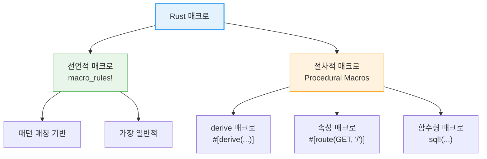

# 매크로 고급

매크로는 **코드를 생성하는 코드**입니다. Rust의 매크로 시스템은 강력하면서도 안전하며, 보일러플레이트 코드를 크게 줄여줍니다. 매크로는 컴파일러가 코드의 의미를 해석하기 **전에** 확장됩니다.

이 장에서 다루는 내용:

- [선언적 매크로 -- `macro_rules!`](ch20-01-declarative-macros.md) -- 기본 문법, 지정자, 반복 패턴, 구조체 빌더 매크로
- [표준 매크로와 고급 패턴](ch20-02-standard-and-advanced-macros.md) -- `println!`, `vec!`, `dbg!` 등 표준 매크로, 재귀 매크로, 매크로 vs 제네릭 vs 트레이트
- [절차적 매크로와 매크로 디버깅](ch20-03-procedural-macros.md) -- derive/속성/함수형 절차적 매크로, serde, `cargo expand`

**매크로 vs 함수:**
- **함수**: 런타임에 호출, 고정된 매개변수 수, 타입 시스템 적용
- **매크로**: 컴파일 타임에 코드 확장, 가변 매개변수, 새로운 문법 생성 가능

