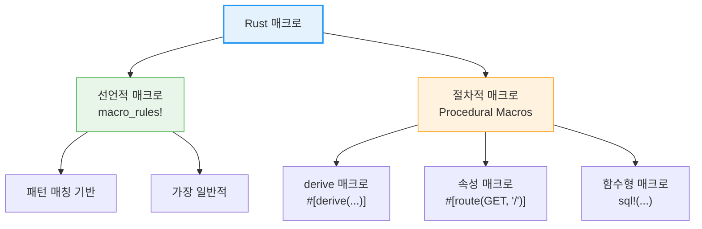
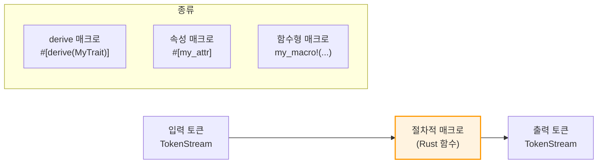

# 매크로 <span class="badge-advanced">고급</span>

매크로는 **코드를 생성하는 코드**입니다. Rust의 매크로 시스템은 강력하면서도 안전하며, 보일러플레이트 코드를 크게 줄여줍니다.

<div class="info-box">

**매크로 vs 함수:**
- **함수**: 런타임에 호출, 고정된 매개변수 수, 타입 시스템 적용
- **매크로**: 컴파일 타임에 코드 확장, 가변 매개변수, 새로운 문법 생성 가능

매크로는 컴파일러가 코드의 의미를 해석하기 **전에** 확장됩니다.

</div>



---

## 1. 선언적 매크로 — `macro_rules!`

### 기본 문법

```rust,editable
// 가장 간단한 매크로
macro_rules! say_hello {
    () => {
        println!("안녕하세요!");
    };
}

// 매개변수를 받는 매크로
macro_rules! greet {
    ($name:expr) => {
        println!("안녕하세요, {}님!", $name);
    };
}

// 여러 패턴 매칭
macro_rules! calculate {
    (add $a:expr, $b:expr) => {
        $a + $b
    };
    (mul $a:expr, $b:expr) => {
        $a * $b
    };
}

fn main() {
    say_hello!();
    greet!("Rust");

    let sum = calculate!(add 3, 4);
    let product = calculate!(mul 3, 4);
    println!("3 + 4 = {}", sum);
    println!("3 × 4 = {}", product);
}
```

### 매크로 지정자(Designators)

```rust,editable
macro_rules! demo_designators {
    // expr — 표현식
    (expr: $e:expr) => {
        println!("표현식 결과: {}", $e);
    };

    // ident — 식별자 (변수명, 함수명 등)
    (ident: $name:ident) => {
        let $name = 42;
        println!("{} = {}", stringify!($name), $name);
    };

    // ty — 타입
    (ty: $t:ty) => {
        println!("타입: {}", stringify!($t));
    };

    // tt — 토큰 트리 (무엇이든 가능)
    (tt: $($tok:tt)*) => {
        println!("토큰: {}", stringify!($($tok)*));
    };

    // literal — 리터럴 값
    (lit: $l:literal) => {
        println!("리터럴: {}", $l);
    };

    // block — 블록 { ... }
    (block: $b:block) => {
        println!("블록 결과: {:?}", $b);
    };
}

fn main() {
    demo_designators!(expr: 2 + 3);
    demo_designators!(ident: my_var);
    demo_designators!(ty: Vec<String>);
    demo_designators!(tt: hello world 123);
    demo_designators!(lit: "문자열");
    demo_designators!(block: { 1 + 2 });
}
```

<div class="info-box">

**주요 매크로 지정자:**

| 지정자 | 설명 | 예시 |
|---|---|---|
| `expr` | 표현식 | `2 + 3`, `"hello"`, `func()` |
| `ident` | 식별자 | `x`, `my_func`, `MyStruct` |
| `ty` | 타입 | `i32`, `Vec<String>`, `&str` |
| `tt` | 토큰 트리 | 무엇이든 |
| `literal` | 리터럴 | `42`, `"text"`, `true` |
| `block` | 블록 | `{ statements }` |
| `stmt` | 문장 | `let x = 5;` |
| `pat` | 패턴 | `Some(x)`, `_`, `1..=5` |
| `path` | 경로 | `std::io::Result` |
| `item` | 아이템 | `fn`, `struct`, `impl` 등 |

</div>

---

## 2. 반복 — `$(...),*`

매크로의 가장 강력한 기능 중 하나는 **반복**입니다.

```rust,editable
// vec! 매크로 직접 구현
macro_rules! my_vec {
    // 빈 벡터
    () => {
        Vec::new()
    };
    // 쉼표로 구분된 원소들
    ( $( $x:expr ),+ $(,)? ) => {
        {
            let mut temp_vec = Vec::new();
            $(
                temp_vec.push($x);
            )+
            temp_vec
        }
    };
}

fn main() {
    let v1: Vec<i32> = my_vec![];
    let v2 = my_vec![1, 2, 3];
    let v3 = my_vec![10, 20, 30, 40,];  // 마지막 쉼표 허용

    println!("v1: {:?}", v1);
    println!("v2: {:?}", v2);
    println!("v3: {:?}", v3);
}
```

### HashMap 생성 매크로

```rust,editable
use std::collections::HashMap;

macro_rules! hashmap {
    ( $( $key:expr => $value:expr ),* $(,)? ) => {
        {
            let mut map = HashMap::new();
            $(
                map.insert($key, $value);
            )*
            map
        }
    };
}

fn main() {
    let scores = hashmap! {
        "Alice" => 95,
        "Bob" => 87,
        "Charlie" => 92,
    };

    for (name, score) in &scores {
        println!("{}: {}", name, score);
    }
}
```

<div class="tip-box">

**반복 구분자:**
- `$( ... ),*` — 0개 이상, 쉼표로 구분
- `$( ... ),+` — 1개 이상, 쉼표로 구분
- `$( ... );*` — 세미콜론으로 구분
- `$( ... )*` — 구분자 없음

`$(,)?`는 마지막 쉼표를 선택적으로 허용합니다.

</div>

### 구조체 빌더 매크로

```rust,editable
macro_rules! make_struct {
    ($name:ident { $( $field:ident : $ty:ty ),* $(,)? }) => {
        #[derive(Debug)]
        struct $name {
            $( $field: $ty, )*
        }

        impl $name {
            fn new( $( $field: $ty ),* ) -> Self {
                $name { $( $field, )* }
            }
        }
    };
}

make_struct!(Person {
    name: String,
    age: u32,
    email: String,
});

make_struct!(Point {
    x: f64,
    y: f64,
});

fn main() {
    let p = Person::new("홍길동".to_string(), 30, "hong@example.com".to_string());
    println!("{:?}", p);

    let pt = Point::new(3.0, 4.0);
    println!("{:?}", pt);
}
```

---

## 3. 유용한 표준 매크로들

```rust,editable
fn main() {
    // === println! / eprintln! — 출력 ===
    println!("표준 출력: {}", 42);
    eprintln!("표준 에러: {}", "에러 메시지");

    // === dbg! — 디버그 출력 (파일명, 줄 번호 포함) ===
    let x = 5;
    let y = dbg!(x * 2) + 1;  // [src/main.rs:3] x * 2 = 10
    println!("y = {}", y);

    // === vec! — 벡터 생성 ===
    let v = vec![1, 2, 3];
    let zeros = vec![0; 10];  // 0이 10개
    println!("{:?}, {:?}", v, zeros);

    // === format! — 문자열 포맷팅 ===
    let s = format!("{}+{} = {}", 2, 3, 2 + 3);
    println!("{}", s);

    // === todo! — 미구현 표시 (실행 시 패닉) ===
    // fn not_yet() -> i32 { todo!("나중에 구현") }

    // === unimplemented! — 구현하지 않을 것 ===
    // fn never() { unimplemented!() }

    // === unreachable! — 도달 불가능한 코드 ===
    let x = 1;
    match x {
        1 => println!("하나"),
        2 => println!("둘"),
        _ => unreachable!("1 또는 2만 가능"),
    }

    // === cfg! — 조건부 컴파일 검사 (bool 반환) ===
    if cfg!(target_os = "linux") {
        println!("리눅스에서 실행 중");
    } else if cfg!(target_os = "windows") {
        println!("윈도우에서 실행 중");
    }

    // === include_str! / include_bytes! — 파일 포함 ===
    // let config = include_str!("config.toml");
    // let icon = include_bytes!("icon.png");

    // === concat! — 문자열 연결 (컴파일 타임) ===
    let s = concat!("hello", " ", "world");
    println!("{}", s);

    // === env! — 환경변수 (컴파일 타임) ===
    let version = env!("CARGO_PKG_VERSION");
    println!("패키지 버전: {}", version);

    // === stringify! — 코드를 문자열로 ===
    println!("{}", stringify!(1 + 2 + 3));  // "1 + 2 + 3"
}
```

---

## 4. 고급 매크로 패턴

### 재귀 매크로

```rust,editable
// 재귀적 카운팅 매크로
macro_rules! count {
    () => { 0usize };
    ($head:tt $($tail:tt)*) => { 1usize + count!($($tail)*) };
}

// 재귀적 max 매크로
macro_rules! max {
    ($x:expr) => { $x };
    ($x:expr, $($rest:expr),+) => {
        {
            let other = max!($($rest),+);
            if $x > other { $x } else { other }
        }
    };
}

// 재귀적 min 매크로
macro_rules! min {
    ($x:expr) => { $x };
    ($x:expr, $($rest:expr),+) => {
        {
            let other = min!($($rest),+);
            if $x < other { $x } else { other }
        }
    };
}

fn main() {
    println!("토큰 개수: {}", count!(a b c d e));  // 5

    println!("max: {}", max!(3, 7, 2, 9, 4));  // 9
    println!("min: {}", min!(3, 7, 2, 9, 4));  // 2
}
```

### 테스트 생성 매크로

```rust,editable
macro_rules! generate_tests {
    ( $func:ident : $( ($input:expr, $expected:expr) ),+ $(,)? ) => {
        #[cfg(test)]
        mod tests {
            use super::*;

            $(
                paste::paste! {
                    // 실제로는 paste 크레이트가 필요합니다
                }
            )+
        }

        // 간단한 실행 시 검증
        fn verify() {
            $(
                let result = $func($input);
                assert_eq!(result, $expected,
                    "{}({}) = {} (기대값: {})",
                    stringify!($func), stringify!($input),
                    result, $expected
                );
                println!("✓ {}({}) = {}", stringify!($func), $input, result);
            )+
        }
    };
}

fn double(x: i32) -> i32 {
    x * 2
}

generate_tests! {
    double:
    (0, 0),
    (1, 2),
    (5, 10),
    (-3, -6),
}

fn main() {
    verify();
    println!("모든 테스트 통과!");
}
```

---

## 5. 절차적 매크로 개요

절차적 매크로는 Rust 코드를 입력받아 새로운 코드를 출력합니다. 별도의 크레이트에서 정의해야 합니다.



### derive 매크로

```rust,editable
// derive 매크로는 구조체/열거형에 트레이트 구현을 자동 생성합니다.

#[derive(Debug, Clone, PartialEq)]
struct User {
    name: String,
    age: u32,
}

// 커스텀 derive 매크로 정의 (별도 크레이트 필요)
// Cargo.toml:
// [lib]
// proc-macro = true
//
// [dependencies]
// syn = "2"
// quote = "1"
// proc_macro2 = "1"

// use proc_macro::TokenStream;
// use quote::quote;
// use syn;
//
// #[proc_macro_derive(HelloMacro)]
// pub fn hello_macro_derive(input: TokenStream) -> TokenStream {
//     let ast = syn::parse(input).unwrap();
//     impl_hello_macro(&ast)
// }
//
// fn impl_hello_macro(ast: &syn::DeriveInput) -> TokenStream {
//     let name = &ast.ident;
//     let gen = quote! {
//         impl HelloMacro for #name {
//             fn hello() {
//                 println!("안녕하세요! 저는 {}입니다.", stringify!(#name));
//             }
//         }
//     };
//     gen.into()
// }

fn main() {
    let u1 = User { name: "Alice".to_string(), age: 30 };
    let u2 = u1.clone();
    println!("{:?}", u1);
    println!("같은가? {}", u1 == u2);

    println!();
    println!("대표적인 derive 매크로:");
    println!("  표준: Debug, Clone, Copy, PartialEq, Eq, Hash, Default");
    println!("  serde: Serialize, Deserialize");
    println!("  기타: Display (thiserror), Builder (derive_builder)");
}
```

### serde의 `#[derive(Serialize, Deserialize)]`

```rust,editable
// serde — Rust에서 가장 널리 사용되는 직렬화 프레임워크
// Cargo.toml:
// serde = { version = "1", features = ["derive"] }
// serde_json = "1"

// use serde::{Serialize, Deserialize};
//
// #[derive(Serialize, Deserialize, Debug)]
// struct Config {
//     #[serde(rename = "serverName")]
//     server_name: String,
//
//     #[serde(default = "default_port")]
//     port: u16,
//
//     #[serde(skip_serializing_if = "Option::is_none")]
//     debug: Option<bool>,
// }
//
// fn default_port() -> u16 { 8080 }
//
// fn main() -> Result<(), serde_json::Error> {
//     // 직렬화 (Rust → JSON)
//     let config = Config {
//         server_name: "my-server".to_string(),
//         port: 3000,
//         debug: Some(true),
//     };
//     let json = serde_json::to_string_pretty(&config)?;
//     println!("JSON:\n{}", json);
//
//     // 역직렬화 (JSON → Rust)
//     let json_str = r#"{ "serverName": "prod-server", "port": 443 }"#;
//     let parsed: Config = serde_json::from_str(json_str)?;
//     println!("파싱: {:?}", parsed);
//
//     Ok(())
// }

fn main() {
    println!("serde derive 매크로 주요 속성:");
    println!("  #[serde(rename = \"...\")]        — 필드 이름 변경");
    println!("  #[serde(default)]               — 누락 시 기본값");
    println!("  #[serde(skip)]                  — 직렬화/역직렬화 제외");
    println!("  #[serde(skip_serializing_if)]    — 조건부 제외");
    println!("  #[serde(flatten)]               — 중첩 구조 평탄화");
    println!("  #[serde(tag = \"type\")]          — 열거형 태그 지정");
}
```

### 속성 매크로와 함수형 매크로

```rust,editable
fn main() {
    println!("=== 속성 매크로 ===");
    println!("사용자 정의 속성을 만들어 코드를 변환합니다.");
    println!();
    println!("예시: 웹 프레임워크의 라우트 정의");
    println!("  #[get(\"/users/:id\")]");
    println!("  async fn get_user(id: u64) -> Response {{ ... }}");
    println!();
    println!("예시: Tokio의 async main");
    println!("  #[tokio::main]");
    println!("  async fn main() {{ ... }}");
    println!();
    println!("=== 함수형 매크로 ===");
    println!("함수 호출처럼 보이지만 컴파일 타임에 코드를 생성합니다.");
    println!();
    println!("예시: SQL 쿼리 검증");
    println!("  let query = sqlx::query!(\"SELECT * FROM users WHERE id = $1\", id);");
    println!();
    println!("예시: HTML 템플릿");
    println!("  let html = html! {{ <div class=\"container\">{{content}}</div> }};");
}
```

---

## 6. 매크로 디버깅

```rust,editable
// cargo expand (cargo-expand 설치 필요)
// 매크로가 확장된 결과 코드를 볼 수 있습니다.

macro_rules! debug_demo {
    ($x:expr) => {
        {
            // stringify!로 매크로 입력을 문자열로
            let expr_str = stringify!($x);
            let result = $x;
            println!("[매크로 확장] {} = {:?}", expr_str, result);
            result
        }
    };
}

fn main() {
    let a = debug_demo!(2 + 3);
    let b = debug_demo!(vec![1, 2, 3].len());
    let c = debug_demo!("hello".to_uppercase());

    println!();
    println!("매크로 디버깅 도구:");
    println!("  cargo expand              — 매크로 확장 결과 확인");
    println!("  cargo install cargo-expand — 설치");
    println!("  stringify!(...)            — 코드를 문자열로 변환");
    println!("  trace_macros!(true)        — 매크로 확장 과정 추적 (nightly)");
}
```

---

## 매크로 vs 제네릭 vs 트레이트

| 특성 | 매크로 | 제네릭 | 트레이트 |
|---|---|---|---|
| 동작 시점 | 컴파일 전 (확장) | 컴파일 (단형화) | 런타임 (동적 디스패치 가능) |
| 타입 검사 | 확장 후 | 확장 시 | 정의 시 |
| 가변 인자 | ✅ 가능 | ❌ 불가 | ❌ 불가 |
| 새 문법 | ✅ 가능 | ❌ 불가 | ❌ 불가 |
| 에러 메시지 | 복잡할 수 있음 | 양호 | 양호 |
| 사용 시기 | 코드 생성, DSL | 타입 추상화 | 동작 추상화 |

---

<div class="exercise-box">

### 연습문제

**연습 1: `min!` / `max!` 매크로 확장**

가변 인자를 받는 `clamp!` 매크로를 작성하세요.

```rust,editable
// clamp! 매크로: 값을 최소~최대 범위로 제한
macro_rules! clamp {
    ($value:expr, $min:expr, $max:expr) => {
        // TODO: $value가 $min보다 작으면 $min, $max보다 크면 $max 반환
        // 힌트: if-else 또는 .max($min).min($max) 사용
        todo!()
    };
}

fn main() {
    println!("clamp(5, 0, 10) = {}", clamp!(5, 0, 10));   // 5
    println!("clamp(-3, 0, 10) = {}", clamp!(-3, 0, 10)); // 0
    println!("clamp(15, 0, 10) = {}", clamp!(15, 0, 10)); // 10
}
```

**연습 2: `enum_str!` 매크로**

열거형을 정의하면서 자동으로 Display 구현을 생성하는 매크로를 작성하세요.

```rust,editable
macro_rules! enum_str {
    (enum $name:ident { $( $variant:ident ),* $(,)? }) => {
        #[derive(Debug)]
        enum $name {
            $( $variant, )*
        }

        impl std::fmt::Display for $name {
            fn fmt(&self, f: &mut std::fmt::Formatter) -> std::fmt::Result {
                match self {
                    // TODO: 각 변형을 문자열로 변환
                    // 힌트: $( $name::$variant => write!(f, stringify!($variant)), )*
                    _ => todo!()
                }
            }
        }
    };
}

// 사용 예:
// enum_str!(enum Color { Red, Green, Blue });
//
// fn main() {
//     let c = Color::Red;
//     println!("{}", c);  // "Red"
// }

fn main() {
    println!("enum_str! 매크로를 구현하세요");
}
```

**연습 3: `log!` 매크로**

로그 레벨을 지원하는 매크로를 작성하세요.

```rust,editable
macro_rules! log {
    (INFO, $($arg:tt)*) => {
        println!("[INFO] {}", format!($($arg)*));
    };
    (WARN, $($arg:tt)*) => {
        println!("[WARN] ⚠ {}", format!($($arg)*));
    };
    (ERROR, $($arg:tt)*) => {
        eprintln!("[ERROR] ✗ {}", format!($($arg)*));
    };
}

fn main() {
    log!(INFO, "서버 시작: 포트 {}", 8080);
    log!(WARN, "메모리 사용량 {}%", 85);
    log!(ERROR, "연결 실패: {}", "timeout");
}
```

</div>

---

<div class="quiz-box" onclick="this.classList.toggle('show-answer')">

**퀴즈 1:** `macro_rules!` 매크로에서 `$x:expr`과 `$x:tt`의 차이점은 무엇인가요?

<div class="quiz-answer">

- **`$x:expr`**: 유효한 Rust **표현식**만 매칭합니다. 파서가 표현식으로 인식할 수 있는 것만 가능합니다 (예: `2 + 3`, `"hello"`, `func()`).
- **`$x:tt`**: **토큰 트리(Token Tree)** 하나를 매칭합니다. 단일 토큰(식별자, 리터럴, 연산자) 또는 괄호로 묶인 그룹이 가능합니다. 가장 유연한 지정자로, 거의 모든 것을 받을 수 있습니다.

`tt`는 매크로가 다른 매크로에 토큰을 전달할 때 특히 유용합니다.

</div>
</div>

<div class="quiz-box" onclick="this.classList.toggle('show-answer')">

**퀴즈 2:** 선언적 매크로와 절차적 매크로의 차이점은 무엇인가요?

<div class="quiz-answer">

- **선언적 매크로 (`macro_rules!`)**: 패턴 매칭을 기반으로 코드를 치환합니다. 간단하고 배우기 쉬우며, 같은 크레이트에서 정의할 수 있습니다.
- **절차적 매크로**: Rust 함수로 작성되며, `TokenStream`을 입력받아 새로운 `TokenStream`을 출력합니다. **별도의 크레이트**에서 정의해야 하며(`proc-macro = true`), `syn`과 `quote` 크레이트를 주로 사용합니다. derive, 속성, 함수형 세 종류가 있습니다.

</div>
</div>

<div class="quiz-box" onclick="this.classList.toggle('show-answer')">

**퀴즈 3:** `dbg!` 매크로의 장점은 무엇인가요?

<div class="quiz-answer">

`dbg!` 매크로는 디버깅에 특화된 매크로로:
1. **파일명과 줄 번호**를 자동으로 출력합니다.
2. 표현식을 **문자열로 변환**하여 어떤 값이 출력되는지 알려줍니다.
3. **표준 에러(stderr)**로 출력하여 표준 출력과 섞이지 않습니다.
4. 값의 **소유권을 반환**하므로 표현식 중간에 삽입할 수 있습니다.

예: `dbg!(x * 2)` → `[src/main.rs:5] x * 2 = 10`을 출력하고 `10`을 반환합니다.

</div>
</div>

<div class="quiz-box" onclick="this.classList.toggle('show-answer')">

**퀴즈 4:** `$(,)?` 패턴의 용도는 무엇인가요?

<div class="quiz-answer">

`$(,)?`는 **선택적 후행 쉼표(trailing comma)**를 허용하는 패턴입니다. `?`는 "0개 또는 1개"를 의미합니다. 이를 통해 매크로 사용자가 마지막 항목 뒤에 쉼표를 붙여도 되고 붙이지 않아도 됩니다.

```rust,ignore
my_macro![1, 2, 3]    // OK
my_macro![1, 2, 3,]   // OK (후행 쉼표)
```

Rust 커뮤니티에서는 후행 쉼표를 허용하는 것이 관례이며, `vec![]` 등 표준 매크로도 이를 지원합니다.

</div>
</div>

---

<div class="summary-box">

### 📝 요약

1. **매크로 vs 함수**: 매크로는 컴파일 타임에 코드를 생성하며, 가변 인자와 새로운 문법을 지원합니다.
2. **`macro_rules!`**: 패턴 매칭 기반의 선언적 매크로입니다. `expr`, `ident`, `ty`, `tt` 등의 지정자로 입력을 매칭합니다.
3. **반복**: `$( ... ),*`로 가변 개수의 인자를 처리합니다.
4. **표준 매크로**: `println!`, `vec!`, `dbg!`, `todo!`, `cfg!`, `format!` 등이 자주 사용됩니다.
5. **절차적 매크로**: derive, 속성, 함수형 세 종류가 있으며, 별도 크레이트에서 정의합니다.
6. **serde**: `#[derive(Serialize, Deserialize)]`로 직렬화를 자동 구현하는 대표적인 절차적 매크로입니다.
7. **디버깅**: `cargo expand`로 매크로 확장 결과를 확인할 수 있습니다.

</div>
