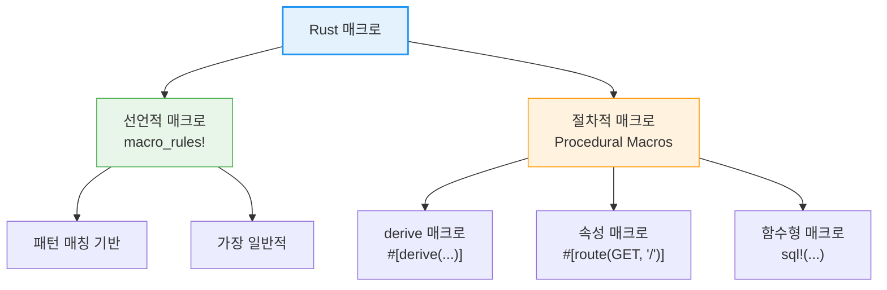

# 선언적 매크로 -- `macro_rules!`

매크로는 **코드를 생성하는 코드**입니다. Rust의 매크로 시스템은 강력하면서도 안전하며, 보일러플레이트 코드를 크게 줄여줍니다.

<div class="info-box">

**매크로 vs 함수:**
- **함수**: 런타임에 호출, 고정된 매개변수 수, 타입 시스템 적용
- **매크로**: 컴파일 타임에 코드 확장, 가변 매개변수, 새로운 문법 생성 가능

매크로는 컴파일러가 코드의 의미를 해석하기 **전에** 확장됩니다.

</div>



---

## 1. 선언적 매크로 -- `macro_rules!`

### 기본 문법

```rust,editable
// 가장 간단한 매크로
macro_rules! say_hello {
    () => {
        println!("안녕하세요!");
    };
}

// 매개변수를 받는 매크로
macro_rules! greet {
    ($name:expr) => {
        println!("안녕하세요, {}님!", $name);
    };
}

// 여러 패턴 매칭
macro_rules! calculate {
    (add $a:expr, $b:expr) => {
        $a + $b
    };
    (mul $a:expr, $b:expr) => {
        $a * $b
    };
}

fn main() {
    say_hello!();
    greet!("Rust");

    let sum = calculate!(add 3, 4);
    let product = calculate!(mul 3, 4);
    println!("3 + 4 = {}", sum);
    println!("3 × 4 = {}", product);
}
```

### 매크로 지정자(Designators)

```rust,editable
macro_rules! demo_designators {
    // expr — 표현식
    (expr: $e:expr) => {
        println!("표현식 결과: {}", $e);
    };

    // ident — 식별자 (변수명, 함수명 등)
    (ident: $name:ident) => {
        let $name = 42;
        println!("{} = {}", stringify!($name), $name);
    };

    // ty — 타입
    (ty: $t:ty) => {
        println!("타입: {}", stringify!($t));
    };

    // tt — 토큰 트리 (무엇이든 가능)
    (tt: $($tok:tt)*) => {
        println!("토큰: {}", stringify!($($tok)*));
    };

    // literal — 리터럴 값
    (lit: $l:literal) => {
        println!("리터럴: {}", $l);
    };

    // block — 블록 { ... }
    (block: $b:block) => {
        println!("블록 결과: {:?}", $b);
    };
}

fn main() {
    demo_designators!(expr: 2 + 3);
    demo_designators!(ident: my_var);
    demo_designators!(ty: Vec<String>);
    demo_designators!(tt: hello world 123);
    demo_designators!(lit: "문자열");
    demo_designators!(block: { 1 + 2 });
}
```

<div class="info-box">

**주요 매크로 지정자:**

| 지정자 | 설명 | 예시 |
|---|---|---|
| `expr` | 표현식 | `2 + 3`, `"hello"`, `func()` |
| `ident` | 식별자 | `x`, `my_func`, `MyStruct` |
| `ty` | 타입 | `i32`, `Vec<String>`, `&str` |
| `tt` | 토큰 트리 | 무엇이든 |
| `literal` | 리터럴 | `42`, `"text"`, `true` |
| `block` | 블록 | `{ statements }` |
| `stmt` | 문장 | `let x = 5;` |
| `pat` | 패턴 | `Some(x)`, `_`, `1..=5` |
| `path` | 경로 | `std::io::Result` |
| `item` | 아이템 | `fn`, `struct`, `impl` 등 |

</div>

---

## 2. 반복 -- `$(...),*`

매크로의 가장 강력한 기능 중 하나는 **반복**입니다.

```rust,editable
// vec! 매크로 직접 구현
macro_rules! my_vec {
    // 빈 벡터
    () => {
        Vec::new()
    };
    // 쉼표로 구분된 원소들
    ( $( $x:expr ),+ $(,)? ) => {
        {
            let mut temp_vec = Vec::new();
            $(
                temp_vec.push($x);
            )+
            temp_vec
        }
    };
}

fn main() {
    let v1: Vec<i32> = my_vec![];
    let v2 = my_vec![1, 2, 3];
    let v3 = my_vec![10, 20, 30, 40,];  // 마지막 쉼표 허용

    println!("v1: {:?}", v1);
    println!("v2: {:?}", v2);
    println!("v3: {:?}", v3);
}
```

### HashMap 생성 매크로

```rust,editable
use std::collections::HashMap;

macro_rules! hashmap {
    ( $( $key:expr => $value:expr ),* $(,)? ) => {
        {
            let mut map = HashMap::new();
            $(
                map.insert($key, $value);
            )*
            map
        }
    };
}

fn main() {
    let scores = hashmap! {
        "Alice" => 95,
        "Bob" => 87,
        "Charlie" => 92,
    };

    for (name, score) in &scores {
        println!("{}: {}", name, score);
    }
}
```

<div class="tip-box">

**반복 구분자:**
- `$( ... ),*` — 0개 이상, 쉼표로 구분
- `$( ... ),+` — 1개 이상, 쉼표로 구분
- `$( ... );*` — 세미콜론으로 구분
- `$( ... )*` — 구분자 없음

`$(,)?`는 마지막 쉼표를 선택적으로 허용합니다.

</div>

### 구조체 빌더 매크로

```rust,editable
macro_rules! make_struct {
    ($name:ident { $( $field:ident : $ty:ty ),* $(,)? }) => {
        #[derive(Debug)]
        struct $name {
            $( $field: $ty, )*
        }

        impl $name {
            fn new( $( $field: $ty ),* ) -> Self {
                $name { $( $field, )* }
            }
        }
    };
}

make_struct!(Person {
    name: String,
    age: u32,
    email: String,
});

make_struct!(Point {
    x: f64,
    y: f64,
});

fn main() {
    let p = Person::new("홍길동".to_string(), 30, "hong@example.com".to_string());
    println!("{:?}", p);

    let pt = Point::new(3.0, 4.0);
    println!("{:?}", pt);
}
```
