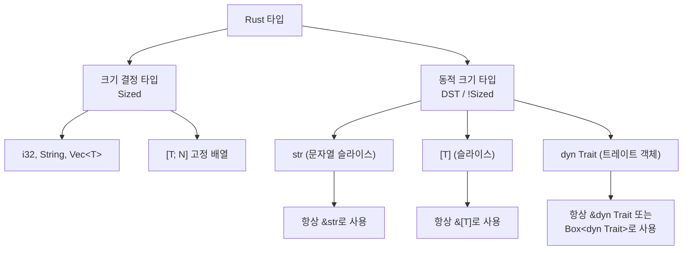
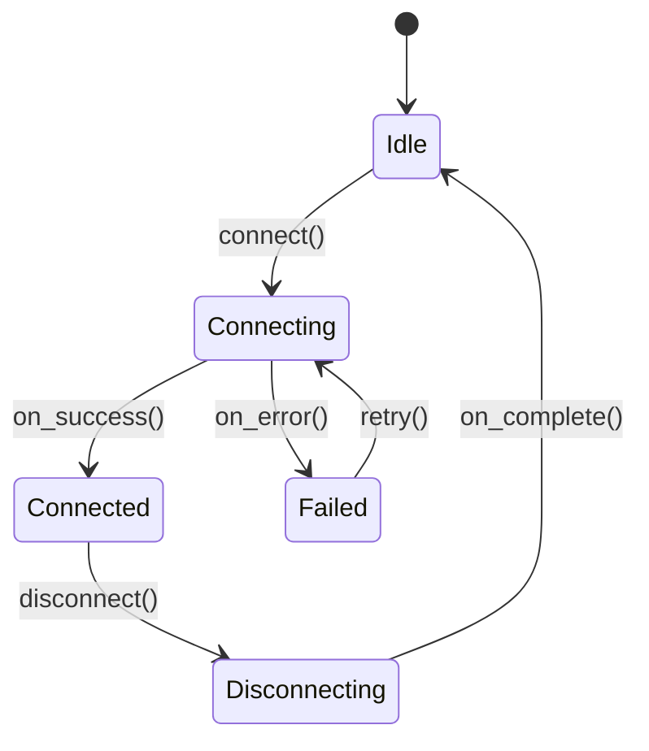
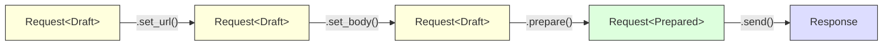

# 타입 시스템 심화 <span class="badge-advanced">고급</span>

Rust의 타입 시스템은 컴파일 타임에 안전성을 보장하는 강력한 도구입니다. 이 장에서는 타입 별칭, Newtype 패턴, Never 타입, 동적 크기 타입, Deref 강제 변환, 상태 머신, Typestate 패턴, PhantomData 등 심화 주제를 다룹니다.

---

## 21.1 타입 별칭 (Type Aliases)

`type` 키워드를 사용하면 기존 타입에 새로운 이름을 부여할 수 있습니다. 이는 복잡한 타입을 간결하게 표현할 때 유용합니다.

```rust,editable
use std::collections::HashMap;

// 복잡한 타입에 별칭 부여
type UserMap = HashMap<String, Vec<(u32, String)>>;
type Result<T> = std::result::Result<T, Box<dyn std::error::Error>>;

fn get_users() -> UserMap {
    let mut map = UserMap::new();
    map.insert(
        "admin".to_string(),
        vec![(1, "Alice".to_string()), (2, "Bob".to_string())],
    );
    map
}

fn process() -> Result<()> {
    let users = get_users();
    for (role, members) in &users {
        println!("{}: {:?}", role, members);
    }
    Ok(())
}

fn main() {
    process().unwrap();
}
```

<div class="info-box">
<strong>ℹ️ 타입 별칭 vs Newtype</strong><br>
타입 별칭은 단순한 이름 변경일 뿐, 원래 타입과 완전히 동일하게 취급됩니다. 타입 안전성이 필요하면 Newtype 패턴을 사용하세요.
</div>

### 함수 포인터 타입 별칭

```rust,editable
// 콜백 함수 타입을 별칭으로 정의
type Callback = fn(i32, i32) -> i32;
type AsyncHandler = Box<dyn Fn(String) -> String>;

fn apply(f: Callback, a: i32, b: i32) -> i32 {
    f(a, b)
}

fn main() {
    let add: Callback = |a, b| a + b;
    let mul: Callback = |a, b| a * b;

    println!("add(3, 4) = {}", apply(add, 3, 4));
    println!("mul(3, 4) = {}", apply(mul, 3, 4));

    let handlers: Vec<AsyncHandler> = vec![
        Box::new(|s| format!("[INFO] {}", s)),
        Box::new(|s| format!("[WARN] {}", s)),
    ];

    for handler in &handlers {
        println!("{}", handler("서버 시작됨".to_string()));
    }
}
```

---

## 21.2 Newtype 패턴

튜플 구조체로 기존 타입을 감싸서 새로운 타입을 만드는 패턴입니다. 타입 안전성을 높이고, 외부 타입에 트레이트를 구현할 수 있게 합니다.

```rust,editable
// 단위를 구분하는 Newtype
struct Meters(f64);
struct Kilometers(f64);
struct Seconds(f64);

impl Meters {
    fn to_kilometers(&self) -> Kilometers {
        Kilometers(self.0 / 1000.0)
    }
}

// 속도 계산: 단위 혼동 방지
fn speed(distance: Kilometers, time: Seconds) -> f64 {
    distance.0 / time.0
}

fn main() {
    let d = Meters(4200.0);
    let t = Seconds(3600.0);

    let km = d.to_kilometers();
    println!("거리: {}km", km.0);
    println!("속도: {}km/s", speed(km, t));

    // 아래 코드는 컴파일 에러 - 타입 안전!
    // speed(d, t); // Meters와 Seconds를 직접 전달할 수 없음
}
```

### 외부 타입에 트레이트 구현하기

고아 규칙(orphan rule)으로 인해 외부 크레이트의 타입에 외부 트레이트를 직접 구현할 수 없지만, Newtype으로 감싸면 가능합니다.

```rust,editable
use std::fmt;

// Vec<String>에 Display를 구현하고 싶다면?
struct PrettyList(Vec<String>);

impl fmt::Display for PrettyList {
    fn fmt(&self, f: &mut fmt::Formatter<'_>) -> fmt::Result {
        write!(f, "[{}]", self.0.join(", "))
    }
}

// Deref로 내부 메서드 위임
impl std::ops::Deref for PrettyList {
    type Target = Vec<String>;
    fn deref(&self) -> &Vec<String> {
        &self.0
    }
}

fn main() {
    let list = PrettyList(vec![
        "Rust".to_string(),
        "Go".to_string(),
        "Python".to_string(),
    ]);

    // Display 트레이트 사용
    println!("언어 목록: {}", list);

    // Deref 덕분에 Vec의 메서드도 사용 가능
    println!("개수: {}", list.len());
    println!("첫 번째: {}", list[0]);
}
```

---

## 21.3 Never 타입 (`!`)

Never 타입(`!`)은 절대 반환하지 않는 함수(발산 함수)의 반환 타입입니다.

```rust,editable
// 발산 함수: 절대 반환하지 않음
fn exit_program() -> ! {
    std::process::exit(1);
}

// panic!도 ! 타입을 반환
fn divide(a: f64, b: f64) -> f64 {
    if b == 0.0 {
        panic!("0으로 나눌 수 없습니다!"); // ! 타입
    }
    a / b
}

fn main() {
    // match에서 ! 타입의 활용
    let input = "42";
    let value: i32 = match input.parse() {
        Ok(v) => v,
        Err(_) => panic!("파싱 실패"), // ! 는 어떤 타입으로든 강제 변환됨
    };
    println!("값: {}", value);

    // loop도 ! 타입이 될 수 있음
    // let _never = loop { break 42; }; // 이 경우는 i32
    println!("결과: {}", divide(10.0, 3.0));
}
```

<div class="info-box">
<strong>ℹ️ Never 타입의 특성</strong><br>
<code>!</code> 타입은 모든 타입으로 강제 변환(coerce)될 수 있습니다. 이 때문에 <code>match</code>의 한 가지 arm에서 <code>panic!</code>이나 <code>continue</code>를 사용해도 다른 arm의 타입과 일치시킬 수 있습니다.
</div>

---

## 21.4 동적 크기 타입 (DST)과 Sized 트레이트

대부분의 Rust 타입은 컴파일 타임에 크기가 결정됩니다. 그러나 `str`, `[T]`, `dyn Trait`은 런타임에만 크기를 알 수 있는 동적 크기 타입(DST)입니다.



```rust,editable
use std::fmt;

// 기본적으로 모든 제네릭 매개변수는 T: Sized
// ?Sized를 붙이면 DST도 허용
fn print_ref<T: fmt::Display + ?Sized>(val: &T) {
    println!("값: {}", val);
}

// Sized 바운드가 있으면 DST 불가
fn print_sized<T: fmt::Display>(val: T) {
    println!("값: {}", val);
}

fn main() {
    let s: String = "안녕하세요".to_string();

    // &String -> &str로 Deref 강제 변환
    print_ref(&s);          // String 참조
    print_ref("리터럴");     // &str (DST의 참조)

    // print_sized는 Sized 타입만 허용
    print_sized(s);          // String (Sized) - OK
    // print_sized(*"hello"); // str (DST) - 컴파일 에러!
}
```

<div class="warning-box">
<strong>⚠️ DST 사용 규칙</strong><br>
DST는 직접 값으로 사용할 수 없습니다. 반드시 참조(<code>&str</code>, <code>&[T]</code>) 또는 스마트 포인터(<code>Box&lt;dyn Trait&gt;</code>, <code>Rc&lt;dyn Trait&gt;</code>)를 통해 간접적으로 사용해야 합니다.
</div>

---

## 21.5 Deref 강제 변환, AsRef vs Borrow

### Deref 강제 변환

Rust는 `Deref` 트레이트를 통해 자동으로 타입을 변환합니다.

```rust,editable
use std::ops::Deref;

struct MyString {
    data: String,
}

impl Deref for MyString {
    type Target = str;

    fn deref(&self) -> &str {
        &self.data
    }
}

// &str을 받는 함수
fn greet(name: &str) {
    println!("안녕하세요, {}!", name);
}

fn main() {
    let my_str = MyString {
        data: "세계".to_string(),
    };

    // Deref 강제 변환 체인:
    // &MyString -> &str (Deref)
    greet(&my_str);

    // String도 마찬가지:
    // &String -> &str (Deref)
    let s = String::from("Rust");
    greet(&s);

    // Box도:
    // &Box<String> -> &String -> &str
    let boxed = Box::new(String::from("Box"));
    greet(&boxed);
}
```

### AsRef vs Borrow

```rust,editable
use std::borrow::Borrow;

// AsRef: 참조 변환 (가벼운 변환)
fn print_path<P: AsRef<std::path::Path>>(path: P) {
    println!("경로: {:?}", path.as_ref());
}

// Borrow: Eq, Hash, Ord가 일관된 참조 변환
// HashMap의 키 조회에 유용
fn find_in_map<Q>(map: &std::collections::HashMap<String, i32>, key: &Q) -> Option<&i32>
where
    String: Borrow<Q>,
    Q: std::hash::Hash + Eq + ?Sized,
{
    map.get(key)
}

fn main() {
    // AsRef: 다양한 타입을 경로로 변환
    print_path("/home/user");          // &str -> Path
    print_path(String::from("/tmp"));   // String -> Path

    // Borrow: HashMap 키 조회
    let mut map = std::collections::HashMap::new();
    map.insert("hello".to_string(), 42);

    // String 키를 &str로 검색 가능
    if let Some(val) = find_in_map(&map, "hello") {
        println!("값: {}", val);
    }
}
```

<div class="tip-box">
<strong>💡 AsRef vs Borrow 선택 기준</strong><br>
<ul>
<li><strong>AsRef</strong>: 단순한 참조 변환이 필요할 때 (파일 경로, 문자열 등)</li>
<li><strong>Borrow</strong>: Hash, Eq, Ord의 일관성이 필요할 때 (HashMap 키 검색 등)</li>
</ul>
</div>

---

## 21.6 열거형으로 상태 머신 구현

열거형을 사용하면 가능한 상태를 명확히 정의하고, 잘못된 상태 전이를 컴파일 타임에 방지할 수 있습니다.



```rust,editable
#[derive(Debug)]
enum ConnectionState {
    Idle,
    Connecting { host: String, attempt: u32 },
    Connected { host: String, latency_ms: u64 },
    Failed { host: String, error: String },
    Disconnecting { host: String },
}

impl ConnectionState {
    fn connect(host: String) -> Self {
        println!("{}에 연결 시도 중...", host);
        ConnectionState::Connecting { host, attempt: 1 }
    }

    fn next(self) -> Self {
        match self {
            ConnectionState::Idle => {
                println!("대기 중. connect()를 호출하세요.");
                ConnectionState::Idle
            }
            ConnectionState::Connecting { host, attempt } => {
                if attempt <= 3 {
                    println!("{}에 연결 성공! (시도 {}회)", host, attempt);
                    ConnectionState::Connected {
                        host,
                        latency_ms: 42,
                    }
                } else {
                    println!("연결 실패 (최대 재시도 초과)");
                    ConnectionState::Failed {
                        host,
                        error: "최대 재시도 초과".to_string(),
                    }
                }
            }
            ConnectionState::Connected { host, .. } => {
                println!("{}에서 연결 해제 중...", host);
                ConnectionState::Disconnecting { host }
            }
            ConnectionState::Failed { host, .. } => {
                println!("{}에 재연결 시도...", host);
                ConnectionState::Connecting { host, attempt: 1 }
            }
            ConnectionState::Disconnecting { .. } => {
                println!("연결 해제 완료. 대기 상태로 전환.");
                ConnectionState::Idle
            }
        }
    }
}

fn main() {
    let state = ConnectionState::Idle;
    let state = ConnectionState::connect("example.com".to_string());
    let state = state.next(); // Connecting -> Connected
    let state = state.next(); // Connected -> Disconnecting
    let state = state.next(); // Disconnecting -> Idle
    println!("최종 상태: {:?}", state);
}
```

---

## 21.7 Typestate 패턴

Typestate 패턴은 **타입 수준에서 상태를 인코딩**하여, 잘못된 상태 전이를 컴파일 타임에 완전히 차단합니다.



```rust,editable
use std::marker::PhantomData;

// 상태를 나타내는 마커 타입
struct Draft;
struct Prepared;
struct Sent;

// 요청 구조체 - 상태가 타입 매개변수로 인코딩됨
struct HttpRequest<State> {
    url: String,
    body: Option<String>,
    headers: Vec<(String, String)>,
    _state: PhantomData<State>,
}

// Draft 상태에서만 가능한 작업
impl HttpRequest<Draft> {
    fn new() -> Self {
        HttpRequest {
            url: String::new(),
            body: None,
            headers: Vec::new(),
            _state: PhantomData,
        }
    }

    fn set_url(mut self, url: &str) -> Self {
        self.url = url.to_string();
        self
    }

    fn set_body(mut self, body: &str) -> Self {
        self.body = Some(body.to_string());
        self
    }

    fn add_header(mut self, key: &str, value: &str) -> Self {
        self.headers.push((key.to_string(), value.to_string()));
        self
    }

    // Draft -> Prepared 상태 전이
    fn prepare(self) -> Result<HttpRequest<Prepared>, String> {
        if self.url.is_empty() {
            return Err("URL이 설정되지 않았습니다".to_string());
        }
        Ok(HttpRequest {
            url: self.url,
            body: self.body,
            headers: self.headers,
            _state: PhantomData,
        })
    }
}

// Prepared 상태에서만 가능한 작업
impl HttpRequest<Prepared> {
    fn send(self) -> HttpRequest<Sent> {
        println!("요청 전송: {} (본문: {:?})", self.url, self.body);
        HttpRequest {
            url: self.url,
            body: self.body,
            headers: self.headers,
            _state: PhantomData,
        }
    }
}

// Sent 상태에서만 가능한 작업
impl HttpRequest<Sent> {
    fn response_code(&self) -> u16 {
        200 // 시뮬레이션
    }
}

fn main() {
    // 빌더 체인으로 자연스러운 사용
    let response = HttpRequest::new()
        .set_url("https://api.example.com/data")
        .set_body(r#"{"key": "value"}"#)
        .add_header("Content-Type", "application/json")
        .prepare()
        .expect("준비 실패")
        .send();

    println!("응답 코드: {}", response.response_code());

    // 컴파일 에러 예시 (주석 해제하면 에러):
    // let draft = HttpRequest::new();
    // draft.send(); // Draft 상태에서는 send() 불가!
}
```

---

## 21.8 PhantomData

`PhantomData<T>`는 실제로 `T` 값을 저장하지 않으면서, 컴파일러에게 타입 `T`와의 관계를 알려주는 마커 타입입니다.

```rust,editable
use std::marker::PhantomData;

// PhantomData로 수명 관계 표현
struct Ref<'a, T: 'a> {
    ptr: *const T,
    _marker: PhantomData<&'a T>, // 'a 수명과 T의 관계를 표현
}

impl<'a, T> Ref<'a, T> {
    fn new(reference: &'a T) -> Self {
        Ref {
            ptr: reference as *const T,
            _marker: PhantomData,
        }
    }

    fn get(&self) -> &'a T {
        unsafe { &*self.ptr }
    }
}

// PhantomData로 타입 안전한 ID 구현
struct Id<T> {
    value: u64,
    _type: PhantomData<T>,
}

struct User;
struct Product;

impl<T> Id<T> {
    fn new(value: u64) -> Self {
        Id {
            value,
            _type: PhantomData,
        }
    }
}

// User ID와 Product ID는 다른 타입!
fn find_user(_id: Id<User>) -> String {
    "Alice".to_string()
}

fn find_product(_id: Id<Product>) -> String {
    "Laptop".to_string()
}

fn main() {
    let user_id: Id<User> = Id::new(1);
    let product_id: Id<Product> = Id::new(1);

    println!("사용자: {}", find_user(user_id));
    println!("상품: {}", find_product(product_id));

    // 컴파일 에러: 타입이 다름!
    // find_user(product_id);

    // Ref 예제
    let value = 42;
    let r = Ref::new(&value);
    println!("Ref 값: {}", r.get());
}
```

<div class="info-box">
<strong>ℹ️ PhantomData 사용 사례</strong><br>
<ul>
<li><strong>수명 표현</strong>: 원시 포인터에 수명 정보를 연결</li>
<li><strong>소유권 표현</strong>: 드롭 체크에 영향</li>
<li><strong>타입 태깅</strong>: Typestate 패턴, 타입 안전한 ID</li>
<li><strong>공변/반변성 제어</strong>: 타입 매개변수의 분산 설정</li>
</ul>
</div>

---

## 종합 예제: 타입 안전한 파일 처리 파이프라인

```rust,editable
use std::marker::PhantomData;

// 파일 처리 상태
struct Unopened;
struct Opened;
struct Parsed;

// 데이터 형식 마커
struct CsvFormat;
struct JsonFormat;

struct FileProcessor<State, Format> {
    path: String,
    content: Option<String>,
    _state: PhantomData<State>,
    _format: PhantomData<Format>,
}

impl<F> FileProcessor<Unopened, F> {
    fn new(path: &str) -> Self {
        FileProcessor {
            path: path.to_string(),
            content: None,
            _state: PhantomData,
            _format: PhantomData,
        }
    }

    fn open(self) -> FileProcessor<Opened, F> {
        println!("파일 열기: {}", self.path);
        FileProcessor {
            path: self.path,
            content: Some("name,age\nAlice,30\nBob,25".to_string()),
            _state: PhantomData,
            _format: PhantomData,
        }
    }
}

impl FileProcessor<Opened, CsvFormat> {
    fn parse(self) -> FileProcessor<Parsed, CsvFormat> {
        println!("CSV 파싱 중...");
        if let Some(content) = &self.content {
            for line in content.lines() {
                println!("  행: {}", line);
            }
        }
        FileProcessor {
            path: self.path,
            content: self.content,
            _state: PhantomData,
            _format: PhantomData,
        }
    }
}

impl FileProcessor<Opened, JsonFormat> {
    fn parse(self) -> FileProcessor<Parsed, JsonFormat> {
        println!("JSON 파싱 중...");
        FileProcessor {
            path: self.path,
            content: self.content,
            _state: PhantomData,
            _format: PhantomData,
        }
    }
}

impl<F> FileProcessor<Parsed, F> {
    fn summary(&self) {
        println!("파싱 완료: {}", self.path);
    }
}

fn main() {
    // CSV 파일 처리 파이프라인
    let processor = FileProcessor::<Unopened, CsvFormat>::new("data.csv");
    let processed = processor
        .open()
        .parse();
    processed.summary();

    // 타입 시스템이 잘못된 순서를 방지:
    // FileProcessor::<Unopened, CsvFormat>::new("x.csv").parse(); // 에러!
}
```

---

<div class="exercise-box">

### 연습문제

**연습 1**: Email과 PhoneNumber를 Newtype으로 구현하고, 유효성 검사 메서드를 추가하세요.

```rust,editable
// 여기에 코드를 작성하세요

struct Email(String);
struct PhoneNumber(String);

impl Email {
    fn new(s: &str) -> Result<Self, String> {
        // '@' 포함 여부 검사
        todo!()
    }

    fn domain(&self) -> &str {
        // '@' 뒤의 도메인 반환
        todo!()
    }
}

impl PhoneNumber {
    fn new(s: &str) -> Result<Self, String> {
        // 숫자와 '-'만 허용
        todo!()
    }
}

fn main() {
    match Email::new("user@example.com") {
        Ok(email) => println!("도메인: {}", email.domain()),
        Err(e) => println!("에러: {}", e),
    }
}
```

**연습 2**: Typestate 패턴을 사용하여 주문 처리 시스템을 구현하세요. 상태: `Created` → `Paid` → `Shipped` → `Delivered`.

```rust,editable
use std::marker::PhantomData;

struct Created;
struct Paid;
struct Shipped;
struct Delivered;

struct Order<State> {
    id: u64,
    item: String,
    _state: PhantomData<State>,
}

// 각 상태별 메서드를 구현하세요
// Created: pay() -> Order<Paid>
// Paid: ship() -> Order<Shipped>
// Shipped: deliver() -> Order<Delivered>
// Delivered: confirmation() -> String

fn main() {
    // 주문 생성 -> 결제 -> 배송 -> 배달 체인을 만들어 보세요
    println!("주문 처리 시스템을 구현하세요!");
}
```

</div>

---

<div class="quiz-box" onclick="this.classList.toggle('show-answer')">

### 퀴즈 1
`type Alias = OriginalType;`과 `struct Newtype(OriginalType);`의 핵심 차이점은 무엇인가요?

<div class="quiz-answer">
<strong>타입 별칭</strong>은 단순한 이름 변경으로, 원래 타입과 완전히 호환됩니다. <strong>Newtype</strong>은 새로운 별도의 타입을 생성하여 타입 안전성을 제공합니다. Newtype은 컴파일 타임에만 존재하며 런타임 비용이 없습니다(zero-cost abstraction).
</div>
</div>

<div class="quiz-box" onclick="this.classList.toggle('show-answer')">

### 퀴즈 2
Never 타입(`!`)이 match 표현식에서 유용한 이유는 무엇인가요?

<div class="quiz-answer">
<code>!</code> 타입은 모든 타입으로 강제 변환될 수 있기 때문에, match arm에서 <code>panic!</code>, <code>continue</code>, <code>return</code>, <code>loop {}</code> 등을 사용해도 다른 arm의 타입과 일치시킬 수 있습니다. 예를 들어 <code>Ok(v) => v</code>가 <code>i32</code>를 반환할 때, <code>Err(_) => panic!()</code>의 <code>!</code>가 <code>i32</code>로 변환되어 전체 표현식의 타입이 <code>i32</code>가 됩니다.
</div>
</div>

<div class="quiz-box" onclick="this.classList.toggle('show-answer')">

### 퀴즈 3
`PhantomData`는 왜 필요한가요? 직접 필드를 추가하면 안 되나요?

<div class="quiz-answer">
<code>PhantomData&lt;T&gt;</code>는 실제 메모리를 사용하지 않으면서(크기가 0) 컴파일러에게 타입 관계를 알려줍니다. 직접 필드를 추가하면 불필요한 메모리를 사용하게 되고, 해당 타입의 값을 실제로 생성해야 합니다. PhantomData는 수명 관계, 소유권 의미, 타입 태깅 등을 런타임 비용 없이 표현할 수 있게 합니다.
</div>
</div>

---

<div class="summary-box">

### 요약

| 개념 | 설명 | 사용 사례 |
|------|------|-----------|
| **타입 별칭** | 기존 타입에 새 이름 부여 | 복잡한 타입 간결하게 표현 |
| **Newtype** | 튜플 구조체로 타입 래핑 | 타입 안전성, 외부 타입에 트레이트 구현 |
| **Never 타입** | 반환하지 않는 함수의 타입 | 발산 함수, match 표현식 |
| **DST** | 런타임에 크기가 결정되는 타입 | str, [T], dyn Trait |
| **?Sized** | DST를 허용하는 트레이트 바운드 | 제네릭 함수에서 참조 수용 |
| **Deref 강제 변환** | 자동 참조 타입 변환 | &String → &str, &Box<T> → &T |
| **AsRef/Borrow** | 참조 변환 트레이트 | 유연한 함수 인터페이스 |
| **상태 머신** | 열거형으로 상태 모델링 | 프로토콜, 워크플로우 |
| **Typestate** | 타입 매개변수로 상태 인코딩 | 빌더, 프로토콜, 파이프라인 |
| **PhantomData** | 제로 크기 타입 마커 | 수명, 소유권, 타입 태깅 |

</div>
